# Matplot++

> A C++ Graphics Library for Data Visualization

[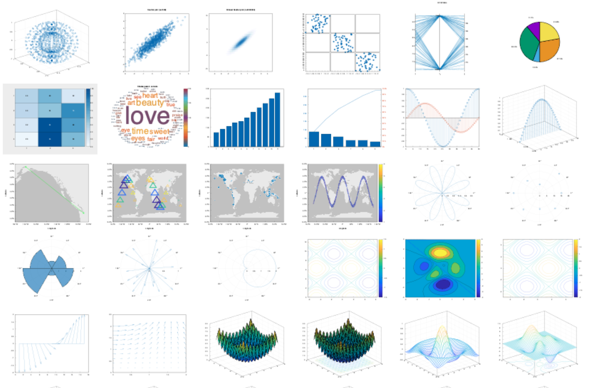](https://alandefreitas.github.io/matplotplusplus/)

<br/>

Data visualization can help programmers and scientists identify trends in their data and efficiently communicate these results with their peers. Modern C++ is being used for a variety of scientific applications, and this environment can benefit considerably from graphics libraries that attend the typical design goals toward scientific data visualization. Besides the option of exporting results to other environments, the customary alternatives in C++ are either non-dedicated libraries that depend on existing user interfaces or bindings to other languages. **Matplot++** is a graphics library for data visualization that provides interactive plotting, means for exporting plots in high-quality formats for scientific publications, a compact syntax consistent with similar libraries, dozens of plot categories with specialized algorithms, multiple coding styles, and supports generic backends.

<br/>

[](https://GitHub.com/alandefreitas/matplotplusplus/releases/)
[](https://alandefreitas.github.io/matplotplusplus/)
[](https://github.com/alandefreitas/matplotplusplus/discussions)

<br/>

<!-- https://github.com/bradvin/social-share-urls -->
[](https://www.facebook.com/sharer/sharer.php?t=Matplot%2B%2B:%20A%20C%2B%2B%20Graphics%20Library%20for%20Data%20Visualization&u=https://github.com/alandefreitas/matplotplusplus/)
[](http://sns.qzone.qq.com/cgi-bin/qzshare/cgi_qzshare_onekey?url=https://github.com/alandefreitas/matplotplusplus/&title=Matplot%2B%2B:%20A%20C%2B%2B%20Graphics%20Library%20for%20Data%20Visualization&summary=Matplot%2B%2B:%20A%20C%2B%2B%20Graphics%20Library%20for%20Data%20Visualization)
[](http://sns.qzone.qq.com/cgi-bin/qzshare/cgi_qzshare_onekey?url=https://github.com/alandefreitas/matplotplusplus/&title=Matplot%2B%2B:%20A%20C%2B%2B%20Graphics%20Library%20for%20Data%20Visualization&summary=Matplot%2B%2B:%20A%20C%2B%2B%20Graphics%20Library%20for%20Data%20Visualization)
[](http://www.reddit.com/submit?url=https://github.com/alandefreitas/matplotplusplus/&title=MatplotPP:%20A%20CPP%20Graphics%20Library%20for%20Data%20Visualization)
[](https://twitter.com/intent/tweet?text=Matplot%2B%2B:%20A%20C%2B%2B%20Graphics%20Library%20for%20Data%20Visualization&url=https://github.com/alandefreitas/matplotplusplus/&hashtags=DataVisualization,DataScience,Matplot,DataAnalysis,Charts,ChartingLibrary,Graphics,ScientificComputing,ScientificVisualization,Graphs,Plots,ContourPlots,PolarPlots)
[](https://www.linkedin.com/shareArticle?mini=false&url=https://github.com/alandefreitas/matplotplusplus/&title=Matplot%2B%2B:%20A%20C%2B%2B%20Graphics%20Library%20for%20Data%20Visualization)
[](https://api.whatsapp.com/send?text=Matplot%2B%2B:%20A%20C%2B%2B%20Graphics%20Library%20for%20Data%20Visualization:+https://github.com/alandefreitas/matplotplusplus/)
[](https://lineit.line.me/share/ui?url=https://github.com/alandefreitas/matplotplusplus/&text=Matplot%2B%2B:%20A%20C%2B%2B%20Graphics%20Library%20for%20Data%20Visualization)
[](https://telegram.me/share/url?url=https://github.com/alandefreitas/matplotplusplus/&text=Matplot%2B%2B:%20A%20C%2B%2B%20Graphics%20Library%20for%20Data%20Visualization)
[](https://news.ycombinator.com/submitlink?u=https://github.com/alandefreitas/matplotplusplus/&t=Matplot%2B%2B:%20A%20C%2B%2B%20Graphics%20Library%20for%20Data%20Visualization)

<br/>


<!-- START mdsplit-ignore -->
<!-- Remove link to documentation from the documentation -->

<h2>

[READ THE DOCUMENTATION FOR A QUICK START AND EXAMPLES](https://alandefreitas.github.io/matplotplusplus/)

</h2>


<!-- https://gist.github.com/jbroadway/2836900 -->
<!-- START doctoc generated TOC please keep comment here to allow auto update -->
<!-- DON'T EDIT THIS SECTION, INSTEAD RE-RUN doctoc TO UPDATE -->
<details>
<summary>Table of Contents</summary>

  - [
](#)
- [Gallery](#gallery)
- [Integration](#integration)
  - [Package Managers](#package-managers)
  - [CMake](#cmake)
  - [Install](#install)
- [Plot Types](#plot-types)
  - [Line Plots](#line-plots)
  - [Data Distribution](#data-distribution)
  - [Discrete Data](#discrete-data)
  - [Geography](#geography)
  - [Polar Plots](#polar-plots)
  - [Contour Plots](#contour-plots)
  - [Vector Fields](#vector-fields)
  - [Surfaces](#surfaces)
  - [Graphs](#graphs)
  - [Images](#images)
- [Annotations](#annotations)
  - [Text](#text)
  - [Text with Arrow](#text-with-arrow)
  - [Rectangle](#rectangle)
  - [Filled Polygon](#filled-polygon)
  - [Ellipse](#ellipse)
  - [Textbox](#textbox)
  - [Arrow](#arrow)
  - [Line](#line)
- [Appearance](#appearance)
  - [Labels](#labels)
  - [Axis](#axis)
  - [Grid](#grid)
  - [Multiplot](#multiplot)
  - [Colormaps](#colormaps)
  - [Camera](#camera)
  - [Figure Object](#figure-object)
  - [Line Specs](#line-specs)
  - [Axes Object](#axes-object)
  - [Clear Axes](#clear-axes)
- [Exporting](#exporting)
  - [Saving (Manually)](#saving-manually)
  - [Saving (Programatically)](#saving-programatically)
- [Coding styles](#coding-styles)
  - [Member vs. Free-standing Functions](#member-vs-free-standing-functions)
  - [Reactive vs. Quiet Figures](#reactive-vs-quiet-figures)
  - [Method Chaining](#method-chaining)
  - [Ranges](#ranges)
  - [Common Utilities](#common-utilities)
  - [Backends](#backends)
  - [Motivation and Details](#motivation-and-details)
- [Community](#community)
  - [Get Involved](#get-involved)
  - [Ideas and Roadmap](#ideas-and-roadmap)
  - [Contributing Guidelines](#contributing-guidelines)
  - [Contributors](#contributors)
- [References](#references)

</details>
<!-- END doctoc generated TOC please keep comment here to allow auto update -->

<!-- END mdsplit-ignore -->

<!-- START mdsplit-ignore -->
<!-- Only leave the complete gallery in the docs -->

## Gallery

[](docs/COMPLETE_GALLERY.md#plot_1) [](docs/COMPLETE_GALLERY.md#plot3_1) [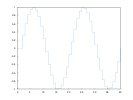](docs/COMPLETE_GALLERY.md#stairs_1) [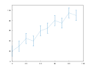](docs/COMPLETE_GALLERY.md#errorbar_1) [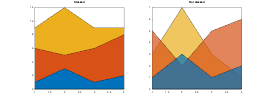](docs/COMPLETE_GALLERY.md#area_1) [](docs/COMPLETE_GALLERY.md#loglog_1) [](docs/COMPLETE_GALLERY.md#fplot_1) [](docs/COMPLETE_GALLERY.md#fimplicit_1)  [](docs/COMPLETE_GALLERY.md#histogram_1) [](docs/COMPLETE_GALLERY.md#boxplot_1) [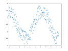](docs/COMPLETE_GALLERY.md#scatter_1) [](docs/COMPLETE_GALLERY.md#scatter3_1) [](docs/COMPLETE_GALLERY.md#binscatter_1)  [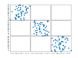](docs/COMPLETE_GALLERY.md#plotmatrix_1)  [](docs/COMPLETE_GALLERY.md#parallelplot_1)  [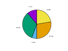](docs/COMPLETE_GALLERY.md#pie_1)  [](docs/COMPLETE_GALLERY.md#heatmap_1)  [](docs/COMPLETE_GALLERY.md#wordcloud_1)  [](docs/COMPLETE_GALLERY.md#bar_1)  [](docs/COMPLETE_GALLERY.md#pareto_1)  [](docs/COMPLETE_GALLERY.md#stem_1)  [](docs/COMPLETE_GALLERY.md#stem3_1)  [](docs/COMPLETE_GALLERY.md#geoplot_1)  [](docs/COMPLETE_GALLERY.md#geoscatter_1)  [](docs/COMPLETE_GALLERY.md#geobubble_1)  [](docs/COMPLETE_GALLERY.md#geodensityplot_1)  [](docs/COMPLETE_GALLERY.md#polarplot_1)  [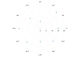](docs/COMPLETE_GALLERY.md#polarscatter_1)  [](docs/COMPLETE_GALLERY.md#polarhistogram_1)  [](docs/COMPLETE_GALLERY.md#compass_1)  [](docs/COMPLETE_GALLERY.md#ezpolar_1)  [](docs/COMPLETE_GALLERY.md#contour_1)  [](docs/COMPLETE_GALLERY.md#contourf_1)  [](docs/COMPLETE_GALLERY.md#fcontour_1)  [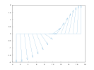](docs/COMPLETE_GALLERY.md#feather_1)  [](docs/COMPLETE_GALLERY.md#quiver_1)  [](docs/COMPLETE_GALLERY.md#surf_1)  [](docs/COMPLETE_GALLERY.md#surfc_1)  [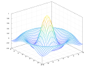](docs/COMPLETE_GALLERY.md#mesh_1)  [](docs/COMPLETE_GALLERY.md#meshc_1)  [](docs/COMPLETE_GALLERY.md#meshz_1)  [](docs/COMPLETE_GALLERY.md#fsurf_1)  [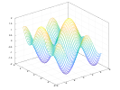](docs/COMPLETE_GALLERY.md#fmesh_1)  [](docs/COMPLETE_GALLERY.md#waterfall_1)  [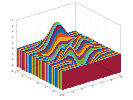](docs/COMPLETE_GALLERY.md#fence_1)  [](docs/COMPLETE_GALLERY.md#ribbon_1)  [](docs/COMPLETE_GALLERY.md#graph_1)  [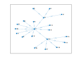](docs/COMPLETE_GALLERY.md#digraph_1)  [](docs/COMPLETE_GALLERY.md#imshow_1)  [](docs/COMPLETE_GALLERY.md#image_1)  [](docs/COMPLETE_GALLERY.md#imagesc_1)

<details>
    <summary>Complete Gallery</summary>

<!-- END mdsplit-ignore -->


[](docs/COMPLETE_GALLERY.md#plot_1)  [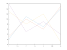](docs/COMPLETE_GALLERY.md#plot_2)  [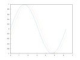](docs/COMPLETE_GALLERY.md#plot_3)  [](docs/COMPLETE_GALLERY.md#plot_4)  [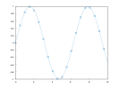](docs/COMPLETE_GALLERY.md#plot_5)  [](docs/COMPLETE_GALLERY.md#plot_6)  [](docs/COMPLETE_GALLERY.md#plot_7)  [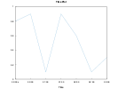](docs/COMPLETE_GALLERY.md#plot_8)  [](docs/COMPLETE_GALLERY.md#plot_9)  [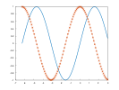](docs/COMPLETE_GALLERY.md#plot_10)  [](docs/COMPLETE_GALLERY.md#plot_11)  [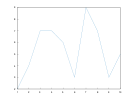](docs/COMPLETE_GALLERY.md#plot_12)  [](docs/COMPLETE_GALLERY.md#plot3_1)  [](docs/COMPLETE_GALLERY.md#plot3_2)  [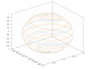](docs/COMPLETE_GALLERY.md#plot3_3)  [](docs/COMPLETE_GALLERY.md#plot3_4)  [](docs/COMPLETE_GALLERY.md#plot3_5)  [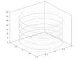](docs/COMPLETE_GALLERY.md#plot3_6)  [](docs/COMPLETE_GALLERY.md#plot3_7)  [](docs/COMPLETE_GALLERY.md#plot3_8)  [](docs/COMPLETE_GALLERY.md#plot3_9)  [](docs/COMPLETE_GALLERY.md#plot3_10)  [](docs/COMPLETE_GALLERY.md#stairs_1)  [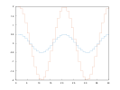](docs/COMPLETE_GALLERY.md#stairs_2)  [](docs/COMPLETE_GALLERY.md#stairs_3)  [](docs/COMPLETE_GALLERY.md#stairs_4)  [](docs/COMPLETE_GALLERY.md#stairs_5)  [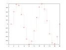](docs/COMPLETE_GALLERY.md#stairs_6)  [](docs/COMPLETE_GALLERY.md#stairs_7)  [](docs/COMPLETE_GALLERY.md#stairs_8)  [](docs/COMPLETE_GALLERY.md#stairs_9)  [](docs/COMPLETE_GALLERY.md#stairs_10)  [](docs/COMPLETE_GALLERY.md#errorbar_1)  [](docs/COMPLETE_GALLERY.md#errorbar_2)  [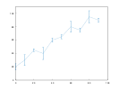](docs/COMPLETE_GALLERY.md#errorbar_3)  [](docs/COMPLETE_GALLERY.md#errorbar_4)  [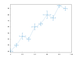](docs/COMPLETE_GALLERY.md#errorbar_5)  [](docs/COMPLETE_GALLERY.md#errorbar_6)  [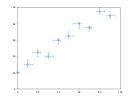](docs/COMPLETE_GALLERY.md#errorbar_7)  [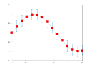](docs/COMPLETE_GALLERY.md#errorbar_8)  [](docs/COMPLETE_GALLERY.md#errorbar_9)  [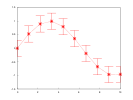](docs/COMPLETE_GALLERY.md#errorbar_10)  [](docs/COMPLETE_GALLERY.md#area_1)  [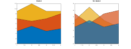](docs/COMPLETE_GALLERY.md#area_2)  [](docs/COMPLETE_GALLERY.md#area_3)  [](docs/COMPLETE_GALLERY.md#area_4)  [](docs/COMPLETE_GALLERY.md#loglog_1)  [](docs/COMPLETE_GALLERY.md#loglog_2)  [](docs/COMPLETE_GALLERY.md#loglog_3)  [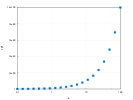](docs/COMPLETE_GALLERY.md#loglog_4)  [](docs/COMPLETE_GALLERY.md#loglog_5)  [](docs/COMPLETE_GALLERY.md#loglog_6)  [](docs/COMPLETE_GALLERY.md#loglog_7)  [](docs/COMPLETE_GALLERY.md#loglog_8)  [](docs/COMPLETE_GALLERY.md#loglog_9)  [](docs/COMPLETE_GALLERY.md#semilogx_1)  [](docs/COMPLETE_GALLERY.md#semilogy_1)  [](docs/COMPLETE_GALLERY.md#fplot_1)  [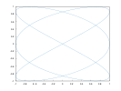](docs/COMPLETE_GALLERY.md#fplot_2)  [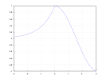](docs/COMPLETE_GALLERY.md#fplot_3)  [](docs/COMPLETE_GALLERY.md#fplot_4)  [](docs/COMPLETE_GALLERY.md#fplot_5)  [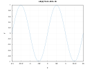](docs/COMPLETE_GALLERY.md#fplot_6)  [](docs/COMPLETE_GALLERY.md#fplot3_1)  [](docs/COMPLETE_GALLERY.md#fplot3_2)  [](docs/COMPLETE_GALLERY.md#fplot3_3)  [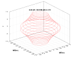](docs/COMPLETE_GALLERY.md#fplot3_4)  [](docs/COMPLETE_GALLERY.md#fplot3_5)  [](docs/COMPLETE_GALLERY.md#fimplicit_1)  [](docs/COMPLETE_GALLERY.md#fimplicit_2)  [](docs/COMPLETE_GALLERY.md#fimplicit_3)  [](docs/COMPLETE_GALLERY.md#fimplicit_4)  [](docs/COMPLETE_GALLERY.md#histogram_1)  [](docs/COMPLETE_GALLERY.md#histogram_2)  [](docs/COMPLETE_GALLERY.md#histogram_3)  [](docs/COMPLETE_GALLERY.md#histogram_4)  [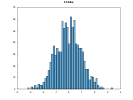](docs/COMPLETE_GALLERY.md#histogram_5)  [](docs/COMPLETE_GALLERY.md#histogram_6)  [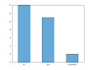](docs/COMPLETE_GALLERY.md#histogram_7)  [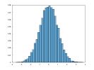](docs/COMPLETE_GALLERY.md#histogram_8)  [](docs/COMPLETE_GALLERY.md#histogram_9)  [](docs/COMPLETE_GALLERY.md#histogram_10)  [](docs/COMPLETE_GALLERY.md#histogram_11)  [](docs/COMPLETE_GALLERY.md#histogram_12)  [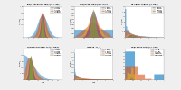](docs/COMPLETE_GALLERY.md#histogram_14)  [](docs/COMPLETE_GALLERY.md#boxplot_1)  [](docs/COMPLETE_GALLERY.md#boxplot_2)  [](docs/COMPLETE_GALLERY.md#boxplot_3)  [](docs/COMPLETE_GALLERY.md#scatter_1)  [](docs/COMPLETE_GALLERY.md#scatter_2)  [](docs/COMPLETE_GALLERY.md#scatter_3)  [](docs/COMPLETE_GALLERY.md#scatter_4)  [](docs/COMPLETE_GALLERY.md#scatter_5)  [](docs/COMPLETE_GALLERY.md#scatter_6)  [](docs/COMPLETE_GALLERY.md#scatter_7)  [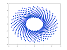](docs/COMPLETE_GALLERY.md#scatter_8)  [](docs/COMPLETE_GALLERY.md#scatter3_1)  [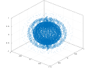](docs/COMPLETE_GALLERY.md#scatter3_2)  [](docs/COMPLETE_GALLERY.md#scatter3_3)  [](docs/COMPLETE_GALLERY.md#scatter3_4)  [](docs/COMPLETE_GALLERY.md#scatter3_5)  [](docs/COMPLETE_GALLERY.md#scatter3_6)  [](docs/COMPLETE_GALLERY.md#binscatter_1)  [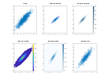](docs/COMPLETE_GALLERY.md#binscatter_2)  [](docs/COMPLETE_GALLERY.md#binscatter_3)  [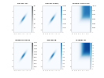](docs/COMPLETE_GALLERY.md#binscatter_4)  [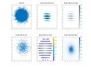](docs/COMPLETE_GALLERY.md#binscatter_5)  [](docs/COMPLETE_GALLERY.md#binscatter_6)  [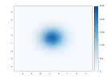](docs/COMPLETE_GALLERY.md#binscatter_7)  [](docs/COMPLETE_GALLERY.md#plotmatrix_1)  [](docs/COMPLETE_GALLERY.md#plotmatrix_2)  [](docs/COMPLETE_GALLERY.md#plotmatrix_3)  [](docs/COMPLETE_GALLERY.md#plotmatrix_4)  [](docs/COMPLETE_GALLERY.md#parallelplot_1)  [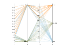](docs/COMPLETE_GALLERY.md#parallelplot_2)  [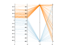](docs/COMPLETE_GALLERY.md#parallelplot_3)  [](docs/COMPLETE_GALLERY.md#pie_1)  [](docs/COMPLETE_GALLERY.md#pie_2)  [](docs/COMPLETE_GALLERY.md#pie_3)  [](docs/COMPLETE_GALLERY.md#pie_4)  [](docs/COMPLETE_GALLERY.md#pie_5)  [](docs/COMPLETE_GALLERY.md#pie_6)  [](docs/COMPLETE_GALLERY.md#heatmap_1)  [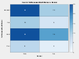](docs/COMPLETE_GALLERY.md#heatmap_2)  [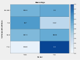](docs/COMPLETE_GALLERY.md#heatmap_3)  [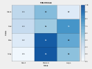](docs/COMPLETE_GALLERY.md#heatmap_4)  [](docs/COMPLETE_GALLERY.md#heatmap_5)  [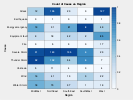](docs/COMPLETE_GALLERY.md#heatmap_6)  [](docs/COMPLETE_GALLERY.md#heatmap_7)  [](docs/COMPLETE_GALLERY.md#wordcloud_1)  [](docs/COMPLETE_GALLERY.md#wordcloud_3)  [](docs/COMPLETE_GALLERY.md#wordcloud_4)  [](docs/COMPLETE_GALLERY.md#wordcloud_4)  [](docs/COMPLETE_GALLERY.md#bar_1)  [](docs/COMPLETE_GALLERY.md#bar_2)  [](docs/COMPLETE_GALLERY.md#bar_3)  [](docs/COMPLETE_GALLERY.md#bar_4)  [](docs/COMPLETE_GALLERY.md#bar_5)  [](docs/COMPLETE_GALLERY.md#bar_6)  [](docs/COMPLETE_GALLERY.md#bar_7)  [](docs/COMPLETE_GALLERY.md#bar_8)  [](docs/COMPLETE_GALLERY.md#bar_9)  [](docs/COMPLETE_GALLERY.md#bar_10)  [](docs/COMPLETE_GALLERY.md#bar_11)  [](docs/COMPLETE_GALLERY.md#bar_12)  [](docs/COMPLETE_GALLERY.md#bar_13)  [](docs/COMPLETE_GALLERY.md#pareto_1)  [](docs/COMPLETE_GALLERY.md#pareto_2)  [](docs/COMPLETE_GALLERY.md#pareto_3)  [](docs/COMPLETE_GALLERY.md#pareto_4)  [](docs/COMPLETE_GALLERY.md#stem_1)  [](docs/COMPLETE_GALLERY.md#stem_2)  [](docs/COMPLETE_GALLERY.md#stem_3)  [](docs/COMPLETE_GALLERY.md#stem_4)  [](docs/COMPLETE_GALLERY.md#stem_5)  [](docs/COMPLETE_GALLERY.md#stem_6)  [](docs/COMPLETE_GALLERY.md#stem_7)  [](docs/COMPLETE_GALLERY.md#stem_8)  [](docs/COMPLETE_GALLERY.md#stem_9)  [](docs/COMPLETE_GALLERY.md#stem3_1)  [](docs/COMPLETE_GALLERY.md#stem3_2)  [](docs/COMPLETE_GALLERY.md#stem3_3)  [](docs/COMPLETE_GALLERY.md#stem3_4)  [](docs/COMPLETE_GALLERY.md#stem3_5)  [](docs/COMPLETE_GALLERY.md#stem3_6)  [](docs/COMPLETE_GALLERY.md#stem3_7)  [](docs/COMPLETE_GALLERY.md#stem3_8)  [](docs/COMPLETE_GALLERY.md#stem3_9)  [](docs/COMPLETE_GALLERY.md#stem3_10)  [](docs/COMPLETE_GALLERY.md#stem3_11)  [](docs/COMPLETE_GALLERY.md#geoplot_1)  [](docs/COMPLETE_GALLERY.md#geoplot_2)  [](docs/COMPLETE_GALLERY.md#geoplot_3)  [](docs/COMPLETE_GALLERY.md#geoplot_4)  [](docs/COMPLETE_GALLERY.md#geoplot_5)  [](docs/COMPLETE_GALLERY.md#geoplot_6)  [](docs/COMPLETE_GALLERY.md#geoplot_7)  [](docs/COMPLETE_GALLERY.md#geoscatter_1)  [](docs/COMPLETE_GALLERY.md#geoscatter_2)  [](docs/COMPLETE_GALLERY.md#geobubble_1)  [](docs/COMPLETE_GALLERY.md#geobubble_2)  [](docs/COMPLETE_GALLERY.md#geodensityplot_1)  [](docs/COMPLETE_GALLERY.md#polarplot_1)  [](docs/COMPLETE_GALLERY.md#polarplot_2)  [](docs/COMPLETE_GALLERY.md#polarplot_3)  [](docs/COMPLETE_GALLERY.md#polarplot_4)  [](docs/COMPLETE_GALLERY.md#polarplot_5)  [](docs/COMPLETE_GALLERY.md#polarplot_6)  [](docs/COMPLETE_GALLERY.md#polarplot_7)  [](docs/COMPLETE_GALLERY.md#polarplot_8)  [](docs/COMPLETE_GALLERY.md#polarscatter_1)  [](docs/COMPLETE_GALLERY.md#polarscatter_2)  [](docs/COMPLETE_GALLERY.md#polarscatter_3)  [](docs/COMPLETE_GALLERY.md#polarscatter_4)  [](docs/COMPLETE_GALLERY.md#polarscatter_5)  [](docs/COMPLETE_GALLERY.md#polarscatter_6)  [](docs/COMPLETE_GALLERY.md#polarhistogram_1)  [](docs/COMPLETE_GALLERY.md#polarhistogram_2)  [](docs/COMPLETE_GALLERY.md#polarhistogram_3)  [](docs/COMPLETE_GALLERY.md#polarhistogram_4)  [](docs/COMPLETE_GALLERY.md#polarhistogram_5)  [](docs/COMPLETE_GALLERY.md#compass_1)  [](docs/COMPLETE_GALLERY.md#compass_2)  [](docs/COMPLETE_GALLERY.md#ezpolar_1)  [](docs/COMPLETE_GALLERY.md#ezpolar_2)  [](docs/COMPLETE_GALLERY.md#contour_1)  [](docs/COMPLETE_GALLERY.md#contour_2)  [](docs/COMPLETE_GALLERY.md#contour_3)  [](docs/COMPLETE_GALLERY.md#contour_4)  [](docs/COMPLETE_GALLERY.md#contour_5)  [](docs/COMPLETE_GALLERY.md#contour_6)  [](docs/COMPLETE_GALLERY.md#contour_7)  [](docs/COMPLETE_GALLERY.md#contour_8)  [](docs/COMPLETE_GALLERY.md#contourf_1)  [](docs/COMPLETE_GALLERY.md#contourf_2)  [](docs/COMPLETE_GALLERY.md#contourf_3)  [](docs/COMPLETE_GALLERY.md#contourf_4)  [](docs/COMPLETE_GALLERY.md#contourf_5)  [](docs/COMPLETE_GALLERY.md#contourf_6)  [](docs/COMPLETE_GALLERY.md#fcontour_1)  [](docs/COMPLETE_GALLERY.md#fcontour_2)  [](docs/COMPLETE_GALLERY.md#fcontour_3)  [](docs/COMPLETE_GALLERY.md#fcontour_4)  [](docs/COMPLETE_GALLERY.md#fcontour_5)  [](docs/COMPLETE_GALLERY.md#fcontour_6)  [](docs/COMPLETE_GALLERY.md#fcontour_7)  [](docs/COMPLETE_GALLERY.md#fcontour_8)  [](docs/COMPLETE_GALLERY.md#fcontour_9)  [](docs/COMPLETE_GALLERY.md#fcontour_10)  [](docs/COMPLETE_GALLERY.md#fcontour_11)  [](docs/COMPLETE_GALLERY.md#feather_1)  [](docs/COMPLETE_GALLERY.md#quiver_1)  [](docs/COMPLETE_GALLERY.md#quiver_2)  [](docs/COMPLETE_GALLERY.md#quiver_3)  [](docs/COMPLETE_GALLERY.md#quiver_4)  [](docs/COMPLETE_GALLERY.md#quiver_5)  [](docs/COMPLETE_GALLERY.md#quiver_6)  [](docs/COMPLETE_GALLERY.md#quiver3_1)  [](docs/COMPLETE_GALLERY.md#quiver3_2)  [](docs/COMPLETE_GALLERY.md#surf_1)  [](docs/COMPLETE_GALLERY.md#surf_2)  [](docs/COMPLETE_GALLERY.md#surf_3)  [](docs/COMPLETE_GALLERY.md#surf_4)  [](docs/COMPLETE_GALLERY.md#surf_5)  [](docs/COMPLETE_GALLERY.md#surf_6)  [](docs/COMPLETE_GALLERY.md#surfc_1)  [](docs/COMPLETE_GALLERY.md#surfc_2)  [](docs/COMPLETE_GALLERY.md#surfc_3)  [](docs/COMPLETE_GALLERY.md#surfc_4)  [](docs/COMPLETE_GALLERY.md#mesh_1)  [](docs/COMPLETE_GALLERY.md#mesh_2)  [](docs/COMPLETE_GALLERY.md#mesh_3)  [](docs/COMPLETE_GALLERY.md#mesh_4)  [](docs/COMPLETE_GALLERY.md#meshc_1)  [](docs/COMPLETE_GALLERY.md#meshc_2)  [](docs/COMPLETE_GALLERY.md#meshc_3)  [](docs/COMPLETE_GALLERY.md#meshz_1)  [](docs/COMPLETE_GALLERY.md#meshz_2)  [](docs/COMPLETE_GALLERY.md#meshz_3)  [](docs/COMPLETE_GALLERY.md#fsurf_1)  [](docs/COMPLETE_GALLERY.md#fsurf_2)  [](docs/COMPLETE_GALLERY.md#fsurf_3)  [](docs/COMPLETE_GALLERY.md#fsurf_4)  [](docs/COMPLETE_GALLERY.md#fsurf_5)  [](docs/COMPLETE_GALLERY.md#fsurf_6)  [](docs/COMPLETE_GALLERY.md#fsurf_7)  [](docs/COMPLETE_GALLERY.md#fsurf_8)  [](docs/COMPLETE_GALLERY.md#fmesh_1)  [](docs/COMPLETE_GALLERY.md#fmesh_2)  [](docs/COMPLETE_GALLERY.md#fmesh_3)  [](docs/COMPLETE_GALLERY.md#fmesh_4)  [](docs/COMPLETE_GALLERY.md#waterfall_1)  [](docs/COMPLETE_GALLERY.md#waterfall_2)  [](docs/COMPLETE_GALLERY.md#waterfall_3)  [](docs/COMPLETE_GALLERY.md#fence_1)  [](docs/COMPLETE_GALLERY.md#fence_2)  [](docs/COMPLETE_GALLERY.md#fence_3)  [](docs/COMPLETE_GALLERY.md#ribbon_1)  [](docs/COMPLETE_GALLERY.md#ribbon_2)  [](docs/COMPLETE_GALLERY.md#ribbon_3)  [](docs/COMPLETE_GALLERY.md#ribbon_4)  [](docs/COMPLETE_GALLERY.md#graph_1)  [](docs/COMPLETE_GALLERY.md#graph_2)  [](docs/COMPLETE_GALLERY.md#graph_3)  [](docs/COMPLETE_GALLERY.md#graph_4)  [](docs/COMPLETE_GALLERY.md#graph_5)  [](docs/COMPLETE_GALLERY.md#graph_6)  [](docs/COMPLETE_GALLERY.md#digraph_1)  [](docs/COMPLETE_GALLERY.md#digraph_2)  [](docs/COMPLETE_GALLERY.md#digraph_3)  [](docs/COMPLETE_GALLERY.md#imshow_1)  [](docs/COMPLETE_GALLERY.md#imshow_2)  [](docs/COMPLETE_GALLERY.md#imshow_3)  [](docs/COMPLETE_GALLERY.md#imshow_4)  [](docs/COMPLETE_GALLERY.md#imshow_5)  [](docs/COMPLETE_GALLERY.md#imshow_6)  [](docs/COMPLETE_GALLERY.md#imshow_7)  [](docs/COMPLETE_GALLERY.md#imshow_8)  [](docs/COMPLETE_GALLERY.md#imshow_9)  [](docs/COMPLETE_GALLERY.md#imshow_10)  [](docs/COMPLETE_GALLERY.md#imshow_11)  [](docs/COMPLETE_GALLERY.md#image_1)  [](docs/COMPLETE_GALLERY.md#image_2)  [](docs/COMPLETE_GALLERY.md#image_3)  [](docs/COMPLETE_GALLERY.md#image_4)  [](docs/COMPLETE_GALLERY.md#image_5)  [](docs/COMPLETE_GALLERY.md#imagesc_1)  [](docs/COMPLETE_GALLERY.md#imagesc_2)  [](docs/COMPLETE_GALLERY.md#imagesc_3)  [](docs/COMPLETE_GALLERY.md#imagesc_4)  [](docs/COMPLETE_GALLERY.md#text_1)  [](docs/COMPLETE_GALLERY.md#text_2)  [](docs/COMPLETE_GALLERY.md#text_3)  [](docs/COMPLETE_GALLERY.md#text_4)  [](docs/COMPLETE_GALLERY.md#text_5)  [](docs/COMPLETE_GALLERY.md#text_6)  [](docs/COMPLETE_GALLERY.md#text_7)  [](docs/COMPLETE_GALLERY.md#text_8)  [](docs/COMPLETE_GALLERY.md#textarrow_1)  [](docs/COMPLETE_GALLERY.md#textarrow_2)  [](docs/COMPLETE_GALLERY.md#rectangle_1)  [](docs/COMPLETE_GALLERY.md#rectangle_2)  [](docs/COMPLETE_GALLERY.md#rectangle_3)  [](docs/COMPLETE_GALLERY.md#rectangle_4)  [](docs/COMPLETE_GALLERY.md#rectangle_5)  [](docs/COMPLETE_GALLERY.md#fill_1)  [](docs/COMPLETE_GALLERY.md#ellipse_1)  [](docs/COMPLETE_GALLERY.md#textbox_1)  [](docs/COMPLETE_GALLERY.md#arrow_1)  [](docs/COMPLETE_GALLERY.md#arrow_2)  [](docs/COMPLETE_GALLERY.md#line_1)  [](docs/COMPLETE_GALLERY.md#title_1)  [](docs/COMPLETE_GALLERY.md#title_2)  [](docs/COMPLETE_GALLERY.md#title_3)  [](docs/COMPLETE_GALLERY.md#title_4)  [](docs/COMPLETE_GALLERY.md#title_5)  [](docs/COMPLETE_GALLERY.md#title_6)  [](docs/COMPLETE_GALLERY.md#title_7)  [](docs/COMPLETE_GALLERY.md#title_8)  [](docs/COMPLETE_GALLERY.md#sgtitle_1)  [](docs/COMPLETE_GALLERY.md#sgtitle_2)  [](docs/COMPLETE_GALLERY.md#xlabel_1)  [](docs/COMPLETE_GALLERY.md#xlabel_2)  [](docs/COMPLETE_GALLERY.md#xlabel_3)  [](docs/COMPLETE_GALLERY.md#xlabel_4)  [](docs/COMPLETE_GALLERY.md#xlabel_5)  [](docs/COMPLETE_GALLERY.md#xlabel_6)  [](docs/COMPLETE_GALLERY.md#xlabel_7)  [](docs/COMPLETE_GALLERY.md#xlabel_8)  [](docs/COMPLETE_GALLERY.md#ylabel_1)  [](docs/COMPLETE_GALLERY.md#ylabel_2)  [](docs/COMPLETE_GALLERY.md#ylabel_3)  [](docs/COMPLETE_GALLERY.md#ylabel_4)  [](docs/COMPLETE_GALLERY.md#ylabel_5)  [](docs/COMPLETE_GALLERY.md#ylabel_6)  [](docs/COMPLETE_GALLERY.md#ylabel_7)  [](docs/COMPLETE_GALLERY.md#ylabel_8)  [](docs/COMPLETE_GALLERY.md#zlabel_1)  [](docs/COMPLETE_GALLERY.md#zlabel_2)  [](docs/COMPLETE_GALLERY.md#zlabel_3)  [](docs/COMPLETE_GALLERY.md#legend_1)  [](docs/COMPLETE_GALLERY.md#legend_2)  [](docs/COMPLETE_GALLERY.md#legend_3)  [](docs/COMPLETE_GALLERY.md#legend_4)  [](docs/COMPLETE_GALLERY.md#legend_5)  [](docs/COMPLETE_GALLERY.md#legend_6)  [](docs/COMPLETE_GALLERY.md#legend_7)  [](docs/COMPLETE_GALLERY.md#legend_8)  [](docs/COMPLETE_GALLERY.md#legend_9)  [](docs/COMPLETE_GALLERY.md#xlim_1)  [](docs/COMPLETE_GALLERY.md#xlim_2)  [](docs/COMPLETE_GALLERY.md#xlim_3)  [](docs/COMPLETE_GALLERY.md#xlim_4)  [](docs/COMPLETE_GALLERY.md#xlim_5)  [](docs/COMPLETE_GALLERY.md#xlim_6)  [](docs/COMPLETE_GALLERY.md#ylim_1)  [](docs/COMPLETE_GALLERY.md#ylim_2)  [](docs/COMPLETE_GALLERY.md#ylim_3)  [](docs/COMPLETE_GALLERY.md#ylim_4)  [](docs/COMPLETE_GALLERY.md#ylim_5)  [](docs/COMPLETE_GALLERY.md#ylim_6)  [](docs/COMPLETE_GALLERY.md#zlim_1)  [](docs/COMPLETE_GALLERY.md#zlim_2)  [](docs/COMPLETE_GALLERY.md#zlim_3)  [](docs/COMPLETE_GALLERY.md#zlim_4)  [](docs/COMPLETE_GALLERY.md#zlim_5)  [](docs/COMPLETE_GALLERY.md#zlim_6)  [](docs/COMPLETE_GALLERY.md#axis_1)  [](docs/COMPLETE_GALLERY.md#axis_2)  [](docs/COMPLETE_GALLERY.md#axis_3)  [](docs/COMPLETE_GALLERY.md#axis_4)  [](docs/COMPLETE_GALLERY.md#axis_5)  [](docs/COMPLETE_GALLERY.md#axis_6)  [](docs/COMPLETE_GALLERY.md#axis_7)  [](docs/COMPLETE_GALLERY.md#axis_8)  [](docs/COMPLETE_GALLERY.md#box_1)  [](docs/COMPLETE_GALLERY.md#box_2)  [](docs/COMPLETE_GALLERY.md#box_3)  [](docs/COMPLETE_GALLERY.md#grid_1)  [](docs/COMPLETE_GALLERY.md#grid_2)  [](docs/COMPLETE_GALLERY.md#grid_3)  [](docs/COMPLETE_GALLERY.md#grid_4)  [](docs/COMPLETE_GALLERY.md#xticks_1)  [](docs/COMPLETE_GALLERY.md#xticks_2)  [](docs/COMPLETE_GALLERY.md#xticks_3)  [](docs/COMPLETE_GALLERY.md#xticks_4)  [](docs/COMPLETE_GALLERY.md#xticks_5)  [](docs/COMPLETE_GALLERY.md#xticks_6)  [](docs/COMPLETE_GALLERY.md#xticks_7)  [](docs/COMPLETE_GALLERY.md#xticks_8)  [](docs/COMPLETE_GALLERY.md#yticks_1)  [](docs/COMPLETE_GALLERY.md#yticks_2)  [](docs/COMPLETE_GALLERY.md#yticks_3)  [](docs/COMPLETE_GALLERY.md#yticks_4)  [](docs/COMPLETE_GALLERY.md#yticks_5)  [](docs/COMPLETE_GALLERY.md#yticks_6)  [](docs/COMPLETE_GALLERY.md#yticks_7)  [](docs/COMPLETE_GALLERY.md#yticks_8)  [](docs/COMPLETE_GALLERY.md#zticks_1)  [](docs/COMPLETE_GALLERY.md#zticks_2)  [](docs/COMPLETE_GALLERY.md#zticks_3)  [](docs/COMPLETE_GALLERY.md#zticks_4)  [](docs/COMPLETE_GALLERY.md#zticks_5)  [](docs/COMPLETE_GALLERY.md#zticks_6)  [](docs/COMPLETE_GALLERY.md#xticklabels_1)  [](docs/COMPLETE_GALLERY.md#xticklabels_2)  [](docs/COMPLETE_GALLERY.md#xticklabels_3)  [](docs/COMPLETE_GALLERY.md#xticklabels_4)  [](docs/COMPLETE_GALLERY.md#yticklabels_1)  [](docs/COMPLETE_GALLERY.md#yticklabels_2)  [](docs/COMPLETE_GALLERY.md#yticklabels_3)  [](docs/COMPLETE_GALLERY.md#yticklabels_4)  [](docs/COMPLETE_GALLERY.md#xtickformat_1)  [](docs/COMPLETE_GALLERY.md#xtickformat_2)  [](docs/COMPLETE_GALLERY.md#xtickformat_3)  [](docs/COMPLETE_GALLERY.md#xtickformat_4)  [](docs/COMPLETE_GALLERY.md#xtickformat_5)  [](docs/COMPLETE_GALLERY.md#ytickformat_1)  [](docs/COMPLETE_GALLERY.md#ytickformat_2)  [](docs/COMPLETE_GALLERY.md#ytickformat_3)  [](docs/COMPLETE_GALLERY.md#ytickformat_4)  [](docs/COMPLETE_GALLERY.md#ytickformat_5)  [](docs/COMPLETE_GALLERY.md#ztickformat_1)  [](docs/COMPLETE_GALLERY.md#ztickformat_2)  [](docs/COMPLETE_GALLERY.md#ztickformat_3)  [](docs/COMPLETE_GALLERY.md#ztickformat_4)  [](docs/COMPLETE_GALLERY.md#ztickformat_5)  [](docs/COMPLETE_GALLERY.md#xtickangle_1)  [](docs/COMPLETE_GALLERY.md#xtickangle_2)  [](docs/COMPLETE_GALLERY.md#xtickangle_3)  [](docs/COMPLETE_GALLERY.md#ytickangle_1)  [](docs/COMPLETE_GALLERY.md#ytickangle_2)  [](docs/COMPLETE_GALLERY.md#ytickangle_3)  [](docs/COMPLETE_GALLERY.md#hold_1)  [](docs/COMPLETE_GALLERY.md#hold_2)  [](docs/COMPLETE_GALLERY.md#hold_3)  [](docs/COMPLETE_GALLERY.md#hold_4)  [](docs/COMPLETE_GALLERY.md#yyaxis_1)  [](docs/COMPLETE_GALLERY.md#yyaxis_2)  [](docs/COMPLETE_GALLERY.md#yyaxis_3)  [](docs/COMPLETE_GALLERY.md#yyaxis_4)  [](docs/COMPLETE_GALLERY.md#yyaxis_5)  [](docs/COMPLETE_GALLERY.md#yyaxis_6)  [](docs/COMPLETE_GALLERY.md#yyaxis_7)  [](docs/COMPLETE_GALLERY.md#colororder_1)  [](docs/COMPLETE_GALLERY.md#colororder_2)  [](docs/COMPLETE_GALLERY.md#colororder_3)  [](docs/COMPLETE_GALLERY.md#colororder_4)  [](docs/COMPLETE_GALLERY.md#colororder_5)  [](docs/COMPLETE_GALLERY.md#colororder_6)  [](docs/COMPLETE_GALLERY.md#colororder_7)  [](docs/COMPLETE_GALLERY.md#subplot_1)  [](docs/COMPLETE_GALLERY.md#subplot_2)  [](docs/COMPLETE_GALLERY.md#subplot_3)  [](docs/COMPLETE_GALLERY.md#subplot_4)  [](docs/COMPLETE_GALLERY.md#subplot_5)  [](docs/COMPLETE_GALLERY.md#subplot_6)  [](docs/COMPLETE_GALLERY.md#subplot_7)  [](docs/COMPLETE_GALLERY.md#subplot_8)  [](docs/COMPLETE_GALLERY.md#subplot_9)  [](docs/COMPLETE_GALLERY.md#subplot_10)  [](docs/COMPLETE_GALLERY.md#subplot_11)  [](docs/COMPLETE_GALLERY.md#subplot_12)  [](docs/COMPLETE_GALLERY.md#subplot_13)  [](docs/COMPLETE_GALLERY.md#tiledlayout_1)  [](docs/COMPLETE_GALLERY.md#tiledlayout_2)  [](docs/COMPLETE_GALLERY.md#tiledlayout_3)  [](docs/COMPLETE_GALLERY.md#tiledlayout_4)  [](docs/COMPLETE_GALLERY.md#tiledlayout_5)  [](docs/COMPLETE_GALLERY.md#tiledlayout_6)  [](docs/COMPLETE_GALLERY.md#tiledlayout_7)  [](docs/COMPLETE_GALLERY.md#tiledlayout_8)  [](docs/COMPLETE_GALLERY.md#colormap_1)  [](docs/COMPLETE_GALLERY.md#colormap_2)  [](docs/COMPLETE_GALLERY.md#colormap_3)  [](docs/COMPLETE_GALLERY.md#colormap_4)  [](docs/COMPLETE_GALLERY.md#colormap_5)  [](docs/COMPLETE_GALLERY.md#colormap_6)  [](docs/COMPLETE_GALLERY.md#colormap_7)  [](docs/COMPLETE_GALLERY.md#colormap_8)  [](docs/COMPLETE_GALLERY.md#colormap_9)  [](docs/COMPLETE_GALLERY.md#colorbar_1)  [](docs/COMPLETE_GALLERY.md#colorbar_2)  [](docs/COMPLETE_GALLERY.md#colorbar_3)  [](docs/COMPLETE_GALLERY.md#colorbar_4)  [](docs/COMPLETE_GALLERY.md#colorbar_5)  [](docs/COMPLETE_GALLERY.md#colorbar_6)  [](docs/COMPLETE_GALLERY.md#colorbar_7)  [](docs/COMPLETE_GALLERY.md#rgbplot_1)  [](docs/COMPLETE_GALLERY.md#rgbplot_2)  [](docs/COMPLETE_GALLERY.md#view_1)  [](docs/COMPLETE_GALLERY.md#view_2)  [](docs/COMPLETE_GALLERY.md#view_3)  [](docs/COMPLETE_GALLERY.md#view_4)  [](docs/COMPLETE_GALLERY.md#view_5)  [](docs/COMPLETE_GALLERY.md#view_6)  [](docs/COMPLETE_GALLERY.md#lighting_1)  [](docs/COMPLETE_GALLERY.md#lighting_2)  [](docs/COMPLETE_GALLERY.md#lighting_3)  [](docs/COMPLETE_GALLERY.md#lighting_4)  [](docs/COMPLETE_GALLERY.md#lighting_5)  [](docs/COMPLETE_GALLERY.md#lighting_6)  [](docs/COMPLETE_GALLERY.md#figure_1)  [](docs/COMPLETE_GALLERY.md#figure_2)  [](docs/COMPLETE_GALLERY.md#figure_3)  [](docs/COMPLETE_GALLERY.md#line_spec_1)  [](docs/COMPLETE_GALLERY.md#axes_1)  [](docs/COMPLETE_GALLERY.md#axes_2)  [](docs/COMPLETE_GALLERY.md#axes_3)  [](docs/COMPLETE_GALLERY.md#axes_4)  [](docs/COMPLETE_GALLERY.md#cla_1)  [](docs/COMPLETE_GALLERY.md#cla_2)  [](docs/COMPLETE_GALLERY.md#cla_3)  [](docs/COMPLETE_GALLERY.md#save_1)  [](docs/COMPLETE_GALLERY.md#save_2)  [](docs/COMPLETE_GALLERY.md#save_3)  [](docs/COMPLETE_GALLERY.md#save_4)  [](docs/COMPLETE_GALLERY.md#save_5)  [](docs/COMPLETE_GALLERY.md#save_6)  [](docs/COMPLETE_GALLERY.md#save_7)  [](docs/COMPLETE_GALLERY.md#save_8)

<!-- START mdsplit-ignore -->
</details>
<!-- END mdsplit-ignore -->

## Integration

### Package Managers

#### Vcpkg

Vcpkg users can install Matplot++ with the [matplotplusplus](https://github.com/microsoft/vcpkg/tree/master/ports/matplotplusplus) port:

```bash
vcpkg install matplotplusplus
```

This formula is a [contribution](https://github.com/microsoft/vcpkg/pull/13725) to [vcpkg](https://github.com/microsoft/vcpkg) by [@myd7349](https://github.com/myd7349).

#### Homebrew

Mac users can install Matplot++ with [Homebrew](https://brew.sh):

```bash
brew install matplotplusplus
```

This formula is a [contribution](https://github.com/Homebrew/homebrew-core/pull/62577) to [Homebrew](https://github.com/Homebrew/homebrew-core) by [Andrew Kane](https://github.com/ankane).

#### Arch Linux

Matplot++ is available in the Arch User Repository
([AUR](https://wiki.archlinux.org/index.php/Arch_User_Repository)) as
[`matplotplusplus`](https://aur.archlinux.org/packages/matplotplusplus/).

Note you can manually install the package by following the instructions on the
[Arch Wiki](https://wiki.archlinux.org/index.php/Arch_User_Repository#Installing_packages)
or use an [AUR helper](https://wiki.archlinux.org/index.php/AUR_helpers) like
[`yay`](https://aur.archlinux.org/packages/yay/)
(recommended for ease of install).

```bash
yay -S matplotplusplus
```

To discuss any issues related to this package refer to the comments section on
the AUR page of `matplotplusplus` [here](https://aur.archlinux.org/packages/matplotplusplus/).

### CMake

#### Embed as Subdirectory

You can use Matplot++ directly in CMake projects as a subproject, without installing it. This is convenient if you are experimenting with this library for the first time or don't expect your users to have Matplot++ installed on their systems.

Check if you have [Cmake](http://cmake.org) 3.14+ installed:

```bash
cmake --version
```

Clone the whole project

```bash
git clone https://github.com/alandefreitas/matplotplusplus/
```

and add the subdirectory to your CMake project:

```cmake
add_subdirectory(matplotplusplus)
```

When creating your executable, link the library to the targets you want:

```cmake
add_executable(my_target main.cpp)
target_link_libraries(my_target PUBLIC matplot)
```

Add this header to your source files:

```cpp
#include <matplot/matplot.h>
```

However, in larger projects, it's always recommended to look for Matplot++ with `find_package` before including it as a subdirectory to avoid [ODR errors](https://en.wikipedia.org/wiki/One_Definition_Rule).

#### Install as a Package via CMake

If you have CMake 3.21 or greater, you can use the `system` build preset to
build the package system-wide:

```bash
cmake --preset=system
cmake --build --preset=system
sudo cmake --install build/system
```

Alternatively, if the `CMAKE_PREFIX_PATH` environment variable is set to
`$HOME/.local`, then you can install it locally. This can be set in `/etc/profile`
or your shell config. This will not affect discovery of packages installed
system-wide.

```bash
export CMAKE_PREFIX_PATH="$HOME/.local"
```

This has the advantage of not
requiring sudo, and matplotplusplus will be installed in `$HOME/.local`.

```bash
cmake --preset=local
cmake --build --preset=local
cmake --install build/local
```

You can now use it from CMake with `find_package`:

```cmake
find_package(Matplot++ REQUIRED)

target_link_libraries(<your target> Matplot++::matplot)
```

If you're using a version of CMake too old to support presets, then building with
 the system preset is equivilant to:

```bash
cmake -B build/system         \
    -DMATPLOTPP_BUILD_EXAMPLES=OFF      \
    -DMATPLOTPP_BUILD_SHARED_LIBS=ON    \
    -DMATPLOTPP_BUILD_TESTS=OFF         \
    -DCMAKE_BUILD_TYPE=Release \
    -DCMAKE_INTERPROCEDURAL_OPTIMIZATION=ON

cmake --build build/system
```

While building with the local preset is equivilant to:

```bash
cmake -B build/local                      \
    -DMATPLOTPP_BUILD_EXAMPLES=OFF                  \
    -DMATPLOTPP_BUILD_SHARED_LIBS=ON                \
    -DMATPLOTPP_BUILD_TESTS=OFF                     \
    -DCMAKE_BUILD_TYPE=Release            \
    -DCMAKE_INSTALL_PREFIX="$HOME/.local" \
    -DCMAKE_INTERPROCEDURAL_OPTIMIZATION=ON

cmake --build build/local
```

#### Embed with Automatic Download

`FetchContent` is a CMake command that can automatically download the Matplot++ repository. Check if you have [Cmake](http://cmake.org) 3.14+ installed:

```bash
cmake --version
```

Include FetchContent in your CMake build script:

```cmake
include(FetchContent)
```

Declare the source for the contents:

```cmake
FetchContent_Declare(matplotplusplus
        GIT_REPOSITORY https://github.com/alandefreitas/matplotplusplus
        GIT_TAG origin/master) # or whatever tag you want
```

Let CMake download the repository and include it as a subdirectory.

```cmake
FetchContent_GetProperties(matplotplusplus)
if(NOT matplotplusplus_POPULATED)
    FetchContent_Populate(matplotplusplus)
    add_subdirectory(${matplotplusplus_SOURCE_DIR} ${matplotplusplus_BINARY_DIR} EXCLUDE_FROM_ALL)
endif()
```

When creating your executable, link the library to the targets you want:

```
add_executable(my_target main.cpp)
target_link_libraries(my_target PUBLIC matplot)
```

Then add this header to your source files:

```cpp
#include <matplot/matplot.h>
```

However, in larger projects, it's always recommended to look for Matplot++ with `find_package` before including it as a subdirectory to avoid [ODR errors](https://en.wikipedia.org/wiki/One_Definition_Rule).

#### Embed with CPM.cmake

[CPM.cmake](https://github.com/TheLartians/CPM.cmake) is a nice wrapper around the CMake `FetchContent` function.

Check if you have [Cmake](http://cmake.org) 3.14+ installed:

```bash
cmake --version
```

Install [CPM.cmake](https://github.com/TheLartians/CPM.cmake) and then use this command to add Matplot++ to your build script:

```cmake
CPMAddPackage(
    NAME matplotplusplus
    GITHUB_REPOSITORY alandefreitas/matplotplusplus
    GIT_TAG origin/master # or whatever tag you want
)
# ...
target_link_libraries(my_target PUBLIC matplot)
```

Then add this header to your source files:

```cpp
#include <matplot/matplot.h>
```

However, in larger projects, it's always recommended to look for Matplot++ with `find_package` before including it as a subdirectory to avoid [ODR errors](https://en.wikipedia.org/wiki/One_Definition_Rule).

You can use:

```cmake
option(CPM_USE_LOCAL_PACKAGES "Try `find_package` before downloading dependencies" ON)
```

in your build script to let CPM.cmake do that for you.

#### Find as External Package

If you have the library installed on your system, you can call `find_package()` from your CMake build script.

```cmake
find_package(Matplot++ REQUIRED)
```

When creating your executable, link the library to the targets you want:

```cmake
add_executable(my_target main.cpp)
target_link_libraries(my_target PUBLIC Matplot++::matplot)
```

Then add this header to your source files:

```cpp
#include <matplot/matplot.h>
```

You can see a complete example in [`test/integration/CMakeLists.txt`](test/integration/CMakeLists.txt).

CMake should be able to locate the `Matplot++Config.cmake` script automatically if you installed the library under `/usr/local/` (Linux / Mac OS). Unfortunately, there is no easy default directory for `find_package` on Windows.

!!! warning "Default directories"

    By default, the library is likely to be in `/usr/local/` (Linux / Mac OS) or `C:/Program Files/` (Windows). The installer will try to find the directory where you usually keep your libraries but that's not always perfect.

!!! warning "Finding packages on Windows"

    Unfortunately, CMake does not have a single default directory for packages on Windows like `/usr/local/lib`. If CMake cannot find Matplot++ on Windows or if you installed the library outside the default directory on Linux/Mac OS, there are a few [options](https://stackoverflow.com/questions/21314893/what-is-the-default-search-path-for-find-package-in-windows-using-cmake):

    * **Environment Variables**: The most reliable way to set this default directory is through environment variables. You can create an environment variable `MATPLOTPP_DIR` and then add `$ENV{MATPLOTPP_DIR}` to the `HINTS` section of the `find_package` command. This tends to be more convenient than requiring the path on the command line every time. Starting with version 3.12, CMake now implicitly considers the `<PackageName>_Root` environment variable a HINT for every `find_package` call.
    * **Package Registry**: CMake offers the [Package Registry](https://cmake.org/cmake/help/v3.5/manual/cmake-packages.7.html#package-registry) as an alternative mechanism for finding package locations. CMake maintains a list of package information in the Windows registry under `HKEY_CURRENT_USER\Software\Kitware\CMake\Packages\`.
    * **Append CMAKE_MODULE_PATH**: You can append more directories to [`CMAKE_MODULE_PATH`](https://cmake.org/cmake/help/latest/variable/CMAKE_MODULE_PATH.html) with something like `list(APPEND CMAKE_MODULE_PATH "C:\\Program Files\\matplotplusplus 1.0.1")`. `CMAKE_MODULE_PATH` is a list of search paths for CMake modules to be loaded by the `include()` or `find_package()` commands.
    * **Set the DIR variable directly**: Directly set the `Matplot++_DIR` variable with something like `set(Matplot++_DIR "C:\\Program Files\\matplotplusplus 1.0.1\\lib\\cmake\\Matplot++")`. This might be good enough for small local projects but it is hard-coding the directory in your build script. When your library gets out of your local environment, you need to choose one of the other options above (better) or make this variable an option and require the user to provide the directory on the command line every time (worse).

#### Supporting Both

It's often useful to let your build script download Matplot++ when find_package fails. If using CPM.cmake, you can set the `CPM_USE_LOCAL_PACKAGES` option to try to `find_package(Matplot++)` before download Matplot++.

If using FetchContent, you can use the following pattern:

```cmake
find_package(Matplot++ QUIET)
if(NOT Matplot++_FOUND)
    # Put your FetchContent or CPM.cmake script here
endif()
```

### Install

#### Binary Packages

Get the binary package from the [release section](https://github.com/alandefreitas/matplotplusplus/releases). These binaries refer to the last release version of Matplot++.

If you need a more recent version of Matplot++, you can download the [binary packages from the CI artifacts](https://github.com/alandefreitas/matplotplusplus/actions?query=workflow%3AMatplotplusplus+event%3Apush) or build the library [from the source files](#build-from-source).

#### Build from Source

##### Dependencies

**C++17**

Make sure your C++ compiler supports C++17:

=== "Ubuntu + GCC"

```bash
g++ --version
```

=== "Mac Os + Clang"

```bash
clang --version
```

=== "Windows + MSVC"

    !!! warning ""
        * Visit the [Visual Studio](https://visualstudio.microsoft.com) website
        * Download Git from [https://git-scm.com/download/win](https://git-scm.com/download/win) and install it

The output should be something like:

=== "Ubuntu + GCC"

```console
g++-8 (Ubuntu 8.4.0-1ubuntu1~18.04) 8.4.0
```

=== "Mac Os + Clang"

```console
Apple clang version 11.0.0 (clang-1100.0.33.8)
```

=== "Windows + MSVC"

    !!! warning ""
        * Visit the [Visual Studio](https://visualstudio.microsoft.com) website
        * Download Git from [https://git-scm.com/download/win](https://git-scm.com/download/win) and install it


If you need to update your compiler:

=== "Ubuntu + GCC"

```bash
# install GCC-8
sudo apt update
sudo apt install gcc-8
sudo apt install g++-8
```

To update to any other version, like GCC-9 or GCC-10:

```bash
sudo apt install build-essential
sudo add-apt-repository ppa:ubuntu-toolchain-r/test
sudo apt-get update
sudo apt install g++-10
```

Once you installed a newer version of GCC, you can link it to `update-alternatives`. For instance, if you have GCC-7 and GCC-10, you can link them with:

```bash
sudo update-alternatives --install /usr/bin/gcc gcc /usr/bin/gcc-7 7
sudo update-alternatives --install /usr/bin/g++ g++ /usr/bin/g++-7 7
sudo update-alternatives --install /usr/bin/gcc gcc /usr/bin/gcc-10 10
sudo update-alternatives --install /usr/bin/g++ g++ /usr/bin/g++-10 10
```

You can now use `update-alternatives` to set your default `gcc` and `g++` to a more recent version:

```bash
update-alternatives --config g++
update-alternatives --config gcc
```

=== "Mac Os + Clang"

```bash
# download clang
curl --output clang.tar.xz -L https://github.com/llvm/llvm-project/releases/download/llvmorg-11.0.0/clang+llvm-11.0.0-x86_64-apple-darwin.tar.xz
mkdir clang
tar -xvJf clang.tar.xz -C clang

# copy files to /usr/local
cd clang/clang+llvm-11.0.0-x86_64-apple-darwin
sudo cp -R * /usr/local/

# update default compiler
export CXX=/usr/local/bin/clang++
```

=== "Windows + MSVC"

    !!! warning ""
        * Visit the [Visual Studio](https://visualstudio.microsoft.com) website
        * Download Git from [https://git-scm.com/download/win](https://git-scm.com/download/win) and install it

**CMake 3.14+**

Also check your CMake version is at least 3.14+:

=== "Ubuntu + GCC"

```bash
cmake --version
```

=== "Mac Os + Clang"

```bash
cmake --version
```

=== "Windows + MSVC"

```bash
cmake --version
```

If CMake is not installed or its version is older than CMake 3.14, update it with

=== "Ubuntu + GCC"

```bash
sudo apt upgrade cmake
```

    !!! warning ""
        Alternatively, download the most recent version from [cmake.org](https://cmake.org/).

=== "Mac Os + Clang"

```bash
brew upgrade cmake
```

    !!! warning "Homebrew"
        If this command fails because you don't have [Homebrew](https://brew.sh) on your computer, you can install it with

```bash
/bin/bash -c "$(curl -fsSL https://raw.githubusercontent.com/Homebrew/install/master/install.sh)"
```

        or you can follow the instructions in [https://brew.sh](https://brew.sh).


    !!! warning ""
        Alternatively, download the most recent version from [cmake.org](https://cmake.org/).

=== "Windows + MSVC"

    !!! warning ""
        Download the most recent version from [cmake.org](https://cmake.org/).

**Gnuplot 5.2.6+**

Install Gnuplot 5.2.6+ (Required at runtime)

=== "Ubuntu + GCC"

```bash
sudo apt update
sudo apt install gnuplot
```

    !!! note ""
        Or download the latest version from [www.gnuplot.info](http://www.gnuplot.info). If you're using an installer, make sure you mark the option "Add application directory to your PATH environment variable".


=== "Mac Os + Clang"

```bash
brew install gnuplot
```

    !!! note ""
        Or download the latest version from [www.gnuplot.info](http://www.gnuplot.info). If you're using an installer, make sure you mark the option "Add application directory to your PATH environment variable".

=== "Windows + MSVC"

    !!! warning ""
        Download Gnuplot from [www.gnuplot.info](http://www.gnuplot.info) and install it.

        If you're using the Gnuplot installer, make sure you mark the option "Add application directory to your PATH environment variable"

    !!! warning "Windows Gnuplot Terminals"

        If the Matplot++ examples don't display without console errors and gnuplot running, try to re-install Gnuplot with the wxt terminal.

**Optional Dependencies**

The build script will also look for these *optional* dependencies for manipulating images:

* JPEG
* TIFF
* ZLIB
* PNG
* LAPACK
* BLAS
* FFTW
* OpenCV

**Embedded Dependencies**

There are two dependencies in [`source/3rd_party`](source/3rd_party). These dependencies are bundled, so you don't have to worry about them:

* olvb/nodesoup
* dtschump/CImg

You can define `MATPLOTPP_WITH_SYSTEM_NODESOUP=ON` or `MATPLOTPP_WITH_SYSTEM_CIMG=ON` in the cmake command line to use a system-provided version of these dependencies.

**OpenGL Dependencies**

There's an extra target `matplot_opengl` with the experimental [OpenGL backend](#backends). You need to define `MATPLOTPP_BUILD_EXPERIMENTAL_OPENGL_BACKEND=ON` in the CMake command line to build that target. In that case, the build script will also look for these extra dependencies:

* OpenGL
* GLAD
* GLFW3

If these dependencies are not found, the build script will download them. In any case, you can install these dependencies with:

=== "Ubuntu + GCC"

```bash
sudo apt-get install libglfw3-dev
```

=== "Mac Os + Clang"

    !!! note ""
        Download GLFW3 from https://www.glfw.org

=== "Windows + MSVC"

    !!! note ""
        Download GLFW3 from https://www.glfw.org

You can also see all dependencies in [`source/3rd_party/CMakeLists.txt`](source/3rd_party/CMakeLists.txt).

##### Build and Install

**Building Examples**

This will build the examples in the `build/examples` directory:

=== "Ubuntu + GCC"

```bash
mkdir build
cd build
cmake .. -DCMAKE_BUILD_TYPE=Release -DCMAKE_CXX_FLAGS="-O2"
sudo cmake --build . --parallel 2 --config Release
```

=== "Mac Os + Clang"

```bash
mkdir build
cd build
cmake .. -DCMAKE_BUILD_TYPE=Release -DCMAKE_CXX_FLAGS="-O2"
cmake --build . --parallel 2 --config Release
```

=== "Windows + MSVC"

```bash
mkdir build
cd build
cmake .. -DCMAKE_BUILD_TYPE=Release -DCMAKE_CXX_FLAGS="/O2"
cmake --build . --parallel 2 --config Release
```

!!! hint "Parallel Build"
Replace `--parallel 2` with `--parallel <number of cores in your machine>`

!!! note "Setting C++ Compiler"

    If your C++ compiler that supports C++17 is not your default compiler, make sure you provide CMake with the compiler location with the DCMAKE_C_COMPILER and DCMAKE_CXX_COMPILER options. For instance:

```bash
cmake .. -DCMAKE_BUILD_TYPE=Release -DCMAKE_CXX_FLAGS="-O2" -DCMAKE_C_COMPILER=/usr/bin/gcc-8 -DCMAKE_CXX_COMPILER=/usr/bin/g++-8
```

**Installing**

You can 1) use `-DMATPLOTPP_BUILD_EXAMPLES=OFF -DMATPLOTPP_BUILD_TESTS=OFF` to bypass the examples and tests, and then 2) `cmake --install .` to install Matplot++ on your system:

=== "Ubuntu + GCC"

```bash
mkdir build
cd build
cmake .. -DCMAKE_BUILD_TYPE=Release -DCMAKE_CXX_FLAGS="-O2" -DMATPLOTPP_BUILD_EXAMPLES=OFF -DMATPLOTPP_BUILD_TESTS=OFF
sudo cmake --build . --parallel 2 --config Release
sudo cmake --install .
```

=== "Mac Os + Clang"

```bash
mkdir build
cd build
cmake .. -DCMAKE_BUILD_TYPE=Release -DCMAKE_CXX_FLAGS="-O2" -DMATPLOTPP_BUILD_EXAMPLES=OFF -DMATPLOTPP_BUILD_TESTS=OFF
cmake --build . --parallel 2 --config Release
cmake --install .
```

=== "Windows + MSVC"

```bash
mkdir build
cd build
cmake .. -DCMAKE_BUILD_TYPE=Release -DCMAKE_CXX_FLAGS="/O2" -DMATPLOTPP_BUILD_EXAMPLES=OFF -DMATPLOTPP_BUILD_TESTS=OFF
cmake --build . --parallel 2 --config Release
cmake --install .
```

!!! hint "Parallel Build"
Replace `--parallel 2` with `--parallel <number of cores in your machine>`

**Create Packages**

You can also create the binary packages to install Matplot++ on other systems:

=== "Ubuntu + GCC"

```bash
sudo cpack .
```

=== "Mac Os + Clang"

```bash
cpack .
```

=== "Windows + MSVC"

```bash
cpack .
```

## Plot Types

### Line Plots

<!-- START mdsplit-ignore -->
[Line Plot](#line-plot) | [Line Plot 3D](#line-plot-3d) | [Stairs](#stairs) | [Error Bars](#error-bars) | [Area](#area) | [Loglog Plot](#loglog-plot) | [Semilogx Plot](#semilogx-plot) | [Semilogy Plot](#semilogy-plot) | [Function Plot](#function-plot) | [Function Plot 3D](#function-plot-3d) | [Implicit function](#implicit-function)
<!-- END mdsplit-ignore -->

#### Line Plot

!!! tip
    Use these examples to understand how to quickly use the library for data visualization. If you are interested in understanding how the library works, you can later read the details in the complete [article](docs/white-paper.md).

```cpp
plot(x,y);
```

Where `x` and `y` are are any value ranges.

<!-- START mdsplit-ignore -->
<h3>

[READ THE DOCUMENTATION TO SEE THESE EXAMPLES WITH THE IMAGES](https://alandefreitas.github.io/matplotplusplus/)

</h3>
<!-- END mdsplit-ignore -->


=== "Plot"

[](examples/line_plot/plot/plot_1.cpp)

=== "C++"

```cpp
--8<-- "examples/line_plot/plot/plot_1.cpp"
```

<!-- START mdsplit-ignore -->
<details>
    <summary>More examples</summary>

[](examples/line_plot/plot/plot_2.cpp)  [](examples/line_plot/plot/plot_3.cpp)  [](examples/line_plot/plot/plot_4.cpp)  [](examples/line_plot/plot/plot_5.cpp)  [](examples/line_plot/plot/plot_6.cpp)  [](examples/line_plot/plot/plot_7.cpp)  [](examples/line_plot/plot/plot_8.cpp)  [](examples/line_plot/plot/plot_9.cpp)  [](examples/line_plot/plot/plot_10.cpp)  [](examples/line_plot/plot/plot_11.cpp)  [](examples/line_plot/plot/plot_12.cpp)
</details>
<!-- END mdsplit-ignore -->

!!! tip
    Setters return a reference to `*this` to allow method chaining:

```cpp
plot(x,y)->line_width(2).color("red");
```

!!! tip
    These examples use free-standing functions to create plots. You can also use a object-oriented style for plots. We discuss these coding styles in the Section [*Coding Styles*](#coding-styles).

**More Examples:**

===! "Plot"

[](examples/line_plot/plot/plot_2.cpp)

=== "C++"

```cpp
--8<-- "examples/line_plot/plot/plot_2.cpp"
```


===! "Plot"

[](examples/line_plot/plot/plot_3.cpp)

=== "C++"

```cpp
--8<-- "examples/line_plot/plot/plot_3.cpp"
```


===! "Plot"

[](examples/line_plot/plot/plot_4.cpp)

=== "C++"

```cpp
--8<-- "examples/line_plot/plot/plot_4.cpp"
```


===! "Plot"

[](examples/line_plot/plot/plot_5.cpp)

=== "C++"

```cpp
--8<-- "examples/line_plot/plot/plot_5.cpp"
```


===! "Plot"

[](examples/line_plot/plot/plot_6.cpp)

=== "C++"

```cpp
--8<-- "examples/line_plot/plot/plot_6.cpp"
```


===! "Plot"

[](examples/line_plot/plot/plot_7.cpp)

=== "C++"

```cpp
--8<-- "examples/line_plot/plot/plot_7.cpp"
```


===! "Plot"

[](examples/line_plot/plot/plot_8.cpp)

=== "C++"

```cpp
--8<-- "examples/line_plot/plot/plot_8.cpp"
```


===! "Plot"

[](examples/line_plot/plot/plot_9.cpp)

=== "C++"

```cpp
--8<-- "examples/line_plot/plot/plot_9.cpp"
```


===! "Plot"

[](examples/line_plot/plot/plot_10.cpp)

=== "C++"

```cpp
--8<-- "examples/line_plot/plot/plot_10.cpp"
```


===! "Plot"

[](examples/line_plot/plot/plot_11.cpp)

=== "C++"

```cpp
--8<-- "examples/line_plot/plot/plot_11.cpp"
```


===! "Plot"

[](examples/line_plot/plot/plot_12.cpp)

=== "C++"

```cpp
--8<-- "examples/line_plot/plot/plot_12.cpp"
```

#### Line Plot 3D

```cpp
plot3(x,y);
```

=== "Plot"

[](examples/line_plot/plot3/plot3_1.cpp)

=== "C++"

```cpp
--8<-- "examples/line_plot/plot3/plot3_1.cpp"
```

!!! tip
    With method chaining:

```cpp
plot3(x,y)->line_width(2).color("red");
```

<!-- START mdsplit-ignore -->
<details>
    <summary>More examples</summary>

[](examples/line_plot/plot3/plot3_2.cpp)  [](examples/line_plot/plot3/plot3_3.cpp)  [](examples/line_plot/plot3/plot3_4.cpp)  [](examples/line_plot/plot3/plot3_5.cpp)  [](examples/line_plot/plot3/plot3_7.cpp)  [](examples/line_plot/plot3/plot3_8.cpp)  [](examples/line_plot/plot3/plot3_9.cpp)  [](examples/line_plot/plot3/plot3_10.cpp)
</details>
<!-- END mdsplit-ignore -->

**More Examples:**

===! "Plot"

[](examples/line_plot/plot3/plot3_2.cpp)

=== "C++"

```cpp
--8<-- "examples/line_plot/plot3/plot3_2.cpp"
```

===! "Plot"

[](examples/line_plot/plot3/plot3_3.cpp)

=== "C++"

```cpp
--8<-- "examples/line_plot/plot3/plot3_3.cpp"
```

===! "Plot"

[](examples/line_plot/plot3/plot3_4.cpp)

=== "C++"

```cpp
--8<-- "examples/line_plot/plot3/plot3_4.cpp"
```

===! "Plot"

[](examples/line_plot/plot3/plot3_5.cpp)

=== "C++"

```cpp
--8<-- "examples/line_plot/plot3/plot3_5.cpp"
```

===! "Plot"

[](examples/line_plot/plot3/plot3_7.cpp)

=== "C++"

```cpp
--8<-- "examples/line_plot/plot3/plot3_7.cpp"
```

===! "Plot"

[](examples/line_plot/plot3/plot3_8.cpp)

=== "C++"

```cpp
--8<-- "examples/line_plot/plot3/plot3_8.cpp"
```

===! "Plot"

[](examples/line_plot/plot3/plot3_9.cpp)

=== "C++"

```cpp
--8<-- "examples/line_plot/plot3/plot3_9.cpp"
```

===! "Plot"

[](examples/line_plot/plot3/plot3_10.cpp)

=== "C++"

```cpp
--8<-- "examples/line_plot/plot3/plot3_10.cpp"
```

#### Stairs

```cpp
stairs(x,y);
```

The `stair` object renders the line with stairs between data points to denote discrete data.

<!-- START mdsplit-ignore -->
<details>
    <summary>See result</summary>

[](examples/line_plot/stairs/stairs_1.cpp)

**More Examples:**

[](examples/line_plot/stairs/stairs_2.cpp)  [](examples/line_plot/stairs/stairs_3.cpp)  [](examples/line_plot/stairs/stairs_4.cpp)  [](examples/line_plot/stairs/stairs_5.cpp)  [](examples/line_plot/stairs/stairs_6.cpp)  [](examples/line_plot/stairs/stairs_7.cpp)  [](examples/line_plot/stairs/stairs_8.cpp)  [](examples/line_plot/stairs/stairs_9.cpp)  [](examples/line_plot/stairs/stairs_10.cpp)
</details>
<!-- END mdsplit-ignore -->

===! "Plot"

[](examples/line_plot/stairs/stairs_2.cpp)

=== "C++"

```cpp
--8<-- "examples/line_plot/stairs/stairs_2.cpp"
```

**More Examples:**


===! "Plot"

[](examples/line_plot/stairs/stairs_3.cpp)

=== "C++"

```cpp
--8<-- "examples/line_plot/stairs/stairs_3.cpp"
```

===! "Plot"

[](examples/line_plot/stairs/stairs_4.cpp)

=== "C++"

```cpp
--8<-- "examples/line_plot/stairs/stairs_4.cpp"
```

===! "Plot"

[](examples/line_plot/stairs/stairs_5.cpp)

=== "C++"

```cpp
--8<-- "examples/line_plot/stairs/stairs_5.cpp"
```

===! "Plot"

[](examples/line_plot/stairs/stairs_6.cpp)

=== "C++"

```cpp
--8<-- "examples/line_plot/stairs/stairs_6.cpp"
```

===! "Plot"

[](examples/line_plot/stairs/stairs_7.cpp)

=== "C++"

```cpp
--8<-- "examples/line_plot/stairs/stairs_7.cpp"
```

===! "Plot"

[](examples/line_plot/stairs/stairs_8.cpp)

=== "C++"

```cpp
--8<-- "examples/line_plot/stairs/stairs_8.cpp"
```

===! "Plot"

[](examples/line_plot/stairs/stairs_9.cpp)

=== "C++"

```cpp
--8<-- "examples/line_plot/stairs/stairs_9.cpp"
```

===! "Plot"

[](examples/line_plot/stairs/stairs_10.cpp)

=== "C++"

```cpp
--8<-- "examples/line_plot/stairs/stairs_10.cpp"
```


#### Error Bars

```cpp
errorbar(x,y,err);
```

<!-- START mdsplit-ignore -->
<details>
    <summary>See result</summary>

[](examples/line_plot/errorbar/errorbar_1.cpp)

****More Examples:****

[](examples/line_plot/errorbar/errorbar_2.cpp)  [](examples/line_plot/errorbar/errorbar_3.cpp)  [](examples/line_plot/errorbar/errorbar_4.cpp)  [](examples/line_plot/errorbar/errorbar_5.cpp)  [](examples/line_plot/errorbar/errorbar_6.cpp)  [](examples/line_plot/errorbar/errorbar_7.cpp)  [](examples/line_plot/errorbar/errorbar_8.cpp)  [](examples/line_plot/errorbar/errorbar_9.cpp)  [](examples/line_plot/errorbar/errorbar_10.cpp)
</details>
<!-- END mdsplit-ignore -->


===! "Plot"

[](examples/line_plot/errorbar/errorbar_1.cpp)

=== "C++"

```cpp
--8<-- "examples/line_plot/errorbar/errorbar_1.cpp"
```

**More Examples:**


===! "Plot"

[](examples/line_plot/errorbar/errorbar_2.cpp)

=== "C++"

```cpp
--8<-- "examples/line_plot/errorbar/errorbar_2.cpp"
```

===! "Plot"

[](examples/line_plot/errorbar/errorbar_3.cpp)

=== "C++"

```cpp
--8<-- "examples/line_plot/errorbar/errorbar_3.cpp"
```

===! "Plot"

[](examples/line_plot/errorbar/errorbar_4.cpp)

=== "C++"

```cpp
--8<-- "examples/line_plot/errorbar/errorbar_4.cpp"
```

===! "Plot"

[](examples/line_plot/errorbar/errorbar_5.cpp)

=== "C++"

```cpp
--8<-- "examples/line_plot/errorbar/errorbar_5.cpp"
```

===! "Plot"

[](examples/line_plot/errorbar/errorbar_6.cpp)

=== "C++"

```cpp
--8<-- "examples/line_plot/errorbar/errorbar_6.cpp"
```

===! "Plot"

[](examples/line_plot/errorbar/errorbar_7.cpp)

=== "C++"

```cpp
--8<-- "examples/line_plot/errorbar/errorbar_7.cpp"
```

===! "Plot"

[](examples/line_plot/errorbar/errorbar_8.cpp)

=== "C++"

```cpp
--8<-- "examples/line_plot/errorbar/errorbar_8.cpp"
```

===! "Plot"

[](examples/line_plot/errorbar/errorbar_9.cpp)

=== "C++"

```cpp
--8<-- "examples/line_plot/errorbar/errorbar_9.cpp"
```

===! "Plot"

[](examples/line_plot/errorbar/errorbar_10.cpp)

=== "C++"

```cpp
--8<-- "examples/line_plot/errorbar/errorbar_10.cpp"
```


The `error bar` object includes extra lines to represent error around data points. Log plots are utility functions that adjust the x or y axes to a logarithmic scale.

#### Area

```cpp
area(Y);
```

<!-- START mdsplit-ignore -->
<details>
    <summary>See result</summary>

[](examples/line_plot/area/area_1.cpp)

****More Examples:****

[](examples/line_plot/area/area_2.cpp)  [](examples/line_plot/area/area_3.cpp)  [](examples/line_plot/area/area_4.cpp)
</details>
<!-- END mdsplit-ignore -->


===! "Plot"

[](examples/line_plot/area/area_1.cpp)

=== "C++"

```cpp
--8<-- "examples/line_plot/area/area_1.cpp"
```

****More Examples:****


===! "Plot"

[](examples/line_plot/area/area_2.cpp)

=== "C++"

```cpp
--8<-- "examples/line_plot/area/area_2.cpp"
```

===! "Plot"

[](examples/line_plot/area/area_3.cpp)

=== "C++"

```cpp
--8<-- "examples/line_plot/area/area_3.cpp"
```

===! "Plot"

[](examples/line_plot/area/area_4.cpp)

=== "C++"

```cpp
--8<-- "examples/line_plot/area/area_4.cpp"
```

#### Loglog Plot

```cpp
loglog(x,y);
```

<!-- START mdsplit-ignore -->
<details>
    <summary>See result</summary>

[](examples/line_plot/loglog/loglog_1.cpp)

****More Examples:****

[](examples/line_plot/loglog/loglog_2.cpp)  [](examples/line_plot/loglog/loglog_3.cpp)  [](examples/line_plot/loglog/loglog_4.cpp)  [](examples/line_plot/loglog/loglog_5.cpp)  [](examples/line_plot/loglog/loglog_6.cpp)  [](examples/line_plot/loglog/loglog_7.cpp)  [](examples/line_plot/loglog/loglog_8.cpp)  [](examples/line_plot/loglog/loglog_9.cpp)
</details>
<!-- END mdsplit-ignore -->

===! "Plot"

[](examples/line_plot/loglog/loglog_1.cpp)

=== "C++"

```cpp
--8<-- "examples/line_plot/loglog/loglog_1.cpp"
```


****More Examples:****

===! "Plot"

[](examples/line_plot/loglog/loglog_2.cpp)

=== "C++"

```cpp
--8<-- "examples/line_plot/loglog/loglog_2.cpp"
```

===! "Plot"

[](examples/line_plot/loglog/loglog_3.cpp)

=== "C++"

```cpp
--8<-- "examples/line_plot/loglog/loglog_3.cpp"
```

===! "Plot"

[](examples/line_plot/loglog/loglog_4.cpp)

=== "C++"

```cpp
--8<-- "examples/line_plot/loglog/loglog_4.cpp"
```

===! "Plot"

[](examples/line_plot/loglog/loglog_5.cpp)

=== "C++"

```cpp
--8<-- "examples/line_plot/loglog/loglog_5.cpp"
```

===! "Plot"

[](examples/line_plot/loglog/loglog_6.cpp)

=== "C++"

```cpp
--8<-- "examples/line_plot/loglog/loglog_6.cpp"
```

===! "Plot"

[](examples/line_plot/loglog/loglog_7.cpp)

=== "C++"

```cpp
--8<-- "examples/line_plot/loglog/loglog_7.cpp"
```

===! "Plot"

[](examples/line_plot/loglog/loglog_8.cpp)

=== "C++"

```cpp
--8<-- "examples/line_plot/loglog/loglog_8.cpp"
```

===! "Plot"

[](examples/line_plot/loglog/loglog_9.cpp)

=== "C++"

```cpp
--8<-- "examples/line_plot/loglog/loglog_9.cpp"
```


#### Semilogx Plot

```cpp
semilogx(x,y);
```

<!-- START mdsplit-ignore -->
<details>
    <summary>See result</summary>

[](examples/line_plot/semilogx/semilogx_1.cpp)
</details>
<!-- END mdsplit-ignore -->

===! "Plot"

[](examples/line_plot/semilogx/semilogx_1.cpp)

=== "C++"

    ```cpp
    --8<-- "examples/line_plot/semilogx/semilogx_1.cpp"
    ```

#### Semilogy Plot

```cpp
semilogy(x,y);
```

<!-- START mdsplit-ignore -->
<details>
    <summary>See result</summary>

[](examples/line_plot/semilogy/semilogy_1.cpp)
</details>
<!-- END mdsplit-ignore -->

===! "Plot"

[](examples/line_plot/semilogy/semilogy_1.cpp)

=== "C++"

```cpp
--8<-- "examples/line_plot/semilogy/semilogy_1.cpp"
```

#### Function Plot

```cpp
fplot(fx);
```

<!-- START mdsplit-ignore -->
<details>
    <summary>See result</summary>

[](examples/line_plot/fplot/fplot_1.cpp)

**More Examples:**

[](examples/line_plot/fplot/fplot_2.cpp)  [](examples/line_plot/fplot/fplot_3.cpp)  [](examples/line_plot/fplot/fplot_4.cpp)  [](examples/line_plot/fplot/fplot_5.cpp)  [](examples/line_plot/fplot/fplot_6.cpp)
</details>
<!-- END mdsplit-ignore -->


===! "Plot"

[](examples/line_plot/fplot/fplot_1.cpp)

=== "C++"

```cpp
--8<-- "examples/line_plot/fplot/fplot_1.cpp"
```

**More Examples:**


===! "Plot"

[](examples/line_plot/fplot/fplot_2.cpp)

=== "C++"

```cpp
--8<-- "examples/line_plot/fplot/fplot_2.cpp"
```

===! "Plot"

[](examples/line_plot/fplot/fplot_3.cpp)

=== "C++"

```cpp
--8<-- "examples/line_plot/fplot/fplot_3.cpp"
```

===! "Plot"

[](examples/line_plot/fplot/fplot_4.cpp)

=== "C++"

```cpp
--8<-- "examples/line_plot/fplot/fplot_4.cpp"
```

===! "Plot"

[](examples/line_plot/fplot/fplot_5.cpp)

=== "C++"

    ```cpp
    --8<-- "examples/line_plot/fplot/fplot_5.cpp"
    ```

===! "Plot"

[](examples/line_plot/fplot/fplot_6.cpp)

=== "C++"

    ```cpp
    --8<-- "examples/line_plot/fplot/fplot_6.cpp"
    ```

Instead of storing data points, the objects `function line` and `string function` store a function as a lambda function or as a string with an expression. These objects use lazy evaluation to generate absolute data points. The data is generated only when the `draw` function is called.

#### Function Plot 3D

```cpp
fplot(fxy);
```

<!-- START mdsplit-ignore -->
<details>
    <summary>See result</summary>

[](examples/line_plot/fplot3/fplot3_1.cpp)

**More Examples:**

[](examples/line_plot/fplot3/fplot3_2.cpp)  [](examples/line_plot/fplot3/fplot3_3.cpp)  [](examples/line_plot/fplot3/fplot3_4.cpp)  [](examples/line_plot/fplot3/fplot3_5.cpp)
</details>
<!-- END mdsplit-ignore -->


===! "Plot"

[](examples/line_plot/fplot3/fplot3_1.cpp)

=== "C++"

    ```cpp
    --8<-- "examples/line_plot/fplot3/fplot3_1.cpp"
    `````

**More Examples:**

===! "Plot"

[](examples/line_plot/fplot3/fplot3_2.cpp)

=== "C++"

    ```cpp
    --8<-- "examples/line_plot/fplot3/fplot3_2.cpp"
    ```

===! "Plot"

[](examples/line_plot/fplot3/fplot3_3.cpp)

=== "C++"

    ```cpp
    --8<-- "examples/line_plot/fplot3/fplot3_3.cpp"
    ```

===! "Plot"

[](examples/line_plot/fplot3/fplot3_4.cpp)

=== "C++"

    ```cpp
    --8<-- "examples/line_plot/fplot3/fplot3_4.cpp"
    ```

===! "Plot"

[](examples/line_plot/fplot3/fplot3_5.cpp)

=== "C++"

    ```cpp
    --8<-- "examples/line_plot/fplot3/fplot3_5.cpp"
    ```

#### Implicit function

```cpp
fplot(fxy);
```

<!-- START mdsplit-ignore -->
<details>
    <summary>See result</summary>

[](examples/line_plot/fimplicit/fimplicit_1.cpp)

**More Examples:**

[](examples/line_plot/fimplicit/fimplicit_2.cpp)  [](examples/line_plot/fimplicit/fimplicit_3.cpp)  [](examples/line_plot/fimplicit/fimplicit_4.cpp)
</details>
<!-- END mdsplit-ignore -->


===! "Plot"

[](examples/line_plot/fimplicit/fimplicit_1.cpp)

=== "C++"

    ```cpp
    --8<-- "examples/line_plot/fimplicit/fimplicit_1.cpp"
    ```

**More Examples:**


===! "Plot"

[](examples/line_plot/fimplicit/fimplicit_2.cpp)

=== "C++"

    ```cpp
    --8<-- "examples/line_plot/fimplicit/fimplicit_2.cpp"
    ```

===! "Plot"

[](examples/line_plot/fimplicit/fimplicit_3.cpp)

=== "C++"

    ```cpp
    --8<-- "examples/line_plot/fimplicit/fimplicit_3.cpp"
    ```

===! "Plot"

[](examples/line_plot/fimplicit/fimplicit_4.cpp)

=== "C++"

    ```cpp
    --8<-- "examples/line_plot/fimplicit/fimplicit_4.cpp"
    ```

### Data Distribution

<!-- START mdsplit-ignore -->
[Histogram](#histogram) | [Boxplot](#boxplot) | [Scatter Plot](#scatter-plot) | [Scatter Plot 3D](#scatter-plot-3d) | [Binned Scatter Plots](#binned-scatter-plots) | [Plot Matrix](#plot-matrix) | [Parallel Coordinates](#parallel-coordinates) | [Pie Chart](#pie-chart) | [Heatmap](#heatmap) | [Word Cloud](#word-cloud)
<!-- END mdsplit-ignore -->

#### Histogram

The `histogram` object creates the histogram edges and bins when the `draw` function is called for the first time with lazy evaluation. Lazy evaluation avoids calculating edges unnecessarily in case the user changes the object parameters before calling `draw`. This object includes several algorithms for automatically delimiting the edges and bins for the histograms.

```cpp
hist(data);
```

<!-- START mdsplit-ignore -->
<details>
    <summary>See result</summary>

[](examples/data_distribution/histogram/histogram_1.cpp)

**More Examples:**

[](examples/data_distribution/histogram/histogram_2.cpp)  [](examples/data_distribution/histogram/histogram_3.cpp)  [](examples/data_distribution/histogram/histogram_4.cpp)  [](examples/data_distribution/histogram/histogram_5.cpp)  [](examples/data_distribution/histogram/histogram_6.cpp)  [](examples/data_distribution/histogram/histogram_7.cpp)  [](examples/data_distribution/histogram/histogram_8.cpp)  [](examples/data_distribution/histogram/histogram_9.cpp)  [](examples/data_distribution/histogram/histogram_10.cpp)  [](examples/data_distribution/histogram/histogram_11.cpp)  [](examples/data_distribution/histogram/histogram_12.cpp)  [](examples/data_distribution/histogram/histogram_14.cpp)
</details>
<!-- END mdsplit-ignore -->


===! "Plot"

[](examples/data_distribution/histogram/histogram_1.cpp)

=== "C++"

    ```cpp
    --8<-- "examples/data_distribution/histogram/histogram_1.cpp"
    ```

**More Examples:**


===! "Plot"

[](examples/data_distribution/histogram/histogram_2.cpp)

=== "C++"

    ```cpp
    --8<-- "examples/data_distribution/histogram/histogram_2.cpp"
    ```

===! "Plot"

[](examples/data_distribution/histogram/histogram_3.cpp)

=== "C++"

    ```cpp
    --8<-- "examples/data_distribution/histogram/histogram_3.cpp"
    ```

===! "Plot"

[](examples/data_distribution/histogram/histogram_4.cpp)

=== "C++"

    ```cpp
    --8<-- "examples/data_distribution/histogram/histogram_4.cpp"
    ```

===! "Plot"

[](examples/data_distribution/histogram/histogram_5.cpp)

=== "C++"

    ```cpp
    --8<-- "examples/data_distribution/histogram/histogram_5.cpp"
    ```

===! "Plot"

[](examples/data_distribution/histogram/histogram_6.cpp)

=== "C++"

    ```cpp
    --8<-- "examples/data_distribution/histogram/histogram_6.cpp"
    ```

===! "Plot"

[](examples/data_distribution/histogram/histogram_7.cpp)

=== "C++"

    ```cpp
    --8<-- "examples/data_distribution/histogram/histogram_7.cpp"
    ```

===! "Plot"

[](examples/data_distribution/histogram/histogram_8.cpp)

=== "C++"

    ```cpp
    --8<-- "examples/data_distribution/histogram/histogram_8.cpp"
    ```

===! "Plot"

[](examples/data_distribution/histogram/histogram_9.cpp)

=== "C++"

    ```cpp
    --8<-- "examples/data_distribution/histogram/histogram_9.cpp"
    ```

===! "Plot"

[](examples/data_distribution/histogram/histogram_10.cpp)

=== "C++"

    ```cpp
    --8<-- "examples/data_distribution/histogram/histogram_10.cpp"
    ```

===! "Plot"

[](examples/data_distribution/histogram/histogram_11.cpp)

=== "C++"

    ```cpp
    --8<-- "examples/data_distribution/histogram/histogram_11.cpp"
    ```

===! "Plot"

[](examples/data_distribution/histogram/histogram_12.cpp)

=== "C++"

    ```cpp
    --8<-- "examples/data_distribution/histogram/histogram_12.cpp"
    ```

===! "Plot"

[](examples/data_distribution/histogram/histogram_14.cpp)

=== "C++"

    ```cpp
    --8<-- "examples/data_distribution/histogram/histogram_14.cpp"
    ```

#### Boxplot

```cpp
boxplot(data);
```

<!-- START mdsplit-ignore -->
<details>
    <summary>See result</summary>

[](examples/data_distribution/boxplot/boxplot_1.cpp)

**More Examples:**

[](examples/data_distribution/boxplot/boxplot_2.cpp)  [](examples/data_distribution/boxplot/boxplot_3.cpp)
</details>
<!-- END mdsplit-ignore -->

===! "Plot"

[](examples/data_distribution/boxplot/boxplot_1.cpp)

=== "C++"

    ```cpp
    --8<-- "examples/data_distribution/boxplot/boxplot_1.cpp"
    ```

**More Examples:**

===! "Plot"

[](examples/data_distribution/boxplot/boxplot_2.cpp)

=== "C++"

    ```cpp
    --8<-- "examples/data_distribution/boxplot/boxplot_2.cpp"
    ```


===! "Plot"

[](examples/data_distribution/boxplot/boxplot_3.cpp)

=== "C++"

    ```cpp
    --8<-- "examples/data_distribution/boxplot/boxplot_3.cpp"
    ```


#### Scatter Plot

```cpp
scatter(x,y);
```

<!-- START mdsplit-ignore -->
<details>
    <summary>See result</summary>

[](examples/data_distribution/scatter/scatter_1.cpp)

**More Examples:**

[](examples/data_distribution/scatter/scatter_2.cpp)  [](examples/data_distribution/scatter/scatter_3.cpp)  [](examples/data_distribution/scatter/scatter_4.cpp)  [](examples/data_distribution/scatter/scatter_5.cpp)  [](examples/data_distribution/scatter/scatter_6.cpp)  [](examples/data_distribution/scatter/scatter_7.cpp)  [](examples/data_distribution/scatter/scatter_8.cpp)
</details>
<!-- END mdsplit-ignore -->

===! "Plot"

[](examples/data_distribution/scatter/scatter_1.cpp)

=== "C++"

    ```cpp
    --8<-- "examples/data_distribution/scatter/scatter_1.cpp"
    ```

**More Examples:**

===! "Plot"

[](examples/data_distribution/scatter/scatter_2.cpp)

=== "C++"

    ```cpp
    --8<-- "examples/data_distribution/scatter/scatter_2.cpp"
    ```


===! "Plot"

[](examples/data_distribution/scatter/scatter_3.cpp)

=== "C++"

    ```cpp
    --8<-- "examples/data_distribution/scatter/scatter_3.cpp"
    ```


===! "Plot"

[](examples/data_distribution/scatter/scatter_4.cpp)

=== "C++"

    ```cpp
    --8<-- "examples/data_distribution/scatter/scatter_4.cpp"
    ```


===! "Plot"

[](examples/data_distribution/scatter/scatter_5.cpp)

=== "C++"

    ```cpp
    --8<-- "examples/data_distribution/scatter/scatter_5.cpp"
    ```


===! "Plot"

[](examples/data_distribution/scatter/scatter_6.cpp)

=== "C++"

    ```cpp
    --8<-- "examples/data_distribution/scatter/scatter_6.cpp"
    ```


===! "Plot"

[](examples/data_distribution/scatter/scatter_7.cpp)

=== "C++"

    ```cpp
    --8<-- "examples/data_distribution/scatter/scatter_7.cpp"
    ```


===! "Plot"

[](examples/data_distribution/scatter/scatter_8.cpp)

=== "C++"

    ```cpp
    --8<-- "examples/data_distribution/scatter/scatter_8.cpp"
    ```


Scatter plots also depend on the `line` object. As the line object can represent lines with markers, the `scatter` function simply creates markers without the lines.

#### Scatter Plot 3D

```cpp
scatter(x,y,z);
```

<!-- START mdsplit-ignore -->
<details>
    <summary>See result</summary>

[](examples/data_distribution/scatter3/scatter3_1.cpp)

**More Examples:**

[](examples/data_distribution/scatter3/scatter3_2.cpp)  [](examples/data_distribution/scatter3/scatter3_3.cpp)  [](examples/data_distribution/scatter3/scatter3_4.cpp)  [](examples/data_distribution/scatter3/scatter3_5.cpp)  [](examples/data_distribution/scatter3/scatter3_6.cpp)
</details>
<!-- END mdsplit-ignore -->

===! "Plot"

[](examples/data_distribution/scatter3/scatter3_1.cpp)

=== "C++"

    ```cpp
    --8<-- "examples/data_distribution/scatter3/scatter3_1.cpp"
    ```

**More Examples:**

===! "Plot"

[](examples/data_distribution/scatter3/scatter3_2.cpp)

=== "C++"

    ```cpp
    --8<-- "examples/data_distribution/scatter3/scatter3_2.cpp"
    ```


===! "Plot"

[](examples/data_distribution/scatter3/scatter3_3.cpp)

=== "C++"

    ```cpp
    --8<-- "examples/data_distribution/scatter3/scatter3_3.cpp"
    ```


===! "Plot"

[](examples/data_distribution/scatter3/scatter3_4.cpp)

=== "C++"

    ```cpp
    --8<-- "examples/data_distribution/scatter3/scatter3_4.cpp"
    ```


===! "Plot"

[](examples/data_distribution/scatter3/scatter3_5.cpp)

=== "C++"

    ```cpp
    --8<-- "examples/data_distribution/scatter3/scatter3_5.cpp"
    ```


===! "Plot"

[](examples/data_distribution/scatter3/scatter3_6.cpp)

=== "C++"

    ```cpp
    --8<-- "examples/data_distribution/scatter3/scatter3_6.cpp"
    ```


#### Binned Scatter Plots

```cpp
binscatter(x,y);
```

<!-- START mdsplit-ignore -->
<details>
    <summary>See result</summary>

[](examples/data_distribution/binscatter/binscatter_1.cpp)

**More Examples:**

[](examples/data_distribution/binscatter/binscatter_2.cpp)  [](examples/data_distribution/binscatter/binscatter_3.cpp)  [](examples/data_distribution/binscatter/binscatter_4.cpp)  [](examples/data_distribution/binscatter/binscatter_5.cpp)  [](examples/data_distribution/binscatter/binscatter_6.cpp)  [](examples/data_distribution/binscatter/binscatter_7.cpp)
</details>
<!-- END mdsplit-ignore -->

===! "Plot"

[](examples/data_distribution/binscatter/binscatter_1.cpp)

=== "C++"

    ```cpp
    --8<-- "examples/data_distribution/binscatter/binscatter_1.cpp"
    ```

**More Examples:**

===! "Plot"

[](examples/data_distribution/binscatter/binscatter_2.cpp)

=== "C++"

    ```cpp
    --8<-- "examples/data_distribution/binscatter/binscatter_2.cpp"
    ```


===! "Plot"

[](examples/data_distribution/binscatter/binscatter_3.cpp)

=== "C++"

    ```cpp
    --8<-- "examples/data_distribution/binscatter/binscatter_3.cpp"
    ```


===! "Plot"

[](examples/data_distribution/binscatter/binscatter_4.cpp)

=== "C++"

    ```cpp
    --8<-- "examples/data_distribution/binscatter/binscatter_4.cpp"
    ```


===! "Plot"

[](examples/data_distribution/binscatter/binscatter_5.cpp)

=== "C++"

    ```cpp
    --8<-- "examples/data_distribution/binscatter/binscatter_5.cpp"
    ```


===! "Plot"

[](examples/data_distribution/binscatter/binscatter_6.cpp)

=== "C++"

    ```cpp
    --8<-- "examples/data_distribution/binscatter/binscatter_6.cpp"
    ```


===! "Plot"

[](examples/data_distribution/binscatter/binscatter_7.cpp)

=== "C++"

    ```cpp
    --8<-- "examples/data_distribution/binscatter/binscatter_7.cpp"
    ```


Binned scatter plots use variations of the histogram algorithms of the previous section as an extra step to place all the data into two-dimensional bins that can be represented with varying colors or sizes. This is useful when there are so many data points that a scatter plot would be impractical for visualizing the data.

#### Plot Matrix

```cpp
plotmatrix(X);
```

<!-- START mdsplit-ignore -->
<details>
    <summary>See result</summary>

[](examples/data_distribution/plotmatrix/plotmatrix_1.cpp)

**More Examples:**

[](examples/data_distribution/plotmatrix/plotmatrix_2.cpp)  [](examples/data_distribution/plotmatrix/plotmatrix_3.cpp)  [](examples/data_distribution/plotmatrix/plotmatrix_4.cpp)
</details>
<!-- END mdsplit-ignore -->

===! "Plot"

[](examples/data_distribution/plotmatrix/plotmatrix_1.cpp)

=== "C++"

    ```cpp
    --8<-- "examples/data_distribution/plotmatrix/plotmatrix_1.cpp"
    ```

**More Examples:**

===! "Plot"

[](examples/data_distribution/plotmatrix/plotmatrix_2.cpp)

=== "C++"

    ```cpp
    --8<-- "examples/data_distribution/plotmatrix/plotmatrix_2.cpp"
    ```


===! "Plot"

[](examples/data_distribution/plotmatrix/plotmatrix_3.cpp)

=== "C++"

    ```cpp
    --8<-- "examples/data_distribution/plotmatrix/plotmatrix_3.cpp"
    ```


===! "Plot"

[](examples/data_distribution/plotmatrix/plotmatrix_4.cpp)

=== "C++"

    ```cpp
    --8<-- "examples/data_distribution/plotmatrix/plotmatrix_4.cpp"
    ```


The Plot Matrix subcategory is a combination of histograms and scatter plots. It creates a matrix of `axes` objects on the `figure` and creates a scatter plot for each pair of data sets.

#### Parallel Coordinates

```cpp
parallelplot(X);
```

<!-- START mdsplit-ignore -->
<details>
    <summary>See result</summary>

[](examples/data_distribution/parallelplot/parallelplot_1.cpp)

**More Examples:**

[](examples/data_distribution/parallelplot/parallelplot_2.cpp)  [](examples/data_distribution/parallelplot/parallelplot_3.cpp)
</details>
<!-- END mdsplit-ignore -->

===! "Plot"

[](examples/data_distribution/parallelplot/parallelplot_1.cpp)

=== "C++"

    ```cpp
    --8<-- "examples/data_distribution/parallelplot/parallelplot_1.cpp"
    ```

**More Examples:**

===! "Plot"

[](examples/data_distribution/parallelplot/parallelplot_2.cpp)

=== "C++"

    ```cpp
    --8<-- "examples/data_distribution/parallelplot/parallelplot_2.cpp"
    ```


===! "Plot"

[](examples/data_distribution/parallelplot/parallelplot_3.cpp)

=== "C++"

    ```cpp
    --8<-- "examples/data_distribution/parallelplot/parallelplot_3.cpp"
    ```


The function `parallelplot` creates a plot with Parallel Coordinates. In this type of plot, a `parallel lines` object stores an arbitrary set of `axis` objects to represent multi-dimensional data.

#### Pie Chart

```cpp
pie(x);
```

<!-- START mdsplit-ignore -->
<details>
    <summary>See result</summary>

[](examples/data_distribution/pie/pie_1.cpp)

**More Examples:**

[](examples/data_distribution/pie/pie_2.cpp)  [](examples/data_distribution/pie/pie_3.cpp)  [](examples/data_distribution/pie/pie_4.cpp)  [](examples/data_distribution/pie/pie_5.cpp)  [](examples/data_distribution/pie/pie_6.cpp)
</details>
<!-- END mdsplit-ignore -->

===! "Plot"

[](examples/data_distribution/pie/pie_1.cpp)

=== "C++"

    ```cpp
    --8<-- "examples/data_distribution/pie/pie_1.cpp"
    ```

**More Examples:**

===! "Plot"

[](examples/data_distribution/pie/pie_2.cpp)

=== "C++"

    ```cpp
    --8<-- "examples/data_distribution/pie/pie_2.cpp"
    ```


===! "Plot"

[](examples/data_distribution/pie/pie_3.cpp)

=== "C++"

    ```cpp
    --8<-- "examples/data_distribution/pie/pie_3.cpp"
    ```


===! "Plot"

[](examples/data_distribution/pie/pie_4.cpp)

=== "C++"

    ```cpp
    --8<-- "examples/data_distribution/pie/pie_4.cpp"
    ```


===! "Plot"

[](examples/data_distribution/pie/pie_5.cpp)

=== "C++"

    ```cpp
    --8<-- "examples/data_distribution/pie/pie_5.cpp"
    ```


===! "Plot"

[](examples/data_distribution/pie/pie_6.cpp)

=== "C++"

    ```cpp
    --8<-- "examples/data_distribution/pie/pie_6.cpp"
    ```


#### Heatmap

```cpp
heatmap(data);
```

<!-- START mdsplit-ignore -->
<details>
    <summary>See result</summary>

[](examples/data_distribution/heatmap/heatmap_1.cpp)

**More Examples:**

[](examples/data_distribution/heatmap/heatmap_2.cpp)  [](examples/data_distribution/heatmap/heatmap_3.cpp)  [](examples/data_distribution/heatmap/heatmap_4.cpp)  [](examples/data_distribution/heatmap/heatmap_5.cpp)  [](examples/data_distribution/heatmap/heatmap_6.cpp)  [](examples/data_distribution/heatmap/heatmap_7.cpp)
</details>
<!-- END mdsplit-ignore -->

===! "Plot"

[](examples/data_distribution/heatmap/heatmap_1.cpp)

=== "C++"

    ```cpp
    --8<-- "examples/data_distribution/heatmap/heatmap_1.cpp"
    ```

**More Examples:**

===! "Plot"

[](examples/data_distribution/heatmap/heatmap_2.cpp)

=== "C++"

    ```cpp
    --8<-- "examples/data_distribution/heatmap/heatmap_2.cpp"
    ```


===! "Plot"

[](examples/data_distribution/heatmap/heatmap_3.cpp)

=== "C++"

    ```cpp
    --8<-- "examples/data_distribution/heatmap/heatmap_3.cpp"
    ```


===! "Plot"

[](examples/data_distribution/heatmap/heatmap_4.cpp)

=== "C++"

    ```cpp
    --8<-- "examples/data_distribution/heatmap/heatmap_4.cpp"
    ```


===! "Plot"

[](examples/data_distribution/heatmap/heatmap_5.cpp)

=== "C++"

    ```cpp
    --8<-- "examples/data_distribution/heatmap/heatmap_5.cpp"
    ```


===! "Plot"

[](examples/data_distribution/heatmap/heatmap_6.cpp)

=== "C++"

    ```cpp
    --8<-- "examples/data_distribution/heatmap/heatmap_6.cpp"
    ```


===! "Plot"

[](examples/data_distribution/heatmap/heatmap_7.cpp)

=== "C++"

    ```cpp
    --8<-- "examples/data_distribution/heatmap/heatmap_7.cpp"
    ```


#### Word Cloud

```cpp
wordcloud(text, black_list);
```

<!-- START mdsplit-ignore -->
<details>
    <summary>See result</summary>

[](examples/data_distribution/wordcloud/wordcloud_1.cpp)

**More Examples:**

[](examples/data_distribution/wordcloud/wordcloud_3.cpp)  [](examples/data_distribution/wordcloud/wordcloud_4.cpp)  [](examples/data_distribution/wordcloud/wordcloud_4.cpp)
</details>
<!-- END mdsplit-ignore -->

===! "Plot"

[](examples/data_distribution/wordcloud/wordcloud_1.cpp)

=== "C++"

    ```cpp
    --8<-- "examples/data_distribution/wordcloud/wordcloud_1.cpp"
    ```

**More Examples:**

===! "Plot"

[](examples/data_distribution/wordcloud/wordcloud_3.cpp)

=== "C++"

    ```cpp
    --8<-- "examples/data_distribution/wordcloud/wordcloud_3.cpp"
    ```


===! "Plot"

[](examples/data_distribution/wordcloud/wordcloud_4.cpp)

=== "C++"

    ```cpp
    --8<-- "examples/data_distribution/wordcloud/wordcloud_4.cpp"
    ```


===! "Plot"

[](examples/data_distribution/wordcloud/wordcloud_4.cpp)

=== "C++"

    ```cpp
    --8<-- "examples/data_distribution/wordcloud/wordcloud_4.cpp"
    ```


Word clouds are generated from text or pairs of words and their frequency. After attributing a size proportional to each word frequency, the algorithm to position the labels iterates words from the largest to the smallest. For each word, it spins the word in polar coordinates converted to Cartesian coordinates until it does not overlap with any other word.

By default, the colors and the sizes depend on the word frequencies. We can customize the colors by passing a third parameter to the `wordcloud` function.

### Discrete Data

<!-- START mdsplit-ignore -->
[Bar Plot](#bar-plot) | [Pareto Chart](#pareto-chart) | [Stem Plot](#stem-plot) | [Stem Plot 3D](#stem-plot-3d)
<!-- END mdsplit-ignore -->

#### Bar Plot

```cpp
bar(y);
```

<!-- START mdsplit-ignore -->
<details>
    <summary>See result</summary>

[](examples/discrete_data/bar/bar_1.cpp)

**More Examples:**

[](examples/discrete_data/bar/bar_2.cpp)  [](examples/discrete_data/bar/bar_3.cpp)  [](examples/discrete_data/bar/bar_4.cpp)  [](examples/discrete_data/bar/bar_5.cpp)  [](examples/discrete_data/bar/bar_6.cpp)  [](examples/discrete_data/bar/bar_7.cpp)  [](examples/discrete_data/bar/bar_8.cpp)  [](examples/discrete_data/bar/bar_9.cpp)  [](examples/discrete_data/bar/bar_10.cpp)  [](examples/discrete_data/bar/bar_11.cpp)  [](examples/discrete_data/bar/bar_12.cpp)  [](examples/discrete_data/bar/bar_13.cpp)
</details>
<!-- END mdsplit-ignore -->

===! "Plot"

[](examples/discrete_data/bar/bar_1.cpp)

=== "C++"

    ```cpp
    --8<-- "examples/discrete_data/bar/bar_1.cpp"
    ```

**More Examples:**

===! "Plot"

[](examples/discrete_data/bar/bar_2.cpp)

=== "C++"

    ```cpp
    --8<-- "examples/discrete_data/bar/bar_2.cpp"
    ```


===! "Plot"

[](examples/discrete_data/bar/bar_3.cpp)

=== "C++"

    ```cpp
    --8<-- "examples/discrete_data/bar/bar_3.cpp"
    ```


===! "Plot"

[](examples/discrete_data/bar/bar_4.cpp)

=== "C++"

    ```cpp
    --8<-- "examples/discrete_data/bar/bar_4.cpp"
    ```


===! "Plot"

[](examples/discrete_data/bar/bar_5.cpp)

=== "C++"

    ```cpp
    --8<-- "examples/discrete_data/bar/bar_5.cpp"
    ```


===! "Plot"

[](examples/discrete_data/bar/bar_6.cpp)

=== "C++"

    ```cpp
    --8<-- "examples/discrete_data/bar/bar_6.cpp"
    ```


===! "Plot"

[](examples/discrete_data/bar/bar_7.cpp)

=== "C++"

    ```cpp
    --8<-- "examples/discrete_data/bar/bar_7.cpp"
    ```


===! "Plot"

[](examples/discrete_data/bar/bar_8.cpp)

=== "C++"

    ```cpp
    --8<-- "examples/discrete_data/bar/bar_8.cpp"
    ```


===! "Plot"

[](examples/discrete_data/bar/bar_9.cpp)

=== "C++"

    ```cpp
    --8<-- "examples/discrete_data/bar/bar_9.cpp"
    ```


===! "Plot"

[](examples/discrete_data/bar/bar_10.cpp)

=== "C++"

    ```cpp
    --8<-- "examples/discrete_data/bar/bar_10.cpp"
    ```


===! "Plot"

[](examples/discrete_data/bar/bar_11.cpp)

=== "C++"

    ```cpp
    --8<-- "examples/discrete_data/bar/bar_11.cpp"
    ```


===! "Plot"

[](examples/discrete_data/bar/bar_12.cpp)

=== "C++"

    ```cpp
    --8<-- "examples/discrete_data/bar/bar_12.cpp"
    ```


===! "Plot"

[](examples/discrete_data/bar/bar_13.cpp)

=== "C++"

    ```cpp
    --8<-- "examples/discrete_data/bar/bar_13.cpp"
    ```


#### Pareto Chart

```cpp
pareto(y);
```

<!-- START mdsplit-ignore -->
<details>
    <summary>See result</summary>

[](examples/discrete_data/pareto/pareto_1.cpp)

**More Examples:**

[](examples/discrete_data/pareto/pareto_2.cpp)  [](examples/discrete_data/pareto/pareto_3.cpp) [](examples/discrete_data/pareto/pareto_4.cpp)
</details>
<!-- END mdsplit-ignore -->

===! "Plot"

[](examples/discrete_data/pareto/pareto_1.cpp)

=== "C++"

    ```cpp
    --8<-- "examples/discrete_data/pareto/pareto_1.cpp"
    ```

**More Examples:**

===! "Plot"

[](examples/discrete_data/pareto/pareto_2.cpp)

=== "C++"

    ```cpp
    --8<-- "examples/discrete_data/pareto/pareto_2.cpp"
    ```


===! "Plot"

[](examples/discrete_data/pareto/pareto_3.cpp)

=== "C++"

    ```cpp
    --8<-- "examples/discrete_data/pareto/pareto_3.cpp"
    ```


===! "Plot"

[](examples/discrete_data/pareto/pareto_4.cpp)

=== "C++"

    ```cpp
    --8<-- "examples/discrete_data/pareto/pareto_4.cpp"
    ```


Pareto Charts are a type of chart that uses both  axes. The  axis is used to represent bars with the data values in descending order. The  axis is used to represent the cumulative distribution function of the data in the  axis. By default, a Pareto Chart includes up to 10 items or as many items as needed to represent 95% of the cumulative distribution.

If you need Pareto *fronts* rather than Pareto *charts*, we refer to [Scatter Plots](#scatter-plot) for two-dimensional fronts, [Plot matrices](#plot-matrix) for three-dimensional fronts, or [Parallel Coordinate Plots](#parallel-coordinates) for many-objective fronts. These plot subcategories are described in Section [Data Distribution](#data-distribution). If you also need a tool to calculate these fronts efficiently, we refer to the [Pareto Front Library](https://github.com/alandefreitas/pareto-front).

#### Stem Plot

```cpp
stem(Y);
```

<!-- START mdsplit-ignore -->
<details>
    <summary>See result</summary>

[](examples/discrete_data/stem/stem_1.cpp)

**More Examples:**

[](examples/discrete_data/stem/stem_2.cpp)  [](examples/discrete_data/stem/stem_3.cpp)  [](examples/discrete_data/stem/stem_4.cpp)  [](examples/discrete_data/stem/stem_5.cpp)  [](examples/discrete_data/stem/stem_6.cpp)  [](examples/discrete_data/stem/stem_7.cpp)  [](examples/discrete_data/stem/stem_8.cpp)  [](examples/discrete_data/stem/stem_9.cpp)
</details>
<!-- END mdsplit-ignore -->

===! "Plot"

[](examples/discrete_data/stem/stem_1.cpp)

=== "C++"

    ```cpp
    --8<-- "examples/discrete_data/stem/stem_1.cpp"
    ```

**More Examples:**

===! "Plot"

[](examples/discrete_data/stem/stem_2.cpp)

=== "C++"

    ```cpp
    --8<-- "examples/discrete_data/stem/stem_2.cpp"
    ```


===! "Plot"

[](examples/discrete_data/stem/stem_3.cpp)

=== "C++"

    ```cpp
    --8<-- "examples/discrete_data/stem/stem_3.cpp"
    ```


===! "Plot"

[](examples/discrete_data/stem/stem_4.cpp)

=== "C++"

    ```cpp
    --8<-- "examples/discrete_data/stem/stem_4.cpp"
    ```


===! "Plot"

[](examples/discrete_data/stem/stem_5.cpp)

=== "C++"

    ```cpp
    --8<-- "examples/discrete_data/stem/stem_5.cpp"
    ```


===! "Plot"

[](examples/discrete_data/stem/stem_6.cpp)

=== "C++"

    ```cpp
    --8<-- "examples/discrete_data/stem/stem_6.cpp"
    ```


===! "Plot"

[](examples/discrete_data/stem/stem_7.cpp)

=== "C++"

    ```cpp
    --8<-- "examples/discrete_data/stem/stem_7.cpp"
    ```


===! "Plot"

[](examples/discrete_data/stem/stem_8.cpp)

=== "C++"

    ```cpp
    --8<-- "examples/discrete_data/stem/stem_8.cpp"
    ```


===! "Plot"

[](examples/discrete_data/stem/stem_9.cpp)

=== "C++"

    ```cpp
    --8<-- "examples/discrete_data/stem/stem_9.cpp"
    ```


#### Stem Plot 3D

```cpp
stem3(z);
```

<!-- START mdsplit-ignore -->
<details>
    <summary>See result</summary>

[](examples/discrete_data/stem3/stem3_1.cpp)

**More Examples:**

[](examples/discrete_data/stem3/stem3_2.cpp)  [](examples/discrete_data/stem3/stem3_3.cpp)  [](examples/discrete_data/stem3/stem3_4.cpp)  [](examples/discrete_data/stem3/stem3_5.cpp)  [](examples/discrete_data/stem3/stem3_6.cpp)  [](examples/discrete_data/stem3/stem3_7.cpp)  [](examples/discrete_data/stem3/stem3_8.cpp)  [](examples/discrete_data/stem3/stem3_9.cpp)  [](examples/discrete_data/stem3/stem3_10.cpp)  [](examples/discrete_data/stem3/stem3_11.cpp)
</details>
<!-- END mdsplit-ignore -->

===! "Plot"

[](examples/discrete_data/stem3/stem3_1.cpp)

=== "C++"

    ```cpp
    --8<-- "examples/discrete_data/stem3/stem3_1.cpp"
    ```

**More Examples:**

===! "Plot"

[](examples/discrete_data/stem3/stem3_2.cpp)

=== "C++"

    ```cpp
    --8<-- "examples/discrete_data/stem3/stem3_2.cpp"
    ```


===! "Plot"

[](examples/discrete_data/stem3/stem3_3.cpp)

=== "C++"

    ```cpp
    --8<-- "examples/discrete_data/stem3/stem3_3.cpp"
    ```


===! "Plot"

[](examples/discrete_data/stem3/stem3_4.cpp)

=== "C++"

    ```cpp
    --8<-- "examples/discrete_data/stem3/stem3_4.cpp"
    ```


===! "Plot"

[](examples/discrete_data/stem3/stem3_5.cpp)

=== "C++"

    ```cpp
    --8<-- "examples/discrete_data/stem3/stem3_5.cpp"
    ```


===! "Plot"

[](examples/discrete_data/stem3/stem3_6.cpp)

=== "C++"

    ```cpp
    --8<-- "examples/discrete_data/stem3/stem3_6.cpp"
    ```


===! "Plot"

[](examples/discrete_data/stem3/stem3_7.cpp)

=== "C++"

    ```cpp
    --8<-- "examples/discrete_data/stem3/stem3_7.cpp"
    ```


===! "Plot"

[](examples/discrete_data/stem3/stem3_8.cpp)

=== "C++"

    ```cpp
    --8<-- "examples/discrete_data/stem3/stem3_8.cpp"
    ```


===! "Plot"

[](examples/discrete_data/stem3/stem3_9.cpp)

=== "C++"

    ```cpp
    --8<-- "examples/discrete_data/stem3/stem3_9.cpp"
    ```


===! "Plot"

[](examples/discrete_data/stem3/stem3_10.cpp)

=== "C++"

    ```cpp
    --8<-- "examples/discrete_data/stem3/stem3_10.cpp"
    ```


===! "Plot"

[](examples/discrete_data/stem3/stem3_11.cpp)

=== "C++"

    ```cpp
    --8<-- "examples/discrete_data/stem3/stem3_11.cpp"
    ```


### Geography

<!-- START mdsplit-ignore -->
[Geoplot](#geoplot) | [Geoscatter Plot](#geoscatter-plot) | [Geobubble](#geobubble) | [Geodensity Plot](#geodensity-plot)
<!-- END mdsplit-ignore -->

#### Geoplot

```cpp
geoplot(lat,lon);
```

<!-- START mdsplit-ignore -->
<details>
    <summary>See result</summary>

[](examples/geography/geoplot/geoplot_1.cpp)

**More Examples:**

[](examples/geography/geoplot/geoplot_2.cpp)  [](examples/geography/geoplot/geoplot_3.cpp)  [](examples/geography/geoplot/geoplot_4.cpp)  [](examples/geography/geoplot/geoplot_5.cpp)  [](examples/geography/geoplot/geoplot_6.cpp)  [](examples/geography/geoplot/geoplot_7.cpp)
</details>
<!-- END mdsplit-ignore -->

===! "Plot"

[](examples/geography/geoplot/geoplot_1.cpp)

=== "C++"

    ```cpp
    --8<-- "examples/geography/geoplot/geoplot_1.cpp"
    ```

**More Examples:**


===! "Plot"

[](examples/geography/geoplot/geoplot_2.cpp)

=== "C++"

    ```cpp
    --8<-- "examples/geography/geoplot/geoplot_2.cpp"
    ```


===! "Plot"

[](examples/geography/geoplot/geoplot_3.cpp)

=== "C++"

    ```cpp
    --8<-- "examples/geography/geoplot/geoplot_3.cpp"
    ```


===! "Plot"

[](examples/geography/geoplot/geoplot_4.cpp)

=== "C++"

    ```cpp
    --8<-- "examples/geography/geoplot/geoplot_4.cpp"
    ```


===! "Plot"

[](examples/geography/geoplot/geoplot_5.cpp)

=== "C++"

    ```cpp
    --8<-- "examples/geography/geoplot/geoplot_5.cpp"
    ```


===! "Plot"

[](examples/geography/geoplot/geoplot_6.cpp)

=== "C++"

    ```cpp
    --8<-- "examples/geography/geoplot/geoplot_6.cpp"
    ```


===! "Plot"

[](examples/geography/geoplot/geoplot_7.cpp)

=== "C++"

    ```cpp
    --8<-- "examples/geography/geoplot/geoplot_7.cpp"
    ```


For the first geography plot, **Matplot++** calls `geoplot()`, which creates a filled polygon with the world map. This first plot receives the tag `"map"` so that subsequent geography plots recognize there is no need to recreate this world map.

The data for the world map comes from [Natural Earth](https://www.naturalearthdata.com/). They provide data at 1:10m, 1:50m, and 1:110m scales. The `geoplot` function will initially use the data at the 1:110m scales. The `geolimits` function can be used to update the axis limits for geography plots. The difference between the usual functions for adjusting axis limits (`xlim` and `ylim`) and `geolimits` is that the latter will also update the map resolution according to the new limits for the  and  axis.

The `geolimits` function will query the `figure` size and, depending on the new limits for the axes, update the map to the 1:10m, or 1:50m scales if needed. Because it would be very inefficient to render the whole world map at a 1:10m or 1:50m scale only to display a region of this map, the `geolimits` function also crops the data pertinent to the new region being displayed.

Note that this does not only involve removing data points outside the new limits but it also needs to create new data points on the correct borders to create new polygons coherent with the map entry points in the region. For this reason, the algorithm needs to track all submaps represented as closed polygons in the original world map. If submaps are completely inside or outside the new ranges, we can respectively include or dismiss the data points. However, if the submap is only partially inside the new limits, to generate the correct borders for the polygons, we need to track all points outside the limits to classify the directions of these points outside the limits. We do that by only including points that change quadrants around the new limits so that the map entry points create polygons that look like they would if the complete world map were still being rendered outside these new limits.

If the you are not interested in geographic plots, the build script includes an option to remove the high-resolution maps at 1:10m and 1:50m scales from the library. In this case, the library will always use the map at a 1:110m scale no matter the axis limits.

The function `world_cities` returns a list of major world cities. Its parameters define the minimum distances between cities in the  and  axes. The `greedy_tsp` function is a naive greedy algorithm to find a route between these cities as a Traveling Salesman Problem (TSP). We use the `geoplot` function to draw this route. Note that we use method chaining to define some further plot properties. Finally, the `text` function includes the city names in the map.

#### Geoscatter Plot

```cpp
geoscatter(lat,lon);
```

<!-- START mdsplit-ignore -->
<details>
    <summary>See result</summary>

[](examples/geography/geoscatter/geoscatter_1.cpp)

**More Examples:**

[](examples/geography/geoscatter/geoscatter_2.cpp)

</details>
<!-- END mdsplit-ignore -->

===! "Plot"

[](examples/geography/geoscatter/geoscatter_1.cpp)

=== "C++"

    ```cpp
    --8<-- "examples/geography/geoscatter/geoscatter_1.cpp"
    ```

**More Examples:**


===! "Plot"

[](examples/geography/geoscatter/geoscatter_2.cpp)

=== "C++"

    ```cpp
    --8<-- "examples/geography/geoscatter/geoscatter_2.cpp"
    ```


#### Geobubble

```cpp
geobubble(lat,lon,sizes);
```

<!-- START mdsplit-ignore -->
<details>
    <summary>See result</summary>

[](examples/geography/geobubble/geobubble_1.cpp)

**More Examples:**

[](examples/geography/geobubble/geobubble_2.cpp)

</details>
<!-- END mdsplit-ignore -->

===! "Plot"

[](examples/geography/geobubble/geobubble_1.cpp)

=== "C++"

    ```cpp
    --8<-- "examples/geography/geobubble/geobubble_1.cpp"
    ```

**More Examples:**


===! "Plot"

[](examples/geography/geobubble/geobubble_2.cpp)

=== "C++"

    ```cpp
    --8<-- "examples/geography/geobubble/geobubble_2.cpp"
    ```


#### Geodensity Plot

```cpp
geodensityplot(lat, lon);
```

<!-- START mdsplit-ignore -->
<details>
    <summary>See result</summary>

[](examples/geography/geodensityplot/geodensityplot_1.cpp)
</details>
<!-- END mdsplit-ignore -->

=== "Plot"

[](examples/geography/geodensityplot/geodensityplot_1.cpp)

=== "C++"

    ```cpp
    --8<-- "examples/geography/geodensityplot/geodensityplot_1.cpp"
    ```

### Polar Plots

<!-- START mdsplit-ignore -->
[Polar Line Plot](#polar-line-plot) | [Polar Scatter Plot](#polar-scatter-plot) | [Polar Histogram](#polar-histogram) | [Compass](#compass) | [Polar Function](#polar-function)
<!-- END mdsplit-ignore -->

#### Polar Line Plot

```cpp
polarplot(theta, rho);
```

<!-- START mdsplit-ignore -->
<details>
    <summary>See result</summary>

[](examples/polar_plots/polarplot/polarplot_1.cpp)

**More Examples:**

[](examples/polar_plots/polarplot/polarplot_2.cpp)  [](examples/polar_plots/polarplot/polarplot_3.cpp)  [](examples/polar_plots/polarplot/polarplot_4.cpp)  [](examples/polar_plots/polarplot/polarplot_5.cpp)  [](examples/polar_plots/polarplot/polarplot_6.cpp)  [](examples/polar_plots/polarplot/polarplot_7.cpp)  [](examples/polar_plots/polarplot/polarplot_8.cpp)
</details>
<!-- END mdsplit-ignore -->

===! "Plot"

[](examples/polar_plots/polarplot/polarplot_1.cpp)

=== "C++"

    ```cpp
    --8<-- "examples/polar_plots/polarplot/polarplot_1.cpp"
    ```

**More Examples:**


===! "Plot"

[](examples/polar_plots/polarplot/polarplot_2.cpp)

=== "C++"

    ```cpp
    --8<-- "examples/polar_plots/polarplot/polarplot_2.cpp"
    ```


===! "Plot"

[](examples/polar_plots/polarplot/polarplot_3.cpp)

=== "C++"

    ```cpp
    --8<-- "examples/polar_plots/polarplot/polarplot_3.cpp"
    ```


===! "Plot"

[](examples/polar_plots/polarplot/polarplot_4.cpp)

=== "C++"

    ```cpp
    --8<-- "examples/polar_plots/polarplot/polarplot_4.cpp"
    ```


===! "Plot"

[](examples/polar_plots/polarplot/polarplot_5.cpp)

=== "C++"

    ```cpp
    --8<-- "examples/polar_plots/polarplot/polarplot_5.cpp"
    ```


===! "Plot"

[](examples/polar_plots/polarplot/polarplot_6.cpp)

=== "C++"

    ```cpp
    --8<-- "examples/polar_plots/polarplot/polarplot_6.cpp"
    ```


===! "Plot"

[](examples/polar_plots/polarplot/polarplot_7.cpp)

=== "C++"

    ```cpp
    --8<-- "examples/polar_plots/polarplot/polarplot_7.cpp"
    ```


===! "Plot"

[](examples/polar_plots/polarplot/polarplot_8.cpp)

=== "C++"

    ```cpp
    --8<-- "examples/polar_plots/polarplot/polarplot_8.cpp"
    ```


By emplacing a polar plot in the `axes`, the `axes` move to a polar mode, where we use the  and  axis instead of the  and  axis.

From the backend point of view, these axes are an abstraction to the user. The data points in the  and  axis are drawn by converting the positions from the polar coordinates  and  to the Cartesian coordinates  and  with the relationships  and .

Aside from this conversion, these plot subcategories are analogous to line plots, scatter plots, histograms, quiver plots, and line functions.

#### Polar Scatter Plot

```cpp
polarscatter(theta, rho);
```

<!-- START mdsplit-ignore -->
<details>
    <summary>See result</summary>

[](examples/polar_plots/polarscatter/polarscatter_1.cpp)

**More Examples:**

[](examples/polar_plots/polarscatter/polarscatter_2.cpp)  [](examples/polar_plots/polarscatter/polarscatter_3.cpp)  [](examples/polar_plots/polarscatter/polarscatter_4.cpp)  [](examples/polar_plots/polarscatter/polarscatter_5.cpp)  [](examples/polar_plots/polarscatter/polarscatter_6.cpp)
</details>
<!-- END mdsplit-ignore -->

===! "Plot"

[](examples/polar_plots/polarscatter/polarscatter_1.cpp)

=== "C++"

    ```cpp
    --8<-- "examples/polar_plots/polarscatter/polarscatter_1.cpp"
    ```

**More Examples:**

===! "Plot"

[](examples/polar_plots/polarscatter/polarscatter_2.cpp)

=== "C++"

    ```cpp
    --8<-- "examples/polar_plots/polarscatter/polarscatter_2.cpp"
    ```


===! "Plot"

[](examples/polar_plots/polarscatter/polarscatter_3.cpp)

=== "C++"

    ```cpp
    --8<-- "examples/polar_plots/polarscatter/polarscatter_3.cpp"
    ```


===! "Plot"

[](examples/polar_plots/polarscatter/polarscatter_4.cpp)

=== "C++"

    ```cpp
    --8<-- "examples/polar_plots/polarscatter/polarscatter_4.cpp"
    ```


===! "Plot"

[](examples/polar_plots/polarscatter/polarscatter_5.cpp)

=== "C++"

    ```cpp
    --8<-- "examples/polar_plots/polarscatter/polarscatter_5.cpp"
    ```


===! "Plot"

[](examples/polar_plots/polarscatter/polarscatter_6.cpp)

=== "C++"

    ```cpp
    --8<-- "examples/polar_plots/polarscatter/polarscatter_6.cpp"
    ```


#### Polar Histogram

```cpp
polarhistogram(theta, 6);
```

<!-- START mdsplit-ignore -->
<details>
    <summary>See result</summary>

[](examples/polar_plots/polarhistogram/polarhistogram_1.cpp)

**More Examples:**

[](examples/polar_plots/polarhistogram/polarhistogram_2.cpp)  [](examples/polar_plots/polarhistogram/polarhistogram_3.cpp)  [](examples/polar_plots/polarhistogram/polarhistogram_4.cpp)  [](examples/polar_plots/polarhistogram/polarhistogram_5.cpp)
</details>
<!-- END mdsplit-ignore -->

===! "Plot"

[](examples/polar_plots/polarhistogram/polarhistogram_1.cpp)

=== "C++"

    ```cpp
    --8<-- "examples/polar_plots/polarhistogram/polarhistogram_1.cpp"
    ```

**More Examples:**


===! "Plot"

[](examples/polar_plots/polarhistogram/polarhistogram_2.cpp)

=== "C++"

    ```cpp
    --8<-- "examples/polar_plots/polarhistogram/polarhistogram_2.cpp"
    ```


===! "Plot"

[](examples/polar_plots/polarhistogram/polarhistogram_3.cpp)

=== "C++"

    ```cpp
    --8<-- "examples/polar_plots/polarhistogram/polarhistogram_3.cpp"
    ```


===! "Plot"

[](examples/polar_plots/polarhistogram/polarhistogram_4.cpp)

=== "C++"

    ```cpp
    --8<-- "examples/polar_plots/polarhistogram/polarhistogram_4.cpp"
    ```


===! "Plot"

[](examples/polar_plots/polarhistogram/polarhistogram_5.cpp)

=== "C++"

    ```cpp
    --8<-- "examples/polar_plots/polarhistogram/polarhistogram_5.cpp"
    ```


The function `polarhistogram` distributes the data into the number of bins provided as its second parameter.

#### Compass

```cpp
compass(u, v);
```

<!-- START mdsplit-ignore -->
<details>
    <summary>See result</summary>

[](examples/polar_plots/compass/compass_1.cpp)

**More Examples:**

[](examples/polar_plots/compass/compass_2.cpp)
</details>

<!-- END mdsplit-ignore -->

===! "Plot"

[](examples/polar_plots/compass/compass_1.cpp)

=== "C++"

    ```cpp
    --8<-- "examples/polar_plots/compass/compass_1.cpp"
    ```

**More Examples:**


===! "Plot"

[](examples/polar_plots/compass/compass_2.cpp)

=== "C++"

    ```cpp
    --8<-- "examples/polar_plots/compass/compass_2.cpp"
    ```


#### Polar Function

```cpp
ezpolar(fn);
```

<!-- START mdsplit-ignore -->
<details>
    <summary>See result</summary>

[](examples/polar_plots/ezpolar/ezpolar_1.cpp)

**More Examples:**

[](examples/polar_plots/ezpolar/ezpolar_2.cpp)

</details>
<!-- END mdsplit-ignore -->

===! "Plot"

[](examples/polar_plots/ezpolar/ezpolar_1.cpp)

=== "C++"

    ```cpp
    --8<-- "examples/polar_plots/ezpolar/ezpolar_1.cpp"
    ```

**More Examples:**


===! "Plot"

[](examples/polar_plots/ezpolar/ezpolar_2.cpp)

=== "C++"

    ```cpp
    --8<-- "examples/polar_plots/ezpolar/ezpolar_2.cpp"
    ```


### Contour Plots

<!-- START mdsplit-ignore -->
[Contour](#contour) | [Filled Contour](#filled-contour) | [Function Contour](#function-contour)
<!-- END mdsplit-ignore -->

#### Contour

```cpp
contour(X, Y, Z);
```

<!-- START mdsplit-ignore -->
<details>
    <summary>See result</summary>

[](examples/contour_plots/contour/contour_1.cpp)

**More Examples:**

[](examples/contour_plots/contour/contour_2.cpp)  [](examples/contour_plots/contour/contour_3.cpp)  [](examples/contour_plots/contour/contour_4.cpp)  [](examples/contour_plots/contour/contour_5.cpp)  [](examples/contour_plots/contour/contour_6.cpp)  [](examples/contour_plots/contour/contour_7.cpp)  [](examples/contour_plots/contour/contour_8.cpp)
</details>
<!-- END mdsplit-ignore -->

===! "Plot"

[](examples/contour_plots/contour/contour_1.cpp)

=== "C++"

    ```cpp
    --8<-- "examples/contour_plots/contour/contour_1.cpp"
    ```

**More Examples:**


===! "Plot"

[](examples/contour_plots/contour/contour_2.cpp)

=== "C++"

    ```cpp
    --8<-- "examples/contour_plots/contour/contour_2.cpp"
    ```


===! "Plot"

[](examples/contour_plots/contour/contour_3.cpp)

=== "C++"

    ```cpp
    --8<-- "examples/contour_plots/contour/contour_3.cpp"
    ```


===! "Plot"

[](examples/contour_plots/contour/contour_4.cpp)

=== "C++"

    ```cpp
    --8<-- "examples/contour_plots/contour/contour_4.cpp"
    ```


===! "Plot"

[](examples/contour_plots/contour/contour_5.cpp)

=== "C++"

    ```cpp
    --8<-- "examples/contour_plots/contour/contour_5.cpp"
    ```


===! "Plot"

[](examples/contour_plots/contour/contour_6.cpp)

=== "C++"

    ```cpp
    --8<-- "examples/contour_plots/contour/contour_6.cpp"
    ```


===! "Plot"

[](examples/contour_plots/contour/contour_7.cpp)

=== "C++"

    ```cpp
    --8<-- "examples/contour_plots/contour/contour_7.cpp"
    ```


===! "Plot"

[](examples/contour_plots/contour/contour_8.cpp)

=== "C++"

    ```cpp
    --8<-- "examples/contour_plots/contour/contour_8.cpp"
    ```


All these subcategories depend on the `contours` type. They also depend on lazy evaluation for generating the contour lines. When the function `draw` is called in the `contours` class, it preprocesses all contour lines for a three-dimensional function.

Although it is relatively simple to show a heatmap with the values for the -axis, calculating contour lines relative to the -axis is more complex than it might seem at first. We provide the function `contourc` for calculating contour lines. This function uses an adaptation of the algorithm adopted by Matplotlib.

The algorithm creates a quad grid defined by the  and  values. It uses this grid to infer a contour line passing through positions with the same  value. The algorithm sweeps through the grid twice to generate these lines. The first sweep looks for lines that start on the boundaries. The second sweep looks for interior closed loops.

Filled contours are closed polygons for pairs of contour levels. Some polygons for filled contours might be holes inside other polygons. The algorithm needs to keep track of these relationships so that we can render the polygons in their accurate order. To avoid an extra step that identifies this relationship between the polygons, the sweeping algorithm already identifies which polygons are holes for each level.

Once we find the quads with the contour line, the line is generated by interpolating the  values around that quad.

#### Filled Contour

```cpp
contourf(X, Y, Z);
```

<!-- START mdsplit-ignore -->
<details>
    <summary>See result</summary>

[](examples/contour_plots/contourf/contourf_1.cpp)

**More Examples:**

[](examples/contour_plots/contourf/contourf_2.cpp)  [](examples/contour_plots/contourf/contourf_3.cpp)  [](examples/contour_plots/contourf/contourf_4.cpp)  [](examples/contour_plots/contourf/contourf_5.cpp)  [](examples/contour_plots/contourf/contourf_6.cpp)
</details>
<!-- END mdsplit-ignore -->

===! "Plot"

[](examples/contour_plots/contourf/contourf_1.cpp)

=== "C++"

    ```cpp
    --8<-- "examples/contour_plots/contourf/contourf_1.cpp"
    ```

**More Examples:**

===! "Plot"

[](examples/contour_plots/contourf/contourf_2.cpp)

=== "C++"

    ```cpp
    --8<-- "examples/contour_plots/contourf/contourf_2.cpp"
    ```


===! "Plot"

[](examples/contour_plots/contourf/contourf_3.cpp)

=== "C++"

    ```cpp
    --8<-- "examples/contour_plots/contourf/contourf_3.cpp"
    ```


===! "Plot"

[](examples/contour_plots/contourf/contourf_4.cpp)

=== "C++"

    ```cpp
    --8<-- "examples/contour_plots/contourf/contourf_4.cpp"
    ```


===! "Plot"

[](examples/contour_plots/contourf/contourf_5.cpp)

=== "C++"

    ```cpp
    --8<-- "examples/contour_plots/contourf/contourf_5.cpp"
    ```


===! "Plot"

[](examples/contour_plots/contourf/contourf_6.cpp)

=== "C++"

    ```cpp
    --8<-- "examples/contour_plots/contourf/contourf_6.cpp"
    ```


#### Function Contour

```cpp
fcontour(f);
```

<!-- START mdsplit-ignore -->
<details>
    <summary>See result</summary>

[](examples/contour_plots/fcontour/fcontour_1.cpp)

**More Examples:**

[](examples/contour_plots/fcontour/fcontour_2.cpp)  [](examples/contour_plots/fcontour/fcontour_3.cpp)  [](examples/contour_plots/fcontour/fcontour_4.cpp)  [](examples/contour_plots/fcontour/fcontour_5.cpp)  [](examples/contour_plots/fcontour/fcontour_6.cpp)  [](examples/contour_plots/fcontour/fcontour_7.cpp)  [](examples/contour_plots/fcontour/fcontour_8.cpp)  [](examples/contour_plots/fcontour/fcontour_9.cpp)  [](examples/contour_plots/fcontour/fcontour_10.cpp)  [](examples/contour_plots/fcontour/fcontour_11.cpp)
</details>
<!-- END mdsplit-ignore -->

===! "Plot"

[](examples/contour_plots/fcontour/fcontour_1.cpp)

=== "C++"

    ```cpp
    --8<-- "examples/contour_plots/fcontour/fcontour_1.cpp"
    ```

**More Examples:**


===! "Plot"

[](examples/contour_plots/fcontour/fcontour_2.cpp)

=== "C++"

    ```cpp
    --8<-- "examples/contour_plots/fcontour/fcontour_2.cpp"
    ```


===! "Plot"

[](examples/contour_plots/fcontour/fcontour_3.cpp)

=== "C++"

    ```cpp
    --8<-- "examples/contour_plots/fcontour/fcontour_3.cpp"
    ```


===! "Plot"

[](examples/contour_plots/fcontour/fcontour_4.cpp)

=== "C++"

    ```cpp
    --8<-- "examples/contour_plots/fcontour/fcontour_4.cpp"
    ```


===! "Plot"

[](examples/contour_plots/fcontour/fcontour_5.cpp)

=== "C++"

    ```cpp
    --8<-- "examples/contour_plots/fcontour/fcontour_5.cpp"
    ```


===! "Plot"

[](examples/contour_plots/fcontour/fcontour_6.cpp)

=== "C++"

    ```cpp
    --8<-- "examples/contour_plots/fcontour/fcontour_6.cpp"
    ```


===! "Plot"

[](examples/contour_plots/fcontour/fcontour_7.cpp)

=== "C++"

    ```cpp
    --8<-- "examples/contour_plots/fcontour/fcontour_7.cpp"
    ```


===! "Plot"

[](examples/contour_plots/fcontour/fcontour_8.cpp)

=== "C++"

    ```cpp
    --8<-- "examples/contour_plots/fcontour/fcontour_8.cpp"
    ```


===! "Plot"

[](examples/contour_plots/fcontour/fcontour_9.cpp)

=== "C++"

    ```cpp
    --8<-- "examples/contour_plots/fcontour/fcontour_9.cpp"
    ```


===! "Plot"

[](examples/contour_plots/fcontour/fcontour_10.cpp)

=== "C++"

    ```cpp
    --8<-- "examples/contour_plots/fcontour/fcontour_10.cpp"
    ```


===! "Plot"

[](examples/contour_plots/fcontour/fcontour_11.cpp)

=== "C++"

    ```cpp
    --8<-- "examples/contour_plots/fcontour/fcontour_11.cpp"
    ```


By default, the function `fcontour` will generate 9 contour lines from a lambda function. The functions `contour` and `contourf`, on the other hand, plot contour lines and filled contour lines from a grid of data points for , , and .

### Vector Fields

<!-- START mdsplit-ignore -->
[Feather](#feather) | [Quiver](#quiver) | [Quiver 3D](#quiver-3d)
<!-- END mdsplit-ignore -->

#### Quiver

```cpp
quiver(x, y, u, v);
```

<!-- START mdsplit-ignore -->
<details>
    <summary>See result</summary>

[](examples/vector_fields/quiver/quiver_1.cpp)

**More Examples:**

[](examples/vector_fields/quiver/quiver_2.cpp)  [](examples/vector_fields/quiver/quiver_3.cpp)  [](examples/vector_fields/quiver/quiver_4.cpp)
</details>
<!-- END mdsplit-ignore -->

===! "Plot"

[](examples/vector_fields/quiver/quiver_1.cpp)

=== "C++"

    ```cpp
    --8<-- "examples/vector_fields/quiver/quiver_1.cpp"
    ```

**More Examples:**


===! "Plot"

[](examples/vector_fields/quiver/quiver_2.cpp)

=== "C++"

    ```cpp
    --8<-- "examples/vector_fields/quiver/quiver_2.cpp"
    ```


===! "Plot"

[](examples/vector_fields/quiver/quiver_3.cpp)

=== "C++"

    ```cpp
    --8<-- "examples/vector_fields/quiver/quiver_3.cpp"
    ```


===! "Plot"

[](examples/vector_fields/quiver/quiver_4.cpp)

=== "C++"

    ```cpp
    --8<-- "examples/vector_fields/quiver/quiver_4.cpp"
    ```


===! "Plot"

[](examples/vector_fields/quiver/quiver_6.cpp)

=== "C++"

    ```cpp
    --8<-- "examples/vector_fields/quiver/quiver_6.cpp"
    ```


All these subcategories depend on the `vectors` object type. In a two-dimensional plot, for each value of  and  with the position of a vector, it also requires the value of  and  indicating its direction and magnitude. In a three-dimensional plot, the direction and magnitude are defined by , , and .


A quiver plot (or velocity plot) shows a grid of vectors whose direction and magnitude are scaled to prevent the overlap between vectors in subsequent quads.

#### Quiver 3D

```cpp
quiver3(Z, U, V, W);
```

<!-- START mdsplit-ignore -->
<details>
    <summary>See result</summary>

[](examples/vector_fields/quiver3/quiver3_1.cpp)
</details>
<!-- END mdsplit-ignore -->

===! "Plot"

[](examples/vector_fields/quiver3/quiver3_1.cpp)

=== "C++"

    ```cpp
    --8<-- "examples/vector_fields/quiver3/quiver3_1.cpp"
    ```


===! "Plot"

[](examples/vector_fields/quiver3/quiver3_2.cpp)

=== "C++"

    ```cpp
    --8<-- "examples/vector_fields/quiver3/quiver3_2.cpp"
    ```


#### Feather

```cpp
feather(u, v);
```

<!-- START mdsplit-ignore -->
<details>
    <summary>See result</summary>

[](examples/vector_fields/feather/feather_1.cpp)
</details>
<!-- END mdsplit-ignore -->

===! "Plot"

[](examples/vector_fields/feather/feather_1.cpp)

=== "C++"

    ```cpp
    --8<-- "examples/vector_fields/feather/feather_1.cpp"
    ```


### Surfaces

<!-- START mdsplit-ignore -->
[Surface](#surface) | [Surface with Contour](#surface-with-contour) | [Mesh](#mesh) | [Mesh with Contour](#mesh-with-contour) | [Mesh with Curtain](#mesh-with-curtain) | [Function Surface](#function-surface) | [Function Mesh](#function-mesh) | [Waterfall](#waterfall) | [Fence](#fence) | [Ribbon](#ribbon)
<!-- END mdsplit-ignore -->

#### Surface

```cpp
surf(X, Y, Z);
```

<!-- START mdsplit-ignore -->
<details>
    <summary>See result</summary>

[](examples/surfaces/surf/surf_1.cpp)

**More Examples:**

[](examples/surfaces/surf/surf_2.cpp)  [](examples/surfaces/surf/surf_3.cpp)  [](examples/surfaces/surf/surf_4.cpp)  [](examples/surfaces/surf/surf_5.cpp)  [](examples/surfaces/surf/surf_6.cpp)
</details>
<!-- END mdsplit-ignore -->

===! "Plot"

[](examples/surfaces/surf/surf_1.cpp)

=== "C++"

    ```cpp
    --8<-- "examples/surfaces/surf/surf_1.cpp"
    ```

**More Examples:**

===! "Plot"

[](examples/surfaces/surf/surf_2.cpp)

=== "C++"

    ```cpp
    --8<-- "examples/surfaces/surf/surf_2.cpp"
    ```


===! "Plot"

[](examples/surfaces/surf/surf_3.cpp)

=== "C++"

    ```cpp
    --8<-- "examples/surfaces/surf/surf_3.cpp"
    ```


===! "Plot"

[](examples/surfaces/surf/surf_4.cpp)

=== "C++"

    ```cpp
    --8<-- "examples/surfaces/surf/surf_4.cpp"
    ```


===! "Plot"

[](examples/surfaces/surf/surf_5.cpp)

=== "C++"

    ```cpp
    --8<-- "examples/surfaces/surf/surf_5.cpp"
    ```


===! "Plot"

[](examples/surfaces/surf/surf_6.cpp)

=== "C++"

    ```cpp
    --8<-- "examples/surfaces/surf/surf_6.cpp"
    ```


#### Surface with Contour

```cpp
surfc(X, Y, Z);
```

<!-- START mdsplit-ignore -->
<details>
    <summary>See result</summary>

[](examples/surfaces/surfc/surfc_1.cpp)

**More Examples:**

[](examples/surfaces/surfc/surfc_2.cpp)  [](examples/surfaces/surfc/surfc_3.cpp)  [](examples/surfaces/surfc/surfc_4.cpp)
</details>
<!-- END mdsplit-ignore -->

===! "Plot"

[](examples/surfaces/surfc/surfc_1.cpp)

=== "C++"

    ```cpp
    --8<-- "examples/surfaces/surfc/surfc_1.cpp"
    ```

**More Examples:**

===! "Plot"

[](examples/surfaces/surfc/surfc_2.cpp)

=== "C++"

    ```cpp
    --8<-- "examples/surfaces/surfc/surfc_2.cpp"
    ```


===! "Plot"

[](examples/surfaces/surfc/surfc_3.cpp)

=== "C++"

    ```cpp
    --8<-- "examples/surfaces/surfc/surfc_3.cpp"
    ```


===! "Plot"

[](examples/surfaces/surfc/surfc_4.cpp)

=== "C++"

    ```cpp
    --8<-- "examples/surfaces/surfc/surfc_4.cpp"
    ```


#### Mesh

```cpp
mesh(X, Y, Z);
```

<!-- START mdsplit-ignore -->
<details>
    <summary>See result</summary>

[](examples/surfaces/mesh/mesh_1.cpp)

**More Examples:**

[](examples/surfaces/mesh/mesh_2.cpp)  [](examples/surfaces/mesh/mesh_3.cpp)  [](examples/surfaces/mesh/mesh_4.cpp)
</details>
<!-- END mdsplit-ignore -->

===! "Plot"

[](examples/surfaces/mesh/mesh_1.cpp)

=== "C++"

    ```cpp
    --8<-- "examples/surfaces/mesh/mesh_1.cpp"
    ```

**More Examples:**

===! "Plot"

[](examples/surfaces/mesh/mesh_2.cpp)

=== "C++"

    ```cpp
    --8<-- "examples/surfaces/mesh/mesh_2.cpp"
    ```


===! "Plot"

[](examples/surfaces/mesh/mesh_3.cpp)

=== "C++"

    ```cpp
    --8<-- "examples/surfaces/mesh/mesh_3.cpp"
    ```


===! "Plot"

[](examples/surfaces/mesh/mesh_4.cpp)

=== "C++"

    ```cpp
    --8<-- "examples/surfaces/mesh/mesh_4.cpp"
    ```


#### Mesh with Contour

```cpp
meshc(X, Y, Z);
```

<!-- START mdsplit-ignore -->
<details>
    <summary>See result</summary>

[](examples/surfaces/meshc/meshc_1.cpp)

**More Examples:**

[](examples/surfaces/meshc/meshc_2.cpp)  [](examples/surfaces/meshc/meshc_3.cpp)
</details>
<!-- END mdsplit-ignore -->

===! "Plot"

[](examples/surfaces/meshc/meshc_1.cpp)

=== "C++"

    ```cpp
    --8<-- "examples/surfaces/meshc/meshc_1.cpp"
    ```

**More Examples:**

===! "Plot"

[](examples/surfaces/meshc/meshc_2.cpp)

=== "C++"

    ```cpp
    --8<-- "examples/surfaces/meshc/meshc_2.cpp"
    ```


===! "Plot"

[](examples/surfaces/meshc/meshc_3.cpp)

=== "C++"

    ```cpp
    --8<-- "examples/surfaces/meshc/meshc_3.cpp"
    ```


#### Mesh with Curtain

```cpp
meshz(X, Y, Z);
```

<!-- START mdsplit-ignore -->
<details>
    <summary>See result</summary>

[](examples/surfaces/meshz/meshz_1.cpp)

**More Examples:**

[](examples/surfaces/meshz/meshz_2.cpp)  [](examples/surfaces/meshz/meshz_3.cpp)
</details>
<!-- END mdsplit-ignore -->

===! "Plot"

[](examples/surfaces/meshz/meshz_1.cpp)

=== "C++"

    ```cpp
    --8<-- "examples/surfaces/meshz/meshz_1.cpp"
    ```

**More Examples:**

===! "Plot"

[](examples/surfaces/meshz/meshz_2.cpp)

=== "C++"

    ```cpp
    --8<-- "examples/surfaces/meshz/meshz_2.cpp"
    ```


===! "Plot"

[](examples/surfaces/meshz/meshz_3.cpp)

=== "C++"

    ```cpp
    --8<-- "examples/surfaces/meshz/meshz_3.cpp"
    ```


#### Function Surface

```cpp
fsurf(fn);
```

<!-- START mdsplit-ignore -->
<details>
    <summary>See result</summary>

[](examples/surfaces/fsurf/fsurf_1.cpp)

**More Examples:**

[](examples/surfaces/fsurf/fsurf_2.cpp)  [](examples/surfaces/fsurf/fsurf_3.cpp)  [](examples/surfaces/fsurf/fsurf_4.cpp)  [](examples/surfaces/fsurf/fsurf_5.cpp)  [](examples/surfaces/fsurf/fsurf_6.cpp)  [](examples/surfaces/fsurf/fsurf_7.cpp)  [](examples/surfaces/fsurf/fsurf_8.cpp)
</details>
<!-- END mdsplit-ignore -->

===! "Plot"

[](examples/surfaces/fsurf/fsurf_1.cpp)

=== "C++"

    ```cpp
    --8<-- "examples/surfaces/fsurf/fsurf_1.cpp"
    ```

**More Examples:**

===! "Plot"

[](examples/surfaces/fsurf/fsurf_2.cpp)

=== "C++"

    ```cpp
    --8<-- "examples/surfaces/fsurf/fsurf_2.cpp"
    ```


===! "Plot"

[](examples/surfaces/fsurf/fsurf_3.cpp)

=== "C++"

    ```cpp
    --8<-- "examples/surfaces/fsurf/fsurf_3.cpp"
    ```


===! "Plot"

[](examples/surfaces/fsurf/fsurf_4.cpp)

=== "C++"

    ```cpp
    --8<-- "examples/surfaces/fsurf/fsurf_4.cpp"
    ```


===! "Plot"

[](examples/surfaces/fsurf/fsurf_5.cpp)

=== "C++"

    ```cpp
    --8<-- "examples/surfaces/fsurf/fsurf_5.cpp"
    ```


===! "Plot"

[](examples/surfaces/fsurf/fsurf_6.cpp)

=== "C++"

    ```cpp
    --8<-- "examples/surfaces/fsurf/fsurf_6.cpp"
    ```


===! "Plot"

[](examples/surfaces/fsurf/fsurf_7.cpp)

=== "C++"

    ```cpp
    --8<-- "examples/surfaces/fsurf/fsurf_7.cpp"
    ```


===! "Plot"

[](examples/surfaces/fsurf/fsurf_8.cpp)

=== "C++"

    ```cpp
    --8<-- "examples/surfaces/fsurf/fsurf_8.cpp"
    ```


#### Function Mesh

```cpp
fmesh(fn);
```

<!-- START mdsplit-ignore -->
<details>
    <summary>See result</summary>

[](examples/surfaces/fmesh/fmesh_1.cpp)

**More Examples:**

[](examples/surfaces/fmesh/fmesh_2.cpp)  [](examples/surfaces/fmesh/fmesh_3.cpp)  [](examples/surfaces/fmesh/fmesh_4.cpp)
</details>
<!-- END mdsplit-ignore -->

===! "Plot"

[](examples/surfaces/fmesh/fmesh_1.cpp)

=== "C++"

    ```cpp
    --8<-- "examples/surfaces/fmesh/fmesh_1.cpp"
    ```

**More Examples:**

===! "Plot"

[](examples/surfaces/fmesh/fmesh_2.cpp)

=== "C++"

    ```cpp
    --8<-- "examples/surfaces/fmesh/fmesh_2.cpp"
    ```


===! "Plot"

[](examples/surfaces/fmesh/fmesh_3.cpp)

=== "C++"

    ```cpp
    --8<-- "examples/surfaces/fmesh/fmesh_3.cpp"
    ```


===! "Plot"

[](examples/surfaces/fmesh/fmesh_4.cpp)

=== "C++"

    ```cpp
    --8<-- "examples/surfaces/fmesh/fmesh_4.cpp"
    ```


#### Waterfall

```cpp
waterfall(X, Y, Z);
```

<!-- START mdsplit-ignore -->
<details>
    <summary>See result</summary>

[](examples/surfaces/waterfall/waterfall_1.cpp)

**More Examples:**

[](examples/surfaces/waterfall/waterfall_2.cpp)  [](examples/surfaces/waterfall/waterfall_3.cpp)
</details>
<!-- END mdsplit-ignore -->

===! "Plot"

[](examples/surfaces/waterfall/waterfall_1.cpp)

=== "C++"

    ```cpp
    --8<-- "examples/surfaces/waterfall/waterfall_1.cpp"
    ```

**More Examples:**

===! "Plot"

[](examples/surfaces/waterfall/waterfall_2.cpp)

=== "C++"

    ```cpp
    --8<-- "examples/surfaces/waterfall/waterfall_2.cpp"
    ```


===! "Plot"

[](examples/surfaces/waterfall/waterfall_3.cpp)

=== "C++"

    ```cpp
    --8<-- "examples/surfaces/waterfall/waterfall_3.cpp"
    ```


#### Fence

```cpp
fence(X, Y, Z);
```

<!-- START mdsplit-ignore -->
<details>
    <summary>See result</summary>

[](examples/surfaces/fence/fence_1.cpp)

**More Examples:**

[](examples/surfaces/fence/fence_2.cpp)  [](examples/surfaces/fence/fence_3.cpp)
</details>
<!-- END mdsplit-ignore -->

===! "Plot"

[](examples/surfaces/fence/fence_1.cpp)

=== "C++"

    ```cpp
    --8<-- "examples/surfaces/fence/fence_1.cpp"
    ```

**More Examples:**

===! "Plot"

[](examples/surfaces/fence/fence_2.cpp)

=== "C++"

    ```cpp
    --8<-- "examples/surfaces/fence/fence_2.cpp"
    ```


===! "Plot"

[](examples/surfaces/fence/fence_3.cpp)

=== "C++"

    ```cpp
    --8<-- "examples/surfaces/fence/fence_3.cpp"
    ```


#### Ribbon

```cpp
ribbon(X, Y, Z);
```

<!-- START mdsplit-ignore -->
<details>
    <summary>See result</summary>

[](examples/surfaces/ribbon/ribbon_1.cpp)

**More Examples:**

[](examples/surfaces/ribbon/ribbon_2.cpp)  [](examples/surfaces/ribbon/ribbon_3.cpp)  [](examples/surfaces/ribbon/ribbon_4.cpp)
</details>
<!-- END mdsplit-ignore -->

===! "Plot"

[](examples/surfaces/ribbon/ribbon_1.cpp)

=== "C++"

    ```cpp
    --8<-- "examples/surfaces/ribbon/ribbon_1.cpp"
    ```

**More Examples:**

===! "Plot"

[](examples/surfaces/ribbon/ribbon_2.cpp)

=== "C++"

    ```cpp
    --8<-- "examples/surfaces/ribbon/ribbon_2.cpp"
    ```

===! "Plot"

[](examples/surfaces/ribbon/ribbon_3.cpp)

=== "C++"

    ```cpp
    --8<-- "examples/surfaces/ribbon/ribbon_3.cpp"
    ```

===! "Plot"

[](examples/surfaces/ribbon/ribbon_4.cpp)

=== "C++"

    ```cpp
    --8<-- "examples/surfaces/ribbon/ribbon_4.cpp"
    ```


### Graphs

<!-- START mdsplit-ignore -->
[Undirected Graph](#undirected-graph) | [Directed Graph](#directed-graph)
<!-- END mdsplit-ignore -->

#### Undirected Graph

```cpp
graph(edges);
```

<!-- START mdsplit-ignore -->
<details>
    <summary>See result</summary>

[](examples/graphs/graph/graph_1.cpp)

**More Examples:**

[](examples/graphs/graph/graph_2.cpp)  [](examples/graphs/graph/graph_3.cpp)  [](examples/graphs/graph/graph_4.cpp)  [](examples/graphs/graph/graph_5.cpp)
</details>
<!-- END mdsplit-ignore -->

===! "Plot"

[](examples/graphs/graph/graph_1.cpp)

=== "C++"

    ```cpp
    --8<-- "examples/graphs/graph/graph_1.cpp"
    ```

**More Examples:**

===! "Plot"

[](examples/graphs/graph/graph_2.cpp)

=== "C++"

    ```cpp
    --8<-- "examples/graphs/graph/graph_2.cpp"
    ```


===! "Plot"

[](examples/graphs/graph/graph_3.cpp)

=== "C++"

    ```cpp
    --8<-- "examples/graphs/graph/graph_3.cpp"
    ```


===! "Plot"

[](examples/graphs/graph/graph_4.cpp)

=== "C++"

    ```cpp
    --8<-- "examples/graphs/graph/graph_4.cpp"
    ```


===! "Plot"

[](examples/graphs/graph/graph_5.cpp)

=== "C++"

    ```cpp
    --8<-- "examples/graphs/graph/graph_5.cpp"
    ```


All these subcategories depend on the `network` class. Graphs are abstract structures that represent objects and relationships between these objects. The objects are represented as vertices and the relationships are depicted as edges.

In an abstract graph, the vertices have no specific position in space. Mathematically, a graph does not depend on its layout. However, the graph layout has a large impact on its understandability. The `network` class can calculate appropriate positions for graph vertices with several algorithms: Kamada Kawai algorithm, Fruchterman-Reingold algorithm, circle layout, random layout, and automatic layout.

The implementation of the Kamada Kawai and Fruchterman-Reingold algorithms depend on the NodeSoup library. The automatic layout uses the Kamada Kawai algorithm for small graphs and the Fruchterman-Reingold algorithm for larger graphs.

#### Directed Graph

```cpp
digraph(edges);
```

<!-- START mdsplit-ignore -->
<details>
    <summary>See result</summary>

[](examples/graphs/digraph/digraph_1.cpp)

**More Examples:**

[](examples/graphs/digraph/digraph_2.cpp)  [](examples/graphs/digraph/digraph_3.cpp)
</details>
<!-- END mdsplit-ignore -->

===! "Plot"

[](examples/graphs/digraph/digraph_1.cpp)

=== "C++"

    ```cpp
    --8<-- "examples/graphs/digraph/digraph_1.cpp"
    ```

**More Examples:**

===! "Plot"

[](examples/graphs/digraph/digraph_2.cpp)

=== "C++"

    ```cpp
    --8<-- "examples/graphs/digraph/digraph_2.cpp"
    ```


===! "Plot"

[](examples/graphs/digraph/digraph_3.cpp)

=== "C++"

    ```cpp
    --8<-- "examples/graphs/digraph/digraph_3.cpp"
    ```


### Images

<!-- START mdsplit-ignore -->
[Image Show](#image-show) | [Image Matrix](#image-matrix) | [Scaled Image](#scaled-image)
<!-- END mdsplit-ignore -->

#### Image Show

```cpp
imshow(image);
```

<!-- START mdsplit-ignore -->
<details>
    <summary>See result</summary>

[](examples/images/imshow/imshow_1.cpp)

**More Examples:**

[](examples/images/imshow/imshow_2.cpp)  [](examples/images/imshow/imshow_3.cpp)  [](examples/images/imshow/imshow_4.cpp)  [](examples/images/imshow/imshow_5.cpp)  [](examples/images/imshow/imshow_6.cpp)  [](examples/images/imshow/imshow_7.cpp)  [](examples/images/imshow/imshow_8.cpp)  [](examples/images/imshow/imshow_9.cpp)  [](examples/images/imshow/imshow_10.cpp)  [](examples/images/imshow/imshow_11.cpp)
</details>
<!-- END mdsplit-ignore -->

===! "Plot"

[](examples/images/imshow/imshow_1.cpp)

=== "C++"

    ```cpp
    --8<-- "examples/images/imshow/imshow_1.cpp"
    ```

**More Examples:**

===! "Plot"

[](examples/images/imshow/imshow_2.cpp)

=== "C++"

    ```cpp
    --8<-- "examples/images/imshow/imshow_2.cpp"
    ```


===! "Plot"

[](examples/images/imshow/imshow_3.cpp)

=== "C++"

    ```cpp
    --8<-- "examples/images/imshow/imshow_3.cpp"
    ```


===! "Plot"

[](examples/images/imshow/imshow_4.cpp)

=== "C++"

    ```cpp
    --8<-- "examples/images/imshow/imshow_4.cpp"
    ```


===! "Plot"

[](examples/images/imshow/imshow_5.cpp)

=== "C++"

    ```cpp
    --8<-- "examples/images/imshow/imshow_5.cpp"
    ```


===! "Plot"

[](examples/images/imshow/imshow_6.cpp)

=== "C++"

    ```cpp
    --8<-- "examples/images/imshow/imshow_6.cpp"
    ```


===! "Plot"

[](examples/images/imshow/imshow_7.cpp)

=== "C++"

    ```cpp
    --8<-- "examples/images/imshow/imshow_7.cpp"
    ```


===! "Plot"

[](examples/images/imshow/imshow_8.cpp)

=== "C++"

    ```cpp
    --8<-- "examples/images/imshow/imshow_8.cpp"
    ```


===! "Plot"

[](examples/images/imshow/imshow_9.cpp)

=== "C++"

    ```cpp
    --8<-- "examples/images/imshow/imshow_9.cpp"
    ```


===! "Plot"

[](examples/images/imshow/imshow_10.cpp)

=== "C++"

    ```cpp
    --8<-- "examples/images/imshow/imshow_10.cpp"
    ```


===! "Plot"

[](examples/images/imshow/imshow_11.cpp)

=== "C++"

    ```cpp
    --8<-- "examples/images/imshow/imshow_11.cpp"
    ```


These subcategories depend on the `matrix` class. The `matrix` class can have up to four matrices. If it has only one matrix, it is represented with a colormap. If it has three matrices, they represent the red, green, and blue channels. If it has four matrices, the fourth matrix represents an alpha channel to control the transparency of each pixel.

We use the CImg library to load and save images. CImg can handle many common image formats as long as it has access to the appropriate libraries. The **Matplot++** build script will look at compile-time for the following optional libraries: JPEG, TIFF, ZLIB, PNG, LAPACK, BLAS, OpenCV, X11, fftw3, OpenEXR, and Magick++. The build script will attempt to link all libraries from this list to **Matplot++**.

**Matplot++** includes a few convenience functions to manipulate matrices with images: `imread`, `rgb2gray`, `gray2rgb`, `imresize`, and `imwrite`. All these functions work with lists of matrices.

#### Image Matrix

```cpp
image(C);
```

<!-- START mdsplit-ignore -->
<details>
    <summary>See result</summary>

[](examples/images/image/image_1.cpp)

**More Examples:**

[](examples/images/image/image_2.cpp)  [](examples/images/image/image_3.cpp)  [](examples/images/image/image_4.cpp)  [](examples/images/image/image_5.cpp)
</details>
<!-- END mdsplit-ignore -->

===! "Plot"

[](examples/images/image/image_1.cpp)

=== "C++"

    ```cpp
    --8<-- "examples/images/image/image_1.cpp"
    ```

**More Examples:**

===! "Plot"

[](examples/images/image/image_2.cpp)

=== "C++"

    ```cpp
    --8<-- "examples/images/image/image_2.cpp"
    ```


===! "Plot"

[](examples/images/image/image_3.cpp)

=== "C++"

    ```cpp
    --8<-- "examples/images/image/image_3.cpp"
    ```


===! "Plot"

[](examples/images/image/image_4.cpp)

=== "C++"

    ```cpp
    --8<-- "examples/images/image/image_4.cpp"
    ```


===! "Plot"

[](examples/images/image/image_5.cpp)

=== "C++"

    ```cpp
    --8<-- "examples/images/image/image_5.cpp"
    ```


#### Scaled Image

```cpp
imagesc(C);
```

<!-- START mdsplit-ignore -->
<details>
    <summary>See result</summary>

[](examples/images/imagesc/imagesc_1.cpp)

**More Examples:**

[](examples/images/imagesc/imagesc_2.cpp)  [](examples/images/imagesc/imagesc_3.cpp)  [](examples/images/imagesc/imagesc_4.cpp)
</details>
<!-- END mdsplit-ignore -->

===! "Plot"

[](examples/images/imagesc/imagesc_1.cpp)

=== "C++"

    ```cpp
    --8<-- "examples/images/imagesc/imagesc_1.cpp"
    ```

**More Examples:**

===! "Plot"

[](examples/images/imagesc/imagesc_2.cpp)

=== "C++"

    ```cpp
    --8<-- "examples/images/imagesc/imagesc_2.cpp"
    ```


===! "Plot"

[](examples/images/imagesc/imagesc_3.cpp)

=== "C++"

    ```cpp
    --8<-- "examples/images/imagesc/imagesc_3.cpp"
    ```


===! "Plot"

[](examples/images/imagesc/imagesc_4.cpp)

=== "C++"

    ```cpp
    --8<-- "examples/images/imagesc/imagesc_4.cpp"
    ```


## Annotations

<!-- START mdsplit-ignore -->
[Text](#text) | [Text with Arrow](#text-with-arrow) | [Rectangle](#rectangle) | [Filled Polygon](#filled-polygon) | [Ellipse](#ellipse) | [Textbox](#textbox) | [Arrow](#arrow) | [Line](#line)
<!-- END mdsplit-ignore -->

### Text

The annotations category is meant to create individual objects on the plot rather than representations of data sets. An important difference between the annotations category and other categories is that, by default, the annotations do not replace the plot that already exists in the `axes` object, even if the user does not call the `hold` function.

```cpp
text(x0, y0, str);
```

<!-- START mdsplit-ignore -->
<details>
    <summary>See result</summary>

[](examples/annotations/text/text_1.cpp)

**More Examples:**

[](examples/annotations/text/text_2.cpp)  [](examples/annotations/text/text_3.cpp)  [](examples/annotations/text/text_4.cpp)  [](examples/annotations/text/text_5.cpp)  [](examples/annotations/text/text_6.cpp)  [](examples/annotations/text/text_7.cpp)  [](examples/annotations/text/text_8.cpp)
</details>
<!-- END mdsplit-ignore -->

===! "Plot"

[](examples/annotations/text/text_1.cpp)

=== "C++"

    ```cpp
    --8<-- "examples/annotations/text/text_1.cpp"
    ```

**More Examples:**

===! "Plot"

[](examples/annotations/text/text_2.cpp)

=== "C++"

    ```cpp
    --8<-- "examples/annotations/text/text_2.cpp"
    ```


===! "Plot"

[](examples/annotations/text/text_3.cpp)

=== "C++"

    ```cpp
    --8<-- "examples/annotations/text/text_3.cpp"
    ```


===! "Plot"

[](examples/annotations/text/text_4.cpp)

=== "C++"

    ```cpp
    --8<-- "examples/annotations/text/text_4.cpp"
    ```


===! "Plot"

[](examples/annotations/text/text_5.cpp)

=== "C++"

    ```cpp
    --8<-- "examples/annotations/text/text_5.cpp"
    ```


===! "Plot"

[](examples/annotations/text/text_6.cpp)

=== "C++"

    ```cpp
    --8<-- "examples/annotations/text/text_6.cpp"
    ```


===! "Plot"

[](examples/annotations/text/text_7.cpp)

=== "C++"

    ```cpp
    --8<-- "examples/annotations/text/text_7.cpp"
    ```


===! "Plot"

[](examples/annotations/text/text_8.cpp)

=== "C++"

    ```cpp
    --8<-- "examples/annotations/text/text_8.cpp"
    ```


### Text with Arrow

```cpp
textarrow(x1, y1, x2, y2, str);
```

<!-- START mdsplit-ignore -->
<details>
    <summary>See result</summary>

[](examples/annotations/textarrow/textarrow_1.cpp)

**More Examples:**

[](examples/annotations/textarrow/textarrow_2.cpp)

</details>
<!-- END mdsplit-ignore -->

===! "Plot"

[](examples/annotations/textarrow/textarrow_1.cpp)

=== "C++"

    ```cpp
    --8<-- "examples/annotations/textarrow/textarrow_1.cpp"
    ```

**More Examples:**


===! "Plot"

[](examples/annotations/textarrow/textarrow_2.cpp)

=== "C++"

    ```cpp
    --8<-- "examples/annotations/textarrow/textarrow_2.cpp"
    ```


### Rectangle

```cpp
rectangle(x, y, w, h);
```

<!-- START mdsplit-ignore -->
<details>
    <summary>See result</summary>

[](examples/annotations/rectangle/rectangle_1.cpp)

**More Examples:**

[](examples/annotations/rectangle/rectangle_2.cpp)  [](examples/annotations/rectangle/rectangle_3.cpp)  [](examples/annotations/rectangle/rectangle_4.cpp)  [](examples/annotations/rectangle/rectangle_5.cpp)
</details>
<!-- END mdsplit-ignore -->

===! "Plot"

[](examples/annotations/rectangle/rectangle_1.cpp)

=== "C++"

    ```cpp
    --8<-- "examples/annotations/rectangle/rectangle_1.cpp"
    ```

**More Examples:**

===! "Plot"

[](examples/annotations/rectangle/rectangle_2.cpp)

=== "C++"

    ```cpp
    --8<-- "examples/annotations/rectangle/rectangle_2.cpp"
    ```


===! "Plot"

[](examples/annotations/rectangle/rectangle_3.cpp)

=== "C++"

    ```cpp
    --8<-- "examples/annotations/rectangle/rectangle_3.cpp"
    ```


===! "Plot"

[](examples/annotations/rectangle/rectangle_4.cpp)

=== "C++"

    ```cpp
    --8<-- "examples/annotations/rectangle/rectangle_4.cpp"
    ```


===! "Plot"

[](examples/annotations/rectangle/rectangle_5.cpp)

=== "C++"

    ```cpp
    --8<-- "examples/annotations/rectangle/rectangle_5.cpp"
    ```


The rectangle object can have a border curvature from  to . We can also annotate with text, arrows, polygons, and lines.

### Filled Polygon

```cpp
polygon(x0, y0, color);
```

<!-- START mdsplit-ignore -->
<details>
    <summary>See result</summary>

[](examples/annotations/fill/fill_1.cpp)
</details>
<!-- END mdsplit-ignore -->

===! "Plot"

[](examples/annotations/fill/fill_1.cpp)

=== "C++"

    ```cpp
    --8<-- "examples/annotations/fill/fill_1.cpp"
    ```

### Ellipse

```cpp
ellipse(x, y, w, h);
```

<!-- START mdsplit-ignore -->
<details>
    <summary>See result</summary>

[](examples/annotations/ellipse/ellipse_1.cpp)
</details>
<!-- END mdsplit-ignore -->

===! "Plot"

[](examples/annotations/ellipse/ellipse_1.cpp)

=== "C++"

    ```cpp
    --8<-- "examples/annotations/ellipse/ellipse_1.cpp"
    ```

### Textbox

```cpp
textbox(x, y, w, h, str);
```

<!-- START mdsplit-ignore -->
<details>
    <summary>See result</summary>

[](examples/annotations/textbox/textbox_1.cpp)
</details>
<!-- END mdsplit-ignore -->

===! "Plot"

[](examples/annotations/textbox/textbox_1.cpp)

=== "C++"

    ```cpp
    --8<-- "examples/annotations/textbox/textbox_1.cpp"
    ```

### Arrow

```cpp
arrow(x1, y1, x2, y2);
```

<!-- START mdsplit-ignore -->
<details>
    <summary>See result</summary>

[](examples/annotations/arrow/arrow_1.cpp)

**More Examples:**

[](examples/annotations/arrow/arrow_2.cpp)

</details>
<!-- END mdsplit-ignore -->

===! "Plot"

[](examples/annotations/arrow/arrow_1.cpp)

=== "C++"

    ```cpp
    --8<-- "examples/annotations/arrow/arrow_1.cpp"
    ```

**More Examples:**


===! "Plot"

[](examples/annotations/arrow/arrow_2.cpp)

=== "C++"

    ```cpp
    --8<-- "examples/annotations/arrow/arrow_2.cpp"
    ```


### Line

```cpp
line(x1, y1, x2, y2);
```

<!-- START mdsplit-ignore -->
<details>
    <summary>See result</summary>

[](examples/annotations/line/line_1.cpp)
</details>
<!-- END mdsplit-ignore -->

===! "Plot"

[](examples/annotations/line/line_1.cpp)

=== "C++"

    ```cpp
    --8<-- "examples/annotations/line/line_1.cpp"
    ```

## Appearance

<!-- START mdsplit-ignore -->
* [Labels](#labels): [Title](#title) | [Subplot Title](#subplot-title) | [X Label](#x-label) | [Y Label](#y-label) | [Z Label](#z-label) | [Legend](#legend)
* [Axis](#axis): [X Limits](#x-limits) | [Y Limits](#y-limits) | [Z Limits](#z-limits) | [Adjust Axis](#adjust-axis) | [Box](#box)
* [Grid](#grid): [Grid Background](#grid-background) | [X Ticks](#x-ticks) | [Y Ticks](#y-ticks) | [Z Ticks](#z-ticks) | [X Tick Labels](#x-tick-labels) | [Y Tick Labels](#y-tick-labels) | [X Tick Format](#x-tick-format) | [Y Tick Format](#y-tick-format) | [Z Tick Format](#z-tick-format) | [X Tick Angle](#x-tick-angle) | [Y Tick Angle](#y-tick-angle)
* [Multiplot](#multiplot): [Hold](#hold) | [YY-axis](#yy-axis) | [Color Order](#color-order) | [Subplots](#subplots) | [Tiled Layout](#tiled-layout)
* [Colormaps](#colormaps): [Colormap](#colormap) | [Color Bar](#color-bar) | [RGB Plot](#rgb-plot)
* [Camera](#camera): [View](#view) | [Lighting](#lighting)
* [Figure Object](#figure-object)
* [Line Specs](#line-specs)
* [Axes Object](#axes-object)
* [Clear Axes](#clear-axes)
<!-- END mdsplit-ignore -->

### Labels

#### Title

```cpp
title(str);
```

<!-- START mdsplit-ignore -->
<details>
    <summary>See result</summary>

[](examples/appearance/labels/title/title_1.cpp)

**More Examples:**

[](examples/appearance/labels/title/title_2.cpp)  [](examples/appearance/labels/title/title_3.cpp)  [](examples/appearance/labels/title/title_4.cpp)  [](examples/appearance/labels/title/title_5.cpp)  [](examples/appearance/labels/title/title_6.cpp)  [](examples/appearance/labels/title/title_7.cpp)  [](examples/appearance/labels/title/title_8.cpp)
</details>
<!-- END mdsplit-ignore -->

===! "Plot"

[](examples/appearance/labels/title/title_1.cpp)

=== "C++"

    ```cpp
    --8<-- "examples/appearance/labels/title/title_1.cpp"
    ```

**More Examples:**

===! "Plot"

[](examples/appearance/labels/title/title_2.cpp)

=== "C++"

    ```cpp
    --8<-- "examples/appearance/labels/title/title_2.cpp"
    ```


===! "Plot"

[](examples/appearance/labels/title/title_3.cpp)

=== "C++"

    ```cpp
    --8<-- "examples/appearance/labels/title/title_3.cpp"
    ```


===! "Plot"

[](examples/appearance/labels/title/title_4.cpp)

=== "C++"

    ```cpp
    --8<-- "examples/appearance/labels/title/title_4.cpp"
    ```


===! "Plot"

[](examples/appearance/labels/title/title_5.cpp)

=== "C++"

    ```cpp
    --8<-- "examples/appearance/labels/title/title_5.cpp"
    ```


===! "Plot"

[](examples/appearance/labels/title/title_6.cpp)

=== "C++"

    ```cpp
    --8<-- "examples/appearance/labels/title/title_6.cpp"
    ```


===! "Plot"

[](examples/appearance/labels/title/title_7.cpp)

=== "C++"

    ```cpp
    --8<-- "examples/appearance/labels/title/title_7.cpp"
    ```


===! "Plot"

[](examples/appearance/labels/title/title_8.cpp)

=== "C++"

    ```cpp
    --8<-- "examples/appearance/labels/title/title_8.cpp"
    ```


#### Subplot Title

```cpp
sgtitle(str);
```

<!-- START mdsplit-ignore -->
<details>
    <summary>See result</summary>

[](examples/appearance/labels/sgtitle/sgtitle_1.cpp)

**More Examples:**

[](examples/appearance/labels/sgtitle/sgtitle_2.cpp)

</details>
<!-- END mdsplit-ignore -->

===! "Plot"

[](examples/appearance/labels/sgtitle/sgtitle_1.cpp)

=== "C++"

    ```cpp
    --8<-- "examples/appearance/labels/sgtitle/sgtitle_1.cpp"
    ```

**More Examples:**


===! "Plot"

[](examples/appearance/labels/sgtitle/sgtitle_2.cpp)

=== "C++"

    ```cpp
    --8<-- "examples/appearance/labels/sgtitle/sgtitle_2.cpp"
    ```


#### X Label

```cpp
xlabel(str);
```

<!-- START mdsplit-ignore -->
<details>
    <summary>See result</summary>

[](examples/appearance/labels/xlabel/xlabel_1.cpp)

**More Examples:**

[](examples/appearance/labels/xlabel/xlabel_2.cpp)  [](examples/appearance/labels/xlabel/xlabel_3.cpp)  [](examples/appearance/labels/xlabel/xlabel_4.cpp)  [](examples/appearance/labels/xlabel/xlabel_5.cpp)  [](examples/appearance/labels/xlabel/xlabel_6.cpp)  [](examples/appearance/labels/xlabel/xlabel_7.cpp)  [](examples/appearance/labels/xlabel/xlabel_8.cpp)
</details>
<!-- END mdsplit-ignore -->

===! "Plot"

[](examples/appearance/labels/xlabel/xlabel_1.cpp)

=== "C++"

    ```cpp
    --8<-- "examples/appearance/labels/xlabel/xlabel_1.cpp"
    ```

**More Examples:**

===! "Plot"

[](examples/appearance/labels/xlabel/xlabel_2.cpp)

=== "C++"

    ```cpp
    --8<-- "examples/appearance/labels/xlabel/xlabel_2.cpp"
    ```


===! "Plot"

[](examples/appearance/labels/xlabel/xlabel_3.cpp)

=== "C++"

    ```cpp
    --8<-- "examples/appearance/labels/xlabel/xlabel_3.cpp"
    ```


===! "Plot"

[](examples/appearance/labels/xlabel/xlabel_4.cpp)

=== "C++"

    ```cpp
    --8<-- "examples/appearance/labels/xlabel/xlabel_4.cpp"
    ```


===! "Plot"

[](examples/appearance/labels/xlabel/xlabel_5.cpp)

=== "C++"

    ```cpp
    --8<-- "examples/appearance/labels/xlabel/xlabel_5.cpp"
    ```


===! "Plot"

[](examples/appearance/labels/xlabel/xlabel_6.cpp)

=== "C++"

    ```cpp
    --8<-- "examples/appearance/labels/xlabel/xlabel_6.cpp"
    ```


===! "Plot"

[](examples/appearance/labels/xlabel/xlabel_7.cpp)

=== "C++"

    ```cpp
    --8<-- "examples/appearance/labels/xlabel/xlabel_7.cpp"
    ```


===! "Plot"

[](examples/appearance/labels/xlabel/xlabel_8.cpp)

=== "C++"

    ```cpp
    --8<-- "examples/appearance/labels/xlabel/xlabel_8.cpp"
    ```


#### Y Label

```cpp
ylabel(str);
```

<!-- START mdsplit-ignore -->
<details>
    <summary>See result</summary>

[](examples/appearance/labels/ylabel/ylabel_1.cpp)

**More Examples:**

[](examples/appearance/labels/ylabel/ylabel_2.cpp)  [](examples/appearance/labels/ylabel/ylabel_3.cpp)  [](examples/appearance/labels/ylabel/ylabel_4.cpp)  [](examples/appearance/labels/ylabel/ylabel_5.cpp)  [](examples/appearance/labels/ylabel/ylabel_6.cpp)  [](examples/appearance/labels/ylabel/ylabel_7.cpp)  [](examples/appearance/labels/ylabel/ylabel_8.cpp)
</details>
<!-- END mdsplit-ignore -->

===! "Plot"

[](examples/appearance/labels/ylabel/ylabel_1.cpp)

=== "C++"

    ```cpp
    --8<-- "examples/appearance/labels/ylabel/ylabel_1.cpp"
    ```

**More Examples:**

===! "Plot"

[](examples/appearance/labels/ylabel/ylabel_2.cpp)

=== "C++"

    ```cpp
    --8<-- "examples/appearance/labels/ylabel/ylabel_2.cpp"
    ```


===! "Plot"

[](examples/appearance/labels/ylabel/ylabel_3.cpp)

=== "C++"

    ```cpp
    --8<-- "examples/appearance/labels/ylabel/ylabel_3.cpp"
    ```


===! "Plot"

[](examples/appearance/labels/ylabel/ylabel_4.cpp)

=== "C++"

    ```cpp
    --8<-- "examples/appearance/labels/ylabel/ylabel_4.cpp"
    ```


===! "Plot"

[](examples/appearance/labels/ylabel/ylabel_5.cpp)

=== "C++"

    ```cpp
    --8<-- "examples/appearance/labels/ylabel/ylabel_5.cpp"
    ```


===! "Plot"

[](examples/appearance/labels/ylabel/ylabel_6.cpp)

=== "C++"

    ```cpp
    --8<-- "examples/appearance/labels/ylabel/ylabel_6.cpp"
    ```


===! "Plot"

[](examples/appearance/labels/ylabel/ylabel_7.cpp)

=== "C++"

    ```cpp
    --8<-- "examples/appearance/labels/ylabel/ylabel_7.cpp"
    ```


===! "Plot"

[](examples/appearance/labels/ylabel/ylabel_8.cpp)

=== "C++"

    ```cpp
    --8<-- "examples/appearance/labels/ylabel/ylabel_8.cpp"
    ```


#### Z Label

```cpp
zlabel(str);
```

<!-- START mdsplit-ignore -->
<details>
    <summary>See result</summary>

[](examples/appearance/labels/zlabel/zlabel_1.cpp)

**More Examples:**

[](examples/appearance/labels/zlabel/zlabel_2.cpp)  [](examples/appearance/labels/zlabel/zlabel_3.cpp)
</details>
<!-- END mdsplit-ignore -->

===! "Plot"

[](examples/appearance/labels/zlabel/zlabel_1.cpp)

=== "C++"

    ```cpp
    --8<-- "examples/appearance/labels/zlabel/zlabel_1.cpp"
    ```

**More Examples:**

===! "Plot"

[](examples/appearance/labels/zlabel/zlabel_2.cpp)

=== "C++"

    ```cpp
    --8<-- "examples/appearance/labels/zlabel/zlabel_2.cpp"
    ```


===! "Plot"

[](examples/appearance/labels/zlabel/zlabel_3.cpp)

=== "C++"

    ```cpp
    --8<-- "examples/appearance/labels/zlabel/zlabel_3.cpp"
    ```

#### Legend

```cpp
legend({str1,str2,str3});
```

<!-- START mdsplit-ignore -->
<details>
    <summary>See result</summary>

[](examples/appearance/labels/legend/legend_1.cpp)

**More Examples:**

[](examples/appearance/labels/legend/legend_2.cpp)  [](examples/appearance/labels/legend/legend_3.cpp)  [](examples/appearance/labels/legend/legend_4.cpp)  [](examples/appearance/labels/legend/legend_5.cpp)  [](examples/appearance/labels/legend/legend_6.cpp)  [](examples/appearance/labels/legend/legend_7.cpp)  [](examples/appearance/labels/legend/legend_8.cpp)
</details>
<!-- END mdsplit-ignore -->

===! "Plot"

[](examples/appearance/labels/legend/legend_1.cpp)

=== "C++"

    ```cpp
    --8<-- "examples/appearance/labels/legend/legend_1.cpp"
    ```

**More Examples:**

===! "Plot"

[](examples/appearance/labels/legend/legend_2.cpp)

=== "C++"

    ```cpp
    --8<-- "examples/appearance/labels/legend/legend_2.cpp"
    ```


===! "Plot"

[](examples/appearance/labels/legend/legend_3.cpp)

=== "C++"

    ```cpp
    --8<-- "examples/appearance/labels/legend/legend_3.cpp"
    ```


===! "Plot"

[](examples/appearance/labels/legend/legend_4.cpp)

=== "C++"

    ```cpp
    --8<-- "examples/appearance/labels/legend/legend_4.cpp"
    ```


===! "Plot"

[](examples/appearance/labels/legend/legend_5.cpp)

=== "C++"

    ```cpp
    --8<-- "examples/appearance/labels/legend/legend_5.cpp"
    ```


===! "Plot"

[](examples/appearance/labels/legend/legend_6.cpp)

=== "C++"

    ```cpp
    --8<-- "examples/appearance/labels/legend/legend_6.cpp"
    ```


===! "Plot"

[](examples/appearance/labels/legend/legend_7.cpp)

=== "C++"

    ```cpp
    --8<-- "examples/appearance/labels/legend/legend_7.cpp"
    ```


===! "Plot"

[](examples/appearance/labels/legend/legend_8.cpp)

=== "C++"

    ```cpp
    --8<-- "examples/appearance/labels/legend/legend_8.cpp"
    ```


### Axis

#### X Limits

```cpp
xlim({xmin,xmax});
```

<!-- START mdsplit-ignore -->
<details>
    <summary>See result</summary>

[](examples/appearance/axis/xlim/xlim_1.cpp)

**More Examples:**

[](examples/appearance/axis/xlim/xlim_2.cpp)  [](examples/appearance/axis/xlim/xlim_3.cpp)  [](examples/appearance/axis/xlim/xlim_4.cpp)  [](examples/appearance/axis/xlim/xlim_5.cpp)  [](examples/appearance/axis/xlim/xlim_6.cpp)
</details>
<!-- END mdsplit-ignore -->

===! "Plot"

[](examples/appearance/axis/xlim/xlim_1.cpp)

=== "C++"

    ```cpp
    --8<-- "examples/appearance/axis/xlim/xlim_1.cpp"
    ```

**More Examples:**

===! "Plot"

[](examples/appearance/axis/xlim/xlim_2.cpp)

=== "C++"

    ```cpp
    --8<-- "examples/appearance/axis/xlim/xlim_2.cpp"
    ```


===! "Plot"

[](examples/appearance/axis/xlim/xlim_3.cpp)

=== "C++"

    ```cpp
    --8<-- "examples/appearance/axis/xlim/xlim_3.cpp"
    ```


===! "Plot"

[](examples/appearance/axis/xlim/xlim_4.cpp)

=== "C++"

    ```cpp
    --8<-- "examples/appearance/axis/xlim/xlim_4.cpp"
    ```


===! "Plot"

[](examples/appearance/axis/xlim/xlim_5.cpp)

=== "C++"

    ```cpp
    --8<-- "examples/appearance/axis/xlim/xlim_5.cpp"
    ```


===! "Plot"

[](examples/appearance/axis/xlim/xlim_6.cpp)

=== "C++"

    ```cpp
    --8<-- "examples/appearance/axis/xlim/xlim_6.cpp"
    ```


#### Y Limits

```cpp
ylim({ymin,ymax});
```

<!-- START mdsplit-ignore -->
<details>
    <summary>See result</summary>

[](examples/appearance/axis/ylim/ylim_1.cpp)

**More Examples:**

[](examples/appearance/axis/ylim/ylim_2.cpp)  [](examples/appearance/axis/ylim/ylim_3.cpp)  [](examples/appearance/axis/ylim/ylim_4.cpp)  [](examples/appearance/axis/ylim/ylim_5.cpp)  [](examples/appearance/axis/ylim/ylim_6.cpp)
</details>
<!-- END mdsplit-ignore -->

===! "Plot"

[](examples/appearance/axis/ylim/ylim_1.cpp)

=== "C++"

    ```cpp
    --8<-- "examples/appearance/axis/ylim/ylim_1.cpp"
    ```

**More Examples:**

===! "Plot"

[](examples/appearance/axis/ylim/ylim_2.cpp)

=== "C++"

    ```cpp
    --8<-- "examples/appearance/axis/ylim/ylim_2.cpp"
    ```


===! "Plot"

[](examples/appearance/axis/ylim/ylim_3.cpp)

=== "C++"

    ```cpp
    --8<-- "examples/appearance/axis/ylim/ylim_3.cpp"
    ```


===! "Plot"

[](examples/appearance/axis/ylim/ylim_4.cpp)

=== "C++"

    ```cpp
    --8<-- "examples/appearance/axis/ylim/ylim_4.cpp"
    ```


===! "Plot"

[](examples/appearance/axis/ylim/ylim_5.cpp)

=== "C++"

    ```cpp
    --8<-- "examples/appearance/axis/ylim/ylim_5.cpp"
    ```


===! "Plot"

[](examples/appearance/axis/ylim/ylim_6.cpp)

=== "C++"

    ```cpp
    --8<-- "examples/appearance/axis/ylim/ylim_6.cpp"
    ```


#### Z Limits

```cpp
zlim({zmin,zmax});
```

<!-- START mdsplit-ignore -->
<details>
    <summary>See result</summary>

[](examples/appearance/axis/zlim/zlim_1.cpp)

**More Examples:**

[](examples/appearance/axis/zlim/zlim_2.cpp)  [](examples/appearance/axis/zlim/zlim_3.cpp)  [](examples/appearance/axis/zlim/zlim_4.cpp)  [](examples/appearance/axis/zlim/zlim_5.cpp)  [](examples/appearance/axis/zlim/zlim_6.cpp)
</details>
<!-- END mdsplit-ignore -->

===! "Plot"

[](examples/appearance/axis/zlim/zlim_1.cpp)

=== "C++"

    ```cpp
    --8<-- "examples/appearance/axis/zlim/zlim_1.cpp"
    ```

**More Examples:**

===! "Plot"

[](examples/appearance/axis/zlim/zlim_2.cpp)

=== "C++"

    ```cpp
    --8<-- "examples/appearance/axis/zlim/zlim_2.cpp"
    ```


===! "Plot"

[](examples/appearance/axis/zlim/zlim_3.cpp)

=== "C++"

    ```cpp
    --8<-- "examples/appearance/axis/zlim/zlim_3.cpp"
    ```


===! "Plot"

[](examples/appearance/axis/zlim/zlim_4.cpp)

=== "C++"

    ```cpp
    --8<-- "examples/appearance/axis/zlim/zlim_4.cpp"
    ```


===! "Plot"

[](examples/appearance/axis/zlim/zlim_5.cpp)

=== "C++"

    ```cpp
    --8<-- "examples/appearance/axis/zlim/zlim_5.cpp"
    ```


===! "Plot"

[](examples/appearance/axis/zlim/zlim_6.cpp)

=== "C++"

    ```cpp
    --8<-- "examples/appearance/axis/zlim/zlim_6.cpp"
    ```


#### Adjust Axis

```cpp
axis({xmin, xmax, ymin, ymax});
```

<!-- START mdsplit-ignore -->
<details>
    <summary>See result</summary>

[](examples/appearance/axis/axis/axis_1.cpp)

**More Examples:**

[](examples/appearance/axis/axis/axis_2.cpp)  [](examples/appearance/axis/axis/axis_3.cpp)  [](examples/appearance/axis/axis/axis_4.cpp)  [](examples/appearance/axis/axis/axis_5.cpp)  [](examples/appearance/axis/axis/axis_6.cpp)  [](examples/appearance/axis/axis/axis_7.cpp)  [](examples/appearance/axis/axis/axis_8.cpp)
</details>
<!-- END mdsplit-ignore -->

===! "Plot"

[](examples/appearance/axis/axis/axis_1.cpp)

=== "C++"

    ```cpp
    --8<-- "examples/appearance/axis/axis/axis_1.cpp"
    ```

**More Examples:**

===! "Plot"

[](examples/appearance/axis/axis/axis_2.cpp)

=== "C++"

    ```cpp
    --8<-- "examples/appearance/axis/axis/axis_2.cpp"
    ```


===! "Plot"

[](examples/appearance/axis/axis/axis_3.cpp)

=== "C++"

    ```cpp
    --8<-- "examples/appearance/axis/axis/axis_3.cpp"
    ```


===! "Plot"

[](examples/appearance/axis/axis/axis_4.cpp)

=== "C++"

    ```cpp
    --8<-- "examples/appearance/axis/axis/axis_4.cpp"
    ```


===! "Plot"

[](examples/appearance/axis/axis/axis_5.cpp)

=== "C++"

    ```cpp
    --8<-- "examples/appearance/axis/axis/axis_5.cpp"
    ```


===! "Plot"

[](examples/appearance/axis/axis/axis_6.cpp)

=== "C++"

    ```cpp
    --8<-- "examples/appearance/axis/axis/axis_6.cpp"
    ```


===! "Plot"

[](examples/appearance/axis/axis/axis_7.cpp)

=== "C++"

    ```cpp
    --8<-- "examples/appearance/axis/axis/axis_7.cpp"
    ```


===! "Plot"

[](examples/appearance/axis/axis/axis_8.cpp)

=== "C++"

    ```cpp
    --8<-- "examples/appearance/axis/axis/axis_8.cpp"
    ```


#### Box

```cpp
box(on);
```

<!-- START mdsplit-ignore -->
<details>
    <summary>See result</summary>

[](examples/appearance/axis/box/box_1.cpp)

**More Examples:**

[](examples/appearance/axis/box/box_2.cpp)  [](examples/appearance/axis/box/box_3.cpp)
</details>
<!-- END mdsplit-ignore -->

===! "Plot"

[](examples/appearance/axis/box/box_1.cpp)

=== "C++"

    ```cpp
    --8<-- "examples/appearance/axis/box/box_1.cpp"
    ```

**More Examples:**

===! "Plot"

[](examples/appearance/axis/box/box_2.cpp)

=== "C++"

    ```cpp
    --8<-- "examples/appearance/axis/box/box_2.cpp"
    ```


===! "Plot"

[](examples/appearance/axis/box/box_3.cpp)

=== "C++"

    ```cpp
    --8<-- "examples/appearance/axis/box/box_3.cpp"
    ```


### Grid

#### Grid Background

```cpp
grid(on);
```

<!-- START mdsplit-ignore -->
<details>
    <summary>See result</summary>

[](examples/appearance/grid/grid/grid_1.cpp)

**More Examples:**

[](examples/appearance/grid/grid/grid_2.cpp)  [](examples/appearance/grid/grid/grid_3.cpp)  [](examples/appearance/grid/grid/grid_4.cpp)
</details>
<!-- END mdsplit-ignore -->

===! "Plot"

[](examples/appearance/grid/grid/grid_1.cpp)

=== "C++"

    ```cpp
    --8<-- "examples/appearance/grid/grid/grid_1.cpp"
    ```

**More Examples:**

===! "Plot"

[](examples/appearance/grid/grid/grid_2.cpp)

=== "C++"

    ```cpp
    --8<-- "examples/appearance/grid/grid/grid_2.cpp"
    ```


===! "Plot"

[](examples/appearance/grid/grid/grid_3.cpp)

=== "C++"

    ```cpp
    --8<-- "examples/appearance/grid/grid/grid_3.cpp"
    ```


===! "Plot"

[](examples/appearance/grid/grid/grid_4.cpp)

=== "C++"

    ```cpp
    --8<-- "examples/appearance/grid/grid/grid_4.cpp"
    ```


#### X Ticks

```cpp
xticks(xs);
```

<!-- START mdsplit-ignore -->
<details>
    <summary>See result</summary>

[](examples/appearance/grid/xticks/xticks_1.cpp)

**More Examples:**

[](examples/appearance/grid/xticks/xticks_2.cpp)  [](examples/appearance/grid/xticks/xticks_3.cpp)  [](examples/appearance/grid/xticks/xticks_4.cpp)  [](examples/appearance/grid/xticks/xticks_5.cpp)  [](examples/appearance/grid/xticks/xticks_6.cpp)  [](examples/appearance/grid/xticks/xticks_7.cpp)  [](examples/appearance/grid/xticks/xticks_8.cpp)
</details>
<!-- END mdsplit-ignore -->

===! "Plot"

[](examples/appearance/grid/xticks/xticks_1.cpp)

=== "C++"

    ```cpp
    --8<-- "examples/appearance/grid/xticks/xticks_1.cpp"
    ```

**More Examples:**

===! "Plot"

[](examples/appearance/grid/xticks/xticks_2.cpp)

=== "C++"

    ```cpp
    --8<-- "examples/appearance/grid/xticks/xticks_2.cpp"
    ```


===! "Plot"

[](examples/appearance/grid/xticks/xticks_3.cpp)

=== "C++"

    ```cpp
    --8<-- "examples/appearance/grid/xticks/xticks_3.cpp"
    ```


===! "Plot"

[](examples/appearance/grid/xticks/xticks_4.cpp)

=== "C++"

    ```cpp
    --8<-- "examples/appearance/grid/xticks/xticks_4.cpp"
    ```


===! "Plot"

[](examples/appearance/grid/xticks/xticks_5.cpp)

=== "C++"

    ```cpp
    --8<-- "examples/appearance/grid/xticks/xticks_5.cpp"
    ```


===! "Plot"

[](examples/appearance/grid/xticks/xticks_6.cpp)

=== "C++"

    ```cpp
    --8<-- "examples/appearance/grid/xticks/xticks_6.cpp"
    ```


===! "Plot"

[](examples/appearance/grid/xticks/xticks_7.cpp)

=== "C++"

    ```cpp
    --8<-- "examples/appearance/grid/xticks/xticks_7.cpp"
    ```


===! "Plot"

[](examples/appearance/grid/xticks/xticks_8.cpp)

=== "C++"

    ```cpp
    --8<-- "examples/appearance/grid/xticks/xticks_8.cpp"
    ```


#### Y Ticks

```cpp
yticks(ys);
```

<!-- START mdsplit-ignore -->
<details>
    <summary>See result</summary>

[](examples/appearance/grid/yticks/yticks_1.cpp)

**More Examples:**

[](examples/appearance/grid/yticks/yticks_2.cpp)  [](examples/appearance/grid/yticks/yticks_3.cpp)  [](examples/appearance/grid/yticks/yticks_4.cpp)  [](examples/appearance/grid/yticks/yticks_5.cpp)  [](examples/appearance/grid/yticks/yticks_6.cpp)  [](examples/appearance/grid/yticks/yticks_7.cpp)  [](examples/appearance/grid/yticks/yticks_8.cpp)
</details>
<!-- END mdsplit-ignore -->

===! "Plot"

[](examples/appearance/grid/yticks/yticks_1.cpp)

=== "C++"

    ```cpp
    --8<-- "examples/appearance/grid/yticks/yticks_1.cpp"
    ```

**More Examples:**

===! "Plot"

[](examples/appearance/grid/yticks/yticks_2.cpp)

=== "C++"

    ```cpp
    --8<-- "examples/appearance/grid/yticks/yticks_2.cpp"
    ```


===! "Plot"

[](examples/appearance/grid/yticks/yticks_3.cpp)

=== "C++"

    ```cpp
    --8<-- "examples/appearance/grid/yticks/yticks_3.cpp"
    ```


===! "Plot"

[](examples/appearance/grid/yticks/yticks_4.cpp)

=== "C++"

    ```cpp
    --8<-- "examples/appearance/grid/yticks/yticks_4.cpp"
    ```


===! "Plot"

[](examples/appearance/grid/yticks/yticks_5.cpp)

=== "C++"

    ```cpp
    --8<-- "examples/appearance/grid/yticks/yticks_5.cpp"
    ```


===! "Plot"

[](examples/appearance/grid/yticks/yticks_6.cpp)

=== "C++"

    ```cpp
    --8<-- "examples/appearance/grid/yticks/yticks_6.cpp"
    ```


===! "Plot"

[](examples/appearance/grid/yticks/yticks_7.cpp)

=== "C++"

    ```cpp
    --8<-- "examples/appearance/grid/yticks/yticks_7.cpp"
    ```


===! "Plot"

[](examples/appearance/grid/yticks/yticks_8.cpp)

=== "C++"

    ```cpp
    --8<-- "examples/appearance/grid/yticks/yticks_8.cpp"
    ```


#### Z Ticks

```cpp
zticks(zs);
```

<!-- START mdsplit-ignore -->
<details>
    <summary>See result</summary>

[](examples/appearance/grid/zticks/zticks_1.cpp)

**More Examples:**

[](examples/appearance/grid/zticks/zticks_2.cpp)  [](examples/appearance/grid/zticks/zticks_3.cpp)  [](examples/appearance/grid/zticks/zticks_4.cpp)  [](examples/appearance/grid/zticks/zticks_5.cpp)  [](examples/appearance/grid/zticks/zticks_6.cpp)
</details>
<!-- END mdsplit-ignore -->

===! "Plot"

[](examples/appearance/grid/zticks/zticks_1.cpp)

=== "C++"

    ```cpp
    --8<-- "examples/appearance/grid/zticks/zticks_1.cpp"
    ```

**More Examples:**

===! "Plot"

[](examples/appearance/grid/zticks/zticks_2.cpp)

=== "C++"

    ```cpp
    --8<-- "examples/appearance/grid/zticks/zticks_2.cpp"
    ```


===! "Plot"

[](examples/appearance/grid/zticks/zticks_3.cpp)

=== "C++"

    ```cpp
    --8<-- "examples/appearance/grid/zticks/zticks_3.cpp"
    ```


===! "Plot"

[](examples/appearance/grid/zticks/zticks_4.cpp)

=== "C++"

    ```cpp
    --8<-- "examples/appearance/grid/zticks/zticks_4.cpp"
    ```


===! "Plot"

[](examples/appearance/grid/zticks/zticks_5.cpp)

=== "C++"

    ```cpp
    --8<-- "examples/appearance/grid/zticks/zticks_5.cpp"
    ```


===! "Plot"

[](examples/appearance/grid/zticks/zticks_6.cpp)

=== "C++"

    ```cpp
    --8<-- "examples/appearance/grid/zticks/zticks_6.cpp"
    ```


#### X Tick Labels

```cpp
xticklabels(xstrs);
```

<!-- START mdsplit-ignore -->
<details>
    <summary>See result</summary>

[](examples/appearance/grid/xticklabels/xticklabels_1.cpp)

**More Examples:**

[](examples/appearance/grid/xticklabels/xticklabels_2.cpp)  [](examples/appearance/grid/xticklabels/xticklabels_3.cpp)  [](examples/appearance/grid/xticklabels/xticklabels_4.cpp)
</details>
<!-- END mdsplit-ignore -->

===! "Plot"

[](examples/appearance/grid/xticklabels/xticklabels_1.cpp)

=== "C++"

    ```cpp
    --8<-- "examples/appearance/grid/xticklabels/xticklabels_1.cpp"
    ```

**More Examples:**

===! "Plot"

[](examples/appearance/grid/xticklabels/xticklabels_2.cpp)

=== "C++"

    ```cpp
    --8<-- "examples/appearance/grid/xticklabels/xticklabels_2.cpp"
    ```


===! "Plot"

[](examples/appearance/grid/xticklabels/xticklabels_3.cpp)

=== "C++"

    ```cpp
    --8<-- "examples/appearance/grid/xticklabels/xticklabels_3.cpp"
    ```


===! "Plot"

[](examples/appearance/grid/xticklabels/xticklabels_4.cpp)

=== "C++"

    ```cpp
    --8<-- "examples/appearance/grid/xticklabels/xticklabels_4.cpp"
    ```


#### Y Tick Labels

```cpp
yticklabels(ystrs);
```

<!-- START mdsplit-ignore -->
<details>
    <summary>See result</summary>

[](examples/appearance/grid/yticklabels/yticklabels_1.cpp)

**More Examples:**

[](examples/appearance/grid/yticklabels/yticklabels_2.cpp)  [](examples/appearance/grid/yticklabels/yticklabels_3.cpp)  [](examples/appearance/grid/yticklabels/yticklabels_4.cpp)
</details>
<!-- END mdsplit-ignore -->

===! "Plot"

[](examples/appearance/grid/yticklabels/yticklabels_1.cpp)

=== "C++"

    ```cpp
    --8<-- "examples/appearance/grid/yticklabels/yticklabels_1.cpp"
    ```

**More Examples:**

===! "Plot"

[](examples/appearance/grid/yticklabels/yticklabels_2.cpp)

=== "C++"

    ```cpp
    --8<-- "examples/appearance/grid/yticklabels/yticklabels_2.cpp"
    ```


===! "Plot"

[](examples/appearance/grid/yticklabels/yticklabels_3.cpp)

=== "C++"

    ```cpp
    --8<-- "examples/appearance/grid/yticklabels/yticklabels_3.cpp"
    ```


===! "Plot"

[](examples/appearance/grid/yticklabels/yticklabels_4.cpp)

=== "C++"

    ```cpp
    --8<-- "examples/appearance/grid/yticklabels/yticklabels_4.cpp"
    ```


#### X Tick Format

```cpp
xtickformat(fmtstr);
```

<!-- START mdsplit-ignore -->
<details>
    <summary>See result</summary>

[](examples/appearance/grid/xtickformat/xtickformat_1.cpp)

**More Examples:**

[](examples/appearance/grid/xtickformat/xtickformat_2.cpp)  [](examples/appearance/grid/xtickformat/xtickformat_3.cpp)  [](examples/appearance/grid/xtickformat/xtickformat_4.cpp)  [](examples/appearance/grid/xtickformat/xtickformat_5.cpp)
</details>
<!-- END mdsplit-ignore -->

===! "Plot"

[](examples/appearance/grid/xtickformat/xtickformat_1.cpp)

=== "C++"

    ```cpp
    --8<-- "examples/appearance/grid/xtickformat/xtickformat_1.cpp"
    ```

**More Examples:**

===! "Plot"

[](examples/appearance/grid/xtickformat/xtickformat_2.cpp)

=== "C++"

    ```cpp
    --8<-- "examples/appearance/grid/xtickformat/xtickformat_2.cpp"
    ```


===! "Plot"

[](examples/appearance/grid/xtickformat/xtickformat_3.cpp)

=== "C++"

    ```cpp
    --8<-- "examples/appearance/grid/xtickformat/xtickformat_3.cpp"
    ```


===! "Plot"

[](examples/appearance/grid/xtickformat/xtickformat_4.cpp)

=== "C++"

    ```cpp
    --8<-- "examples/appearance/grid/xtickformat/xtickformat_4.cpp"
    ```


===! "Plot"

[](examples/appearance/grid/xtickformat/xtickformat_5.cpp)

=== "C++"

    ```cpp
    --8<-- "examples/appearance/grid/xtickformat/xtickformat_5.cpp"
    ```


#### Y Tick Format

```cpp
ytickformat(fmtstr);
```

<!-- START mdsplit-ignore -->
<details>
    <summary>See result</summary>

[](examples/appearance/grid/ytickformat/ytickformat_1.cpp)

**More Examples:**

[](examples/appearance/grid/ytickformat/ytickformat_2.cpp)  [](examples/appearance/grid/ytickformat/ytickformat_3.cpp)  [](examples/appearance/grid/ytickformat/ytickformat_4.cpp)  [](examples/appearance/grid/ytickformat/ytickformat_5.cpp)
</details>
<!-- END mdsplit-ignore -->

===! "Plot"

[](examples/appearance/grid/ytickformat/ytickformat_1.cpp)

=== "C++"

    ```cpp
    --8<-- "examples/appearance/grid/ytickformat/ytickformat_1.cpp"
    ```

**More Examples:**


===! "Plot"

[](examples/appearance/grid/ytickformat/ytickformat_2.cpp)

=== "C++"

    ```cpp
    --8<-- "examples/appearance/grid/ytickformat/ytickformat_2.cpp"
    ```


===! "Plot"

[](examples/appearance/grid/ytickformat/ytickformat_3.cpp)

=== "C++"

    ```cpp
    --8<-- "examples/appearance/grid/ytickformat/ytickformat_3.cpp"
    ```


===! "Plot"

[](examples/appearance/grid/ytickformat/ytickformat_4.cpp)

=== "C++"

    ```cpp
    --8<-- "examples/appearance/grid/ytickformat/ytickformat_4.cpp"
    ```


===! "Plot"

[](examples/appearance/grid/ytickformat/ytickformat_5.cpp)

=== "C++"

    ```cpp
    --8<-- "examples/appearance/grid/ytickformat/ytickformat_5.cpp"
    ```


#### Z Tick Format

```cpp
ztickformat(fmtstr);
```

<!-- START mdsplit-ignore -->
<details>
    <summary>See result</summary>

[](examples/appearance/grid/ztickformat/ztickformat_1.cpp)

**More Examples:**

[](examples/appearance/grid/ztickformat/ztickformat_2.cpp)  [](examples/appearance/grid/ztickformat/ztickformat_3.cpp)  [](examples/appearance/grid/ztickformat/ztickformat_4.cpp)  [](examples/appearance/grid/ztickformat/ztickformat_5.cpp)
</details>
<!-- END mdsplit-ignore -->

===! "Plot"

[](examples/appearance/grid/ztickformat/ztickformat_1.cpp)

=== "C++"

    ```cpp
    --8<-- "examples/appearance/grid/ztickformat/ztickformat_1.cpp"
    ```

**More Examples:**

===! "Plot"

[](examples/appearance/grid/ztickformat/ztickformat_2.cpp)

=== "C++"

    ```cpp
    --8<-- "examples/appearance/grid/ztickformat/ztickformat_2.cpp"
    ```


===! "Plot"

[](examples/appearance/grid/ztickformat/ztickformat_3.cpp)

=== "C++"

    ```cpp
    --8<-- "examples/appearance/grid/ztickformat/ztickformat_3.cpp"
    ```


===! "Plot"

[](examples/appearance/grid/ztickformat/ztickformat_4.cpp)

=== "C++"

    ```cpp
    --8<-- "examples/appearance/grid/ztickformat/ztickformat_4.cpp"
    ```


===! "Plot"

[](examples/appearance/grid/ztickformat/ztickformat_5.cpp)

=== "C++"

    ```cpp
    --8<-- "examples/appearance/grid/ztickformat/ztickformat_5.cpp"
    ```


#### X Tick Angle

```cpp
xtickangle(ang);
```

<!-- START mdsplit-ignore -->
<details>
    <summary>See result</summary>

[](examples/appearance/grid/xtickangle/xtickangle_1.cpp)

**More Examples:**

[](examples/appearance/grid/xtickangle/xtickangle_2.cpp)  [](examples/appearance/grid/xtickangle/xtickangle_3.cpp)
</details>
<!-- END mdsplit-ignore -->

===! "Plot"

[](examples/appearance/grid/xtickangle/xtickangle_1.cpp)

=== "C++"

    ```cpp
    --8<-- "examples/appearance/grid/xtickangle/xtickangle_1.cpp"
    ```

**More Examples:**

===! "Plot"

[](examples/appearance/grid/xtickangle/xtickangle_2.cpp)

=== "C++"

    ```cpp
    --8<-- "examples/appearance/grid/xtickangle/xtickangle_2.cpp"
    ```


===! "Plot"

[](examples/appearance/grid/xtickangle/xtickangle_3.cpp)

=== "C++"

    ```cpp
    --8<-- "examples/appearance/grid/xtickangle/xtickangle_3.cpp"
    ```


#### Y Tick Angle

```cpp
ytickangle(ang);
```

<!-- START mdsplit-ignore -->
<details>
    <summary>See result</summary>

[](examples/appearance/grid/ytickangle/ytickangle_1.cpp)

**More Examples:**

[](examples/appearance/grid/ytickangle/ytickangle_2.cpp)  [](examples/appearance/grid/ytickangle/ytickangle_3.cpp)
</details>
<!-- END mdsplit-ignore -->

===! "Plot"

[](examples/appearance/grid/ytickangle/ytickangle_1.cpp)

=== "C++"

    ```cpp
    --8<-- "examples/appearance/grid/ytickangle/ytickangle_1.cpp"
    ```

**More Examples:**

===! "Plot"

[](examples/appearance/grid/ytickangle/ytickangle_2.cpp)

=== "C++"

    ```cpp
    --8<-- "examples/appearance/grid/ytickangle/ytickangle_2.cpp"
    ```


===! "Plot"

[](examples/appearance/grid/ytickangle/ytickangle_3.cpp)

=== "C++"

    ```cpp
    --8<-- "examples/appearance/grid/ytickangle/ytickangle_3.cpp"
    ```


### Multiplot

#### Hold

```cpp
hold(on);
```

<!-- START mdsplit-ignore -->
<details>
    <summary>See result</summary>

[](examples/appearance/multiplot/hold/hold_1.cpp)

**More Examples:**

[](examples/appearance/multiplot/hold/hold_2.cpp)  [](examples/appearance/multiplot/hold/hold_3.cpp)  [](examples/appearance/multiplot/hold/hold_4.cpp)
</details>
<!-- END mdsplit-ignore -->

===! "Plot"

[](examples/appearance/multiplot/hold/hold_1.cpp)

=== "C++"

    ```cpp
    --8<-- "examples/appearance/multiplot/hold/hold_1.cpp"
    ```

**More Examples:**

===! "Plot"

[](examples/appearance/multiplot/hold/hold_2.cpp)

=== "C++"

    ```cpp
    --8<-- "examples/appearance/multiplot/hold/hold_2.cpp"
    ```


===! "Plot"

[](examples/appearance/multiplot/hold/hold_3.cpp)

=== "C++"

    ```cpp
    --8<-- "examples/appearance/multiplot/hold/hold_3.cpp"
    ```


===! "Plot"

[](examples/appearance/multiplot/hold/hold_4.cpp)

=== "C++"

    ```cpp
    --8<-- "examples/appearance/multiplot/hold/hold_4.cpp"
    ```


#### YY-axis

```cpp
plot(x, y)->use_y2(true);
```

<!-- START mdsplit-ignore -->
<details>
    <summary>See result</summary>

[](examples/appearance/multiplot/yyaxis/yyaxis_1.cpp)

**More Examples:**

[](examples/appearance/multiplot/yyaxis/yyaxis_2.cpp)  [](examples/appearance/multiplot/yyaxis/yyaxis_3.cpp)  [](examples/appearance/multiplot/yyaxis/yyaxis_4.cpp)  [](examples/appearance/multiplot/yyaxis/yyaxis_5.cpp)  [](examples/appearance/multiplot/yyaxis/yyaxis_6.cpp)
</details>
<!-- END mdsplit-ignore -->

===! "Plot"

[](examples/appearance/multiplot/yyaxis/yyaxis_1.cpp)

=== "C++"

    ```cpp
    --8<-- "examples/appearance/multiplot/yyaxis/yyaxis_1.cpp"
    ```

**More Examples:**

===! "Plot"

[](examples/appearance/multiplot/yyaxis/yyaxis_2.cpp)

=== "C++"

    ```cpp
    --8<-- "examples/appearance/multiplot/yyaxis/yyaxis_2.cpp"
    ```


===! "Plot"

[](examples/appearance/multiplot/yyaxis/yyaxis_3.cpp)

=== "C++"

    ```cpp
    --8<-- "examples/appearance/multiplot/yyaxis/yyaxis_3.cpp"
    ```


===! "Plot"

[](examples/appearance/multiplot/yyaxis/yyaxis_4.cpp)

=== "C++"

    ```cpp
    --8<-- "examples/appearance/multiplot/yyaxis/yyaxis_4.cpp"
    ```


===! "Plot"

[](examples/appearance/multiplot/yyaxis/yyaxis_5.cpp)

=== "C++"

    ```cpp
    --8<-- "examples/appearance/multiplot/yyaxis/yyaxis_5.cpp"
    ```


===! "Plot"

[](examples/appearance/multiplot/yyaxis/yyaxis_6.cpp)

=== "C++"

    ```cpp
    --8<-- "examples/appearance/multiplot/yyaxis/yyaxis_6.cpp"
    ```


#### Color Order

```cpp
colororder(colors);
```

<!-- START mdsplit-ignore -->
<details>
    <summary>See result</summary>

[](examples/appearance/multiplot/colororder/colororder_1.cpp)

**More Examples:**

[](examples/appearance/multiplot/colororder/colororder_2.cpp)  [](examples/appearance/multiplot/colororder/colororder_3.cpp)  [](examples/appearance/multiplot/colororder/colororder_4.cpp)  [](examples/appearance/multiplot/colororder/colororder_5.cpp)  [](examples/appearance/multiplot/colororder/colororder_6.cpp)  [](examples/appearance/multiplot/colororder/colororder_7.cpp)
</details>
<!-- END mdsplit-ignore -->

===! "Plot"

[](examples/appearance/multiplot/colororder/colororder_1.cpp)

=== "C++"

    ```cpp
    --8<-- "examples/appearance/multiplot/colororder/colororder_1.cpp"
    ```

**More Examples:**

===! "Plot"

[](examples/appearance/multiplot/colororder/colororder_2.cpp)

=== "C++"

    ```cpp
    --8<-- "examples/appearance/multiplot/colororder/colororder_2.cpp"
    ```


===! "Plot"

[](examples/appearance/multiplot/colororder/colororder_3.cpp)

=== "C++"

    ```cpp
    --8<-- "examples/appearance/multiplot/colororder/colororder_3.cpp"
    ```


===! "Plot"

[](examples/appearance/multiplot/colororder/colororder_4.cpp)

=== "C++"

    ```cpp
    --8<-- "examples/appearance/multiplot/colororder/colororder_4.cpp"
    ```


===! "Plot"

[](examples/appearance/multiplot/colororder/colororder_5.cpp)

=== "C++"

    ```cpp
    --8<-- "examples/appearance/multiplot/colororder/colororder_5.cpp"
    ```


===! "Plot"

[](examples/appearance/multiplot/colororder/colororder_6.cpp)

=== "C++"

    ```cpp
    --8<-- "examples/appearance/multiplot/colororder/colororder_6.cpp"
    ```


===! "Plot"

[](examples/appearance/multiplot/colororder/colororder_7.cpp)

=== "C++"

    ```cpp
    --8<-- "examples/appearance/multiplot/colororder/colororder_7.cpp"
    ```


#### Subplots

```cpp
subplot(rows, cols, id);
```

Unlike other libraries, subplots uses 0-based indices.

<!-- START mdsplit-ignore -->
<details>
    <summary>See result</summary>

[](examples/appearance/multiplot/subplot/subplot_1.cpp)

**More Examples:**

[](examples/appearance/multiplot/subplot/subplot_2.cpp)  [](examples/appearance/multiplot/subplot/subplot_3.cpp)  [](examples/appearance/multiplot/subplot/subplot_4.cpp)  [](examples/appearance/multiplot/subplot/subplot_5.cpp)  [](examples/appearance/multiplot/subplot/subplot_6.cpp)  [](examples/appearance/multiplot/subplot/subplot_7.cpp)  [](examples/appearance/multiplot/subplot/subplot_8.cpp)  [](examples/appearance/multiplot/subplot/subplot_9.cpp)  [](examples/appearance/multiplot/subplot/subplot_10.cpp)  [](examples/appearance/multiplot/subplot/subplot_11.cpp)  [](examples/appearance/multiplot/subplot/subplot_12.cpp)  [](examples/appearance/multiplot/subplot/subplot_13.cpp)
</details>
<!-- END mdsplit-ignore -->

===! "Plot"

[](examples/appearance/multiplot/subplot/subplot_1.cpp)

=== "C++"

    ```cpp
    --8<-- "examples/appearance/multiplot/subplot/subplot_1.cpp"
    ```

**More Examples:**

===! "Plot"

[](examples/appearance/multiplot/subplot/subplot_2.cpp)

=== "C++"

    ```cpp
    --8<-- "examples/appearance/multiplot/subplot/subplot_2.cpp"
    ```


===! "Plot"

[](examples/appearance/multiplot/subplot/subplot_3.cpp)

=== "C++"

    ```cpp
    --8<-- "examples/appearance/multiplot/subplot/subplot_3.cpp"
    ```


===! "Plot"

[](examples/appearance/multiplot/subplot/subplot_4.cpp)

=== "C++"

    ```cpp
    --8<-- "examples/appearance/multiplot/subplot/subplot_4.cpp"
    ```


===! "Plot"

[](examples/appearance/multiplot/subplot/subplot_5.cpp)

=== "C++"

    ```cpp
    --8<-- "examples/appearance/multiplot/subplot/subplot_5.cpp"
    ```


===! "Plot"

[](examples/appearance/multiplot/subplot/subplot_6.cpp)

=== "C++"

    ```cpp
    --8<-- "examples/appearance/multiplot/subplot/subplot_6.cpp"
    ```


===! "Plot"

[](examples/appearance/multiplot/subplot/subplot_7.cpp)

=== "C++"

    ```cpp
    --8<-- "examples/appearance/multiplot/subplot/subplot_7.cpp"
    ```


===! "Plot"

[](examples/appearance/multiplot/subplot/subplot_8.cpp)

=== "C++"

    ```cpp
    --8<-- "examples/appearance/multiplot/subplot/subplot_8.cpp"
    ```


===! "Plot"

[](examples/appearance/multiplot/subplot/subplot_9.cpp)

=== "C++"

    ```cpp
    --8<-- "examples/appearance/multiplot/subplot/subplot_9.cpp"
    ```


===! "Plot"

[](examples/appearance/multiplot/subplot/subplot_10.cpp)

=== "C++"

    ```cpp
    --8<-- "examples/appearance/multiplot/subplot/subplot_10.cpp"
    ```


===! "Plot"

[](examples/appearance/multiplot/subplot/subplot_11.cpp)

=== "C++"

    ```cpp
    --8<-- "examples/appearance/multiplot/subplot/subplot_11.cpp"
    ```


===! "Plot"

[](examples/appearance/multiplot/subplot/subplot_12.cpp)

=== "C++"

    ```cpp
    --8<-- "examples/appearance/multiplot/subplot/subplot_12.cpp"
    ```


===! "Plot"

[](examples/appearance/multiplot/subplot/subplot_13.cpp)

=== "C++"

    ```cpp
    --8<-- "examples/appearance/multiplot/subplot/subplot_13.cpp"
    ```


#### Tiled Layout

```cpp
tiledlayout(rows, cols);
nexttile();
```

<!-- START mdsplit-ignore -->
<details>
    <summary>See result</summary>

[](examples/appearance/multiplot/tiledlayout/tiledlayout_1.cpp)

**More Examples:**

[](examples/appearance/multiplot/tiledlayout/tiledlayout_2.cpp)  [](examples/appearance/multiplot/tiledlayout/tiledlayout_3.cpp)  [](examples/appearance/multiplot/tiledlayout/tiledlayout_4.cpp)  [](examples/appearance/multiplot/tiledlayout/tiledlayout_5.cpp)  [](examples/appearance/multiplot/tiledlayout/tiledlayout_6.cpp)  [](examples/appearance/multiplot/tiledlayout/tiledlayout_7.cpp)  [](examples/appearance/multiplot/tiledlayout/tiledlayout_8.cpp)
</details>
<!-- END mdsplit-ignore -->

===! "Plot"

[](examples/appearance/multiplot/tiledlayout/tiledlayout_1.cpp)

=== "C++"

    ```cpp
    --8<-- "examples/appearance/multiplot/tiledlayout/tiledlayout_1.cpp"
    ```

**More Examples:**

===! "Plot"

[](examples/appearance/multiplot/tiledlayout/tiledlayout_2.cpp)

=== "C++"

    ```cpp
    --8<-- "examples/appearance/multiplot/tiledlayout/tiledlayout_2.cpp"
    ```


===! "Plot"

[](examples/appearance/multiplot/tiledlayout/tiledlayout_3.cpp)

=== "C++"

    ```cpp
    --8<-- "examples/appearance/multiplot/tiledlayout/tiledlayout_3.cpp"
    ```


===! "Plot"

[](examples/appearance/multiplot/tiledlayout/tiledlayout_4.cpp)

=== "C++"

    ```cpp
    --8<-- "examples/appearance/multiplot/tiledlayout/tiledlayout_4.cpp"
    ```


===! "Plot"

[](examples/appearance/multiplot/tiledlayout/tiledlayout_5.cpp)

=== "C++"

    ```cpp
    --8<-- "examples/appearance/multiplot/tiledlayout/tiledlayout_5.cpp"
    ```


===! "Plot"

[](examples/appearance/multiplot/tiledlayout/tiledlayout_6.cpp)

=== "C++"

    ```cpp
    --8<-- "examples/appearance/multiplot/tiledlayout/tiledlayout_6.cpp"
    ```


===! "Plot"

[](examples/appearance/multiplot/tiledlayout/tiledlayout_7.cpp)

=== "C++"

    ```cpp
    --8<-- "examples/appearance/multiplot/tiledlayout/tiledlayout_7.cpp"
    ```


===! "Plot"

[](examples/appearance/multiplot/tiledlayout/tiledlayout_8.cpp)

=== "C++"

    ```cpp
    --8<-- "examples/appearance/multiplot/tiledlayout/tiledlayout_8.cpp"
    ```


Our tiling functions are convenience shortcuts for the subplot functions. If there is no room for the next tile, we automatically rearrange the axes and increase the number of subplot rows or columns to fit the next tile. Use subplots for more control over the subplots.

### Colormaps

#### Colormap

As a convenience, the `colors.h` header contains many functions to generate colors from strings and vice-versa.

```cpp
colormap(colors);
```

<!-- START mdsplit-ignore -->
<details>
    <summary>See result</summary>

[](examples/appearance/colormaps/colormap/colormap_1.cpp)

**More Examples:**

[](examples/appearance/colormaps/colormap/colormap_2.cpp)  [](examples/appearance/colormaps/colormap/colormap_3.cpp)  [](examples/appearance/colormaps/colormap/colormap_4.cpp)  [](examples/appearance/colormaps/colormap/colormap_5.cpp)  [](examples/appearance/colormaps/colormap/colormap_6.cpp)  [](examples/appearance/colormaps/colormap/colormap_7.cpp)  [](examples/appearance/colormaps/colormap/colormap_8.cpp)  [](examples/appearance/colormaps/colormap/colormap_9.cpp)
</details>
<!-- END mdsplit-ignore -->

===! "Plot"

[](examples/appearance/colormaps/colormap/colormap_1.cpp)

=== "C++"

    ```cpp
    --8<-- "examples/appearance/colormaps/colormap/colormap_1.cpp"
    ```

**More Examples:**

===! "Plot"

[](examples/appearance/colormaps/colormap/colormap_2.cpp)

=== "C++"

    ```cpp
    --8<-- "examples/appearance/colormaps/colormap/colormap_2.cpp"
    ```


===! "Plot"

[](examples/appearance/colormaps/colormap/colormap_3.cpp)

=== "C++"

    ```cpp
    --8<-- "examples/appearance/colormaps/colormap/colormap_3.cpp"
    ```


===! "Plot"

[](examples/appearance/colormaps/colormap/colormap_4.cpp)

=== "C++"

    ```cpp
    --8<-- "examples/appearance/colormaps/colormap/colormap_4.cpp"
    ```


===! "Plot"

[](examples/appearance/colormaps/colormap/colormap_5.cpp)

=== "C++"

    ```cpp
    --8<-- "examples/appearance/colormaps/colormap/colormap_5.cpp"
    ```


===! "Plot"

[](examples/appearance/colormaps/colormap/colormap_6.cpp)

=== "C++"

    ```cpp
    --8<-- "examples/appearance/colormaps/colormap/colormap_6.cpp"
    ```


===! "Plot"

[](examples/appearance/colormaps/colormap/colormap_7.cpp)

=== "C++"

    ```cpp
    --8<-- "examples/appearance/colormaps/colormap/colormap_7.cpp"
    ```


===! "Plot"

[](examples/appearance/colormaps/colormap/colormap_8.cpp)

=== "C++"

    ```cpp
    --8<-- "examples/appearance/colormaps/colormap/colormap_8.cpp"
    ```


===! "Plot"

[](examples/appearance/colormaps/colormap/colormap_9.cpp)

=== "C++"

    ```cpp
    --8<-- "examples/appearance/colormaps/colormap/colormap_9.cpp"
    ```


#### Color Bar

```cpp
colorbar();
```

<!-- START mdsplit-ignore -->
<details>
    <summary>See result</summary>

[](examples/appearance/colormaps/colorbar/colorbar_1.cpp)

**More Examples:**

[](examples/appearance/colormaps/colorbar/colorbar_2.cpp)  [](examples/appearance/colormaps/colorbar/colorbar_3.cpp)  [](examples/appearance/colormaps/colorbar/colorbar_4.cpp)  [](examples/appearance/colormaps/colorbar/colorbar_5.cpp)  [](examples/appearance/colormaps/colorbar/colorbar_6.cpp)  [](examples/appearance/colormaps/colorbar/colorbar_7.cpp)
</details>
<!-- END mdsplit-ignore -->

===! "Plot"

[](examples/appearance/colormaps/colorbar/colorbar_1.cpp)

=== "C++"

    ```cpp
    --8<-- "examples/appearance/colormaps/colorbar/colorbar_1.cpp"
    ```

**More Examples:**

===! "Plot"

[](examples/appearance/colormaps/colorbar/colorbar_2.cpp)

=== "C++"

    ```cpp
    --8<-- "examples/appearance/colormaps/colorbar/colorbar_2.cpp"
    ```


===! "Plot"

[](examples/appearance/colormaps/colorbar/colorbar_3.cpp)

=== "C++"

    ```cpp
    --8<-- "examples/appearance/colormaps/colorbar/colorbar_3.cpp"
    ```


===! "Plot"

[](examples/appearance/colormaps/colorbar/colorbar_4.cpp)

=== "C++"

    ```cpp
    --8<-- "examples/appearance/colormaps/colorbar/colorbar_4.cpp"
    ```


===! "Plot"

[](examples/appearance/colormaps/colorbar/colorbar_5.cpp)

=== "C++"

    ```cpp
    --8<-- "examples/appearance/colormaps/colorbar/colorbar_5.cpp"
    ```


===! "Plot"

[](examples/appearance/colormaps/colorbar/colorbar_6.cpp)

=== "C++"

    ```cpp
    --8<-- "examples/appearance/colormaps/colorbar/colorbar_6.cpp"
    ```


===! "Plot"

[](examples/appearance/colormaps/colorbar/colorbar_7.cpp)

=== "C++"

    ```cpp
    --8<-- "examples/appearance/colormaps/colorbar/colorbar_7.cpp"
    ```


#### RGB Plot

```cpp
rgbplot(colors);
```

<!-- START mdsplit-ignore -->
<details>
    <summary>See result</summary>

[](examples/appearance/colormaps/rgbplot/rgbplot_1.cpp)

**More Examples:**

[](examples/appearance/colormaps/rgbplot/rgbplot_2.cpp)

</details>
<!-- END mdsplit-ignore -->

===! "Plot"

[](examples/appearance/colormaps/rgbplot/rgbplot_1.cpp)

=== "C++"

    ```cpp
    --8<-- "examples/appearance/colormaps/rgbplot/rgbplot_1.cpp"
    ```

**More Examples:**


===! "Plot"

[](examples/appearance/colormaps/rgbplot/rgbplot_2.cpp)

=== "C++"

    ```cpp
    --8<-- "examples/appearance/colormaps/rgbplot/rgbplot_2.cpp"
    ```


### Camera

#### View

```cpp
view(az, el);
```

<!-- START mdsplit-ignore -->
<details>
    <summary>See result</summary>

[](examples/appearance/camera/view/view_1.cpp)

**More Examples:**

[](examples/appearance/camera/view/view_2.cpp)  [](examples/appearance/camera/view/view_3.cpp)  [](examples/appearance/camera/view/view_4.cpp)  [](examples/appearance/camera/view/view_5.cpp)
</details>
<!-- END mdsplit-ignore -->

===! "Plot"

[](examples/appearance/camera/view/view_1.cpp)

=== "C++"

    ```cpp
    --8<-- "examples/appearance/camera/view/view_1.cpp"
    ```

**More Examples:**

===! "Plot"

[](examples/appearance/camera/view/view_2.cpp)

=== "C++"

    ```cpp
    --8<-- "examples/appearance/camera/view/view_2.cpp"
    ```


===! "Plot"

[](examples/appearance/camera/view/view_3.cpp)

=== "C++"

    ```cpp
    --8<-- "examples/appearance/camera/view/view_3.cpp"
    ```


===! "Plot"

[](examples/appearance/camera/view/view_4.cpp)

=== "C++"

    ```cpp
    --8<-- "examples/appearance/camera/view/view_4.cpp"
    ```


===! "Plot"

[](examples/appearance/camera/view/view_5.cpp)

=== "C++"

    ```cpp
    --8<-- "examples/appearance/camera/view/view_5.cpp"
    ```


===! "Plot"

[](examples/appearance/camera/view/view_6.cpp)

=== "C++"

    ```cpp
    --8<-- "examples/appearance/camera/view/view_6.cpp"
    ```


#### Lighting

```cpp
surf(x, y, z)->lighting(true);
```

<!-- START mdsplit-ignore -->
<details>
    <summary>See result</summary>

[](examples/appearance/camera/lighting/lighting_1.cpp)

**More Examples:**

[](examples/appearance/camera/lighting/lighting_2.cpp)  [](examples/appearance/camera/lighting/lighting_3.cpp)  [](examples/appearance/camera/lighting/lighting_4.cpp)  [](examples/appearance/camera/lighting/lighting_5.cpp)  [](examples/appearance/camera/lighting/lighting_6.cpp)
</details>
<!-- END mdsplit-ignore -->

===! "Plot"

[](examples/appearance/camera/lighting/lighting_1.cpp)

=== "C++"

    ```cpp
    --8<-- "examples/appearance/camera/lighting/lighting_1.cpp"
    ```

**More Examples:**

===! "Plot"

[](examples/appearance/camera/lighting/lighting_2.cpp)

=== "C++"

    ```cpp
    --8<-- "examples/appearance/camera/lighting/lighting_2.cpp"
    ```


===! "Plot"

[](examples/appearance/camera/lighting/lighting_3.cpp)

=== "C++"

    ```cpp
    --8<-- "examples/appearance/camera/lighting/lighting_3.cpp"
    ```


===! "Plot"

[](examples/appearance/camera/lighting/lighting_4.cpp)

=== "C++"

    ```cpp
    --8<-- "examples/appearance/camera/lighting/lighting_4.cpp"
    ```


===! "Plot"

[](examples/appearance/camera/lighting/lighting_5.cpp)

=== "C++"

    ```cpp
    --8<-- "examples/appearance/camera/lighting/lighting_5.cpp"
    ```


===! "Plot"

[](examples/appearance/camera/lighting/lighting_6.cpp)

=== "C++"

    ```cpp
    --8<-- "examples/appearance/camera/lighting/lighting_6.cpp"
    ```


### Figure Object

```cpp
figure();
```

<!-- START mdsplit-ignore -->
<details>
    <summary>See result</summary>

[](examples/appearance/figure/figure_1.cpp)

**More Examples:**

[](examples/appearance/figure/figure_2.cpp)  [](examples/appearance/figure/figure_3.cpp)
</details>
<!-- END mdsplit-ignore -->

===! "Plot"

[](examples/appearance/figure/figure_1.cpp)

=== "C++"

    ```cpp
    --8<-- "examples/appearance/figure/figure_1.cpp"
    ```

**More Examples:**

===! "Plot"

[](examples/appearance/figure/figure_2.cpp)

=== "C++"

    ```cpp
    --8<-- "examples/appearance/figure/figure_2.cpp"
    ```


===! "Plot"

[](examples/appearance/figure/figure_3.cpp)

=== "C++"

    ```cpp
    --8<-- "examples/appearance/figure/figure_3.cpp"
    ```


### Line Specs

```cpp
fplot(fn, spec_str);
```

<!-- START mdsplit-ignore -->
<details>
    <summary>See result</summary>

[](examples/appearance/line_spec/line_spec_1.cpp)
</details>
<!-- END mdsplit-ignore -->

===! "Plot"

[](examples/appearance/line_spec/line_spec_1.cpp)

=== "C++"

    ```cpp
    --8<-- "examples/appearance/line_spec/line_spec_1.cpp"
    ```

### Axes Object

```cpp
auto ax1 = gca();
```

<!-- START mdsplit-ignore -->
<details>
    <summary>See result</summary>

[](examples/appearance/axes/axes_1.cpp)

**More Examples:**

[](examples/appearance/axes/axes_2.cpp)  [](examples/appearance/axes/axes_3.cpp)
</details>
<!-- END mdsplit-ignore -->

===! "Plot"

[](examples/appearance/axes/axes_1.cpp)

=== "C++"

    ```cpp
    --8<-- "examples/appearance/axes/axes_1.cpp"
    ```

**More Examples:**

===! "Plot"

[](examples/appearance/axes/axes_2.cpp)

=== "C++"

    ```cpp
    --8<-- "examples/appearance/axes/axes_2.cpp"
    ```


===! "Plot"

[](examples/appearance/axes/axes_3.cpp)

=== "C++"

    ```cpp
    --8<-- "examples/appearance/axes/axes_3.cpp"
    ```


### Clear Axes

```cpp
cla();
```

<!-- START mdsplit-ignore -->
<details>
    <summary>See result</summary>

[](examples/appearance/cla/cla_1.cpp)

**More Examples:**

[](examples/appearance/cla/cla_2.cpp)  [](examples/appearance/cla/cla_3.cpp)
</details>
<!-- END mdsplit-ignore -->

===! "Plot"

[](examples/appearance/cla/cla_1.cpp)

=== "C++"

    ```cpp
    --8<-- "examples/appearance/cla/cla_1.cpp"
    ```

**More Examples:**

===! "Plot"

[](examples/appearance/cla/cla_2.cpp)

=== "C++"

    ```cpp
    --8<-- "examples/appearance/cla/cla_2.cpp"
    ```


===! "Plot"

[](examples/appearance/cla/cla_3.cpp)

=== "C++"

    ```cpp
    --8<-- "examples/appearance/cla/cla_3.cpp"
    ```


## Exporting

<!-- START mdsplit-ignore -->
* [Saving (Manually)](#saving-manually)
* [Saving (Programatically)](#saving-programatically)
<!-- END mdsplit-ignore -->

### Saving (Manually)

The interactive plot window contains a widget to save the current figure. Because this widget uses the same backend as the one used to produce the interactive image, the final image matches closely what the user sees in the window.

### Saving (Programatically)

You can programmatically save the figure in a number of formats with the `save` function:

```cpp
save(filename);
```

or

```cpp
save(filename, fileformat);
```

<!-- START mdsplit-ignore -->
<details>
    <summary>See result</summary>

[](examples/exporting/save/save_1.cpp)

**More Examples:**

[](examples/exporting/save/save_2.cpp)  [](examples/exporting/save/save_3.cpp)  [](examples/exporting/save/save_4.cpp)  [](examples/exporting/save/save_5.cpp)  [](examples/exporting/save/save_6.cpp)  [](examples/exporting/save/save_7.cpp)  [](examples/exporting/save/save_8.cpp)
</details>
<!-- END mdsplit-ignore -->

===! "Plot"

[](examples/exporting/save/save_1.cpp)

=== "C++"

    ```cpp
    --8<-- "examples/exporting/save/save_1.cpp"
    ```

**More Examples:**

===! "Plot"

[](examples/exporting/save/save_2.cpp)

=== "C++"

    ```cpp
    --8<-- "examples/exporting/save/save_2.cpp"
    ```


===! "Plot"

[](examples/exporting/save/save_3.cpp)

=== "C++"

    ```cpp
    --8<-- "examples/exporting/save/save_3.cpp"
    ```


===! "Plot"

[](examples/exporting/save/save_4.cpp)

=== "C++"

    ```cpp
    --8<-- "examples/exporting/save/save_4.cpp"
    ```


===! "Plot"

[](examples/exporting/save/save_5.cpp)

=== "C++"

    ```cpp
    --8<-- "examples/exporting/save/save_5.cpp"
    ```


===! "Plot"

[](examples/exporting/save/save_6.cpp)

=== "C++"

    ```cpp
    --8<-- "examples/exporting/save/save_6.cpp"
    ```


===! "Plot"

[](examples/exporting/save/save_7.cpp)

=== "C++"

    ```cpp
    --8<-- "examples/exporting/save/save_7.cpp"
    ```


===! "Plot"

[](examples/exporting/save/save_8.cpp)

=== "C++"

    ```cpp
    --8<-- "examples/exporting/save/save_8.cpp"
    ```


The first option (`save(filename)`) infers the appropriate file format from the filename extension. In both cases (`save(filename)` and `save(filename,fileformat)`), this function temporarily changes the backend to a non-interactive backend appropriate to draw the figure. A different backend is used for each format and, depending on the format, the final image does not necessarily match what is on the interactive plot window. The reason is that some file formats purposefully do not include the same features.

 For instance, consider the bar chart generated by

 ```cpp
 vector<double> x = {29, 17, 14, 13, 12, 4, 11};
 bar(x);
 ```

 If we export the image with

 ```cpp
 save("barchart.svg");
 ```

 we get the vector graphics

<details>
    <summary>See result</summary>

 
</details>

 Exporting the image with

 ```cpp
 save("barchart.txt");
 ```

 generates a representation of the image appropriate for text or markdown files, such as

 <details>
     <summary>See result</summary>


 ```

        30 +-----------------------------------------------------------+
           |    *******   +       +      +       +      +       +      |
           |    *     *                                                |
        25 |-+  *     *                                              +-|
           |    *     *                                                |
           |    *     *                                                |
        20 |-+  *     *                                              +-|
           |    *     *                                                |
           |    *     ********                                         |
        15 |-+  *     **     *                                       +-|
           |    *     **     * *******                                 |
           |    *     **     * *     ******** *******                  |
           |    *     **     * *     **     * *     *        *******   |
        10 |-+  *     **     * *     **     * *     *        *     * +-|
           |    *     **     * *     **     * *     *        *     *   |
           |    *     **     * *     **     * *     *        *     *   |
         5 |-+  *     **     * *     **     * *     ******** *     * +-|
           |    *     **     * *     **     * *     **     * *     *   |
           |    *  +  **  +  * *  +  **  +  * *  +  **  +  * *  +  *   |
         0 +-----------------------------------------------------------+
                   1      2       3      4       5      6       7

 ```
 </details>

 As the last example, saving an image with

 ```cpp
 save("barchart.tex");
 ```

 would save the image in a format appropriate to embed in latex documents, such as

<details>
  <summary>See result</summary>

 
</details>

 This exports the image in a format in which the labels are replaced by latex text so that the plot fits the rest of the document.

## Coding styles

### Member vs. Free-standing Functions

Like in Matplotlib, we support two coding styles: Free-standing functions and an Object-oriented interface.

These two examples would generate the same plot:

=== "Free-standing functions"

    ```cpp
    auto ax = gca();
    plot(ax, x, y)->color("red").line_width(2);
    my_function(ax);
    ```

=== "Object-oriented interface"

    ```cpp
    auto ax = gca();
    ax->plot(x, y)->color("red").line_width(2);
    my_function(ax);
    ```


* Freestanding functions:
    - We call functions to create plots on the current axes
    - The global current `axes` object is the current `axes` object in the current figure in the global figure registry
    - For instance, one can use `plot(y);` to create a line plot on the current axes (or create a new `axes` object if needed).
    - Also, one can use `plot(ax,y);` to create a line plot on the `axes` object `ax`.
    - This is less verbose for small projects and quick tests.
    - The library looks for existing axes to create the plot.

* Object-oriented interface:
    - We explicitly create figures and call methods on them
    - For instance, one can use `ax->plot(y);` to plot on the `axes` object `ax`
    - We can create the same line plot on the current axes by `auto ax = gca(); ax->plot(y);`
    - This is less verbose and provides better control in large projects where we need to pass these objects around
    - The user manages axes handles containing plots.

All free-standing functions are templated functions that use meta-programming to call the main function on the current `axes` object. If the first parameter is not an `axes_handle`, it will get an `axes_handle` from the figure registry with `gca` (Section [Axes Object](#axes-object)) and forward all parameters to the function in this `axes` object. If the first parameter is an `axes_handle`, the template function will forward all parameters, but the first one, to this `axes` object. This use of templates for the free-standing functions keeps both coding styles maintainable by the developers.

Note that, because the example needs the `axes` object for the function `my_function`, we also need to get a reference to the `axes` object with the free-standing functions. In that case, the free-standing functions are not less verbose than the object-oriented interface.

To adhere to free-standing functions, we could create two versions of `my_function`: one that receives an `axes_handle`, and a second version that would get an `axes_handle` from the figure registry and call the first version. If `my_function` is going to be exposed to other users as a library, this could be a convenience to these users. However, notice that this is only moving the verbosity from the main function to `my_function`. In fact, this is how the free-standing functions in **Matplot++** work.

### Reactive vs. Quiet Figures

There are also two modes for figures: reactive (or interactive) mode and quiet mode.

=== "Reactive mode"

    ```cpp
    // Reactive mode
    auto f = figure(false);
    auto ax = f->gca();
    auto p = ax->plot(ax, x, y);   // draws once
    p->color("red").line_width(2); // draws twice more
    show();                        // pause console
    ```

=== "Quiet mode"

    ```cpp
    // Quiet mode
    auto f = figure(true);
    auto ax = f->gca();
    auto p = ax->plot(x,y);        // does not draw
    p->color("red").line_width(2); // does not draw
    f->show();                     // draw only once and pause console
    ```

Figures in reactive mode are updated whenever any of their child objects change. This happens through the `touch` function, that gets called on any child object when it changes its appearance. This creates an interactive mode in which figures are updated as soon as we adjust their properties. If we combine interactive figures with free-standing functions, we have a "Matlab-like style" for plots. This is a coding pattern where the figure registry works as a stream for plots. The problem with this coding style is that the user might unnecessarily create useless intermediary plots.

Figures in quiet mode are updated by calling the functions `draw()` or `show()` (Section [Reactive Figures](#reactive-figures)). Unless these functions are called, nothing changes in the figure. The combination of the object-oriented coding style and quiet mode is the "OO-Matplotlib-like style" for plots. This is a coding style in which the user explicitly decides when the plot is shown or updated. This is beneficial to applications that cannot waste computational resources on intermediary figures that might not be valuable to the application.

We generally use free-standing functions with reactive mode and the object-oriented interface with quiet mode. By default, new figures are in reactive mode, unless it is using an non-interactive backend. One can turn this reactive mode on and off with:

* `ion()` or `ioff()` free-standing functions
* `reactive(bool)` or `quiet(bool)` function on the `figure` object
* `figure(true)` or `figure(false)` when explicitly creating a new figure

For convenience, the examples in Section [Examples](#examples) use the reactive mode. The `show` function pauses the console until the user interacts with the plot window. If the backend is based on process pipes, because these are unidirectional, closing the window is not enough to resume. The user needs to use the console to unblock execution. A similar example is quiet mode would be

In this example, the figure is only updated once. The user could replace the `show` function with the `draw` function, but the window would close as soon as execution completes. It is important to use `show()` with caution. These functions are meant for some particular executables so that an interactive plot does not close before the user can see it. It is probably unreasonable to call these functions inside a library because the user would have to manually interfere with the execution to continue.

### Method Chaining

To support a more compact syntax, the library allows method chaining on plot objects. For instance, we can create a simple line plot and modify its appearance by

=== "Object Handle"

    ```cpp
    // Using the line handle
    auto p = plot(x,y,"--gs");
    p->line_width(2);
    p->marker_size(10);
    p->marker_color("b");
    p->marker_face_color({.5,.5,.5});
    ```

=== "Method Chaining"

    ```cpp
    // Method chaining
    plot(x,y,"--gs")
      ->line_width(2)
      .marker_size(10)
      .marker_color("b")
      .marker_face_color({.5,.5,.5});
    ```

The first code snippet works because `plot` returns a `line_handle` to the object in the `axes`. We can use this line handle to modify the line plot. Whenever we modify a property, the setter function calls `touch`, which will `draw` the figure again if it is in reactive mode. The second option works because setters return a reference to `*this` rather than void.

### Ranges


The plotting functions work on any range of elements convertible to `double`. For instance, we can create a line plot from a set of elements by

```cpp
set<int> y = {6,3,8,2,5};
plot(y);
```

Any object that has the functions `begin` and `end` are considered iterable ranges. Most `axes object` subclasses use `vector<double>` or `vector<vector<double>>` to store their data. For convenience, the `common.h` header file includes the aliases `vector_1d` and `vector_2d` to these data types.

These conversions also work on ranges of ranges:

```cpp
vector<set<int>> Y = { {6, 3, 8, 2, 5}, {6, 3, 5, 8, 2} };
plot(Y);
```

Unfortunately, because of how templated functions work, one exception is initializer lists. Initializer lists only work for functions that are explicitly defined for them.

### Common Utilities

The headers `common.h` and `colors.h` include a number of utilities we use in our examples. These include naive functions to:

* generate and manipulate vectors and strings;
* handle RGBA color arrays;
* convert points to and from polar coordinates;
* read files to strings;
* write strings to files;
* calculate gradients;
* read, write, and manipulate images;
* and generate vectors with random numbers.

Although some of these functions might be helpful, most functions only operate on `std::vector<double>` and they are not intended to be a library of utilities. The sole purpose of these algorithms is to simplify the examples.

### Backends

This library currently include a GnuPlot backend and an experimental OpenGL backend. Coming up with new backends is a continuous process. See the complete [article](docs/white-paper.md) for a description of the [backend interface](source/matplot/backend/backend_interface.h), a description of the current default backend ([Gnuplot pipe](source/matplot/backend/gnuplot.h)), and what's involved in possible [new backends](docs/white-paper.md#backends). See the directory [`source/matplot/backend`](source/matplot/backend) for some examples. Also, have a look at this example [`test/backends/main.cpp`](test/backends/ogl_main.cpp).

If you're in a hurry, here is a summary of the backends we have and the backends we have been considering or are working on:

* Gnuplot
    * Pros: It seems to be working for everyone.
    * Cons: Pipes are comparatively slow and unidirectional
    * *In practice, this is default backend you'll get right now.*
* OpenGL
    * Pros: Efficient for many FPS.
    * Cons: Blocks the main thread on some operating systems
    * *The experimental OpenGL backend already works for some plot categories.* <sup>see [1](test/backends/ogl_main.cpp) </sup>
* Qt
    * Same as OpenGL <sup>see [1](https://doc.qt.io/qt-5/qtgui-index.html#opengl-and-opengl-es-integration), [2](https://doc.qt.io/qt-5/qtopengl-index.html) </sup>
* AGG
    * Pros: Great for vector graphics
    * Cons: Unmaintained, 2D only, and non-interactive by itself <sup>see [1](https://github.com/ghaerr/agg-2.6#roadmap), [2](https://github.com/mapnik/mapnik/wiki/MapnikRenderers), [3](http://www.antigrain.com/) </sup>

### Motivation and Details

If you are interested in understanding how the library works, you can read the details in the complete [article](docs/white-paper.md). It describes the relationship between its main objects, the backend interface, how to create new plot categories, its limitations, and compares this library with similar alternatives.

## Community

### Get Involved

* After getting started with this library, please complete this [survey](http://www.alandefreitas.com/survey/alandefreitas/matplotplusplus) to let us know how we can improve your experience.
* Discussions are concentrated on our GitHub [discussions](https://github.com/alandefreitas/matplotplusplus/discussions) page. Don't refrain from asking questions and proposing ideas. If this library helps you create something interesting, please divulge it with the community.
* If you are a programmer with good ideas, please [share](https://github.com/alandefreitas/matplotplusplus/discussions/new) these ideas with us.
* Academic collaboration is more than welcome. It'd be great to see this library help people write lots and lots of academic papers.

### Ideas and Roadmap

Feel free to contribute with new features to this library. For complex features and changes, consider [getting feedback](https://github.com/alandefreitas/matplotplusplus/discussions/new) from the community first. Contributing to an existing code base with its own conventions might seem intricate at first but please don't let that discourage you from sharing your ideas.

There are many ways in which you can contribute to this library:

* Testing the library in new environments <sup>see [1](https://github.com/alandefreitas/matplotplusplus/issues?q=is%3Aopen+is%3Aissue+label%3A%22cross-platform+issue+-+windows%22), [2](https://github.com/alandefreitas/matplotplusplus/issues?q=is%3Aopen+is%3Aissue+label%3A%22cross-platform+issue+-+linux%22), [3](https://github.com/alandefreitas/matplotplusplus/issues?q=is%3Aopen+is%3Aissue+label%3A%22cross-platform+issue+-+macos%22) </sup>
* Contributing with interesting examples <sup>see [1](source/examples)</sup>
* Designing new backends <sup>see [1](source/matplot/backend/backend_interface.h), [2](test/backends/ogl_main.cpp), [3](#backends), [4](docs/white-paper.md#backends)</sup>
* Finding problems in this documentation <sup>see [1](https://github.com/alandefreitas/matplotplusplus/issues?q=is%3Aopen+is%3Aissue+label%3A%22enhancement+-+documentation%22) </sup>
* Writing algorithms for new plot categories <sup>see [1](https://github.com/alandefreitas/matplotplusplus/issues?q=is%3Aopen+is%3Aissue+label%3A%22enhancement+-+plot+categories%22) </sup>
* Finding bugs in general <sup>see [1](https://github.com/alandefreitas/matplotplusplus/issues?q=is%3Aopen+is%3Aissue+label%3A%22bug+-+compilation+error%22), [2](https://github.com/alandefreitas/matplotplusplus/issues?q=is%3Aopen+is%3Aissue+label%3A%22bug+-+compilation+warning%22), [3](https://github.com/alandefreitas/matplotplusplus/issues?q=is%3Aopen+is%3Aissue+label%3A%22bug+-+runtime+error%22), [4](https://github.com/alandefreitas/matplotplusplus/issues?q=is%3Aopen+is%3Aissue+label%3A%22bug+-+runtime+warning%22) </sup>
* Whatever idea seems interesting to you

The only thing we ask you is to make sure your contribution is not destructive. Some contributions in which we are not interested are:

* "I don't like this optional feature so I removed/deprecated it"
* "I removed this feature to support older versions of C++" but have not provided an equivalent alternative
* "I removed this feature so I don't have to install/update ______" but have not provided an equivalent alternative
* "I'm creating this high-cost promise that we'll support ________ forever" but I'm not sticking around to keep that promise

In doubt, please open a [discussion](https://github.com/alandefreitas/matplotplusplus/discussions) first

### Contributing Guidelines

If contributing with code, please leave the OpenGL backend and pedantic mode ON (`-DMATPLOTPP_BUILD_EXPERIMENTAL_OPENGL_BACKEND=ON -DMATPLOTPP_BUILD_WITH_PEDANTIC_WARNINGS=ON`), use [cppcheck](http://cppcheck.sourceforge.net/), and [clang-format](https://clang.llvm.org/docs/ClangFormat.html).

<details>
    <summary>Example: CLion</summary>


</details>

If contributing to the documentation, please edit [`README.md`](README.md) directly, as the files in [`./docs`](./docs) are automatically generated with [mdsplit](https://github.com/alandefreitas/mdsplit).

### Contributors

<!-- readme: collaborators,contributors,ankane -start -->
<table>
<tr>
    <td align="center">
        <a href="https://github.com/alandefreitas">
            
            <br />
            <sub><b>Alan De Freitas</b></sub>
        </a>
    </td>
    <td align="center">
        <a href="https://github.com/mrexodia">
            
            <br />
            <sub><b>Duncan Ogilvie</b></sub>
        </a>
    </td>
    <td align="center">
        <a href="https://github.com/lacc97">
            
            <br />
            <sub><b>Luis CC!ceres</b></sub>
        </a>
    </td>
    <td align="center">
        <a href="https://github.com/matthew-hennefarth">
            
            <br />
            <sub><b>Matthew-hennefarth</b></sub>
        </a>
    </td>
    <td align="center">
        <a href="https://github.com/actions-user">
            
            <br />
            <sub><b>Actions-user</b></sub>
        </a>
    </td>
    <td align="center">
        <a href="https://github.com/aminya">
            
            <br />
            <sub><b>Amin Yahyaabadi</b></sub>
        </a>
    </td></tr>
<tr>
    <td align="center">
        <a href="https://github.com/j0hnnybash">
            
            <br />
            <sub><b>J0hnnybash</b></sub>
        </a>
    </td>
    <td align="center">
        <a href="https://github.com/leha-bot">
            
            <br />
            <sub><b>Alex</b></sub>
        </a>
    </td>
    <td align="center">
        <a href="https://github.com/rath3t">
            
            <br />
            <sub><b>Rath3t</b></sub>
        </a>
    </td>
    <td align="center">
        <a href="https://github.com/xnorpx">
            
            <br />
            <sub><b>Marcus Asteborg</b></sub>
        </a>
    </td>
    <td align="center">
        <a href="https://github.com/edvinsmineikis">
            
            <br />
            <sub><b>Edvins Mineikis</b></sub>
        </a>
    </td>
    <td align="center">
        <a href="https://github.com/codeinred">
            
            <br />
            <sub><b>Alecto Irene Perez</b></sub>
        </a>
    </td></tr>
<tr>
    <td align="center">
        <a href="https://github.com/gitplcc">
            
            <br />
            <sub><b>Gitplcc</b></sub>
        </a>
    </td>
    <td align="center">
        <a href="https://github.com/madronalabs">
            
            <br />
            <sub><b>Randy Jones</b></sub>
        </a>
    </td>
    <td align="center">
        <a href="https://github.com/sammi">
            
            <br />
            <sub><b>Sammi</b></sub>
        </a>
    </td>
    <td align="center">
        <a href="https://github.com/acxz">
            
            <br />
            <sub><b>Akash Patel</b></sub>
        </a>
    </td>
    <td align="center">
        <a href="https://github.com/aalbaali">
            
            <br />
            <sub><b>Amro Al-Baali</b></sub>
        </a>
    </td>
    <td align="center">
        <a href="https://github.com/avocadoboi">
            
            <br />
            <sub><b>BjC6rn Sundin</b></sub>
        </a>
    </td></tr>
<tr>
    <td align="center">
        <a href="https://github.com/csernib">
            
            <br />
            <sub><b>BC!lint Cserni</b></sub>
        </a>
    </td>
    <td align="center">
        <a href="https://github.com/david-x64">
            
            <br />
            <sub><b>David</b></sub>
        </a>
    </td>
    <td align="center">
        <a href="https://github.com/dimztimz">
            
            <br />
            <sub><b>Dimitrij Mijoski</b></sub>
        </a>
    </td>
    <td align="center">
        <a href="https://github.com/saxbophone">
            
            <br />
            <sub><b>Joshua Saxby</b></sub>
        </a>
    </td>
    <td align="center">
        <a href="https://github.com/MaBnt">
            
            <br />
            <sub><b>MaBnt</b></sub>
        </a>
    </td>
    <td align="center">
        <a href="https://github.com/globberwops">
            
            <br />
            <sub><b>Martin Stump</b></sub>
        </a>
    </td></tr>
<tr>
    <td align="center">
        <a href="https://github.com/Morwenn">
            
            <br />
            <sub><b>Morwenn</b></sub>
        </a>
    </td>
    <td align="center">
        <a href="https://github.com/kaffehalv">
            
            <br />
            <sub><b>Niclas Wall Wennerdal</b></sub>
        </a>
    </td>
    <td align="center">
        <a href="https://github.com/RTrioux">
            
            <br />
            <sub><b>RTrioux</b></sub>
        </a>
    </td>
    <td align="center">
        <a href="https://github.com/solosuper">
            
            <br />
            <sub><b>Solo Super</b></sub>
        </a>
    </td>
    <td align="center">
        <a href="https://github.com/TheGreatRambler">
            
            <br />
            <sub><b>TheGreatRambler</b></sub>
        </a>
    </td>
    <td align="center">
        <a href="https://github.com/ankane">
            
            <br />
            <sub><b>Andrew Kane</b></sub>
        </a>
    </td> </tr>
  <tr>
    <td align="center">
      <a href=https://github.com/wwinslade">
        
        <br />
        <sub><b>William Winslade</b></sub>
      </a>
    </td></tr>
</table>
<!-- readme: collaborators,contributors,ankane -end -->

We would also like to thank [The Icculus Microgrant](https://icculus.org/microgrant2020).

## References

These are some references we used for this work:

* Abadi M, Barham P, Chen J, Chen Z, Davis A, Dean J, Devin M, Ghemawat S, Irving G,Isard M,et al.(2016). "Tensorflow: A system for large-scale machine learning." In 12th USENIX symposium on operating systems design and implementation (OSDI 16), pp.265-283.

* Angerson E, Bai Z, Dongarra J, Greenbaum A, McKenney A, Du Croz J, Hammarling S,Demmel J, Bischof C, Sorensen D (1990). "LAPACK: A portable linear algebra library for high-performance computers." In Supercomputing'90: Proceedings of the 1990 ACM/IEEE Conference on Supercomputing, pp. 2-11. IEEE.

* Antcheva I, Ballintijn M, Bellenot B, Biskup M, Brun R, Buncic N, Canal P, Casadei D, CouetO, Fine V, et al.(2011). "ROOT-A C++ framework for petabyte data storage, statistical analysis and visualization."Computer Physics Communications,182(6), 1384-1385.

* Baratov R (2019). Hunter. URL: [https://hunter.readthedocs.io](https://hunter.readthedocs.io).

* Barrett P, Hunter J, Miller JT, Hsu JC, Greenfield P (2005). "matplotlib-A Portable Python Plotting Package." In Astronomical data analysis software and systems XIV, volume 347,p. 91.

* Bezanson J, Edelman A, Karpinski S, Shah VB (2017). "Julia: A fresh approach to numerical computing. "SIAM review,59(1), 65-98.

* CEGUI Team (2020). CEGUI. URL: [http://cegui.org.uk](http://cegui.org.uk).

* Cornut O (2020). Dear ImGui: Bloat-free Immediate Mode Graphical User Interface for C++ with minimal dependencies. URL: [https://github.com/ocornut/imgui](https://github.com/ocornut/imgui).

* de Guzman J (2020). Elements. URL: [http://cycfi.github.io/elements/](http://cycfi.github.io/elements/).

* Eichhammer E (2020). QCustomPlot. URL: [https://www.qcustomplot.com](https://www.qcustomplot.com).

* Evers B (2019). Matplotlib-cpp. URL: [https://github.com/lava/matplotlib-cpp](https://github.com/lava/matplotlib-cpp).

* Freitas A (2020). Pareto Front Library.   URL: [https://github.com/alandefreitas/pareto-front](https://github.com/alandefreitas/pareto-front).

* Frigo M, Johnson SG (1998). "FFTW: An adaptive software architecture for the FFT." In Proceedings of the 1998 IEEE International Conference on Acoustics, Speech and Signal Processing, ICASSP'98 (Cat. No. 98CH36181), volume 3, pp. 1381-1384. IEEE.

* Fruchterman TM, Reingold EM (1991). "Graph drawing by force-directed placement. "Software: Practice and experience, 21(11), 1129-1164.

* GNU Project (2020). GNU Octave: Introduction to Plotting. URL: [https://octave.org/doc/v4.2.2/Introduction-to-Plotting.html](https://octave.org/doc/v4.2.2/Introduction-to-Plotting.html).

* Guy Eric Schalnat Andreas Dilger GRP (2020). Libpng. URL: [https://sourceforge.net/p/libpng/](https://sourceforge.net/p/libpng/).

* Hao J (2020). Nana. URL: [http://nanapro.org/](http://nanapro.org/).

* Hunter JD (2007).  "Matplotlib: A 2D graphics environment. "Computing in Science & Engineering, 9(3), 90-95. doi:10.1109/MCSE.2007.55.

* Idea4good (2020). GuiLite. URL: [https://github.com/idea4good/GuiLite](https://github.com/idea4good/GuiLite).

* ImageMagick Studio LLC (2020). Magick++. URL: [https://imagemagick.org/Magick++/](https://imagemagick.org/Magick++/).

* Independent JPEG Group (2020). Libjpeg. URL: [http://libjpeg.sourceforge.net](http://libjpeg.sourceforge.net).

* Intel Corporation, Willow Garage I (2020). Open Source Computer Vision Library (OpenCV). URL: [https://opencv.org/](https://opencv.org/).

* Jakob W (2017). PyBind11. URL: [https://pybind11.readthedocs.io/en/stable/](https://pybind11.readthedocs.io/en/stable/).

* Kagstrom B LP, C VL (2020). Basic Linear Algebra Subprograms (BLAS).  URL: [http://www.netlib.org/blas/](http://www.netlib.org/blas/).

* Kainz F, Bogart R, Hess D (2003). "The OpenEXR image file format."SIGGRAPH TechnicalSketches.

* Kamada T, Kawai S,et al.(1989). "An algorithm for drawing general undirected graphs."Information processing letters,31(1), 7-15.

* Loup Gailly J, Adler M (2020). Zlib. URL: [https://github.com/madler/zlib](https://github.com/madler/zlib).

* Martin K, Hoffman B (2010). Mastering CMake: a cross-platform build system. Kitware.

* McKinney W,et al.(2011). "Pandas: a foundational Python library for data analysis and statistics. "Python for High Performance and Scientific Computing, 14(9).

* Conan.io (2020). Conan. URL: [https://conan.io](https://conan.io).

* Melchior L (2020). CPM.cmake. URL: [https://github.com/TheLartians/CPM.cmake](https://github.com/TheLartians/CPM.cmake).

* Murray Cumming DE (2020). Gtkmm. URL: [https://www.gtkmm.org/](https://www.gtkmm.org/).

* Natural Earth (2018). "Natural earth. Free vector and raster map data." URL: [http://www.naturalearthdata.com/downloads/](http://www.naturalearthdata.com/downloads/).

* NetworkX developers (2020). NetworkX. URL: [https://networkx.github.io](https://networkx.github.io).

* Olivier Birot (2020). nodesoup. URL: [https://github.com/olvb/nodesoup](https://github.com/olvb/nodesoup).

* Pezent E (2020). ImPlot. URL: [https://github.com/epezent/implot](https://github.com/epezent/implot).

* Sam Leffler SG (2020). Libtiff. URL: [https://gitlab.com/libtiff/libtiff](https://gitlab.com/libtiff/libtiff).

* Schaling B (2011). The boost C++ libraries. Boris Schaling.

* Spitzak B, et al.(2004). "Fast Light Toolkit (FLTK)." FTLK: Fast light toolkit. Available: [http://www.fltk.org/](http://www.fltk.org/)

* Stahlke D (2020). Gnuplot-Iostream. URL: [http://stahlke.org/dan/gnuplot-iostream/](http://stahlke.org/dan/gnuplot-iostream/).

* Storer J (2020). JUCE. URL: [https://juce.com](https://juce.com).

* Terra Informatica Software, Inc (2020). Sciter. URL: [https://sciter.com](https://sciter.com).

* The FLTK Team (2020). FLTK. URL: [https://www.fltk.org](https://www.fltk.org).

* The MathWorks, Inc (2020). MatlabGraphics. URL: [https://www.mathworks.com/help/matlab/graphics.html](https://www.mathworks.com/help/matlab/graphics.html).

* The Qt Company (2020). Qt. URL: [https://www.qt.io](https://www.qt.io).

* Tschumperle D (2020). CImg. URL: [http://cimg.eu](http://cimg.eu).

* van der Zijp J (2020). Fox toolkit. URL: [http://fox-toolkit.org](http://fox-toolkit.org).

* Vasilev V, Canal P, Naumann A, Russo P (2012). "Cling-the new interactive interpreter for root 6." In Journal of Physics: Conference Series, volume 396, p. 052071.

* Walt Svd, Colbert SC, Varoquaux G (2011). "The NumPy array: a structure for efficient numerical computation." Computing in science & engineering,13(2), 22-30.

* Wei V (2020). MiniGUI. URL: [http://www.minigui.com](http://www.minigui.com).

* Williams T, Kelley C, Bersch C, Broker HB, Campbell J, Cunningham R, Denholm D, Elber G, Fearick R, Grammes C,et al.(2017). "gnuplot 5.2."

* wxWidgets (2020). WxWidgets. URL: [https://wxwidgets.org](https://wxwidgets.org).

* XOrg Foundation (2020). X11. URL: [https://www.x.org/](https://www.x.org/).

* Zaitsev S (2020). Webview. URL: [https://github.com/zserge/webview](https://github.com/zserge/webview).

* Zakai A (2011). "Emscripten: an LLVM-to-JavaScript compiler." In Proceedings of the ACM international conference companion on Object oriented programming systems languages and applications companion, pp. 301-312.
