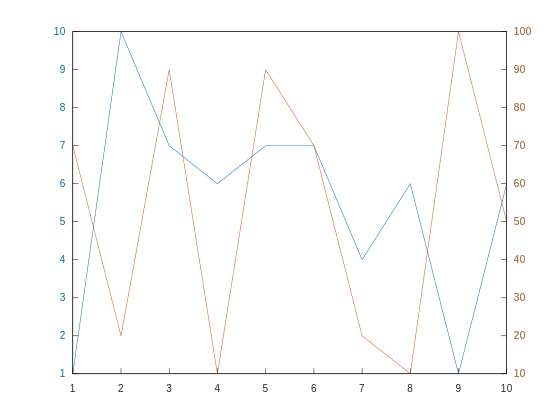

# Complete Gallery

## Line Plots

### Line Plot

`examples/line_plot/plot/plot_1.cpp`: 

`examples/line_plot/plot/plot_2.cpp`: 

`examples/line_plot/plot/plot_3.cpp`: 

`examples/line_plot/plot/plot_4.cpp`: 

`examples/line_plot/plot/plot_5.cpp`: 

`examples/line_plot/plot/plot_6.cpp`: 

`examples/line_plot/plot/plot_7.cpp`: 

`examples/line_plot/plot/plot_8.cpp`: 

`examples/line_plot/plot/plot_9.cpp`: 

`examples/line_plot/plot/plot_10.cpp`: 

`examples/line_plot/plot/plot_11.cpp`: 

`examples/line_plot/plot/plot_12.cpp`: 

### Line Plot 3D

`examples/line_plot/plot3/plot3_1.cpp`: 

`examples/line_plot/plot3/plot3_2.cpp`: 

`examples/line_plot/plot3/plot3_3.cpp`: 

`examples/line_plot/plot3/plot3_4.cpp`: 

`examples/line_plot/plot3/plot3_5.cpp`: 

`examples/line_plot/plot3/plot3_6.cpp`: 

`examples/line_plot/plot3/plot3_7.cpp`: 

`examples/line_plot/plot3/plot3_8.cpp`: 

`examples/line_plot/plot3/plot3_9.cpp`: 

`examples/line_plot/plot3/plot3_10.cpp`: 

### Stairs

`examples/line_plot/stairs/stairs_1.cpp`: 

`examples/line_plot/stairs/stairs_2.cpp`: 

`examples/line_plot/stairs/stairs_3.cpp`: 

`examples/line_plot/stairs/stairs_4.cpp`: 

`examples/line_plot/stairs/stairs_5.cpp`: 

`examples/line_plot/stairs/stairs_6.cpp`: 

`examples/line_plot/stairs/stairs_7.cpp`: 

`examples/line_plot/stairs/stairs_8.cpp`: 

`examples/line_plot/stairs/stairs_9.cpp`: 

`examples/line_plot/stairs/stairs_10.cpp`: 

### Error Bars

`examples/line_plot/errorbar/errorbar_1.cpp`: 

`examples/line_plot/errorbar/errorbar_2.cpp`: 

`examples/line_plot/errorbar/errorbar_3.cpp`: 

`examples/line_plot/errorbar/errorbar_4.cpp`: 

`examples/line_plot/errorbar/errorbar_5.cpp`: 

`examples/line_plot/errorbar/errorbar_6.cpp`: 

`examples/line_plot/errorbar/errorbar_7.cpp`: 

`examples/line_plot/errorbar/errorbar_8.cpp`: 

`examples/line_plot/errorbar/errorbar_9.cpp`: 

`examples/line_plot/errorbar/errorbar_10.cpp`: 

### Area

`examples/line_plot/area/area_1.cpp`: 

`examples/line_plot/area/area_2.cpp`: 

`examples/line_plot/area/area_3.cpp`: 

`examples/line_plot/area/area_4.cpp`: 

### Loglog Plot

`examples/line_plot/loglog/loglog_1.cpp`: 

`examples/line_plot/loglog/loglog_2.cpp`: 

`examples/line_plot/loglog/loglog_3.cpp`: 

`examples/line_plot/loglog/loglog_4.cpp`: 

`examples/line_plot/loglog/loglog_5.cpp`: 

`examples/line_plot/loglog/loglog_6.cpp`: 

`examples/line_plot/loglog/loglog_7.cpp`: 

`examples/line_plot/loglog/loglog_8.cpp`: 

`examples/line_plot/loglog/loglog_9.cpp`: 

### Semilogx Plot

`examples/line_plot/semilogx/semilogx_1.cpp`: 

### Semilogy Plot

`examples/line_plot/semilogy/semilogy_1.cpp`: 

### Function Plot

`examples/line_plot/fplot/fplot_1.cpp`: 

`examples/line_plot/fplot/fplot_2.cpp`: 

`examples/line_plot/fplot/fplot_3.cpp`: 

`examples/line_plot/fplot/fplot_4.cpp`: 

`examples/line_plot/fplot/fplot_5.cpp`: 

`examples/line_plot/fplot/fplot_6.cpp`: 

### Function Plot 3D

`examples/line_plot/fplot3/fplot3_1.cpp`: 

`examples/line_plot/fplot3/fplot3_2.cpp`: 

`examples/line_plot/fplot3/fplot3_3.cpp`: 

`examples/line_plot/fplot3/fplot3_4.cpp`: 

`examples/line_plot/fplot3/fplot3_5.cpp`: 

### Implicit function

`examples/line_plot/fimplicit/fimplicit_1.cpp`: 

`examples/line_plot/fimplicit/fimplicit_2.cpp`: 

`examples/line_plot/fimplicit/fimplicit_3.cpp`: 

`examples/line_plot/fimplicit/fimplicit_4.cpp`: 

## Data Distribution

### Histogram

`examples/data_distribution/histogram/histogram_1.cpp`: 

`examples/data_distribution/histogram/histogram_2.cpp`: 

`examples/data_distribution/histogram/histogram_3.cpp`: 

`examples/data_distribution/histogram/histogram_4.cpp`: 

`examples/data_distribution/histogram/histogram_5.cpp`: 

`examples/data_distribution/histogram/histogram_6.cpp`: 

`examples/data_distribution/histogram/histogram_7.cpp`: 

`examples/data_distribution/histogram/histogram_8.cpp`: 

`examples/data_distribution/histogram/histogram_9.cpp`: 

`examples/data_distribution/histogram/histogram_10.cpp`: 

`examples/data_distribution/histogram/histogram_11.cpp`: 

`examples/data_distribution/histogram/histogram_12.cpp`: 

`examples/data_distribution/histogram/histogram_14.cpp`: 

### Boxplot

`examples/data_distribution/boxplot/boxplot_1.cpp`: 

`examples/data_distribution/boxplot/boxplot_2.cpp`: 

`examples/data_distribution/boxplot/boxplot_3.cpp`: 

### Scatter Plot

`examples/data_distribution/scatter/scatter_1.cpp`: 

`examples/data_distribution/scatter/scatter_2.cpp`: 

`examples/data_distribution/scatter/scatter_3.cpp`: 

`examples/data_distribution/scatter/scatter_4.cpp`: 

`examples/data_distribution/scatter/scatter_5.cpp`: 

`examples/data_distribution/scatter/scatter_6.cpp`: 

`examples/data_distribution/scatter/scatter_7.cpp`: 

`examples/data_distribution/scatter/scatter_8.cpp`: 

### Scatter Plot 3D

`examples/data_distribution/scatter3/scatter3_1.cpp`: 

`examples/data_distribution/scatter3/scatter3_2.cpp`: 

`examples/data_distribution/scatter3/scatter3_3.cpp`: 

`examples/data_distribution/scatter3/scatter3_4.cpp`: 

`examples/data_distribution/scatter3/scatter3_5.cpp`: 

`examples/data_distribution/scatter3/scatter3_6.cpp`: 

### Binned Scatter Plots

`examples/data_distribution/binscatter/binscatter_1.cpp`: 

`examples/data_distribution/binscatter/binscatter_2.cpp`: 

`examples/data_distribution/binscatter/binscatter_3.cpp`: 

`examples/data_distribution/binscatter/binscatter_4.cpp`: 

`examples/data_distribution/binscatter/binscatter_5.cpp`: 

`examples/data_distribution/binscatter/binscatter_6.cpp`: 

`examples/data_distribution/binscatter/binscatter_7.cpp`: 

### Plot Matrix

`examples/data_distribution/plotmatrix/plotmatrix_1.cpp`: 

`examples/data_distribution/plotmatrix/plotmatrix_2.cpp`: 

`examples/data_distribution/plotmatrix/plotmatrix_3.cpp`: 

`examples/data_distribution/plotmatrix/plotmatrix_4.cpp`: 

### Parallel Coordinates

`examples/data_distribution/parallelplot/parallelplot_1.cpp`: 

`examples/data_distribution/parallelplot/parallelplot_2.cpp`: 

`examples/data_distribution/parallelplot/parallelplot_3.cpp`: 

### Pie Chart

`examples/data_distribution/pie/pie_1.cpp`: 

`examples/data_distribution/pie/pie_2.cpp`: 

`examples/data_distribution/pie/pie_3.cpp`: 

`examples/data_distribution/pie/pie_4.cpp`: 

`examples/data_distribution/pie/pie_5.cpp`: 

`examples/data_distribution/pie/pie_6.cpp`: 

### Heatmap

`examples/data_distribution/heatmap/heatmap_1.cpp`: 

`examples/data_distribution/heatmap/heatmap_2.cpp`: 

`examples/data_distribution/heatmap/heatmap_3.cpp`: 

`examples/data_distribution/heatmap/heatmap_4.cpp`: 

`examples/data_distribution/heatmap/heatmap_5.cpp`: 

`examples/data_distribution/heatmap/heatmap_6.cpp`: 

`examples/data_distribution/heatmap/heatmap_7.cpp`: 

### Word Cloud

`examples/data_distribution/wordcloud/wordcloud_1.cpp`: 

`examples/data_distribution/wordcloud/wordcloud_3.cpp`: 

`examples/data_distribution/wordcloud/wordcloud_4.cpp`: 

`examples/data_distribution/wordcloud/wordcloud_4.cpp`: 

## Discrete Data

### Bar Plot

`examples/discrete_data/bar/bar_1.cpp`: 

`examples/discrete_data/bar/bar_2.cpp`: 

`examples/discrete_data/bar/bar_3.cpp`: 

`examples/discrete_data/bar/bar_4.cpp`: 

`examples/discrete_data/bar/bar_5.cpp`: 

`examples/discrete_data/bar/bar_6.cpp`: 

`examples/discrete_data/bar/bar_7.cpp`: 

`examples/discrete_data/bar/bar_8.cpp`: 

`examples/discrete_data/bar/bar_9.cpp`: 

`examples/discrete_data/bar/bar_10.cpp`: 

`examples/discrete_data/bar/bar_11.cpp`: 

`examples/discrete_data/bar/bar_12.cpp`: 

`examples/discrete_data/bar/bar_13.cpp`: 

### Pareto Chart

`examples/discrete_data/pareto/pareto_1.cpp`: 

`examples/discrete_data/pareto/pareto_2.cpp`: 

`examples/discrete_data/pareto/pareto_3.cpp`: 

`examples/discrete_data/pareto/pareto_4.cpp`: 

### Stem Plot

`examples/discrete_data/stem/stem_1.cpp`: 

`examples/discrete_data/stem/stem_2.cpp`: 

`examples/discrete_data/stem/stem_3.cpp`: 

`examples/discrete_data/stem/stem_4.cpp`: 

`examples/discrete_data/stem/stem_5.cpp`: 

`examples/discrete_data/stem/stem_6.cpp`: 

`examples/discrete_data/stem/stem_7.cpp`: 

`examples/discrete_data/stem/stem_8.cpp`: 

`examples/discrete_data/stem/stem_9.cpp`: 

### Stem Plot 3D

`examples/discrete_data/stem3/stem3_1.cpp`: 

`examples/discrete_data/stem3/stem3_2.cpp`: 

`examples/discrete_data/stem3/stem3_3.cpp`: 

`examples/discrete_data/stem3/stem3_4.cpp`: 

`examples/discrete_data/stem3/stem3_5.cpp`: 

`examples/discrete_data/stem3/stem3_6.cpp`: 

`examples/discrete_data/stem3/stem3_7.cpp`: 

`examples/discrete_data/stem3/stem3_8.cpp`: 

`examples/discrete_data/stem3/stem3_9.cpp`: 

`examples/discrete_data/stem3/stem3_10.cpp`: 

`examples/discrete_data/stem3/stem3_11.cpp`: 

## Geography

### Geoplot

`examples/geography/geoplot/geoplot_1.cpp`: 

`examples/geography/geoplot/geoplot_2.cpp`: 

`examples/geography/geoplot/geoplot_3.cpp`: 

`examples/geography/geoplot/geoplot_4.cpp`: 

`examples/geography/geoplot/geoplot_5.cpp`: 

`examples/geography/geoplot/geoplot_6.cpp`: 

`examples/geography/geoplot/geoplot_7.cpp`: 

### Geoscatter Plot

`examples/geography/geoscatter/geoscatter_1.cpp`: 

`examples/geography/geoscatter/geoscatter_2.cpp`: 

### Geobubble

`examples/geography/geobubble/geobubble_1.cpp`: 

`examples/geography/geobubble/geobubble_2.cpp`: 

### Geodensity Plot

`examples/geography/geodensityplot/geodensityplot_1.cpp`: 

## Polar Plots

### Polar Line Plot

`examples/polar_plots/polarplot/polarplot_1.cpp`: 

`examples/polar_plots/polarplot/polarplot_2.cpp`: 

`examples/polar_plots/polarplot/polarplot_3.cpp`: 

`examples/polar_plots/polarplot/polarplot_4.cpp`: 

`examples/polar_plots/polarplot/polarplot_5.cpp`: 

`examples/polar_plots/polarplot/polarplot_6.cpp`: 

`examples/polar_plots/polarplot/polarplot_7.cpp`: 

`examples/polar_plots/polarplot/polarplot_8.cpp`: 

### Polar Scatter Plot

`examples/polar_plots/polarscatter/polarscatter_1.cpp`: 

`examples/polar_plots/polarscatter/polarscatter_2.cpp`: 

`examples/polar_plots/polarscatter/polarscatter_3.cpp`: 

`examples/polar_plots/polarscatter/polarscatter_4.cpp`: 

`examples/polar_plots/polarscatter/polarscatter_5.cpp`: 

`examples/polar_plots/polarscatter/polarscatter_6.cpp`: 

### Polar Histogram

`examples/polar_plots/polarhistogram/polarhistogram_1.cpp`: 

`examples/polar_plots/polarhistogram/polarhistogram_2.cpp`: 

`examples/polar_plots/polarhistogram/polarhistogram_3.cpp`: 

`examples/polar_plots/polarhistogram/polarhistogram_4.cpp`: 

`examples/polar_plots/polarhistogram/polarhistogram_5.cpp`: 

### Compass

`examples/polar_plots/compass/compass_1.cpp`: 

`examples/polar_plots/compass/compass_2.cpp`: 

### Polar Function

`examples/polar_plots/ezpolar/ezpolar_1.cpp`: 

`examples/polar_plots/ezpolar/ezpolar_2.cpp`: 

## Contour Plots

### Contour

`examples/contour_plots/contour/contour_1.cpp`: 

`examples/contour_plots/contour/contour_2.cpp`: 

`examples/contour_plots/contour/contour_3.cpp`: 

`examples/contour_plots/contour/contour_4.cpp`: 

`examples/contour_plots/contour/contour_5.cpp`: 

`examples/contour_plots/contour/contour_6.cpp`: 

`examples/contour_plots/contour/contour_7.cpp`: 

`examples/contour_plots/contour/contour_8.cpp`: 

### Filled Contour

`examples/contour_plots/contourf/contourf_1.cpp`: 

`examples/contour_plots/contourf/contourf_2.cpp`: 

`examples/contour_plots/contourf/contourf_3.cpp`: 

`examples/contour_plots/contourf/contourf_4.cpp`: 

`examples/contour_plots/contourf/contourf_5.cpp`: 

`examples/contour_plots/contourf/contourf_6.cpp`: 

### Function Contour

`examples/contour_plots/fcontour/fcontour_1.cpp`: 

`examples/contour_plots/fcontour/fcontour_2.cpp`: 

`examples/contour_plots/fcontour/fcontour_3.cpp`: 

`examples/contour_plots/fcontour/fcontour_4.cpp`: 

`examples/contour_plots/fcontour/fcontour_5.cpp`: 

`examples/contour_plots/fcontour/fcontour_6.cpp`: 

`examples/contour_plots/fcontour/fcontour_7.cpp`: 

`examples/contour_plots/fcontour/fcontour_8.cpp`: 

`examples/contour_plots/fcontour/fcontour_9.cpp`: 

`examples/contour_plots/fcontour/fcontour_10.cpp`: 

`examples/contour_plots/fcontour/fcontour_11.cpp`: 

## Vector Fields

### Quiver

`examples/vector_fields/quiver/quiver_1.cpp`: 

`examples/vector_fields/quiver/quiver_2.cpp`: 

`examples/vector_fields/quiver/quiver_3.cpp`: 

`examples/vector_fields/quiver/quiver_4.cpp`: 

`examples/vector_fields/quiver/quiver_5.cpp`: 

### Quiver 3D

`examples/vector_fields/quiver3/quiver3_1.cpp`: 

### Feather

`examples/vector_fields/feather/feather_1.cpp`: 

## Surfaces

### Surface

`examples/surfaces/surf/surf_1.cpp`: 

`examples/surfaces/surf/surf_2.cpp`: 

`examples/surfaces/surf/surf_3.cpp`: 

`examples/surfaces/surf/surf_4.cpp`: 

`examples/surfaces/surf/surf_5.cpp`: 

`examples/surfaces/surf/surf_6.cpp`: 

### Surface with Contour

`examples/surfaces/surfc/surfc_1.cpp`: 

`examples/surfaces/surfc/surfc_2.cpp`: 

`examples/surfaces/surfc/surfc_3.cpp`: 

`examples/surfaces/surfc/surfc_4.cpp`: 

### Mesh

`examples/surfaces/mesh/mesh_1.cpp`: 

`examples/surfaces/mesh/mesh_2.cpp`: 

`examples/surfaces/mesh/mesh_3.cpp`: 

`examples/surfaces/mesh/mesh_4.cpp`: 

### Mesh with Contour

`examples/surfaces/meshc/meshc_1.cpp`: 

`examples/surfaces/meshc/meshc_2.cpp`: 

`examples/surfaces/meshc/meshc_3.cpp`: 

### Mesh with Curtain

`examples/surfaces/meshz/meshz_1.cpp`: 

`examples/surfaces/meshz/meshz_2.cpp`: 

`examples/surfaces/meshz/meshz_3.cpp`: 

### Function Surface

`examples/surfaces/fsurf/fsurf_1.cpp`: 

`examples/surfaces/fsurf/fsurf_2.cpp`: 

`examples/surfaces/fsurf/fsurf_3.cpp`: 

`examples/surfaces/fsurf/fsurf_4.cpp`: 

`examples/surfaces/fsurf/fsurf_5.cpp`: 

`examples/surfaces/fsurf/fsurf_6.cpp`: 

`examples/surfaces/fsurf/fsurf_7.cpp`: 

`examples/surfaces/fsurf/fsurf_8.cpp`: 

### Function Mesh

`examples/surfaces/fmesh/fmesh_1.cpp`: 

`examples/surfaces/fmesh/fmesh_2.cpp`: 

`examples/surfaces/fmesh/fmesh_3.cpp`: 

`examples/surfaces/fmesh/fmesh_4.cpp`: 

### Waterfall

`examples/surfaces/waterfall/waterfall_1.cpp`: 

`examples/surfaces/waterfall/waterfall_2.cpp`: 

`examples/surfaces/waterfall/waterfall_3.cpp`: 

### Fence

`examples/surfaces/fence/fence_1.cpp`: 

`examples/surfaces/fence/fence_2.cpp`: 

`examples/surfaces/fence/fence_3.cpp`: 

### Ribbon

`examples/surfaces/ribbon/ribbon_1.cpp`: 

`examples/surfaces/ribbon/ribbon_2.cpp`: 

`examples/surfaces/ribbon/ribbon_3.cpp`: 

`examples/surfaces/ribbon/ribbon_4.cpp`: 

## Graphs

### Undirected Graph

`examples/graphs/graph/graph_1.cpp`: 

`examples/graphs/graph/graph_2.cpp`: 

`examples/graphs/graph/graph_3.cpp`: 

`examples/graphs/graph/graph_4.cpp`: 

`examples/graphs/graph/graph_5.cpp`: 

`examples/graphs/graph/graph_6.cpp`: 

### Directed Graph

`examples/graphs/digraph/digraph_1.cpp`: 

`examples/graphs/digraph/digraph_2.cpp`: 

`examples/graphs/digraph/digraph_3.cpp`: 

## Images

### Image Show

`examples/images/imshow/imshow_1.cpp`: 

`examples/images/imshow/imshow_2.cpp`: 

`examples/images/imshow/imshow_3.cpp`: 

`examples/images/imshow/imshow_4.cpp`: 

`examples/images/imshow/imshow_5.cpp`: 

`examples/images/imshow/imshow_6.cpp`: 

`examples/images/imshow/imshow_7.cpp`: 

`examples/images/imshow/imshow_8.cpp`: 

`examples/images/imshow/imshow_9.cpp`: 

`examples/images/imshow/imshow_10.cpp`: 

`examples/images/imshow/imshow_11.cpp`: 

### Image Matrix

`examples/images/image/image_1.cpp`: 

`examples/images/image/image_2.cpp`: 

`examples/images/image/image_3.cpp`: 

`examples/images/image/image_4.cpp`: 

`examples/images/image/image_5.cpp`: 

### Scaled Image

`examples/images/imagesc/imagesc_1.cpp`: 

`examples/images/imagesc/imagesc_2.cpp`: 

`examples/images/imagesc/imagesc_3.cpp`: 

`examples/images/imagesc/imagesc_4.cpp`: 

## Annotations

### Text

`examples/annotations/text/text_1.cpp`: 

`examples/annotations/text/text_2.cpp`: 

`examples/annotations/text/text_3.cpp`: 

`examples/annotations/text/text_4.cpp`: 

`examples/annotations/text/text_5.cpp`: 

`examples/annotations/text/text_6.cpp`: 

`examples/annotations/text/text_7.cpp`: 

`examples/annotations/text/text_8.cpp`: 

### Text with Arrow

`examples/annotations/textarrow/textarrow_1.cpp`: 

`examples/annotations/textarrow/textarrow_2.cpp`: 

### Rectangle

`examples/annotations/rectangle/rectangle_1.cpp`: 

`examples/annotations/rectangle/rectangle_2.cpp`: 

`examples/annotations/rectangle/rectangle_3.cpp`: 

`examples/annotations/rectangle/rectangle_4.cpp`: 

`examples/annotations/rectangle/rectangle_5.cpp`: 

### Filled Polygon

`examples/annotations/fill/fill_1.cpp`: 

### Ellipse

`examples/annotations/ellipse/ellipse_1.cpp`: 

### Textbox

`examples/annotations/textbox/textbox_1.cpp`: 

### Arrow

`examples/annotations/arrow/arrow_1.cpp`: 

`examples/annotations/arrow/arrow_2.cpp`: 

### Line

`examples/annotations/line/line_1.cpp`: 

## Appearance

### Labels

#### Title

`examples/appearance/labels/title/title_1.cpp`: 

`examples/appearance/labels/title/title_2.cpp`: 

`examples/appearance/labels/title/title_3.cpp`: 

`examples/appearance/labels/title/title_4.cpp`: 

`examples/appearance/labels/title/title_5.cpp`: 

`examples/appearance/labels/title/title_6.cpp`: 

`examples/appearance/labels/title/title_7.cpp`: 

`examples/appearance/labels/title/title_8.cpp`: 

#### Subplot Title

`examples/appearance/labels/sgtitle/sgtitle_1.cpp`: 

`examples/appearance/labels/sgtitle/sgtitle_2.cpp`: 

#### X Label

`examples/appearance/labels/xlabel/xlabel_1.cpp`: 

`examples/appearance/labels/xlabel/xlabel_2.cpp`: 

`examples/appearance/labels/xlabel/xlabel_3.cpp`: 

`examples/appearance/labels/xlabel/xlabel_4.cpp`: 

`examples/appearance/labels/xlabel/xlabel_5.cpp`: 

`examples/appearance/labels/xlabel/xlabel_6.cpp`: 

`examples/appearance/labels/xlabel/xlabel_7.cpp`: 

`examples/appearance/labels/xlabel/xlabel_8.cpp`: 

#### Y Label

`examples/appearance/labels/ylabel/ylabel_1.cpp`: 

`examples/appearance/labels/ylabel/ylabel_2.cpp`: 

`examples/appearance/labels/ylabel/ylabel_3.cpp`: 

`examples/appearance/labels/ylabel/ylabel_4.cpp`: 

`examples/appearance/labels/ylabel/ylabel_5.cpp`: 

`examples/appearance/labels/ylabel/ylabel_6.cpp`: 

`examples/appearance/labels/ylabel/ylabel_7.cpp`: 

`examples/appearance/labels/ylabel/ylabel_8.cpp`: 

#### Z Label

`examples/appearance/labels/zlabel/zlabel_1.cpp`: 

`examples/appearance/labels/zlabel/zlabel_2.cpp`: 

`examples/appearance/labels/zlabel/zlabel_3.cpp`: 

#### Legend

`examples/appearance/labels/legend/legend_1.cpp`: 

`examples/appearance/labels/legend/legend_2.cpp`: 

`examples/appearance/labels/legend/legend_3.cpp`: 

`examples/appearance/labels/legend/legend_4.cpp`: 

`examples/appearance/labels/legend/legend_5.cpp`: 

`examples/appearance/labels/legend/legend_6.cpp`: 

`examples/appearance/labels/legend/legend_7.cpp`: 

`examples/appearance/labels/legend/legend_8.cpp`: 

`examples/appearance/labels/legend/legend_9.cpp`: 

### Axis

#### X Limits

`examples/appearance/axis/xlim/xlim_1.cpp`: 

`examples/appearance/axis/xlim/xlim_2.cpp`: 

`examples/appearance/axis/xlim/xlim_3.cpp`: 

`examples/appearance/axis/xlim/xlim_4.cpp`: 

`examples/appearance/axis/xlim/xlim_5.cpp`: 

`examples/appearance/axis/xlim/xlim_6.cpp`: 

#### Y Limits

`examples/appearance/axis/ylim/ylim_1.cpp`: 

`examples/appearance/axis/ylim/ylim_2.cpp`: 

`examples/appearance/axis/ylim/ylim_3.cpp`: 

`examples/appearance/axis/ylim/ylim_4.cpp`: 

`examples/appearance/axis/ylim/ylim_5.cpp`: 

`examples/appearance/axis/ylim/ylim_6.cpp`: 

#### Z Limits

`examples/appearance/axis/zlim/zlim_1.cpp`: 

`examples/appearance/axis/zlim/zlim_2.cpp`: 

`examples/appearance/axis/zlim/zlim_3.cpp`: 

`examples/appearance/axis/zlim/zlim_4.cpp`: 

`examples/appearance/axis/zlim/zlim_5.cpp`: 

`examples/appearance/axis/zlim/zlim_6.cpp`: 

#### Adjust Axis

`examples/appearance/axis/axis/axis_1.cpp`: 

`examples/appearance/axis/axis/axis_2.cpp`: 

`examples/appearance/axis/axis/axis_3.cpp`: 

`examples/appearance/axis/axis/axis_4.cpp`: 

`examples/appearance/axis/axis/axis_5.cpp`: 

`examples/appearance/axis/axis/axis_6.cpp`: 

`examples/appearance/axis/axis/axis_7.cpp`: 

`examples/appearance/axis/axis/axis_8.cpp`: 

#### Box

`examples/appearance/axis/box/box_1.cpp`: 

`examples/appearance/axis/box/box_2.cpp`: 

`examples/appearance/axis/box/box_3.cpp`: 

### Grid

#### Grid

`examples/appearance/grid/grid/grid_1.cpp`: 

`examples/appearance/grid/grid/grid_2.cpp`: 

`examples/appearance/grid/grid/grid_3.cpp`: 

`examples/appearance/grid/grid/grid_4.cpp`: 

#### X Ticks

`examples/appearance/grid/xticks/xticks_1.cpp`: 

`examples/appearance/grid/xticks/xticks_2.cpp`: 

`examples/appearance/grid/xticks/xticks_3.cpp`: 

`examples/appearance/grid/xticks/xticks_4.cpp`: 

`examples/appearance/grid/xticks/xticks_5.cpp`: 

`examples/appearance/grid/xticks/xticks_6.cpp`: 

`examples/appearance/grid/xticks/xticks_7.cpp`: 

`examples/appearance/grid/xticks/xticks_8.cpp`: 

#### Y Ticks

`examples/appearance/grid/yticks/yticks_1.cpp`: 

`examples/appearance/grid/yticks/yticks_2.cpp`: 

`examples/appearance/grid/yticks/yticks_3.cpp`: 

`examples/appearance/grid/yticks/yticks_4.cpp`: 

`examples/appearance/grid/yticks/yticks_5.cpp`: 

`examples/appearance/grid/yticks/yticks_6.cpp`: 

`examples/appearance/grid/yticks/yticks_7.cpp`: 

`examples/appearance/grid/yticks/yticks_8.cpp`: 

#### Z Ticks

`examples/appearance/grid/zticks/zticks_1.cpp`: 

`examples/appearance/grid/zticks/zticks_2.cpp`: 

`examples/appearance/grid/zticks/zticks_3.cpp`: 

`examples/appearance/grid/zticks/zticks_4.cpp`: 

`examples/appearance/grid/zticks/zticks_5.cpp`: 

`examples/appearance/grid/zticks/zticks_6.cpp`: 

#### X Tick Labels

`examples/appearance/grid/xticklabels/xticklabels_1.cpp`: 

`examples/appearance/grid/xticklabels/xticklabels_2.cpp`: 

`examples/appearance/grid/xticklabels/xticklabels_3.cpp`: 

`examples/appearance/grid/xticklabels/xticklabels_4.cpp`: 

#### Y Tick Labels

`examples/appearance/grid/yticklabels/yticklabels_1.cpp`: 

`examples/appearance/grid/yticklabels/yticklabels_2.cpp`: 

`examples/appearance/grid/yticklabels/yticklabels_3.cpp`: 

`examples/appearance/grid/yticklabels/yticklabels_4.cpp`: 

#### X Tick Format

`examples/appearance/grid/xtickformat/xtickformat_1.cpp`: 

`examples/appearance/grid/xtickformat/xtickformat_2.cpp`: 

`examples/appearance/grid/xtickformat/xtickformat_3.cpp`: 

`examples/appearance/grid/xtickformat/xtickformat_4.cpp`: 

`examples/appearance/grid/xtickformat/xtickformat_5.cpp`: 

#### Y Tick Format

`examples/appearance/grid/ytickformat/ytickformat_1.cpp`: 

`examples/appearance/grid/ytickformat/ytickformat_2.cpp`: 

`examples/appearance/grid/ytickformat/ytickformat_3.cpp`: 

`examples/appearance/grid/ytickformat/ytickformat_4.cpp`: 

`examples/appearance/grid/ytickformat/ytickformat_5.cpp`: 

#### Z Tick Format

`examples/appearance/grid/ztickformat/ztickformat_1.cpp`: 

`examples/appearance/grid/ztickformat/ztickformat_2.cpp`: 

`examples/appearance/grid/ztickformat/ztickformat_3.cpp`: 

`examples/appearance/grid/ztickformat/ztickformat_4.cpp`: 

`examples/appearance/grid/ztickformat/ztickformat_5.cpp`: 

#### X Tick Angle

`examples/appearance/grid/xtickangle/xtickangle_1.cpp`: 

`examples/appearance/grid/xtickangle/xtickangle_2.cpp`: 

`examples/appearance/grid/xtickangle/xtickangle_3.cpp`: 

#### Y Tick Angle

`examples/appearance/grid/ytickangle/ytickangle_1.cpp`: 

`examples/appearance/grid/ytickangle/ytickangle_2.cpp`: 

`examples/appearance/grid/ytickangle/ytickangle_3.cpp`: 

### Multiplot

#### Hold

`examples/appearance/multiplot/hold/hold_1.cpp`: 

`examples/appearance/multiplot/hold/hold_2.cpp`: 

`examples/appearance/multiplot/hold/hold_3.cpp`: 

`examples/appearance/multiplot/hold/hold_4.cpp`: 

#### YY-axis

`examples/appearance/multiplot/yyaxis/yyaxis_1.cpp`: 

`examples/appearance/multiplot/yyaxis/yyaxis_2.cpp`: 

`examples/appearance/multiplot/yyaxis/yyaxis_3.cpp`: 

`examples/appearance/multiplot/yyaxis/yyaxis_4.cpp`: 

`examples/appearance/multiplot/yyaxis/yyaxis_5.cpp`: 

`examples/appearance/multiplot/yyaxis/yyaxis_6.cpp`: 

`examples/appearance/multiplot/yyaxis/yyaxis_7.cpp`: 

#### Color Order

`examples/appearance/multiplot/colororder/colororder_1.cpp`: 

`examples/appearance/multiplot/colororder/colororder_2.cpp`: 

`examples/appearance/multiplot/colororder/colororder_3.cpp`: 

`examples/appearance/multiplot/colororder/colororder_4.cpp`: 

`examples/appearance/multiplot/colororder/colororder_5.cpp`: 

`examples/appearance/multiplot/colororder/colororder_6.cpp`: 

`examples/appearance/multiplot/colororder/colororder_7.cpp`: 

#### Subplots

`examples/appearance/multiplot/subplot/subplot_1.cpp`: 

`examples/appearance/multiplot/subplot/subplot_2.cpp`: 

`examples/appearance/multiplot/subplot/subplot_3.cpp`: 

`examples/appearance/multiplot/subplot/subplot_4.cpp`: 

`examples/appearance/multiplot/subplot/subplot_5.cpp`: 

`examples/appearance/multiplot/subplot/subplot_6.cpp`: 

`examples/appearance/multiplot/subplot/subplot_7.cpp`: 

`examples/appearance/multiplot/subplot/subplot_8.cpp`: 

`examples/appearance/multiplot/subplot/subplot_9.cpp`: 

`examples/appearance/multiplot/subplot/subplot_10.cpp`: 

`examples/appearance/multiplot/subplot/subplot_11.cpp`: 

`examples/appearance/multiplot/subplot/subplot_12.cpp`: 

`examples/appearance/multiplot/subplot/subplot_13.cpp`: 

#### Tiled Layout

`examples/appearance/multiplot/tiledlayout/tiledlayout_1.cpp`: 

`examples/appearance/multiplot/tiledlayout/tiledlayout_2.cpp`: 

`examples/appearance/multiplot/tiledlayout/tiledlayout_3.cpp`: 

`examples/appearance/multiplot/tiledlayout/tiledlayout_4.cpp`: 

`examples/appearance/multiplot/tiledlayout/tiledlayout_5.cpp`: 

`examples/appearance/multiplot/tiledlayout/tiledlayout_6.cpp`: 

`examples/appearance/multiplot/tiledlayout/tiledlayout_7.cpp`: 

`examples/appearance/multiplot/tiledlayout/tiledlayout_8.cpp`: 

### Colormaps

#### Colormap

`examples/appearance/colormaps/colormap/colormap_1.cpp`: 

`examples/appearance/colormaps/colormap/colormap_2.cpp`: 

`examples/appearance/colormaps/colormap/colormap_3.cpp`: 

`examples/appearance/colormaps/colormap/colormap_4.cpp`: 

`examples/appearance/colormaps/colormap/colormap_5.cpp`: 

`examples/appearance/colormaps/colormap/colormap_6.cpp`: 

`examples/appearance/colormaps/colormap/colormap_7.cpp`: 

`examples/appearance/colormaps/colormap/colormap_8.cpp`: 

`examples/appearance/colormaps/colormap/colormap_9.cpp`: 

#### Color Bar

`examples/appearance/colormaps/colorbar/colorbar_1.cpp`: 

`examples/appearance/colormaps/colorbar/colorbar_2.cpp`: 

`examples/appearance/colormaps/colorbar/colorbar_3.cpp`: 

`examples/appearance/colormaps/colorbar/colorbar_4.cpp`: 

`examples/appearance/colormaps/colorbar/colorbar_5.cpp`: 

`examples/appearance/colormaps/colorbar/colorbar_6.cpp`: 

`examples/appearance/colormaps/colorbar/colorbar_7.cpp`: 

#### RGB Plot

`examples/appearance/colormaps/rgbplot/rgbplot_1.cpp`: 

`examples/appearance/colormaps/rgbplot/rgbplot_2.cpp`: 

### Camera

#### View

`examples/appearance/camera/view/view_1.cpp`: 

`examples/appearance/camera/view/view_2.cpp`: 

`examples/appearance/camera/view/view_3.cpp`: 

`examples/appearance/camera/view/view_4.cpp`: 

`examples/appearance/camera/view/view_5.cpp`: 

`examples/appearance/camera/view/view_6.cpp`: 

#### Lighting

`examples/appearance/camera/lighting/lighting_1.cpp`: 

`examples/appearance/camera/lighting/lighting_2.cpp`: 

`examples/appearance/camera/lighting/lighting_3.cpp`: 

`examples/appearance/camera/lighting/lighting_4.cpp`: 

`examples/appearance/camera/lighting/lighting_5.cpp`: 

`examples/appearance/camera/lighting/lighting_6.cpp`: 

### Figure Object

`examples/appearance/figure/figure_1.cpp`: 

`examples/appearance/figure/figure_2.cpp`: 

`examples/appearance/figure/figure_3.cpp`: 

### Line Specs

`examples/appearance/line_spec/line_spec_1.cpp`: 

### Axes Object

`examples/appearance/axes/axes_1.cpp`: 

`examples/appearance/axes/axes_2.cpp`: 

`examples/appearance/axes/axes_3.cpp`: 

`examples/appearance/axes/axes_4.cpp`: 

### Clear Axes

`examples/appearance/cla/cla_1.cpp`: 

`examples/appearance/cla/cla_2.cpp`: 

`examples/appearance/cla/cla_3.cpp`: 

## Exporting

### Saving

`examples/exporting/save/save_1.cpp`: 

`examples/exporting/save/save_2.cpp`: 

`examples/exporting/save/save_3.cpp`: 

`examples/exporting/save/save_4.cpp`: 

`examples/exporting/save/save_5.cpp`: 

`examples/exporting/save/save_6.cpp`: 

`examples/exporting/save/save_7.cpp`: 

`examples/exporting/save/save_8.cpp`: 

