## Examples

### Line Plots

#### Line Plot

More examples:

        [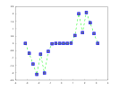](examples/line_plot/plot/plot_6.cpp)          [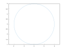](examples/line_plot/plot/plot_11.cpp)    
#### Line Plot 3D

More examples:

[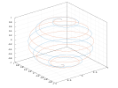](examples/line_plot/plot3/plot3_2.cpp)                  
#### Stairs

More examples:

  [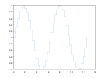](examples/line_plot/stairs/stairs_3.cpp)  [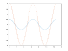](examples/line_plot/stairs/stairs_4.cpp)              
#### Error Bars

More examples:

        [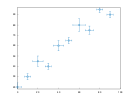](examples/line_plot/errorbar/errorbar_6.cpp)          
#### Area

More examples:

    [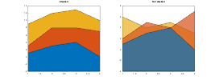](examples/line_plot/area/area_4.cpp)  
#### Loglog Plot

More examples:

        [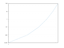](examples/line_plot/loglog/loglog_6.cpp)  [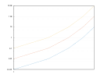](examples/line_plot/loglog/loglog_7.cpp)      
#### Semilogx Plot

[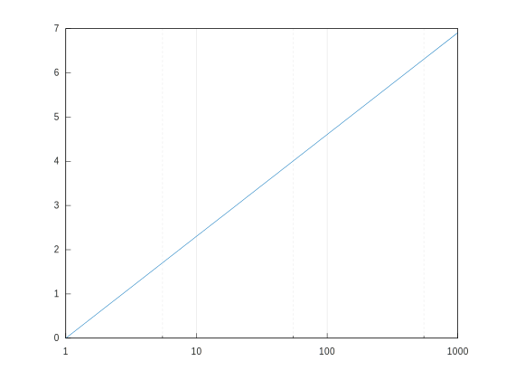](examples/line_plot/semilogx/semilogx_1.cpp)

#### Semilogy Plot

#### Function Plot

More examples:

          
#### Function Plot 3D

More examples:

      [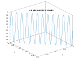](examples/line_plot/fplot3/fplot3_5.cpp)  
#### Implicit function

[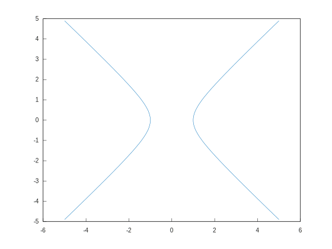](examples/line_plot/fimplicit/fimplicit_1.cpp)

More examples:

      
### Data Distribution

#### Histogram

More examples:

                        
#### Boxplot

More examples:

    
#### Scatter Plot

More examples:

[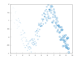](examples/data_distribution/scatter/scatter_2.cpp)    [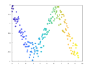](examples/data_distribution/scatter/scatter_4.cpp)    [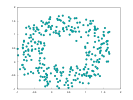](examples/data_distribution/scatter/scatter_6.cpp)      
#### Scatter Plot 3D

More examples:

    [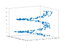](examples/data_distribution/scatter3/scatter3_4.cpp)    [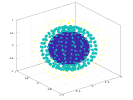](examples/data_distribution/scatter3/scatter3_6.cpp)  
#### Binned Scatter Plots

[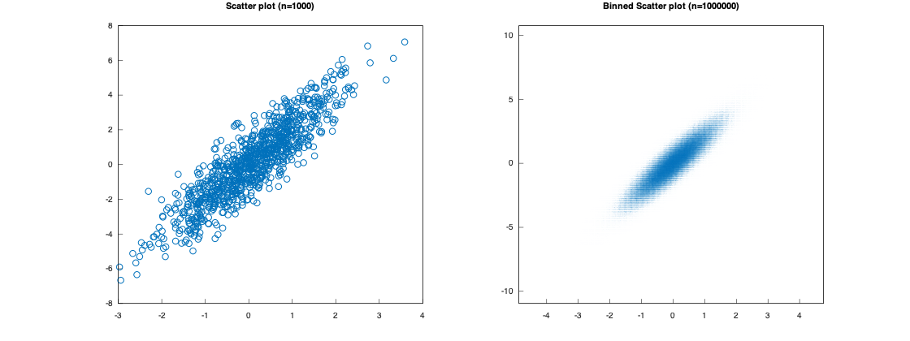](examples/data_distribution/binscatter/binscatter_1.cpp)

More examples:

            
#### Plot Matrix

More examples:

[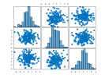](examples/data_distribution/plotmatrix/plotmatrix_2.cpp)      
#### Parallel Coordinates

[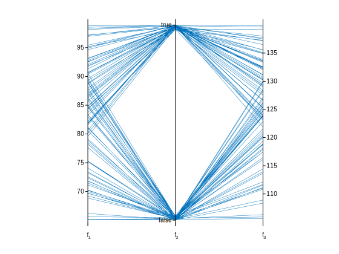](examples/data_distribution/parallelplot/parallelplot_1.cpp)

More examples:

    
#### Pie Chart

More examples:

          
#### Heatmap

More examples:

            
#### Word Cloud

More examples:

      
### Discrete Data

#### Bar Plot

More examples:

        [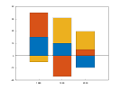](examples/discrete_data/bar/bar_6.cpp)                
#### Pareto Chart

[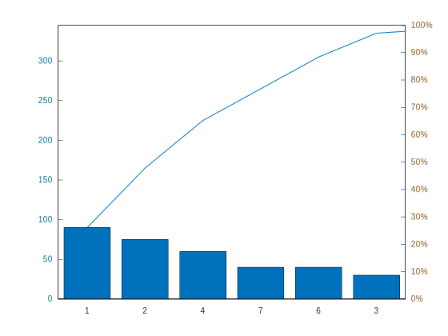](examples/discrete_data/pareto/pareto_1.cpp)

More examples:

  [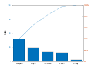](examples/discrete_data/pareto/pareto_3.cpp)    
#### Stem Plot

More examples:

                
#### Stem Plot 3D

More examples:

  [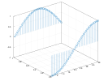](examples/discrete_data/stem3/stem3_3.cpp)        [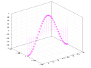](examples/discrete_data/stem3/stem3_7.cpp)      [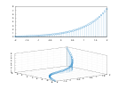](examples/discrete_data/stem3/stem3_10.cpp)    
### Geography

#### Geoplot

More examples:

        [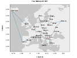](examples/geography/geoplot/geoplot_6.cpp)    
#### Geoscatter Plot

More examples:

[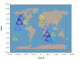](examples/geography/geoscatter/geoscatter_2.cpp)  
#### Geobubble

[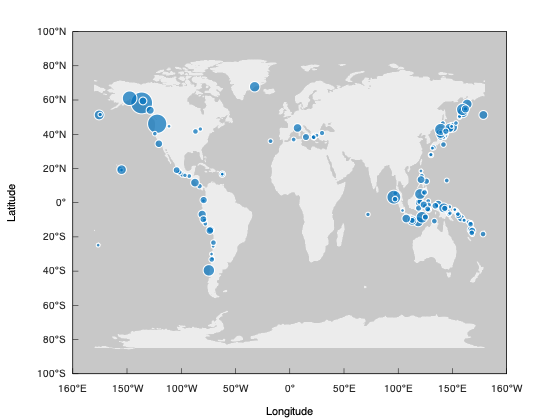](examples/geography/geobubble/geobubble_1.cpp)

More examples:

[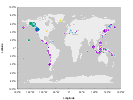](examples/geography/geobubble/geobubble_2.cpp)  
#### Geodensity Plot

### Polar Plots

#### Polar Line Plot

More examples:

              
#### Polar Scatter Plot

More examples:

          
#### Polar Histogram

More examples:

    [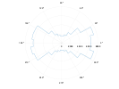](examples/polar_plots/polarhistogram/polarhistogram_4.cpp)    
#### Compass

More examples:

  
#### Polar Function

More examples:

  
### Contour Plots

#### Contour

More examples:

              
#### Filled Contour

More examples:

  [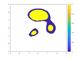](examples/contour_plots/contourf/contourf_3.cpp)        
#### Function Contour

More examples:

          [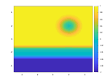](examples/contour_plots/fcontour/fcontour_7.cpp)      [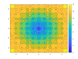](examples/contour_plots/fcontour/fcontour_10.cpp)    
### Vector Fields

#### Feather

#### Quiver

More examples:

        
#### Quiver 3D

### Surfaces

#### Surface

More examples:

          
#### Surface with Contour

More examples:

  [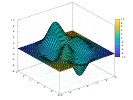](examples/surfaces/surfc/surfc_3.cpp)    
#### Mesh

More examples:

      
#### Mesh with Contour

More examples:

    
#### Mesh with Curtain

More examples:

    
#### Function Surface

[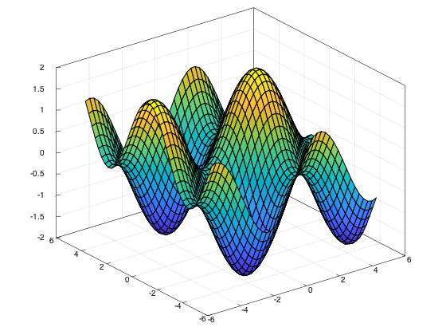](examples/surfaces/fsurf/fsurf_1.cpp)

More examples:

              
#### Function Mesh

[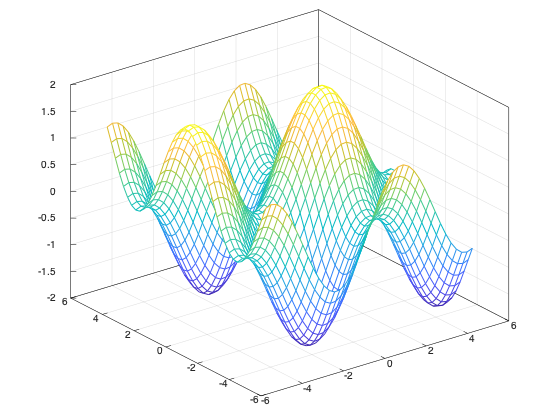](examples/surfaces/fmesh/fmesh_1.cpp)

More examples:

      
#### Waterfall

More examples:

    
#### Fence

More examples:

  [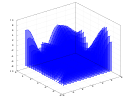](examples/surfaces/fence/fence_3.cpp)  
#### Ribbon

More examples:

[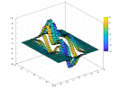](examples/surfaces/ribbon/ribbon_2.cpp)      
### Graphs

#### Undirected Graph

More examples:

          
#### Directed Graph

More examples:

    
### Images

#### Image Show

More examples:

                    
#### Image Matrix

More examples:

        
#### Scaled Image

More examples:

      
### Annotations

#### Text

More examples:

  [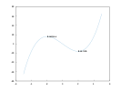](examples/annotations/text/text_3.cpp)        [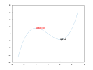](examples/annotations/text/text_7.cpp)    
#### Text with Arrow

More examples:

[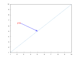](examples/annotations/textarrow/textarrow_2.cpp)  
#### Rectangle

More examples:

        
#### Filled Polygon

#### Ellipse

#### Textbox

[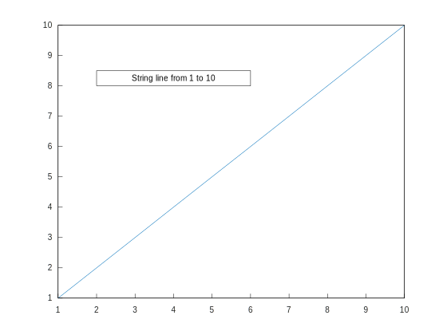](examples/annotations/textbox/textbox_1.cpp)

#### Arrow

More examples:

  
#### Line

### Appearance

#### Labels

##### Title

More examples:

  [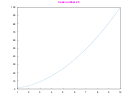](examples/appearance/labels/title/title_3.cpp)  [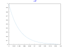](examples/appearance/labels/title/title_4.cpp)          
##### Subplot Title

More examples:

[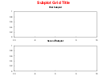](examples/appearance/labels/sgtitle/sgtitle_2.cpp)  
##### X Label

More examples:

  [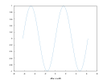](examples/appearance/labels/xlabel/xlabel_3.cpp)        [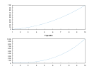](examples/appearance/labels/xlabel/xlabel_7.cpp)    
##### Y Label

More examples:

    [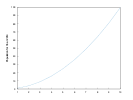](examples/appearance/labels/ylabel/ylabel_4.cpp)          
##### Z Label

[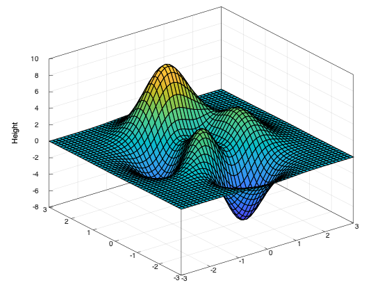](examples/appearance/labels/zlabel/zlabel_1.cpp)

More examples:

    
##### Legend

More examples:

                
#### Axis

##### X Limits

More examples:

          
##### Y Limits

More examples:

          
##### Z Limits

More examples:

          
##### Adjust Axis

More examples:

              
##### Box

More examples:

    
#### Grid

##### Grid

More examples:

      
##### X Ticks

More examples:

              
##### Y Ticks

More examples:

              
##### Z Ticks

More examples:

          
##### X Tick Labels

More examples:

      
##### Y Tick Labels

More examples:

      
##### X Tick Format

More examples:

        
##### Y Tick Format

More examples:

        
##### Z Tick Format

More examples:

        
##### X Tick Angle

More examples:

    
##### Y Tick Angle

More examples:

    
#### Multiplot

##### Hold

More examples:

      
##### YY-axis

More examples:

            
##### Color Order

More examples:

            
##### Subplots

More examples:

                        
##### Tiled Layout

More examples:

              
#### Colormaps

##### Colormap

More examples:

                
##### Color Bar

More examples:

            
##### RGB Plot

More examples:

  
#### Camera

##### View

More examples:

          
##### Lighting

More examples:

          
#### Figure Object

More examples:

    
#### Line Specs

#### Axes Object

More examples:

      
#### Clear Axes

More examples:

    
### Exporting

#### Saving

More examples:

              