# Matplot++

Data visualization can help programmers and scientists identify trends in their data and efficiently communicate these results with their peers. Modern C++ is being used for a variety of scientific applications, and this environment can benefit considerably from graphics libraries that attend the typical design goals toward scientific data visualization. Besides the option of exporting results to other environments, the customary alternatives in C++ are either non-dedicated libraries that depend on existing user interfaces or bindings to other languages. **Matplot++** is a graphics library for data visualization that provides interactive plotting, means for exporting plots in high-quality formats for scientific publications, a compact syntax consistent with similar libraries, dozens of plot categories with specialized algorithms, multiple coding styles, and supports generic backends.

<!-- START doctoc generated TOC please keep comment here to allow auto update -->
<!-- DON'T EDIT THIS SECTION, INSTEAD RE-RUN doctoc TO UPDATE -->

Table of Contents

- [Gallery](#gallery)
- [Examples](#examples)
  - [Line Plots](#line-plots)
  - [Data Distribution](#data-distribution)
  - [Discrete Data](#discrete-data)
  - [Geography](#geography)
  - [Polar Plots](#polar-plots)
  - [Contour Plots](#contour-plots)
  - [Vector Fields](#vector-fields)
  - [Surfaces](#surfaces)
  - [Graphs](#graphs)
  - [Images](#images)
  - [Annotations](#annotations)
  - [Appearance](#appearance)
  - [Exporting](#exporting)
- [Coding styles](#coding-styles)
  - [Member vs. Free-standing Functions](#member-vs-free-standing-functions)
  - [Reactive figures](#reactive-figures)
  - [Method Chaining](#method-chaining)
  - [Ranges](#ranges)
  - [Common Utilities](#common-utilities)
- [Motivation and Details](#motivation-and-details)
- [Integration](#integration)
  - [Binary Packages](#binary-packages)
  - [Build from Source](#build-from-source)
  - [CMake targets](#cmake-targets)
  - [Other build systems](#other-build-systems)
  - [Backends](#backends)
- [Contributing](#contributing)
  - [Contributors](#contributors)
- [References](#references)


<!-- END doctoc generated TOC please keep comment here to allow auto update -->

## Gallery

[](documentation/GALLERY.md#plot_1) [](documentation/GALLERY.md#plot3_1) [](documentation/GALLERY.md#stairs_1) [](documentation/GALLERY.md#errorbar_1) [](documentation/GALLERY.md#area_1) [](documentation/GALLERY.md#loglog_1) [](documentation/GALLERY.md#fplot_1) [](documentation/GALLERY.md#fimplicit_1)  [](documentation/GALLERY.md#histogram_1) [](documentation/GALLERY.md#boxplot_1) [](documentation/GALLERY.md#scatter_1) [](documentation/GALLERY.md#scatter3_1) [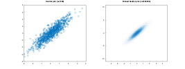](documentation/GALLERY.md#binscatter_1)  [](documentation/GALLERY.md#plotmatrix_1)  [](documentation/GALLERY.md#parallelplot_1)  [](documentation/GALLERY.md#pie_1)  [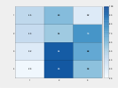](documentation/GALLERY.md#heatmap_1)  [](documentation/GALLERY.md#wordcloud_1)  [](documentation/GALLERY.md#bar_1)  [](documentation/GALLERY.md#pareto_1)  [](documentation/GALLERY.md#stem_1)  [](documentation/GALLERY.md#stem3_1)  [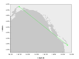](documentation/GALLERY.md#geoplot_1)  [](documentation/GALLERY.md#geoscatter_1)  [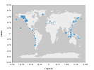](documentation/GALLERY.md#geobubble_1)  [](documentation/GALLERY.md#geodensityplot_1)  [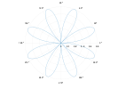](documentation/GALLERY.md#polarplot_1)  [](documentation/GALLERY.md#polarscatter_1)  [](documentation/GALLERY.md#polarhistogram_1)  [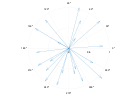](documentation/GALLERY.md#compass_1)  [](documentation/GALLERY.md#ezpolar_1)  [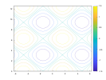](documentation/GALLERY.md#contour_1)  [](documentation/GALLERY.md#contourf_1)  [](documentation/GALLERY.md#fcontour_1)  [](documentation/GALLERY.md#feather_1)  [](documentation/GALLERY.md#quiver_1)  [](documentation/GALLERY.md#surf_1)  [](documentation/GALLERY.md#surfc_1)  [](documentation/GALLERY.md#mesh_1)  [](documentation/GALLERY.md#meshc_1)  [](documentation/GALLERY.md#meshz_1)  [](documentation/GALLERY.md#fsurf_1)  [](documentation/GALLERY.md#fmesh_1)  [](documentation/GALLERY.md#waterfall_1)  [](documentation/GALLERY.md#fence_1)  [](documentation/GALLERY.md#ribbon_1)  [](documentation/GALLERY.md#graph_1)  [](documentation/GALLERY.md#digraph_1)  [](documentation/GALLERY.md#imshow_1)  [](documentation/GALLERY.md#image_1)  [](documentation/GALLERY.md#imagesc_1)


Complete Gallery

[](documentation/GALLERY.md#plot_1)  [](documentation/GALLERY.md#plot_2)  [](documentation/GALLERY.md#plot_3)  [](documentation/GALLERY.md#plot_4)  [](documentation/GALLERY.md#plot_5)  [](documentation/GALLERY.md#plot_6)  [](documentation/GALLERY.md#plot_7)  [](documentation/GALLERY.md#plot_8)  [](documentation/GALLERY.md#plot_9)  [](documentation/GALLERY.md#plot_10)  [](documentation/GALLERY.md#plot_11)  [](documentation/GALLERY.md#plot_12)  [](documentation/GALLERY.md#plot3_1)  [](documentation/GALLERY.md#plot3_2)  [](documentation/GALLERY.md#plot3_3)  [](documentation/GALLERY.md#plot3_4)  [](documentation/GALLERY.md#plot3_5)  [](documentation/GALLERY.md#plot3_6)  [](documentation/GALLERY.md#plot3_7)  [](documentation/GALLERY.md#plot3_8)  [](documentation/GALLERY.md#plot3_9)  [](documentation/GALLERY.md#plot3_10)  [](documentation/GALLERY.md#stairs_1)  [](documentation/GALLERY.md#stairs_2)  [](documentation/GALLERY.md#stairs_3)  [](documentation/GALLERY.md#stairs_4)  [](documentation/GALLERY.md#stairs_5)  [](documentation/GALLERY.md#stairs_6)  [](documentation/GALLERY.md#stairs_7)  [](documentation/GALLERY.md#stairs_8)  [](documentation/GALLERY.md#stairs_9)  [](documentation/GALLERY.md#stairs_10)  [](documentation/GALLERY.md#errorbar_1)  [](documentation/GALLERY.md#errorbar_2)  [](documentation/GALLERY.md#errorbar_3)  [](documentation/GALLERY.md#errorbar_4)  [](documentation/GALLERY.md#errorbar_5)  [](documentation/GALLERY.md#errorbar_6)  [](documentation/GALLERY.md#errorbar_7)  [](documentation/GALLERY.md#errorbar_8)  [](documentation/GALLERY.md#errorbar_9)  [](documentation/GALLERY.md#errorbar_10)  [](documentation/GALLERY.md#area_1)  [](documentation/GALLERY.md#area_2)  [](documentation/GALLERY.md#area_3)  [](documentation/GALLERY.md#area_4)  [](documentation/GALLERY.md#loglog_1)  [](documentation/GALLERY.md#loglog_2)  [](documentation/GALLERY.md#loglog_3)  [](documentation/GALLERY.md#loglog_4)  [](documentation/GALLERY.md#loglog_5)  [](documentation/GALLERY.md#loglog_6)  [](documentation/GALLERY.md#loglog_7)  [](documentation/GALLERY.md#loglog_8)  [](documentation/GALLERY.md#loglog_9)  [](documentation/GALLERY.md#semilogx_1)  [](documentation/GALLERY.md#semilogy_1)  [](documentation/GALLERY.md#fplot_1)  [](documentation/GALLERY.md#fplot_2)  [](documentation/GALLERY.md#fplot_3)  [](documentation/GALLERY.md#fplot_4)  [](documentation/GALLERY.md#fplot_5)  [](documentation/GALLERY.md#fplot_6)  [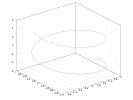](documentation/GALLERY.md#fplot3_1)  [](documentation/GALLERY.md#fplot3_2)  [](documentation/GALLERY.md#fplot3_3)  [](documentation/GALLERY.md#fplot3_4)  [](documentation/GALLERY.md#fplot3_5)  [](documentation/GALLERY.md#fimplicit_1)  [](documentation/GALLERY.md#fimplicit_2)  [](documentation/GALLERY.md#fimplicit_3)  [](documentation/GALLERY.md#fimplicit_4)  [](documentation/GALLERY.md#histogram_1)  [](documentation/GALLERY.md#histogram_2)  [](documentation/GALLERY.md#histogram_3)  [](documentation/GALLERY.md#histogram_4)  [](documentation/GALLERY.md#histogram_5)  [](documentation/GALLERY.md#histogram_6)  [](documentation/GALLERY.md#histogram_7)  [](documentation/GALLERY.md#histogram_8)  [](documentation/GALLERY.md#histogram_9)  [](documentation/GALLERY.md#histogram_10)  [](documentation/GALLERY.md#histogram_11)  [](documentation/GALLERY.md#histogram_12)  [](documentation/GALLERY.md#histogram_14)  [](documentation/GALLERY.md#boxplot_1)  [](documentation/GALLERY.md#boxplot_2)  [](documentation/GALLERY.md#boxplot_3)  [](documentation/GALLERY.md#scatter_1)  [](documentation/GALLERY.md#scatter_2)  [](documentation/GALLERY.md#scatter_3)  [](documentation/GALLERY.md#scatter_4)  [](documentation/GALLERY.md#scatter_5)  [](documentation/GALLERY.md#scatter_6)  [](documentation/GALLERY.md#scatter_7)  [](documentation/GALLERY.md#scatter_8)  [](documentation/GALLERY.md#scatter3_1)  [](documentation/GALLERY.md#scatter3_2)  [](documentation/GALLERY.md#scatter3_3)  [](documentation/GALLERY.md#scatter3_4)  [](documentation/GALLERY.md#scatter3_5)  [](documentation/GALLERY.md#scatter3_6)  [](documentation/GALLERY.md#binscatter_1)  [](documentation/GALLERY.md#binscatter_2)  [](documentation/GALLERY.md#binscatter_3)  [](documentation/GALLERY.md#binscatter_4)  [](documentation/GALLERY.md#binscatter_5)  [](documentation/GALLERY.md#binscatter_6)  [](documentation/GALLERY.md#binscatter_7)  [](documentation/GALLERY.md#plotmatrix_1)  [](documentation/GALLERY.md#plotmatrix_2)  [](documentation/GALLERY.md#plotmatrix_3)  [](documentation/GALLERY.md#plotmatrix_4)  [](documentation/GALLERY.md#parallelplot_1)  [](documentation/GALLERY.md#parallelplot_2)  [](documentation/GALLERY.md#parallelplot_3)  [](documentation/GALLERY.md#pie_1)  [](documentation/GALLERY.md#pie_2)  [](documentation/GALLERY.md#pie_3)  [](documentation/GALLERY.md#pie_4)  [](documentation/GALLERY.md#pie_5)  [](documentation/GALLERY.md#pie_6)  [](documentation/GALLERY.md#heatmap_1)  [](documentation/GALLERY.md#heatmap_2)  [](documentation/GALLERY.md#heatmap_3)  [](documentation/GALLERY.md#heatmap_4)  [](documentation/GALLERY.md#heatmap_5)  [](documentation/GALLERY.md#heatmap_6)  [](documentation/GALLERY.md#heatmap_7)  [](documentation/GALLERY.md#wordcloud_1)  [](documentation/GALLERY.md#wordcloud_3)  [](documentation/GALLERY.md#wordcloud_4)  [](documentation/GALLERY.md#wordcloud_4)  [](documentation/GALLERY.md#bar_1)  [](documentation/GALLERY.md#bar_2)  [](documentation/GALLERY.md#bar_3)  [](documentation/GALLERY.md#bar_4)  [](documentation/GALLERY.md#bar_5)  [](documentation/GALLERY.md#bar_6)  [](documentation/GALLERY.md#bar_7)  [](documentation/GALLERY.md#bar_8)  [](documentation/GALLERY.md#bar_9)  [](documentation/GALLERY.md#bar_10)  [](documentation/GALLERY.md#bar_11)  [](documentation/GALLERY.md#bar_12)  [](documentation/GALLERY.md#bar_13)  [](documentation/GALLERY.md#pareto_1)  [](documentation/GALLERY.md#pareto_2)  [](documentation/GALLERY.md#pareto_3)  [](documentation/GALLERY.md#pareto_4)  [](documentation/GALLERY.md#stem_1)  [](documentation/GALLERY.md#stem_2)  [](documentation/GALLERY.md#stem_3)  [](documentation/GALLERY.md#stem_4)  [](documentation/GALLERY.md#stem_5)  [](documentation/GALLERY.md#stem_6)  [](documentation/GALLERY.md#stem_7)  [](documentation/GALLERY.md#stem_8)  [](documentation/GALLERY.md#stem_9)  [](documentation/GALLERY.md#stem3_1)  [](documentation/GALLERY.md#stem3_2)  [](documentation/GALLERY.md#stem3_3)  [](documentation/GALLERY.md#stem3_4)  [](documentation/GALLERY.md#stem3_5)  [](documentation/GALLERY.md#stem3_6)  [](documentation/GALLERY.md#stem3_7)  [](documentation/GALLERY.md#stem3_8)  [](documentation/GALLERY.md#stem3_9)  [](documentation/GALLERY.md#stem3_10)  [](documentation/GALLERY.md#stem3_11)  [](documentation/GALLERY.md#geoplot_1)  [](documentation/GALLERY.md#geoplot_2)  [](documentation/GALLERY.md#geoplot_3)  [](documentation/GALLERY.md#geoplot_4)  [](documentation/GALLERY.md#geoplot_5)  [](documentation/GALLERY.md#geoplot_6)  [](documentation/GALLERY.md#geoplot_7)  [](documentation/GALLERY.md#geoscatter_1)  [](documentation/GALLERY.md#geoscatter_2)  [](documentation/GALLERY.md#geobubble_1)  [](documentation/GALLERY.md#geobubble_2)  [](documentation/GALLERY.md#geodensityplot_1)  [](documentation/GALLERY.md#polarplot_1)  [](documentation/GALLERY.md#polarplot_2)  [](documentation/GALLERY.md#polarplot_3)  [](documentation/GALLERY.md#polarplot_4)  [](documentation/GALLERY.md#polarplot_5)  [](documentation/GALLERY.md#polarplot_6)  [](documentation/GALLERY.md#polarplot_7)  [](documentation/GALLERY.md#polarplot_8)  [](documentation/GALLERY.md#polarscatter_1)  [](documentation/GALLERY.md#polarscatter_2)  [](documentation/GALLERY.md#polarscatter_3)  [](documentation/GALLERY.md#polarscatter_4)  [](documentation/GALLERY.md#polarscatter_5)  [](documentation/GALLERY.md#polarscatter_6)  [](documentation/GALLERY.md#polarhistogram_1)  [](documentation/GALLERY.md#polarhistogram_2)  [](documentation/GALLERY.md#polarhistogram_3)  [](documentation/GALLERY.md#polarhistogram_4)  [](documentation/GALLERY.md#polarhistogram_5)  [](documentation/GALLERY.md#compass_1)  [](documentation/GALLERY.md#compass_2)  [](documentation/GALLERY.md#ezpolar_1)  [](documentation/GALLERY.md#ezpolar_2)  [](documentation/GALLERY.md#contour_1)  [](documentation/GALLERY.md#contour_2)  [](documentation/GALLERY.md#contour_3)  [](documentation/GALLERY.md#contour_4)  [](documentation/GALLERY.md#contour_5)  [](documentation/GALLERY.md#contour_6)  [](documentation/GALLERY.md#contour_7)  [](documentation/GALLERY.md#contour_8)  [](documentation/GALLERY.md#contourf_1)  [](documentation/GALLERY.md#contourf_2)  [](documentation/GALLERY.md#contourf_3)  [](documentation/GALLERY.md#contourf_4)  [](documentation/GALLERY.md#contourf_5)  [](documentation/GALLERY.md#contourf_6)  [](documentation/GALLERY.md#fcontour_1)  [](documentation/GALLERY.md#fcontour_2)  [](documentation/GALLERY.md#fcontour_3)  [](documentation/GALLERY.md#fcontour_4)  [](documentation/GALLERY.md#fcontour_5)  [](documentation/GALLERY.md#fcontour_6)  [](documentation/GALLERY.md#fcontour_7)  [](documentation/GALLERY.md#fcontour_8)  [](documentation/GALLERY.md#fcontour_9)  [](documentation/GALLERY.md#fcontour_10)  [](documentation/GALLERY.md#fcontour_11)  [](documentation/GALLERY.md#feather_1)  [](documentation/GALLERY.md#quiver_1)  [](documentation/GALLERY.md#quiver_2)  [](documentation/GALLERY.md#quiver_3)  [](documentation/GALLERY.md#quiver_4)  [](documentation/GALLERY.md#quiver_5)  [](documentation/GALLERY.md#quiver3_1)  [](documentation/GALLERY.md#surf_1)  [](documentation/GALLERY.md#surf_2)  [](documentation/GALLERY.md#surf_3)  [](documentation/GALLERY.md#surf_4)  [](documentation/GALLERY.md#surf_5)  [](documentation/GALLERY.md#surf_6)  [](documentation/GALLERY.md#surfc_1)  [](documentation/GALLERY.md#surfc_2)  [](documentation/GALLERY.md#surfc_3)  [](documentation/GALLERY.md#surfc_4)  [](documentation/GALLERY.md#mesh_1)  [](documentation/GALLERY.md#mesh_2)  [](documentation/GALLERY.md#mesh_3)  [](documentation/GALLERY.md#mesh_4)  [](documentation/GALLERY.md#meshc_1)  [](documentation/GALLERY.md#meshc_2)  [](documentation/GALLERY.md#meshc_3)  [](documentation/GALLERY.md#meshz_1)  [](documentation/GALLERY.md#meshz_2)  [](documentation/GALLERY.md#meshz_3)  [](documentation/GALLERY.md#fsurf_1)  [](documentation/GALLERY.md#fsurf_2)  [](documentation/GALLERY.md#fsurf_3)  [](documentation/GALLERY.md#fsurf_4)  [](documentation/GALLERY.md#fsurf_5)  [](documentation/GALLERY.md#fsurf_6)  [](documentation/GALLERY.md#fsurf_7)  [](documentation/GALLERY.md#fsurf_8)  [](documentation/GALLERY.md#fmesh_1)  [](documentation/GALLERY.md#fmesh_2)  [](documentation/GALLERY.md#fmesh_3)  [](documentation/GALLERY.md#fmesh_4)  [](documentation/GALLERY.md#waterfall_1)  [](documentation/GALLERY.md#waterfall_2)  [](documentation/GALLERY.md#waterfall_3)  [](documentation/GALLERY.md#fence_1)  [](documentation/GALLERY.md#fence_2)  [](documentation/GALLERY.md#fence_3)  [](documentation/GALLERY.md#ribbon_1)  [](documentation/GALLERY.md#ribbon_2)  [](documentation/GALLERY.md#ribbon_3)  [](documentation/GALLERY.md#ribbon_4)  [](documentation/GALLERY.md#graph_1)  [](documentation/GALLERY.md#graph_2)  [](documentation/GALLERY.md#graph_3)  [](documentation/GALLERY.md#graph_4)  [](documentation/GALLERY.md#graph_5)  [](documentation/GALLERY.md#graph_6)  [](documentation/GALLERY.md#digraph_1)  [](documentation/GALLERY.md#digraph_2)  [](documentation/GALLERY.md#digraph_3)  [](documentation/GALLERY.md#imshow_1)  [](documentation/GALLERY.md#imshow_2)  [](documentation/GALLERY.md#imshow_3)  [](documentation/GALLERY.md#imshow_4)  [](documentation/GALLERY.md#imshow_5)  [](documentation/GALLERY.md#imshow_6)  [](documentation/GALLERY.md#imshow_7)  [](documentation/GALLERY.md#imshow_8)  [](documentation/GALLERY.md#imshow_9)  [](documentation/GALLERY.md#imshow_10)  [](documentation/GALLERY.md#imshow_11)  [](documentation/GALLERY.md#image_1)  [](documentation/GALLERY.md#image_2)  [](documentation/GALLERY.md#image_3)  [](documentation/GALLERY.md#image_4)  [](documentation/GALLERY.md#image_5)  [](documentation/GALLERY.md#imagesc_1)  [](documentation/GALLERY.md#imagesc_2)  [](documentation/GALLERY.md#imagesc_3)  [](documentation/GALLERY.md#imagesc_4)  [](documentation/GALLERY.md#text_1)  [](documentation/GALLERY.md#text_2)  [](documentation/GALLERY.md#text_3)  [](documentation/GALLERY.md#text_4)  [](documentation/GALLERY.md#text_5)  [](documentation/GALLERY.md#text_6)  [](documentation/GALLERY.md#text_7)  [](documentation/GALLERY.md#text_8)  [](documentation/GALLERY.md#textarrow_1)  [](documentation/GALLERY.md#textarrow_2)  [](documentation/GALLERY.md#rectangle_1)  [](documentation/GALLERY.md#rectangle_2)  [](documentation/GALLERY.md#rectangle_3)  [](documentation/GALLERY.md#rectangle_4)  [](documentation/GALLERY.md#rectangle_5)  [](documentation/GALLERY.md#fill_1)  [](documentation/GALLERY.md#ellipse_1)  [](documentation/GALLERY.md#textbox_1)  [](documentation/GALLERY.md#arrow_1)  [](documentation/GALLERY.md#arrow_2)  [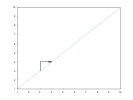](documentation/GALLERY.md#line_1)  [](documentation/GALLERY.md#title_1)  [](documentation/GALLERY.md#title_2)  [](documentation/GALLERY.md#title_3)  [](documentation/GALLERY.md#title_4)  [](documentation/GALLERY.md#title_5)  [](documentation/GALLERY.md#title_6)  [](documentation/GALLERY.md#title_7)  [](documentation/GALLERY.md#title_8)  [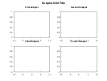](documentation/GALLERY.md#sgtitle_1)  [](documentation/GALLERY.md#sgtitle_2)  [](documentation/GALLERY.md#xlabel_1)  [](documentation/GALLERY.md#xlabel_2)  [](documentation/GALLERY.md#xlabel_3)  [](documentation/GALLERY.md#xlabel_4)  [](documentation/GALLERY.md#xlabel_5)  [](documentation/GALLERY.md#xlabel_6)  [](documentation/GALLERY.md#xlabel_7)  [](documentation/GALLERY.md#xlabel_8)  [](documentation/GALLERY.md#ylabel_1)  [](documentation/GALLERY.md#ylabel_2)  [](documentation/GALLERY.md#ylabel_3)  [](documentation/GALLERY.md#ylabel_4)  [](documentation/GALLERY.md#ylabel_5)  [](documentation/GALLERY.md#ylabel_6)  [](documentation/GALLERY.md#ylabel_7)  [](documentation/GALLERY.md#ylabel_8)  [](documentation/GALLERY.md#zlabel_1)  [](documentation/GALLERY.md#zlabel_2)  [](documentation/GALLERY.md#zlabel_3)  [](documentation/GALLERY.md#legend_1)  [](documentation/GALLERY.md#legend_2)  [](documentation/GALLERY.md#legend_3)  [](documentation/GALLERY.md#legend_4)  [](documentation/GALLERY.md#legend_5)  [](documentation/GALLERY.md#legend_6)  [](documentation/GALLERY.md#legend_7)  [](documentation/GALLERY.md#legend_8)  [](documentation/GALLERY.md#legend_9)  [](documentation/GALLERY.md#xlim_1)  [](documentation/GALLERY.md#xlim_2)  [](documentation/GALLERY.md#xlim_3)  [](documentation/GALLERY.md#xlim_4)  [](documentation/GALLERY.md#xlim_5)  [](documentation/GALLERY.md#xlim_6)  [](documentation/GALLERY.md#ylim_1)  [](documentation/GALLERY.md#ylim_2)  [](documentation/GALLERY.md#ylim_3)  [](documentation/GALLERY.md#ylim_4)  [](documentation/GALLERY.md#ylim_5)  [](documentation/GALLERY.md#ylim_6)  [](documentation/GALLERY.md#zlim_1)  [](documentation/GALLERY.md#zlim_2)  [](documentation/GALLERY.md#zlim_3)  [](documentation/GALLERY.md#zlim_4)  [](documentation/GALLERY.md#zlim_5)  [](documentation/GALLERY.md#zlim_6)  [](documentation/GALLERY.md#axis_1)  [](documentation/GALLERY.md#axis_2)  [](documentation/GALLERY.md#axis_3)  [](documentation/GALLERY.md#axis_4)  [](documentation/GALLERY.md#axis_5)  [](documentation/GALLERY.md#axis_6)  [](documentation/GALLERY.md#axis_7)  [](documentation/GALLERY.md#axis_8)  [](documentation/GALLERY.md#box_1)  [](documentation/GALLERY.md#box_2)  [](documentation/GALLERY.md#box_3)  [](documentation/GALLERY.md#grid_1)  [](documentation/GALLERY.md#grid_2)  [](documentation/GALLERY.md#grid_3)  [](documentation/GALLERY.md#grid_4)  [](documentation/GALLERY.md#xticks_1)  [](documentation/GALLERY.md#xticks_2)  [](documentation/GALLERY.md#xticks_3)  [](documentation/GALLERY.md#xticks_4)  [](documentation/GALLERY.md#xticks_5)  [](documentation/GALLERY.md#xticks_6)  [](documentation/GALLERY.md#xticks_7)  [](documentation/GALLERY.md#xticks_8)  [](documentation/GALLERY.md#yticks_1)  [](documentation/GALLERY.md#yticks_2)  [](documentation/GALLERY.md#yticks_3)  [](documentation/GALLERY.md#yticks_4)  [](documentation/GALLERY.md#yticks_5)  [](documentation/GALLERY.md#yticks_6)  [](documentation/GALLERY.md#yticks_7)  [](documentation/GALLERY.md#yticks_8)  [](documentation/GALLERY.md#zticks_1)  [](documentation/GALLERY.md#zticks_2)  [](documentation/GALLERY.md#zticks_3)  [](documentation/GALLERY.md#zticks_4)  [](documentation/GALLERY.md#zticks_5)  [](documentation/GALLERY.md#zticks_6)  [](documentation/GALLERY.md#xticklabels_1)  [](documentation/GALLERY.md#xticklabels_2)  [](documentation/GALLERY.md#xticklabels_3)  [](documentation/GALLERY.md#xticklabels_4)  [](documentation/GALLERY.md#yticklabels_1)  [](documentation/GALLERY.md#yticklabels_2)  [](documentation/GALLERY.md#yticklabels_3)  [](documentation/GALLERY.md#yticklabels_4)  [](documentation/GALLERY.md#xtickformat_1)  [](documentation/GALLERY.md#xtickformat_2)  [](documentation/GALLERY.md#xtickformat_3)  [](documentation/GALLERY.md#xtickformat_4)  [](documentation/GALLERY.md#xtickformat_5)  [](documentation/GALLERY.md#ytickformat_1)  [](documentation/GALLERY.md#ytickformat_2)  [](documentation/GALLERY.md#ytickformat_3)  [](documentation/GALLERY.md#ytickformat_4)  [](documentation/GALLERY.md#ytickformat_5)  [](documentation/GALLERY.md#ztickformat_1)  [](documentation/GALLERY.md#ztickformat_2)  [](documentation/GALLERY.md#ztickformat_3)  [](documentation/GALLERY.md#ztickformat_4)  [](documentation/GALLERY.md#ztickformat_5)  [](documentation/GALLERY.md#xtickangle_1)  [](documentation/GALLERY.md#xtickangle_2)  [](documentation/GALLERY.md#xtickangle_3)  [](documentation/GALLERY.md#ytickangle_1)  [](documentation/GALLERY.md#ytickangle_2)  [](documentation/GALLERY.md#ytickangle_3)  [](documentation/GALLERY.md#hold_1)  [](documentation/GALLERY.md#hold_2)  [](documentation/GALLERY.md#hold_3)  [](documentation/GALLERY.md#hold_4)  [](documentation/GALLERY.md#yyaxis_1)  [](documentation/GALLERY.md#yyaxis_2)  [](documentation/GALLERY.md#yyaxis_3)  [](documentation/GALLERY.md#yyaxis_4)  [](documentation/GALLERY.md#yyaxis_5)  [](documentation/GALLERY.md#yyaxis_6)  [](documentation/GALLERY.md#yyaxis_7)  [](documentation/GALLERY.md#colororder_1)  [](documentation/GALLERY.md#colororder_2)  [](documentation/GALLERY.md#colororder_3)  [](documentation/GALLERY.md#colororder_4)  [](documentation/GALLERY.md#colororder_5)  [](documentation/GALLERY.md#colororder_6)  [](documentation/GALLERY.md#colororder_7)  [](documentation/GALLERY.md#subplot_1)  [](documentation/GALLERY.md#subplot_2)  [](documentation/GALLERY.md#subplot_3)  [](documentation/GALLERY.md#subplot_4)  [](documentation/GALLERY.md#subplot_5)  [](documentation/GALLERY.md#subplot_6)  [](documentation/GALLERY.md#subplot_7)  [](documentation/GALLERY.md#subplot_8)  [](documentation/GALLERY.md#subplot_9)  [](documentation/GALLERY.md#subplot_10)  [](documentation/GALLERY.md#subplot_11)  [](documentation/GALLERY.md#subplot_12)  [](documentation/GALLERY.md#subplot_13)  [](documentation/GALLERY.md#tiledlayout_1)  [](documentation/GALLERY.md#tiledlayout_2)  [](documentation/GALLERY.md#tiledlayout_3)  [](documentation/GALLERY.md#tiledlayout_4)  [](documentation/GALLERY.md#tiledlayout_5)  [](documentation/GALLERY.md#tiledlayout_6)  [](documentation/GALLERY.md#tiledlayout_7)  [](documentation/GALLERY.md#tiledlayout_8)  [](documentation/GALLERY.md#colormap_1)  [](documentation/GALLERY.md#colormap_2)  [](documentation/GALLERY.md#colormap_3)  [](documentation/GALLERY.md#colormap_4)  [](documentation/GALLERY.md#colormap_5)  [](documentation/GALLERY.md#colormap_6)  [](documentation/GALLERY.md#colormap_7)  [](documentation/GALLERY.md#colormap_8)  [](documentation/GALLERY.md#colormap_9)  [](documentation/GALLERY.md#colorbar_1)  [](documentation/GALLERY.md#colorbar_2)  [](documentation/GALLERY.md#colorbar_3)  [](documentation/GALLERY.md#colorbar_4)  [](documentation/GALLERY.md#colorbar_5)  [](documentation/GALLERY.md#colorbar_6)  [](documentation/GALLERY.md#colorbar_7)  [](documentation/GALLERY.md#rgbplot_1)  [](documentation/GALLERY.md#rgbplot_2)  [](documentation/GALLERY.md#view_1)  [](documentation/GALLERY.md#view_2)  [](documentation/GALLERY.md#view_3)  [](documentation/GALLERY.md#view_4)  [](documentation/GALLERY.md#view_5)  [](documentation/GALLERY.md#view_6)  [](documentation/GALLERY.md#lighting_1)  [](documentation/GALLERY.md#lighting_2)  [](documentation/GALLERY.md#lighting_3)  [](documentation/GALLERY.md#lighting_4)  [](documentation/GALLERY.md#lighting_5)  [](documentation/GALLERY.md#lighting_6)  [](documentation/GALLERY.md#figure_1)  [](documentation/GALLERY.md#figure_2)  [](documentation/GALLERY.md#figure_3)  [](documentation/GALLERY.md#line_spec_1)  [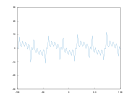](documentation/GALLERY.md#axes_1)  [](documentation/GALLERY.md#axes_2)  [](documentation/GALLERY.md#axes_3)  [](documentation/GALLERY.md#axes_4)  [](documentation/GALLERY.md#cla_1)  [](documentation/GALLERY.md#cla_2)  [](documentation/GALLERY.md#cla_3)  [](documentation/GALLERY.md#save_1)  [](documentation/GALLERY.md#save_2)  [](documentation/GALLERY.md#save_3)  [](documentation/GALLERY.md#save_4)  [](documentation/GALLERY.md#save_5)  [](documentation/GALLERY.md#save_6)  [](documentation/GALLERY.md#save_7)  [](documentation/GALLERY.md#save_8)


## Examples

The examples assume we are in the `matplot` namespace. Use these examples to understand how to quickly use the library for data visualization. If you are interested in understanding how the library works, you can later read the details in the complete [article](documentation/README.md).

### Line Plots

[Line Plot](#line-plot) | [Line Plot 3D](#line-plot-3d) | [Stairs](#stairs) | [Error Bars](#error-bars) | [Area](#area) | [Loglog Plot](#loglog-plot) | [Semilogx Plot](#semilogx-plot) | [Semilogy Plot](#semilogy-plot) | [Function Plot](#function-plot) | [Function Plot 3D](#function-plot-3d) | [Implicit function](#implicit-function)

#### Line Plot

```cpp
plot(x,y);
```

[](examples/line_plot/plot/plot_1.cpp)

Where `x` and `y` are are any value ranges.


More examples

[](examples/line_plot/plot/plot_2.cpp)  [](examples/line_plot/plot/plot_3.cpp)  [](examples/line_plot/plot/plot_4.cpp)  [](examples/line_plot/plot/plot_5.cpp)  [](examples/line_plot/plot/plot_6.cpp)  [](examples/line_plot/plot/plot_7.cpp)  [](examples/line_plot/plot/plot_8.cpp)  [](examples/line_plot/plot/plot_9.cpp)  [](examples/line_plot/plot/plot_10.cpp)  [](examples/line_plot/plot/plot_11.cpp)  [](examples/line_plot/plot/plot_12.cpp)


Setters return a reference to `*this` to allow method chaining:

```cpp
plot(x,y)->line_width(2).color("red");
```

The examples use free-standing functions to create plots. You can also use a object-oriented style for plots. We discuss these coding styles in the Section [*Coding Styles*](#coding-styles).

#### Line Plot 3D

```cpp
plot3(x,y);
```


[](examples/line_plot/plot3/plot3_1.cpp)

More examples:

[](examples/line_plot/plot3/plot3_2.cpp)  [](examples/line_plot/plot3/plot3_3.cpp)  [](examples/line_plot/plot3/plot3_4.cpp)  [](examples/line_plot/plot3/plot3_5.cpp)  [](examples/line_plot/plot3/plot3_7.cpp)  [](examples/line_plot/plot3/plot3_8.cpp)  [](examples/line_plot/plot3/plot3_9.cpp)  [](examples/line_plot/plot3/plot3_10.cpp)


With method chaining:

```cpp
plot3(x,y)->line_width(2).color("red");
```

#### Stairs

```cpp
stairs(x,y);
```


[](examples/line_plot/stairs/stairs_1.cpp)

More examples:

[](examples/line_plot/stairs/stairs_2.cpp)  [](examples/line_plot/stairs/stairs_3.cpp)  [](examples/line_plot/stairs/stairs_4.cpp)  [](examples/line_plot/stairs/stairs_5.cpp)  [](examples/line_plot/stairs/stairs_6.cpp)  [](examples/line_plot/stairs/stairs_7.cpp)  [](examples/line_plot/stairs/stairs_8.cpp)  [](examples/line_plot/stairs/stairs_9.cpp)  [](examples/line_plot/stairs/stairs_10.cpp)


The `stair` object renders the line with stairs between data points to denote discrete data.

#### Error Bars

```cpp
errorbar(x,y,err);
```


[](examples/line_plot/errorbar/errorbar_1.cpp)

More examples:

[](examples/line_plot/errorbar/errorbar_2.cpp)  [](examples/line_plot/errorbar/errorbar_3.cpp)  [](examples/line_plot/errorbar/errorbar_4.cpp)  [](examples/line_plot/errorbar/errorbar_5.cpp)  [](examples/line_plot/errorbar/errorbar_6.cpp)  [](examples/line_plot/errorbar/errorbar_7.cpp)  [](examples/line_plot/errorbar/errorbar_8.cpp)  [](examples/line_plot/errorbar/errorbar_9.cpp)  [](examples/line_plot/errorbar/errorbar_10.cpp)


The `error bar` object includes extra lines to represent error around data points. Log plots are utility functions that adjust the x or y axes to a logarithmic scale.

#### Area

```cpp
area(Y);
```


[](examples/line_plot/area/area_1.cpp)

More examples:

[](examples/line_plot/area/area_2.cpp)  [](examples/line_plot/area/area_3.cpp)  [](examples/line_plot/area/area_4.cpp)


#### Loglog Plot

```cpp
loglog(x,y);
```


[](examples/line_plot/loglog/loglog_1.cpp)

More examples:

[](examples/line_plot/loglog/loglog_2.cpp)  [](examples/line_plot/loglog/loglog_3.cpp)  [](examples/line_plot/loglog/loglog_4.cpp)  [](examples/line_plot/loglog/loglog_5.cpp)  [](examples/line_plot/loglog/loglog_6.cpp)  [](examples/line_plot/loglog/loglog_7.cpp)  [](examples/line_plot/loglog/loglog_8.cpp)  [](examples/line_plot/loglog/loglog_9.cpp)


#### Semilogx Plot

```cpp
semilogx(x,y);
```


[](examples/line_plot/semilogx/semilogx_1.cpp)


#### Semilogy Plot

```cpp
semilogy(x,y);
```


[](examples/line_plot/semilogy/semilogy_1.cpp)


#### Function Plot

```cpp
fplot(fx);
```


[](examples/line_plot/fplot/fplot_1.cpp)

More examples:

[](examples/line_plot/fplot/fplot_2.cpp)  [](examples/line_plot/fplot/fplot_3.cpp)  [](examples/line_plot/fplot/fplot_4.cpp)  [](examples/line_plot/fplot/fplot_5.cpp)  [](examples/line_plot/fplot/fplot_6.cpp)


Instead of storing data points, the objects `function line` and `string function` store a function as a lambda function or as a string with an expression. These objects use lazy evaluation to generate absolute data points. The data is generated only when the `draw` function is called.

#### Function Plot 3D

```cpp
fplot(fxy);
```


[](examples/line_plot/fplot3/fplot3_1.cpp)

More examples:

[](examples/line_plot/fplot3/fplot3_2.cpp)  [](examples/line_plot/fplot3/fplot3_3.cpp)  [](examples/line_plot/fplot3/fplot3_4.cpp)  [](examples/line_plot/fplot3/fplot3_5.cpp)


#### Implicit function

```cpp
fplot(fxy);
```


[](examples/line_plot/fimplicit/fimplicit_1.cpp)

More examples:

[](examples/line_plot/fimplicit/fimplicit_2.cpp)  [](examples/line_plot/fimplicit/fimplicit_3.cpp)  [](examples/line_plot/fimplicit/fimplicit_4.cpp)


### Data Distribution

[Histogram](#histogram) | [Boxplot](#boxplot) | [Scatter Plot](#scatter-plot) | [Scatter Plot 3D](#scatter-plot-3d) | [Binscatter](#binscatter) | [Plot Matrix](#plot-matrix) | [Parallel Coordinates](#parallel-coordinates) | [Pie Chart](#pie-chart) | [Heatmap](#heatmap) | [Word Cloud](#word-cloud)

#### Histogram

```cpp
hist(data);
```


[](examples/data_distribution/histogram/histogram_1.cpp)

More examples:

[](examples/data_distribution/histogram/histogram_2.cpp)  [](examples/data_distribution/histogram/histogram_3.cpp)  [](examples/data_distribution/histogram/histogram_4.cpp)  [](examples/data_distribution/histogram/histogram_5.cpp)  [](examples/data_distribution/histogram/histogram_6.cpp)  [](examples/data_distribution/histogram/histogram_7.cpp)  [](examples/data_distribution/histogram/histogram_8.cpp)  [](examples/data_distribution/histogram/histogram_9.cpp)  [](examples/data_distribution/histogram/histogram_10.cpp)  [](examples/data_distribution/histogram/histogram_11.cpp)  [](examples/data_distribution/histogram/histogram_12.cpp)  [](examples/data_distribution/histogram/histogram_14.cpp)


The `histogram` object creates the histogram edges and bins when the `draw` function is called for the first time with lazy evaluation. Lazy evaluation avoids calculating edges unnecessarily in case the user changes the object parameters before calling `draw`. This object includes several algorithms for automatically delimiting the edges and bins for the histograms.

#### Boxplot

```cpp
boxplot(data);
```


[](examples/data_distribution/boxplot/boxplot_1.cpp)

More examples:

[](examples/data_distribution/boxplot/boxplot_2.cpp)  [](examples/data_distribution/boxplot/boxplot_3.cpp)


#### Scatter Plot

```cpp
scatter(x,y);
```


[](examples/data_distribution/scatter/scatter_1.cpp)

More examples:

[](examples/data_distribution/scatter/scatter_2.cpp)  [](examples/data_distribution/scatter/scatter_3.cpp)  [](examples/data_distribution/scatter/scatter_4.cpp)  [](examples/data_distribution/scatter/scatter_5.cpp)  [](examples/data_distribution/scatter/scatter_6.cpp)  [](examples/data_distribution/scatter/scatter_7.cpp)  [](examples/data_distribution/scatter/scatter_8.cpp)


Scatter plots also depend on the `line` object. As the line object can represent lines with markers, the `scatter` function simply creates markers without the lines.

#### Scatter Plot 3D

```cpp
scatter(x,y,z);
```


[](examples/data_distribution/scatter3/scatter3_1.cpp)

More examples:

[](examples/data_distribution/scatter3/scatter3_2.cpp)  [](examples/data_distribution/scatter3/scatter3_3.cpp)  [](examples/data_distribution/scatter3/scatter3_4.cpp)  [](examples/data_distribution/scatter3/scatter3_5.cpp)  [](examples/data_distribution/scatter3/scatter3_6.cpp)


#### Binned Scatter Plots

```cpp
binscatter(x,y);
```


[](examples/data_distribution/binscatter/binscatter_1.cpp)

More examples:

[](examples/data_distribution/binscatter/binscatter_2.cpp)  [](examples/data_distribution/binscatter/binscatter_3.cpp)  [](examples/data_distribution/binscatter/binscatter_4.cpp)  [](examples/data_distribution/binscatter/binscatter_5.cpp)  [](examples/data_distribution/binscatter/binscatter_6.cpp)  [](examples/data_distribution/binscatter/binscatter_7.cpp)


Binned scatter plots use variations of the histogram algorithms of the previous section as an extra step to place all the data into two-dimensional bins that can be represented with varying colors or sizes. This is useful when there are so many data points that a scatter plot would be impractical for visualizing the data.

#### Plot Matrix

```cpp
plotmatrix(X);
```


[](examples/data_distribution/plotmatrix/plotmatrix_1.cpp)

More examples:

[](examples/data_distribution/plotmatrix/plotmatrix_2.cpp)  [](examples/data_distribution/plotmatrix/plotmatrix_3.cpp)  [](examples/data_distribution/plotmatrix/plotmatrix_4.cpp)


The Plot Matrix subcategory is a combination of histograms and scatter plots. It creates a matrix of `axes` objects on the `figure` and creates a scatter plot for each pair of data sets.

#### Parallel Coordinates

```cpp
parallelplot(X);
```


[](examples/data_distribution/parallelplot/parallelplot_1.cpp)

More examples:

[](examples/data_distribution/parallelplot/parallelplot_2.cpp)  [](examples/data_distribution/parallelplot/parallelplot_3.cpp)


The function `parallelplot` creates a plot with Parallel Coordinates. In this type of plot, a `parallel lines` object stores an arbitrary set of `axis` objects to represent multi-dimensional data.

#### Pie Chart

```cpp
pie(x);
```


[](examples/data_distribution/pie/pie_1.cpp)

More examples:

[](examples/data_distribution/pie/pie_2.cpp)  [](examples/data_distribution/pie/pie_3.cpp)  [](examples/data_distribution/pie/pie_4.cpp)  [](examples/data_distribution/pie/pie_5.cpp)  [](examples/data_distribution/pie/pie_6.cpp)


#### Heatmap

```cpp
heatmap(data);
```


[](examples/data_distribution/heatmap/heatmap_1.cpp)

More examples:

[](examples/data_distribution/heatmap/heatmap_2.cpp)  [](examples/data_distribution/heatmap/heatmap_3.cpp)  [](examples/data_distribution/heatmap/heatmap_4.cpp)  [](examples/data_distribution/heatmap/heatmap_5.cpp)  [](examples/data_distribution/heatmap/heatmap_6.cpp)  [](examples/data_distribution/heatmap/heatmap_7.cpp)


#### Word Cloud

```cpp
wordcloud(text, black_list);
```


[](examples/data_distribution/wordcloud/wordcloud_1.cpp)

More examples:

[](examples/data_distribution/wordcloud/wordcloud_3.cpp)  [](examples/data_distribution/wordcloud/wordcloud_4.cpp)  [](examples/data_distribution/wordcloud/wordcloud_4.cpp)


Word clouds are generated from text or pairs of words and their frequency. After attributing a size proportional to each word frequency, the algorithm to position the labels iterates words from the largest to the smallest. For each word, it spins the word in polar coordinates converted to Cartesian coordinates until it does not overlap with any other word.

By default, the colors and the sizes depend on the word frequencies. We can customize the colors by passing a third parameter to the `wordcloud` function.

### Discrete Data

[Bar Plot](#bar-plot) | [Pareto Chart](#pareto-chart) | [Stem Plot](#stem-plot) | [Stem Plot 3D](#stem-plot-3d)

#### Bar Plot

```cpp
bar(y);
```


[](examples/discrete_data/bar/bar_1.cpp)

More examples:

[](examples/discrete_data/bar/bar_2.cpp)  [](examples/discrete_data/bar/bar_3.cpp)  [](examples/discrete_data/bar/bar_4.cpp)  [](examples/discrete_data/bar/bar_5.cpp)  [](examples/discrete_data/bar/bar_6.cpp)  [](examples/discrete_data/bar/bar_7.cpp)  [](examples/discrete_data/bar/bar_8.cpp)  [](examples/discrete_data/bar/bar_9.cpp)  [](examples/discrete_data/bar/bar_10.cpp)  [](examples/discrete_data/bar/bar_11.cpp)  [](examples/discrete_data/bar/bar_12.cpp)  [](examples/discrete_data/bar/bar_13.cpp)


#### Pareto Chart

```cpp
pareto(y);
```


[](examples/discrete_data/pareto/pareto_1.cpp)

More examples:

[](examples/discrete_data/pareto/pareto_2.cpp)  [](examples/discrete_data/pareto/pareto_3.cpp) [](examples/discrete_data/pareto/pareto_4.cpp)


Pareto Charts are a type of chart that uses both $y$ axes. The $y_1$ axis is used to represent bars with the data values in descending order. The $y_2$ axis is used to represent the cumulative distribution function of the data in the $y_1$ axis. By default, a Pareto Chart includes up to 10 items or as many items as needed to represent 95% of the cumulative distribution.

If you need Pareto *fronts* rather than Pareto *charts*, we refer to [Scatter Plots](#scatter-plot) for two-dimensional fronts, [Plot matrices](#plot-matrix) for three-dimensional fronts, or [Parallel Coordinate Plots](#parallel-coordinates) for many-objective fronts. These plot subcategories are described in Section [Data Distribution](#data-distribution). If you also need a tool to calculate these fronts efficiently, we refer to the [Pareto Front Library](https://github.com/alandefreitas/pareto-front).

#### Stem Plot

```cpp
stem(Y);
```


[](examples/discrete_data/stem/stem_1.cpp)

More examples:

[](examples/discrete_data/stem/stem_2.cpp)  [](examples/discrete_data/stem/stem_3.cpp)  [](examples/discrete_data/stem/stem_4.cpp)  [](examples/discrete_data/stem/stem_5.cpp)  [](examples/discrete_data/stem/stem_6.cpp)  [](examples/discrete_data/stem/stem_7.cpp)  [](examples/discrete_data/stem/stem_8.cpp)  [](examples/discrete_data/stem/stem_9.cpp)


#### Stem Plot 3D

```cpp
stem3(z);
```


[](examples/discrete_data/stem3/stem3_1.cpp)

More examples:

[](examples/discrete_data/stem3/stem3_2.cpp)  [](examples/discrete_data/stem3/stem3_3.cpp)  [](examples/discrete_data/stem3/stem3_4.cpp)  [](examples/discrete_data/stem3/stem3_5.cpp)  [](examples/discrete_data/stem3/stem3_6.cpp)  [](examples/discrete_data/stem3/stem3_7.cpp)  [](examples/discrete_data/stem3/stem3_8.cpp)  [](examples/discrete_data/stem3/stem3_9.cpp)  [](examples/discrete_data/stem3/stem3_10.cpp)  [](examples/discrete_data/stem3/stem3_11.cpp)


### Geography

[Geoplot](#geoplot) | [Geoscatter Plot](#geoscatter-plot) | [Geobubble](#geobubble) | [Geodensity Plot](#geodensity-plot)

#### Geoplot

```cpp
geoplot(lat,lon);
```


[](examples/geography/geoplot/geoplot_1.cpp)

More examples:

[](examples/geography/geoplot/geoplot_2.cpp)  [](examples/geography/geoplot/geoplot_3.cpp)  [](examples/geography/geoplot/geoplot_4.cpp)  [](examples/geography/geoplot/geoplot_5.cpp)  [](examples/geography/geoplot/geoplot_6.cpp)  [](examples/geography/geoplot/geoplot_7.cpp)


For the first geography plot, **Matplot++** calls `geoplot()`, which creates a filled polygon with the world map. This first plot receives the tag `"map"` so that subsequent geography plots recognize there is no need to recreate this world map.

The data for the world map comes from Natural Earth. They provide data at 1:10m, 1:50m, and 1:110m scales. The `geoplot` function will initially use the data at the 1:110m scales. The `geolimits` function can be used to update the axis limits for geography plots. The difference between the usual functions for adjusting axis limits (`xlim` and `ylim`) and `geolimits` is that the latter will also update the map resolution according to the new limits for the $x$ and $y$ axis.

The `geolimits` function will query the `figure` size and, depending on the new limits for the axes, update the map to the 1:10m, or 1:50m scales if needed. Because it would be very inefficient to render the whole world map at a 1:10m or 1:50m scale only to display a region of this map, the `geolimits` function also crops the data pertinent to the new region being displayed.

Note that this does not only involve removing data points outside the new limits but it also needs to create new data points on the correct borders to create new polygons coherent with the map entry points in the region. For this reason, the algorithm needs to track all submaps represented as closed polygons in the original world map. If submaps are completely inside or outside the new ranges, we can respectively include or dismiss the data points. However, if the submap is only partially inside the new limits, to generate the correct borders for the polygons, we need to track all points outside the limits to classify the directions of these points outside the limits. We do that by only including points that change quadrants around the new limits so that the map entry points create polygons that look like they would if the complete world map were still being rendered outside these new limits.

If the you are not interested in geographic plots, the build script includes an option to remove the high-resolution maps at 1:10m and 1:50m scales from the library. In this case, the library will always use the map at a 1:110m scale no matter the axis limits.

The function `world_cities` returns a list of major world cities. Its parameters define the minimum distances between cities in the $x$ and $y$ axes. The `greedy_tsp` function is a naive greedy algorithm to find a route between these cities as a Traveling Salesman Problem (TSP). We use the `geoplot` function to draw this route. Note that we use method chaining to define some further plot properties. Finally, the `text` function includes the city names in the map.

#### Geoscatter Plot

```cpp
geoscatter(lat,lon);
```


[](examples/geography/geoscatter/geoscatter_1.cpp)

More examples:

[](examples/geography/geoscatter/geoscatter_2.cpp)


#### Geobubble

```cpp
geobubble(lat,lon,sizes);
```


[](examples/geography/geobubble/geobubble_1.cpp)

More examples:

[](examples/geography/geobubble/geobubble_2.cpp)


#### Geodensity Plot

```cpp
geodensityplot(lat, lon);
```


[](examples/geography/geodensityplot/geodensityplot_1.cpp)


### Polar Plots

[Polar Line Plot](#polar-line-plot) | [Polar Scatter Plot](#polar-scatter-plot) | [Polar Histogram](#polar-histogram) | [Compass](#compass) | [Polar Function](#polar-function)

#### Polar Line Plot

```cpp
polarplot(theta, rho);
```


[](examples/polar_plots/polarplot/polarplot_1.cpp)

More examples:

[](examples/polar_plots/polarplot/polarplot_2.cpp)  [](examples/polar_plots/polarplot/polarplot_3.cpp)  [](examples/polar_plots/polarplot/polarplot_4.cpp)  [](examples/polar_plots/polarplot/polarplot_5.cpp)  [](examples/polar_plots/polarplot/polarplot_6.cpp)  [](examples/polar_plots/polarplot/polarplot_7.cpp)  [](examples/polar_plots/polarplot/polarplot_8.cpp)


By emplacing a polar plot in the `axes`, the `axes` move to a polar mode, where we use the $r$ and $t$ axis instead of the $x$ and $y$ axis.

From the backend point of view, these axes are an abstraction to the user. The data points in the $r$ and $t$ axis are drawn by converting the positions from the polar coordinates $r$ and $t$ to the Cartesian coordinates $x$ and $y$ with the relationships $x=r \cos{t}$ and $y=r \sin{t}$.

Aside from this conversion, these plot subcategories are analogous to line plots, scatter plots, histograms, quiver plots, and line functions.

#### Polar Scatter Plot

```cpp
polarscatter(theta, rho);
```


[](examples/polar_plots/polarscatter/polarscatter_1.cpp)

More examples:

[](examples/polar_plots/polarscatter/polarscatter_2.cpp)  [](examples/polar_plots/polarscatter/polarscatter_3.cpp)  [](examples/polar_plots/polarscatter/polarscatter_4.cpp)  [](examples/polar_plots/polarscatter/polarscatter_5.cpp)  [](examples/polar_plots/polarscatter/polarscatter_6.cpp)


#### Polar Histogram

```cpp
polarhistogram(theta, 6);
```


[](examples/polar_plots/polarhistogram/polarhistogram_1.cpp)

More examples:

[](examples/polar_plots/polarhistogram/polarhistogram_2.cpp)  [](examples/polar_plots/polarhistogram/polarhistogram_3.cpp)  [](examples/polar_plots/polarhistogram/polarhistogram_4.cpp)  [](examples/polar_plots/polarhistogram/polarhistogram_5.cpp)


The function `polarhistogram` distributes the data into the number of bins provided as its second parameter.

#### Compass

```cpp
compass(u, v);
```


[](examples/polar_plots/compass/compass_1.cpp)

More examples:

[](examples/polar_plots/compass/compass_2.cpp)


#### Polar Function

```cpp
ezpolar(fn);
```


[](examples/polar_plots/ezpolar/ezpolar_1.cpp)

More examples:

[](examples/polar_plots/ezpolar/ezpolar_2.cpp)


### Contour Plots

[Contour](#contour) | [Filled Contour](#filled-contour) | [Function Contour](#function-contour)

#### Contour

```cpp
contour(X, Y, Z);
```


[](examples/contour_plots/contour/contour_1.cpp)

More examples:

[](examples/contour_plots/contour/contour_2.cpp)  [](examples/contour_plots/contour/contour_3.cpp)  [](examples/contour_plots/contour/contour_4.cpp)  [](examples/contour_plots/contour/contour_5.cpp)  [](examples/contour_plots/contour/contour_6.cpp)  [](examples/contour_plots/contour/contour_7.cpp)  [](examples/contour_plots/contour/contour_8.cpp)


All these subcategories depend on the `contours` type. They also depend on lazy evaluation for generating the contour lines. When the function `draw` is called in the `contours` class, it preprocesses all contour lines for a three-dimensional function.

Although it is relatively simple to show a heatmap with the values for the $z$-axis, calculating contour lines relative to the $z$-axis is more complex than it might seem at first. We provide the function `contourc` for calculating contour lines. This function uses an adaptation of the algorithm adopted by Matplotlib.

The algorithm creates a quad grid defined by the $x$ and $y$ values. It uses this grid to infer a contour line passing through positions with the same $z$ value. The algorithm sweeps through the grid twice to generate these lines. The first sweep looks for lines that start on the boundaries. The second sweep looks for interior closed loops.

Filled contours are closed polygons for pairs of contour levels. Some polygons for filled contours might be holes inside other polygons. The algorithm needs to keep track of these relationships so that we can render the polygons in their accurate order. To avoid an extra step that identifies this relationship between the polygons, the sweeping algorithm already identifies which polygons are holes for each level.

Once we find the quads with the contour line, the line is generated by interpolating the $z$ values around that quad.

#### Filled Contour

```cpp
contourf(X, Y, Z);
```


[](examples/contour_plots/contourf/contourf_1.cpp)

More examples:

[](examples/contour_plots/contourf/contourf_2.cpp)  [](examples/contour_plots/contourf/contourf_3.cpp)  [](examples/contour_plots/contourf/contourf_4.cpp)  [](examples/contour_plots/contourf/contourf_5.cpp)  [](examples/contour_plots/contourf/contourf_6.cpp)


#### Function Contour

```cpp
fcontour(f);
```


[](examples/contour_plots/fcontour/fcontour_1.cpp)

More examples:

[](examples/contour_plots/fcontour/fcontour_2.cpp)  [](examples/contour_plots/fcontour/fcontour_3.cpp)  [](examples/contour_plots/fcontour/fcontour_4.cpp)  [](examples/contour_plots/fcontour/fcontour_5.cpp)  [](examples/contour_plots/fcontour/fcontour_6.cpp)  [](examples/contour_plots/fcontour/fcontour_7.cpp)  [](examples/contour_plots/fcontour/fcontour_8.cpp)  [](examples/contour_plots/fcontour/fcontour_9.cpp)  [](examples/contour_plots/fcontour/fcontour_10.cpp)  [](examples/contour_plots/fcontour/fcontour_11.cpp)


By default, the function `fcontour` will generate 9 contour lines from a lambda function. The functions `contour` and `contourf`, on the other hand, plot contour lines and filled contour lines from a grid of data points for $x$, $y$, and $z$.

### Vector Fields

[Feather](#feather) | [Quiver](#quiver) | [Quiver 3D](#quiver-3d)

#### Quiver

```cpp
quiver(x, y, u, v);
```


[](examples/vector_fields/quiver/quiver_1.cpp)

More examples:

[](examples/vector_fields/quiver/quiver_2.cpp)  [](examples/vector_fields/quiver/quiver_3.cpp)  [](examples/vector_fields/quiver/quiver_4.cpp)


All these subcategories depend on the `vectors` object type. In a two-dimensional plot, for each value of $x$ and $y$ with the position of a vector, it also requires the value of $u$ and $v$ indicating its direction and magnitude. In a three-dimensional plot, the direction and magnitude are defined by $u$, $v$, and $w$.


A quiver plot (or velocity plot) shows a grid of vectors whose direction and magnitude are scaled to prevent the overlap between vectors in subsequent quads.

#### Quiver 3D

```cpp
quiver3(Z, U, V, W);
```


[](examples/vector_fields/quiver3/quiver3_1.cpp)


#### Feather

```cpp
feather(u, v);
```


[](examples/vector_fields/feather/feather_1.cpp)


### Surfaces

[Surface](#surface) | [Surface with Contour](#surface-with-contour) | [Mesh](#mesh) | [Mesh with Contour](#mesh-with-contour) | [Mesh with Curtain](#mesh-with-curtain) | [Function Surface](#function-surface) | [Function Mesh](#function-mesh) | [Waterfall](#waterfall) | [Fence](#fence) | [Ribbon](#ribbon)

#### Surface

```cpp
surf(X, Y, Z);
```


[](examples/surfaces/surf/surf_1.cpp)

More examples:

[](examples/surfaces/surf/surf_2.cpp)  [](examples/surfaces/surf/surf_3.cpp)  [](examples/surfaces/surf/surf_4.cpp)  [](examples/surfaces/surf/surf_5.cpp)  [](examples/surfaces/surf/surf_6.cpp)


#### Surface with Contour

```cpp
surfc(X, Y, Z);
```


[](examples/surfaces/surfc/surfc_1.cpp)

More examples:

[](examples/surfaces/surfc/surfc_2.cpp)  [](examples/surfaces/surfc/surfc_3.cpp)  [](examples/surfaces/surfc/surfc_4.cpp)


#### Mesh

```cpp
mesh(X, Y, Z);
```


[](examples/surfaces/mesh/mesh_1.cpp)

More examples:

[](examples/surfaces/mesh/mesh_2.cpp)  [](examples/surfaces/mesh/mesh_3.cpp)  [](examples/surfaces/mesh/mesh_4.cpp)


#### Mesh with Contour

```cpp
meshc(X, Y, Z);
```


[](examples/surfaces/meshc/meshc_1.cpp)

More examples:

[](examples/surfaces/meshc/meshc_2.cpp)  [](examples/surfaces/meshc/meshc_3.cpp)


#### Mesh with Curtain

```cpp
meshz(X, Y, Z);
```


[](examples/surfaces/meshz/meshz_1.cpp)

More examples:

[](examples/surfaces/meshz/meshz_2.cpp)  [](examples/surfaces/meshz/meshz_3.cpp)


#### Function Surface

```cpp
fsurf(fn);
```


[](examples/surfaces/fsurf/fsurf_1.cpp)

More examples:

[](examples/surfaces/fsurf/fsurf_2.cpp)  [](examples/surfaces/fsurf/fsurf_3.cpp)  [](examples/surfaces/fsurf/fsurf_4.cpp)  [](examples/surfaces/fsurf/fsurf_5.cpp)  [](examples/surfaces/fsurf/fsurf_6.cpp)  [](examples/surfaces/fsurf/fsurf_7.cpp)  [](examples/surfaces/fsurf/fsurf_8.cpp)


#### Function Mesh

```cpp
fmesh(fn);
```


[](examples/surfaces/fmesh/fmesh_1.cpp)

More examples:

[](examples/surfaces/fmesh/fmesh_2.cpp)  [](examples/surfaces/fmesh/fmesh_3.cpp)  [](examples/surfaces/fmesh/fmesh_4.cpp)


#### Waterfall

```cpp
waterfall(X, Y, Z);
```


[](examples/surfaces/waterfall/waterfall_1.cpp)

More examples:

[](examples/surfaces/waterfall/waterfall_2.cpp)  [](examples/surfaces/waterfall/waterfall_3.cpp)


#### Fence

```cpp
fence(X, Y, Z);
```


[](examples/surfaces/fence/fence_1.cpp)

More examples:

[](examples/surfaces/fence/fence_2.cpp)  [](examples/surfaces/fence/fence_3.cpp)


#### Ribbon

```cpp
ribbon(X, Y, Z);
```


[](examples/surfaces/ribbon/ribbon_1.cpp)

More examples:

[](examples/surfaces/ribbon/ribbon_2.cpp)  [](examples/surfaces/ribbon/ribbon_3.cpp)  [](examples/surfaces/ribbon/ribbon_4.cpp)


### Graphs

[Undirected Graph](#undirected-graph) | [Directed Graph](#directed-graph)

#### Undirected Graph

```cpp
graph(edges);
```


[](examples/graphs/graph/graph_1.cpp)

More examples:

[](examples/graphs/graph/graph_2.cpp)  [](examples/graphs/graph/graph_3.cpp)  [](examples/graphs/graph/graph_4.cpp)  [](examples/graphs/graph/graph_5.cpp)


All these subcategories depend on the `network` class. Graphs are abstract structures that represent objects and relationships between these objects. The objects are represented as vertices and the relationships are depicted as edges.

In an abstract graph, the vertices have no specific position in space. Mathematically, a graph does not depend on its layout. However, the graph layout has a large impact on its understandability. The `network` class can calculate appropriate positions for graph vertices with several algorithms: Kamada Kawai algorithm, Fruchterman-Reingold algorithm, circle layout, random layout, and automatic layout.

The implementation of the Kamada Kawai and Fruchterman-Reingold algorithms depend on the NodeSoup library. The automatic layout uses the Kamada Kawai algorithm for small graphs and the Fruchterman-Reingold algorithm for larger graphs.

#### Directed Graph

```cpp
digraph(edges);
```


[](examples/graphs/digraph/digraph_1.cpp)

More examples:

[](examples/graphs/digraph/digraph_2.cpp)  [](examples/graphs/digraph/digraph_3.cpp)


### Images

[Image Show](#image-show) | [Image Matrix](#image-matrix) | [Scaled Image](#scaled-image)

#### Image Show

```cpp
imshow(image);
```


[](examples/images/imshow/imshow_1.cpp)

More examples:

[](examples/images/imshow/imshow_2.cpp)  [](examples/images/imshow/imshow_3.cpp)  [](examples/images/imshow/imshow_4.cpp)  [](examples/images/imshow/imshow_5.cpp)  [](examples/images/imshow/imshow_6.cpp)  [](examples/images/imshow/imshow_7.cpp)  [](examples/images/imshow/imshow_8.cpp)  [](examples/images/imshow/imshow_9.cpp)  [](examples/images/imshow/imshow_10.cpp)  [](examples/images/imshow/imshow_11.cpp)


These subcategories depend on the `matrix` class. The `matrix` class can have up to four matrices. If it has only one matrix, it is represented with a colormap. If it has three matrices, they represent the red, green, and blue channels. If it has four matrices, the fourth matrix represents an alpha channel to control the transparency of each pixel.

We use the CImg library to load and save images. CImg can handle many common image formats as long as it has access to the appropriate libraries. The **Matplot++** build script will look at compile-time for the following optional libraries: JPEG, TIFF, ZLIB, PNG, LAPACK, BLAS, OpenCV, X11, fftw3, OpenEXR, and Magick++. The build script will attempt to link all libraries from this list to **Matplot++**.

**Matplot++** includes a few convenience functions to manipulate matrices with images: `imread`, `rgb2gray`, `gray2rgb`, `imresize`, and `imwrite`. All these functions work with lists of matrices.

#### Image Matrix

```cpp
image(C);
```


[](examples/images/image/image_1.cpp)

More examples:

[](examples/images/image/image_2.cpp)  [](examples/images/image/image_3.cpp)  [](examples/images/image/image_4.cpp)  [](examples/images/image/image_5.cpp)


#### Scaled Image

```cpp
imagesc(C);
```


[](examples/images/imagesc/imagesc_1.cpp)

More examples:

[](examples/images/imagesc/imagesc_2.cpp)  [](examples/images/imagesc/imagesc_3.cpp)  [](examples/images/imagesc/imagesc_4.cpp)


### Annotations

[Text](#text) | [Text with Arrow](#text-with-arrow) | [Rectangle](#rectangle) | [Filled Polygon](#filled-polygon) | [Ellipse](#ellipse) | [Textbox](#textbox) | [Arrow](#arrow) | [Line](#line)

The annotations category is meant to create individual objects on the plot rather than representations of data sets. An important difference between the annotations category and other categories is that, by default, the annotations do not replace the plot that already exists in the `axes` object, even if the user does not call the `hold` function.

#### Text

```cpp
text(x0, y0, str);
```


[](examples/annotations/text/text_1.cpp)

More examples:

[](examples/annotations/text/text_2.cpp)  [](examples/annotations/text/text_3.cpp)  [](examples/annotations/text/text_4.cpp)  [](examples/annotations/text/text_5.cpp)  [](examples/annotations/text/text_6.cpp)  [](examples/annotations/text/text_7.cpp)  [](examples/annotations/text/text_8.cpp)


#### Text with Arrow

```cpp
textarrow(x1, y1, x2, y2, str);
```


[](examples/annotations/textarrow/textarrow_1.cpp)

More examples:

[](examples/annotations/textarrow/textarrow_2.cpp)


#### Rectangle

```cpp
rectangle(x, y, w, h);
```


[](examples/annotations/rectangle/rectangle_1.cpp)

More examples:

[](examples/annotations/rectangle/rectangle_2.cpp)  [](examples/annotations/rectangle/rectangle_3.cpp)  [](examples/annotations/rectangle/rectangle_4.cpp)  [](examples/annotations/rectangle/rectangle_5.cpp)


The rectangle object can have a border curvature from $0$ to $1$. We can also annotate with text, arrows, polygons, and lines.

#### Filled Polygon

```cpp
polygon(x0, y0, color);
```


[](examples/annotations/fill/fill_1.cpp)


#### Ellipse

```cpp
ellipse(x, y, w, h);
```


[](examples/annotations/ellipse/ellipse_1.cpp)


#### Textbox

```cpp
textbox(x, y, w, h, str);
```


[](examples/annotations/textbox/textbox_1.cpp)


#### Arrow

```cpp
arrow(x1, y1, x2, y2);
```


[](examples/annotations/arrow/arrow_1.cpp)

More examples:

[](examples/annotations/arrow/arrow_2.cpp)


#### Line

```cpp
line(x1, y1, x2, y2);
```


[](examples/annotations/line/line_1.cpp)


### Appearance

* [Labels](#labels): [Title](#title) | [Subplot Title](#subplot-title) | [X Label](#x-label) | [Y Label](#y-label) | [Z Label](#z-label) | [Legend](#legend)
* [Axis](#axis): [X Limits](#x-limits) | [Y Limits](#y-limits) | [Z Limits](#z-limits) | [Adjust Axis](#adjust-axis) | [Box](#box)
* [Grid](#grid): [Grid](#grid-1) | [X Ticks](#x-ticks) | [Y Ticks](#y-ticks) | [Z Ticks](#z-ticks) | [X Tick Labels](#x-tick-labels) | [Y Tick Labels](#y-tick-labels) | [X Tick Format](#x-tick-format) | [Y Tick Format](#y-tick-format) | [Z Tick Format](#z-tick-format) | [X Tick Angle](#x-tick-angle) | [Y Tick Angle](#y-tick-angle)
* [Multiplot](#multiplot): [Hold](#hold) | [YY-axis](#yy-axis) | [Color Order](#color-order) | [Subplots](#subplots) | [Tiled Layout](#tiled-layout)
* [Colormaps](#colormaps): [Colormap](#colormap) | [Color Bar](#color-bar) | [RGB Plot](#rgb-plot)
* [Camera](#camera): [View](#view) | [Lighting](#lighting)
* [Figure Object](#figure-object)
* [Line Specs](#line-specs)
* [Axes Object](#axes-object)
* [Clear Axes](#clear-axes)

As a convenience, the `colors.h` header contains many functions to generate colors from strings and vice-versa.

#### Labels

##### Title

```cpp
title(str);
```


[](examples/appearance/labels/title/title_1.cpp)

More examples:

[](examples/appearance/labels/title/title_2.cpp)  [](examples/appearance/labels/title/title_3.cpp)  [](examples/appearance/labels/title/title_4.cpp)  [](examples/appearance/labels/title/title_5.cpp)  [](examples/appearance/labels/title/title_6.cpp)  [](examples/appearance/labels/title/title_7.cpp)  [](examples/appearance/labels/title/title_8.cpp)


##### Subplot Title

```cpp
sgtitle(str);
```


[](examples/appearance/labels/sgtitle/sgtitle_1.cpp)

More examples:

[](examples/appearance/labels/sgtitle/sgtitle_2.cpp)


##### X Label

```cpp
xlabel(str);
```


[](examples/appearance/labels/xlabel/xlabel_1.cpp)

More examples:

[](examples/appearance/labels/xlabel/xlabel_2.cpp)  [](examples/appearance/labels/xlabel/xlabel_3.cpp)  [](examples/appearance/labels/xlabel/xlabel_4.cpp)  [](examples/appearance/labels/xlabel/xlabel_5.cpp)  [](examples/appearance/labels/xlabel/xlabel_6.cpp)  [](examples/appearance/labels/xlabel/xlabel_7.cpp)  [](examples/appearance/labels/xlabel/xlabel_8.cpp)


##### Y Label

```cpp
ylabel(str);
```


[](examples/appearance/labels/ylabel/ylabel_1.cpp)

More examples:

[](examples/appearance/labels/ylabel/ylabel_2.cpp)  [](examples/appearance/labels/ylabel/ylabel_3.cpp)  [](examples/appearance/labels/ylabel/ylabel_4.cpp)  [](examples/appearance/labels/ylabel/ylabel_5.cpp)  [](examples/appearance/labels/ylabel/ylabel_6.cpp)  [](examples/appearance/labels/ylabel/ylabel_7.cpp)  [](examples/appearance/labels/ylabel/ylabel_8.cpp)


##### Z Label

```cpp
zlabel(str);
```


[](examples/appearance/labels/zlabel/zlabel_1.cpp)

More examples:

[](examples/appearance/labels/zlabel/zlabel_2.cpp)  [](examples/appearance/labels/zlabel/zlabel_3.cpp)


##### Legend

```cpp
legend({str1,str2,str3});
```


[](examples/appearance/labels/legend/legend_1.cpp)

More examples:

[](examples/appearance/labels/legend/legend_2.cpp)  [](examples/appearance/labels/legend/legend_3.cpp)  [](examples/appearance/labels/legend/legend_4.cpp)  [](examples/appearance/labels/legend/legend_5.cpp)  [](examples/appearance/labels/legend/legend_6.cpp)  [](examples/appearance/labels/legend/legend_7.cpp)  [](examples/appearance/labels/legend/legend_8.cpp)


#### Axis

##### X Limits

```cpp
xlim({xmin,xmax});
```


[](examples/appearance/axis/xlim/xlim_1.cpp)

More examples:

[](examples/appearance/axis/xlim/xlim_2.cpp)  [](examples/appearance/axis/xlim/xlim_3.cpp)  [](examples/appearance/axis/xlim/xlim_4.cpp)  [](examples/appearance/axis/xlim/xlim_5.cpp)  [](examples/appearance/axis/xlim/xlim_6.cpp)


##### Y Limits

```cpp
ylim({ymin,ymax});
```


[](examples/appearance/axis/ylim/ylim_1.cpp)

More examples:

[](examples/appearance/axis/ylim/ylim_2.cpp)  [](examples/appearance/axis/ylim/ylim_3.cpp)  [](examples/appearance/axis/ylim/ylim_4.cpp)  [](examples/appearance/axis/ylim/ylim_5.cpp)  [](examples/appearance/axis/ylim/ylim_6.cpp)


##### Z Limits

```cpp
zlim({zmin,zmax});
```


[](examples/appearance/axis/zlim/zlim_1.cpp)

More examples:

[](examples/appearance/axis/zlim/zlim_2.cpp)  [](examples/appearance/axis/zlim/zlim_3.cpp)  [](examples/appearance/axis/zlim/zlim_4.cpp)  [](examples/appearance/axis/zlim/zlim_5.cpp)  [](examples/appearance/axis/zlim/zlim_6.cpp)


##### Adjust Axis

```cpp
axis({xmin, xmax, ymin, ymax});
```


[](examples/appearance/axis/axis/axis_1.cpp)

More examples:

[](examples/appearance/axis/axis/axis_2.cpp)  [](examples/appearance/axis/axis/axis_3.cpp)  [](examples/appearance/axis/axis/axis_4.cpp)  [](examples/appearance/axis/axis/axis_5.cpp)  [](examples/appearance/axis/axis/axis_6.cpp)  [](examples/appearance/axis/axis/axis_7.cpp)  [](examples/appearance/axis/axis/axis_8.cpp)


##### Box

```cpp
box(on);
```


[](examples/appearance/axis/box/box_1.cpp)

More examples:

[](examples/appearance/axis/box/box_2.cpp)  [](examples/appearance/axis/box/box_3.cpp)


#### Grid


##### Grid

```cpp
grid(on);
```


[](examples/appearance/grid/grid/grid_1.cpp)

More examples:

[](examples/appearance/grid/grid/grid_2.cpp)  [](examples/appearance/grid/grid/grid_3.cpp)  [](examples/appearance/grid/grid/grid_4.cpp)


##### X Ticks

```cpp
xticks(xs);
```


[](examples/appearance/grid/xticks/xticks_1.cpp)

More examples:

[](examples/appearance/grid/xticks/xticks_2.cpp)  [](examples/appearance/grid/xticks/xticks_3.cpp)  [](examples/appearance/grid/xticks/xticks_4.cpp)  [](examples/appearance/grid/xticks/xticks_5.cpp)  [](examples/appearance/grid/xticks/xticks_6.cpp)  [](examples/appearance/grid/xticks/xticks_7.cpp)  [](examples/appearance/grid/xticks/xticks_8.cpp)


##### Y Ticks

```cpp
yticks(ys);
```


[](examples/appearance/grid/yticks/yticks_1.cpp)

More examples:

[](examples/appearance/grid/yticks/yticks_2.cpp)  [](examples/appearance/grid/yticks/yticks_3.cpp)  [](examples/appearance/grid/yticks/yticks_4.cpp)  [](examples/appearance/grid/yticks/yticks_5.cpp)  [](examples/appearance/grid/yticks/yticks_6.cpp)  [](examples/appearance/grid/yticks/yticks_7.cpp)  [](examples/appearance/grid/yticks/yticks_8.cpp)


##### Z Ticks

```cpp
zticks(zs);
```


[](examples/appearance/grid/zticks/zticks_1.cpp)

More examples:

[](examples/appearance/grid/zticks/zticks_2.cpp)  [](examples/appearance/grid/zticks/zticks_3.cpp)  [](examples/appearance/grid/zticks/zticks_4.cpp)  [](examples/appearance/grid/zticks/zticks_5.cpp)  [](examples/appearance/grid/zticks/zticks_6.cpp)


##### X Tick Labels

```cpp
xticklabels(xstrs);
```


[](examples/appearance/grid/xticklabels/xticklabels_1.cpp)

More examples:

[](examples/appearance/grid/xticklabels/xticklabels_2.cpp)  [](examples/appearance/grid/xticklabels/xticklabels_3.cpp)  [](examples/appearance/grid/xticklabels/xticklabels_4.cpp)


##### Y Tick Labels

```cpp
yticklabels(ystrs);
```


[](examples/appearance/grid/yticklabels/yticklabels_1.cpp)

More examples:

[](examples/appearance/grid/yticklabels/yticklabels_2.cpp)  [](examples/appearance/grid/yticklabels/yticklabels_3.cpp)  [](examples/appearance/grid/yticklabels/yticklabels_4.cpp)


##### X Tick Format

```cpp
xtickformat(fmtstr);
```


[](examples/appearance/grid/xtickformat/xtickformat_1.cpp)

More examples:

[](examples/appearance/grid/xtickformat/xtickformat_2.cpp)  [](examples/appearance/grid/xtickformat/xtickformat_3.cpp)  [](examples/appearance/grid/xtickformat/xtickformat_4.cpp)  [](examples/appearance/grid/xtickformat/xtickformat_5.cpp)


##### Y Tick Format

```cpp
ytickformat(fmtstr);
```


[](examples/appearance/grid/ytickformat/ytickformat_1.cpp)

More examples:

[](examples/appearance/grid/ytickformat/ytickformat_2.cpp)  [](examples/appearance/grid/ytickformat/ytickformat_3.cpp)  [](examples/appearance/grid/ytickformat/ytickformat_4.cpp)  [](examples/appearance/grid/ytickformat/ytickformat_5.cpp)


##### Z Tick Format

```cpp
ztickformat(fmtstr);
```


[](examples/appearance/grid/ztickformat/ztickformat_1.cpp)

More examples:

[](examples/appearance/grid/ztickformat/ztickformat_2.cpp)  [](examples/appearance/grid/ztickformat/ztickformat_3.cpp)  [](examples/appearance/grid/ztickformat/ztickformat_4.cpp)  [](examples/appearance/grid/ztickformat/ztickformat_5.cpp)


##### X Tick Angle

```cpp
xtickangle(ang);
```


[](examples/appearance/grid/xtickangle/xtickangle_1.cpp)

More examples:

[](examples/appearance/grid/xtickangle/xtickangle_2.cpp)  [](examples/appearance/grid/xtickangle/xtickangle_3.cpp)


##### Y Tick Angle

```cpp
ytickangle(ang);
```


[](examples/appearance/grid/ytickangle/ytickangle_1.cpp)

More examples:

[](examples/appearance/grid/ytickangle/ytickangle_2.cpp)  [](examples/appearance/grid/ytickangle/ytickangle_3.cpp)


#### Multiplot

##### Hold

```cpp
hold(on);
```


[](examples/appearance/multiplot/hold/hold_1.cpp)

More examples:

[](examples/appearance/multiplot/hold/hold_2.cpp)  [](examples/appearance/multiplot/hold/hold_3.cpp)  [](examples/appearance/multiplot/hold/hold_4.cpp)


##### YY-axis

```cpp
plot(x, y)->use_y2(true);
```


[](examples/appearance/multiplot/yyaxis/yyaxis_1.cpp)

More examples:

[](examples/appearance/multiplot/yyaxis/yyaxis_2.cpp)  [](examples/appearance/multiplot/yyaxis/yyaxis_3.cpp)  [](examples/appearance/multiplot/yyaxis/yyaxis_4.cpp)  [](examples/appearance/multiplot/yyaxis/yyaxis_5.cpp)  [](examples/appearance/multiplot/yyaxis/yyaxis_6.cpp)


##### Color Order

```cpp
colororder(colors);
```


[](examples/appearance/multiplot/colororder/colororder_1.cpp)

More examples:

[](examples/appearance/multiplot/colororder/colororder_2.cpp)  [](examples/appearance/multiplot/colororder/colororder_3.cpp)  [](examples/appearance/multiplot/colororder/colororder_4.cpp)  [](examples/appearance/multiplot/colororder/colororder_5.cpp)  [](examples/appearance/multiplot/colororder/colororder_6.cpp)  [](examples/appearance/multiplot/colororder/colororder_7.cpp)


##### Subplots

```cpp
subplot(rows, cols, id);
```

Unlike other libraries, subplots uses 0-based indices.


[](examples/appearance/multiplot/subplot/subplot_1.cpp)

More examples:

[](examples/appearance/multiplot/subplot/subplot_2.cpp)  [](examples/appearance/multiplot/subplot/subplot_3.cpp)  [](examples/appearance/multiplot/subplot/subplot_4.cpp)  [](examples/appearance/multiplot/subplot/subplot_5.cpp)  [](examples/appearance/multiplot/subplot/subplot_6.cpp)  [](examples/appearance/multiplot/subplot/subplot_7.cpp)  [](examples/appearance/multiplot/subplot/subplot_8.cpp)  [](examples/appearance/multiplot/subplot/subplot_9.cpp)  [](examples/appearance/multiplot/subplot/subplot_10.cpp)  [](examples/appearance/multiplot/subplot/subplot_11.cpp)  [](examples/appearance/multiplot/subplot/subplot_12.cpp)  [](examples/appearance/multiplot/subplot/subplot_13.cpp)


##### Tiled Layout

```cpp
tiledlayout(rows, cols);
nexttile();
```


[](examples/appearance/multiplot/tiledlayout/tiledlayout_1.cpp)

More examples:

[](examples/appearance/multiplot/tiledlayout/tiledlayout_2.cpp)  [](examples/appearance/multiplot/tiledlayout/tiledlayout_3.cpp)  [](examples/appearance/multiplot/tiledlayout/tiledlayout_4.cpp)  [](examples/appearance/multiplot/tiledlayout/tiledlayout_5.cpp)  [](examples/appearance/multiplot/tiledlayout/tiledlayout_6.cpp)  [](examples/appearance/multiplot/tiledlayout/tiledlayout_7.cpp)  [](examples/appearance/multiplot/tiledlayout/tiledlayout_8.cpp)


Our tiling functions are convenience shortcuts for the subplot functions. If there is no room for the next tile, we automatically rearrange the axes and increase the number of subplot rows or columns to fit the next tile. Use subplots for more control over the subplots.

#### Colormaps


##### Colormap

```cpp
colormap(colors);
```


[](examples/appearance/colormaps/colormap/colormap_1.cpp)

More examples:

[](examples/appearance/colormaps/colormap/colormap_2.cpp)  [](examples/appearance/colormaps/colormap/colormap_3.cpp)  [](examples/appearance/colormaps/colormap/colormap_4.cpp)  [](examples/appearance/colormaps/colormap/colormap_5.cpp)  [](examples/appearance/colormaps/colormap/colormap_6.cpp)  [](examples/appearance/colormaps/colormap/colormap_7.cpp)  [](examples/appearance/colormaps/colormap/colormap_8.cpp)  [](examples/appearance/colormaps/colormap/colormap_9.cpp)


##### Color Bar

```cpp
colorbar();
```


[](examples/appearance/colormaps/colorbar/colorbar_1.cpp)

More examples:

[](examples/appearance/colormaps/colorbar/colorbar_2.cpp)  [](examples/appearance/colormaps/colorbar/colorbar_3.cpp)  [](examples/appearance/colormaps/colorbar/colorbar_4.cpp)  [](examples/appearance/colormaps/colorbar/colorbar_5.cpp)  [](examples/appearance/colormaps/colorbar/colorbar_6.cpp)  [](examples/appearance/colormaps/colorbar/colorbar_7.cpp)


##### RGB Plot

```cpp
rgbplot(colors);
```


[](examples/appearance/colormaps/rgbplot/rgbplot_1.cpp)

More examples:

[](examples/appearance/colormaps/rgbplot/rgbplot_2.cpp)


#### Camera

##### View

```cpp
view(az, el);
```


[](examples/appearance/camera/view/view_1.cpp)

More examples:

[](examples/appearance/camera/view/view_2.cpp)  [](examples/appearance/camera/view/view_3.cpp)  [](examples/appearance/camera/view/view_4.cpp)  [](examples/appearance/camera/view/view_5.cpp)


##### Lighting

```cpp
surf(x, y, z)->lighting(true);
```


[](examples/appearance/camera/lighting/lighting_1.cpp)

More examples:

[](examples/appearance/camera/lighting/lighting_2.cpp)  [](examples/appearance/camera/lighting/lighting_3.cpp)  [](examples/appearance/camera/lighting/lighting_4.cpp)  [](examples/appearance/camera/lighting/lighting_5.cpp)  [](examples/appearance/camera/lighting/lighting_6.cpp)


#### Figure Object

```cpp
figure();
```


[](examples/appearance/figure/figure_1.cpp)

More examples:

[](examples/appearance/figure/figure_2.cpp)  [](examples/appearance/figure/figure_3.cpp)


#### Line Specs

```cpp
fplot(fn, spec_str);
```


[](examples/appearance/line_spec/line_spec_1.cpp)


#### Axes Object

```cpp
auto ax1 = gca();
```


[](examples/appearance/axes/axes_1.cpp)

More examples:

[](examples/appearance/axes/axes_2.cpp)  [](examples/appearance/axes/axes_3.cpp)


#### Clear Axes

```cpp
cla();
```


[](examples/appearance/cla/cla_1.cpp)

More examples:

[](examples/appearance/cla/cla_2.cpp)  [](examples/appearance/cla/cla_3.cpp)


### Exporting

* [Saving (Manually)](#saving-manually)
* [Saving (Programatically)](#saving-programatically)

#### Saving (Manually)

The interactive plot window has a widget to save the current figure. Because this widget uses the same backend as the one used to produce the interactive image, the final image matches closely what the user sees in the window.

#### Saving (Programatically)

You can programatically save the figure in a number of formats with the `save` function:

```cpp
save(filename);
```

or

```cpp
save(filename, fileformat);
```


[](examples/exporting/save/save_1.cpp)

More examples:

[](examples/exporting/save/save_2.cpp)  [](examples/exporting/save/save_3.cpp)  [](examples/exporting/save/save_4.cpp)  [](examples/exporting/save/save_5.cpp)  [](examples/exporting/save/save_6.cpp)  [](examples/exporting/save/save_7.cpp)  [](examples/exporting/save/save_8.cpp)


The first option (`save(filename)`) infers the appropriate file format from the filename extension. In both cases (`save(filename)` and `save(filename,fileformat)`), this function temporarily changes the backend to a non-interactive backend appropriate to draw the figure. A different backend is used for each format and, depending on the format, the final image does not necessarily match what is on the interactive plot window. The reason is that some file formats purposefully do not include the same features.

 For instance, consider the bar chart generated by

 ```cpp
 vector<double> x = {29, 17, 14, 13, 12, 4, 11};
 bar(x);
 ```

 If we export the image with

 ```cpp
 save("barchart.svg");
 ```

 we get the vector graphics


 


 Exporting the image with

 ```cpp
 save("barchart.txt");
 ```

 generates a representation of the image appropriate for text or markdown files, such as


 ```

        30 +-----------------------------------------------------------+
           |    *******   +       +      +       +      +       +      |
           |    *     *                                                |
        25 |-+  *     *                                              +-|
           |    *     *                                                |
           |    *     *                                                |
        20 |-+  *     *                                              +-|
           |    *     *                                                |
           |    *     ********                                         |
        15 |-+  *     **     *                                       +-|
           |    *     **     * *******                                 |
           |    *     **     * *     ******** *******                  |
           |    *     **     * *     **     * *     *        *******   |
        10 |-+  *     **     * *     **     * *     *        *     * +-|
           |    *     **     * *     **     * *     *        *     *   |
           |    *     **     * *     **     * *     *        *     *   |
         5 |-+  *     **     * *     **     * *     ******** *     * +-|
           |    *     **     * *     **     * *     **     * *     *   |
           |    *  +  **  +  * *  +  **  +  * *  +  **  +  * *  +  *   |
         0 +-----------------------------------------------------------+
                   1      2       3      4       5      6       7

 ```


 As the last example, saving an image with

 ```cpp
 save("barchart.tex");
 ```

 would save the image in a format appropriate to embed in latex documents, such as


 


 This exports the image in a format in which the labels are replaced by latex text so that the plot fits the rest of the document.

## Coding styles

### Member vs. Free-standing Functions

Like in Matplotlib, we support two coding styles: Free-standing functions and an Object-oriented interface.

* Freestanding functions:
    - We call functions to create plots on the current axes
    - The global current `axes` object is the current `axes` object in the current figure in the global figure registry
    - For instance, one can use `plot(y);` to create a line plot on the current axes (or create a new `axes` object if needed).
    - Also, one can use `plot(ax,y);` to create a line plot on the `axes` object `ax`.
    - This is less verbose for small projects and quick tests.
    - The library looks for existing axes to create the plot.

* Object-oriented interface:
    - We explicitly create figures and call methods on them
    - For instance, one can use `ax->plot(y);` to plot on the `axes` object `ax`
    - We can create the same line plot on the current axes by `auto ax = gca(); ax->plot(y);`
    - This is less verbose and provides better control in large projects where we need to pass these objects around
    - The user manages axes handles containing plots.

Assuming the user is explicitly managing the axes to create plots in another function, a more complete example of these styles could be

```cpp
// Free-standing functions
auto ax = gca();
plot(ax, x, y)->color("red").line_width(2);
my_function(ax);
```

and

```cpp
// Object-oriented interface
auto ax = gca();
ax->plot(x, y)->color("red").line_width(2);
my_function(ax);
```

Both examples would generate the same plot. All free-standing functions are templated functions that use meta-programming to call the main function on the current `axes` object. If the first parameter is not an `axes_handle`, it will get an `axes_handle` from the figure registry with `gca` (Section [Figures and Axes](#figures-and-axes)) and forward all parameters to the function in this `axes` object. If the first parameter is an `axes_handle`, the template function will forward all parameters, but the first one, to this `axes` object. This use of templates for the free-standing functions keeps both coding styles maintainable by the developers.

Note that, because the example needs the `axes` object for the function `my_function`, we also need to get a reference to the `axes` object with the free-standing functions. In that case, the free-standing functions are not less verbose than the object-oriented interface.

To adhere to free-standing functions, we could create two versions of `my_function`: one that receives an `axes_handle`, and a second version that would get an `axes_handle` from the figure registry and call the first version. If `my_function` is going to be exposed to other users as a library, this could be a convenience to these users. However, notice that this is only moving the verbosity from the main function to `my_function`. In fact, this is how the free-standing functions in **Matplot++** work.

### Reactive figures

There are also two modes for figures: reactive (or interactive) mode and quiet mode. Figures in reactive mode are updated whenever any of their child objects change. This happens through the `touch` function, that gets called on any child object when it changes its appearance. This creates an interactive mode in which figures are updated as soon as we adjust their properties. If we combine interactive figures with free-standing functions, we have a "Matlab-like style" for plots. This is a coding pattern where the figure registry works as a stream for plots.
The problem with this coding style is that the user might unnecessarily create useless intermediary plots.

Figures in quiet mode are updated by calling the functions `draw()` or `show()` (Section [Figures and Axes](#figures-and-axes)). Unless these functions are called, nothing changes in the figure. The combination of the object-oriented coding style and quiet mode is the "OO-Matplotlib-like style" for plots. This is a coding style in which the user explicitly decides when the plot is shown or updated. This is beneficial to applications that cannot waste computational resources on intermediary figures that might not be valuable to the application.

We generally use free-standing functions with reactive mode and the object-oriented interface with quiet mode. By default, new figures are in reactive mode, unless it is using an non-interactive backend. One can turn this reactive mode on and off with:


* `ion()` or `ioff()` free-standing functions
* `reactive(bool)` or `quiet(bool)` function on the `figure` object
* `figure(true)` or `figure(false)` when explicitly creating a new figure

A more complete example of the reactive mode would be:

```cpp
// Reactive mode
auto f = gcf(false);
auto ax = f->gca();
auto p = ax->plot(ax, x, y);   // draws once
p->color("red").line_width(2); // draws twice more
wait();                        // pause console
```

For convenience, the examples in Section [Plot Categories](#plot-categories) use the reactive mode. The `wait` function pauses the console until the user interacts with the plot window. If the backend is based on process pipes, because these are unidirectional, closing the window is not enough to resume. The user needs to use the console to unblock execution. A similar example is quiet mode would be

```cpp
// Quiet mode
auto f = gcf(true);
auto ax = f->gca();
auto p = ax->plot(x,y);        // does not draw
p->color("red").line_width(2); // does not draw
f->show();                     // draw only once and pause console
```

In this example, the figure is only updated once. The user could replace the `show` function with the `draw` function, but the window would close as soon as execution completes. It is important to use `wait()` and `show()` with caution. These functions are meant for some particular executables so that an interactive plot does not close before the user can see it. It is probably unreasonable to call these functions inside a library because the user would have to manually interfere with the execution to continue.

### Method Chaining

To support a more compact syntax, the library allows method chaining on plot objects. For instance, we can create a simple line plot and modify its appearance by

```cpp
// Using the line handle
auto p = plot(x,y,"--gs");
p->line_width(2);
p->marker_size(10);
p->marker_color("b");
p->marker_face_color({.5,.5,.5});
```

or

```cpp
// Method chaining
plot(x,y,"--gs")->line_width(2).marker_size(10).marker_color("b").marker_face_color({.5,.5,.5});
```

The first code snippet works because `plot` returns a `line_handle` to the object in the `axes`. We can use this line handle to modify the line plot. Whenever we modify a property, the setter function calls `touch`, which will `draw` the figure again if it is in reactive mode. The second option works because setters return a reference to `*this` rather than void.

### Ranges


The plotting functions work on any range of elements convertible to `double`. For instance, we can create a line plot from a set of elements by

```cpp
set<int> y = {6,3,8,2,5};
plot(y);
```

Any object that has the functions `begin` and `end` are considered iterable ranges. Most `axes object` subclasses use `vector<double>` or `vector<vector<double>>` to store their data. For convenience, the `common.h` header file includes the aliases `vector_1d` and `vector_2d` to these data types.

These conversions also work on ranges of ranges:

```cpp
vector<set<int>> Y = { {6, 3, 8, 2, 5}, {6, 3, 5, 8, 2} };
plot(Y);
```

Unfortunately, because of how templated functions work, one exception is initializer lists. Initializer lists only work for functions that are explicitly defined for them.

### Common Utilities

The headers `common.h` and `colors.h` include a number of utilities we use in our examples. These include naive functions to generate and manipulate vectors and strings; handle RGBA color arrays; convert points to and from polar coordinates; read files to strings; write strings to files; calculate gradients; read, write, and manipulate images; and generate vectors with random numbers. Although some of these functions might be helpful, most functions only operate on `vector<double>` and they are not intended to be a library of utilities. The sole purpose of these algorithms is to simplify the examples.

## Motivation and Details

If you are interested in understanding how the library works, you can read the details in the complete [article](documentation/README.md). It describes the relationship between its main objects, the backend interface, how to create new plot categories, limitations, and compares this library with similar alternatives.

## Integration

### Binary Packages

Get the binary package from the [release section](https://github.com/alandefreitas/matplotplusplus/releases). These binaries refer to the last release version of Matplot++.

If you need a more recent version of Matplot++, you can download the [binary packages from the CI artifacts](https://github.com/alandefreitas/matplotplusplus/actions?query=workflow%3AMatplotplusplus+event%3Apush) or build the library [from the source files](#build-from-source).

Once the package is installed, you can link your C++ program to the library and include the directories where you installed Matplot++. Unless you changed the default options, the library is likely to be in `/usr/local/` (Linux / Mac OS) or `C:/Program Files/` (Windows). The installer will try to find the directory where you usually keep your  libraries but that's not always perfect.

If you are using CMake, you can then find Matplot++ with the usual `find_package` command:

```cmake
find_package(Matplot++ REQUIRED)
# ...
target_link_libraries(my_target PUBLIC Matplot++::matplot)
```

CMake should be able to locate the `matplot++-config.cmake` script automatically if you installed the library under `/usr/local/` (Linux / Mac OS) or `C:/Program Files/` (Windows). Otherwise, you need to include your installation directory in `CMAKE_MODULE_PATH` first:

```cmake
list(APPEND CMAKE_MODULE_PATH put/your/installation/directory/here)
find_package(Matplot++ REQUIRED)
# ...
target_link_libraries(my_target PUBLIC Matplot++::matplot)
```

### Build from Source

#### Dependencies

This section lists the dependencies you need before installing Matplot++ from source. The build script will try to find all these dependencies for you:

* C++17
* CMake 3.14+
* Gnuplot 5.2.6+ (Required at runtime)


Instructions: Linux/Ubuntu/GCC

Check your GCC version:

```bash
g++ --version
```

The output should be something like:

```console
g++-8 (Ubuntu 8.4.0-1ubuntu1~18.04) 8.4.0
```

If you see a version before GCC-8, update it with

```bash
sudo apt update
sudo apt install gcc-8
sudo apt install g++-8
```

To update to any other version, like GCC-9 or GCC-10:

```bash
sudo apt install build-essential
sudo add-apt-repository ppa:ubuntu-toolchain-r/test
sudo apt-get update
sudo apt install g++-10
```

Once you installed a newer version of GCC, you can link it to `update-alternatives`. For instance, if you have GCC-7 and GCC-10, you can link them with:

```bash
sudo update-alternatives --install /usr/bin/gcc gcc /usr/bin/gcc-7 7
sudo update-alternatives --install /usr/bin/g++ g++ /usr/bin/g++-7 7
sudo update-alternatives --install /usr/bin/gcc gcc /usr/bin/gcc-10 10
sudo update-alternatives --install /usr/bin/g++ g++ /usr/bin/g++-10 10
```

You can now use `update-alternatives` to set your default `gcc` and `g++` to a more recent version:

```bash
update-alternatives --config g++
update-alternatives --config gcc
```

Also check your CMake version:

```bash
cmake --version
```

If it's older than CMake 3.14, update it with

```bash
sudo apt upgrade cmake
```

or download the most recent version from [cmake.org](https://cmake.org/).

[Later](#build-the-examples) when running CMake, make sure you are using GCC-8 or higher by appending the following options:

```bash
-DCMAKE_C_COMPILER=/usr/bin/gcc-8 -DCMAKE_CXX_COMPILER=/usr/bin/g++-8
```

Install Gnuplot 5.2.6+

```bash
sudo apt update
sudo apt install gnuplot
```

or download the latest version from [www.gnuplot.info](www.gnuplot.info). If you're using an installer, make sure you mark the option "Add application directory to your PATH environment variable".


Instructions: Mac Os/Clang

Check your Clang version:

```bash
clang --version
```

The output should have something like

```console
Apple clang version 11.0.0 (clang-1100.0.33.8)
```

If you see a version before Clang 11, update XCode in the App Store or update clang with homebrew.

Check your CMake version:

```bash
cmake --version
```

If it's older than CMake 3.14, update it with

```bash
sudo brew upgrade cmake
```

or download the most recent version from [cmake.org](https://cmake.org/).

If the last command fails because you don't have [Homebrew](https://brew.sh) on your computer, you can install it with

```bash
/bin/bash -c "$(curl -fsSL https://raw.githubusercontent.com/Homebrew/install/master/install.sh)"
```

or you can follow the instructions in [https://brew.sh](https://brew.sh).

Install Gnuplot 5.2.6+

```bash
sudo brew install gnuplot
```

or download the latest version from [www.gnuplot.info](www.gnuplot.info). If you're using an installer, make sure you mark the option "Add application directory to your PATH environment variable".


Instructions: Windows/MSVC

* Make sure you have a recent version of [Visual Studio](https://visualstudio.microsoft.com)
* Download Git from [https://git-scm.com/download/win](https://git-scm.com/download/win) and install it
* Download CMake from [https://cmake.org/download/](https://cmake.org/download/) and install it
* Download Gnuplot from [www.gnuplot.info](www.gnuplot.info) and install it

If you're using the Gnuplot installer, make sure you mark the option "Add application directory to your PATH environment variable".


The build script will also look for these *optional* dependencies for manipulating images:

* JPEG
* TIFF
* ZLIB
* PNG
* LAPACK
* BLAS
* FFTW
* OpenCV

There are two dependencies in [`source/3rd_party`](source/3rd_party). These dependencies are bundled, so you don't have to worry about them:

* olvb/nodesoup
* dtschump/CImg

You can define `WITH_SYSTEM_NODESOUP=ON` or `WITH_SYSTEM_CIMG=ON` in the cmake command line to use a system-provided version of these dependencies.

There's an extra target `matplot_opengl` with the experimental [OpenGL backend](#backends). You need to define `MATPLOTPP_BUILD_EXPERIMENTAL_OPENGL_BACKEND=ON` in the CMake command line to build that target. In that case, the build script will also look for these extra dependencies:

* OpenGL
* GLAD
* GLFW3


Instructions: Linux/Ubuntu/GCC

```bash
sudo apt-get install libglfw3-dev
```


Instructions: Mac Os/Clang

Download GLFW3 from https://www.glfw.org


Instructions: Windows/MSVC

Download GLFW3 from https://www.glfw.org


You can see all dependencies in [`source/3rd_party/CMakeLists.txt`](source/3rd_party/CMakeLists.txt).

#### Build the Examples

This will build the examples in the `build/examples` directory:

```bash
mkdir build
cmake -version
cmake .. -DCMAKE_BUILD_TYPE=Release -DCMAKE_CXX_FLAGS="-O2"
cmake --build . -j 2 --config Release
```

On windows, replace `-O2` with `/O2`.

#### Installing Matplot++ from Source

This will install Matplot++ on your system:

```bash
mkdir build
cmake -version
cmake .. -DCMAKE_BUILD_TYPE=Release -DCMAKE_CXX_FLAGS="-O2" -DMATPLOTPP_BUILD_EXAMPLES=OFF -DMATPLOTPP_BUILD_TESTS=OFF
cmake --build . -j 2 --config Release
cmake --install .
```

On windows, replace `-O2` with `/O2`. You might need `sudo` for this last command.

#### Building the packages

This will create the binary packages you can use to install Matplot++ on your system:

```bash
mkdir build
cmake -version
cmake .. -DCMAKE_BUILD_TYPE=Release -DCMAKE_CXX_FLAGS="-O2" -DMATPLOTPP_BUILD_EXAMPLES=OFF -DMATPLOTPP_BUILD_TESTS=OFF
cmake --build . -j 2 --config Release
cmake --install .
cpack .
```

On windows, replace `-O2` with `/O2`. You might need `sudo` for this last command.

### CMake targets

#### Find it as a CMake Package

If you have the library installed, you can call

```cmake
find_package(Matplot++)
```

from your CMake build script.

When creating your executable, link the library to the targets you want:

```
add_executable(my_target main.cpp)
target_link_libraries(my_target PUBLIC matplot)
```

Add this header to your source files:

```cpp
#include <matplot/matplot.h>
```

#### Use it as a CMake subdirectory

You can use Matplot++ directly in CMake projects without installing it. Check if you have [Cmake](http://cmake.org) 3.14+ installed:

```bash
cmake -version
```

Clone the whole project

```bash
git clone https://github.com/alandefreitas/matplotplusplus/
```

and add the subdirectory to your CMake project:

```cmake
add_subdirectory(matplotplusplus)
```

When creating your executable, link the library to the targets you want:

```
add_executable(my_target main.cpp)
target_link_libraries(my_target PUBLIC matplot)
```

Add this header to your source files:

```cpp
#include <matplot/matplot.h>
```

However, it's always recommended to look for Matplot++ with `find_package` before including it as a subdirectory. Otherwise, we can get [ODR errors](https://en.wikipedia.org/wiki/One_Definition_Rule) in larger projects.

#### CMake with Automatic Download

Check if you have [Cmake](http://cmake.org) 3.14+ installed:

```bash
cmake -version
```

Install [CPM.cmake](https://github.com/TheLartians/CPM.cmake) and then:

```cmake
CPMAddPackage(
    NAME matplotplusplus
    GITHUB_REPOSITORY alandefreitas/matplotplusplus
    GIT_TAG origin/master # or whatever tag you want
)
# ...
target_link_libraries(my_target PUBLIC matplot)
```

Then add this header to your source files:

```cpp
#include <matplot/matplot.h>
```

However, it's always recommended to look for Matplot++ with `find_package` before including it as a subdirectory. You can use:

```
option(CPM_USE_LOCAL_PACKAGES "Try `find_package` before downloading dependencies" ON)
```

to let CPM.cmake do that for you. Otherwise, we can get [ODR errors](https://en.wikipedia.org/wiki/One_Definition_Rule) in larger projects.

### Other build systems

If you want to use it in another build system you can either install the library (Section [*Installing*](#installing)) or you have to somehow rewrite the build script.

If you want to rewrite the build script, your project needs to 1) include the headers and compile all source files in the [`source`](source) directory, and 2) link with the dependencies described in [`source/3rd_party/CMakeLists.txt`](source/3rd_party/CMakeLists.txt).

Then add this header to your source files:

```cpp
#include <matplot/matplot.h>
```

### Backends

Coming up with new backends is a continuous process. See the complete [article](documentation/README.md) for a description of the [backend interface](source/matplot/backend/backend_interface.h), a description of the current default backend ([Gnuplot pipe](source/matplot/backend/gnuplot.h)), and what's involved in possible [new backends](documentation/README.md#backends). See the directory [`source/matplot/backend`](source/matplot/backend) for some examples. Also, have a look at this example [`test/backends/main.cpp`](test/backends/ogl_main.cpp).

If you're in a hurry, here is a summary of the backends we have and the backends we have been considering or working on:

* Gnuplot
    * Pros: It seems to be working for everyone.
    * Cons: Pipes are comparatively slow and unidirectional
    * *In practice, this is default backend you'll get right now.*
* OpenGL
    * Pros: Efficient for many FPS.
    * Cons: Blocks the main thread on some operating systems
    * *The experimental OpenGL backend already works for some plot categories.* <sup>see [1](test/backends/ogl_main.cpp) </sup>
* Qt
    * Same as OpenGL <sup>see [1](https://doc.qt.io/qt-5/qtgui-index.html#opengl-and-opengl-es-integration), [2](https://doc.qt.io/qt-5/qtopengl-index.html) </sup>
* AGG
    * Pros: Great for vector graphics
    * Cons: Unmaintained, 2D only, and non-interactive by itself <sup>see [1](https://github.com/ghaerr/agg-2.6#roadmap), [2](https://github.com/mapnik/mapnik/wiki/MapnikRenderers), [3](http://www.antigrain.com/) </sup>

## Contributing

There are many ways in which you can contribute to this library:

* Testing the library in new environments <sup>see [1](https://github.com/alandefreitas/matplotplusplus/issues?q=is%3Aopen+is%3Aissue+label%3A%22cross-platform+issue+-+windows%22), [2](https://github.com/alandefreitas/matplotplusplus/issues?q=is%3Aopen+is%3Aissue+label%3A%22cross-platform+issue+-+linux%22), [3](https://github.com/alandefreitas/matplotplusplus/issues?q=is%3Aopen+is%3Aissue+label%3A%22cross-platform+issue+-+macos%22) </sup>
* Contributing with interesting examples <sup>see [1](source/examples)</sup>
* Designing new backends <sup>see [1](source/matplot/backend/backend_interface.h), [2](test/backends/ogl_main.cpp), [3](#backends), [4](documentation/README.md#backends)</sup>
* Finding problems in this documentation <sup>see [1](https://github.com/alandefreitas/matplotplusplus/issues?q=is%3Aopen+is%3Aissue+label%3A%22enhancement+-+documentation%22) </sup>
* Writing algorithms for new plot categories <sup>see [1](https://github.com/alandefreitas/matplotplusplus/issues?q=is%3Aopen+is%3Aissue+label%3A%22enhancement+-+plot+categories%22) </sup>
* Finding bugs in general <sup>see [1](https://github.com/alandefreitas/matplotplusplus/issues?q=is%3Aopen+is%3Aissue+label%3A%22bug+-+compilation+error%22), [2](https://github.com/alandefreitas/matplotplusplus/issues?q=is%3Aopen+is%3Aissue+label%3A%22bug+-+compilation+warning%22), [3](https://github.com/alandefreitas/matplotplusplus/issues?q=is%3Aopen+is%3Aissue+label%3A%22bug+-+runtime+error%22), [4](https://github.com/alandefreitas/matplotplusplus/issues?q=is%3Aopen+is%3Aissue+label%3A%22bug+-+runtime+warning%22) </sup>
* Whatever idea seems interesting to you

If contributing with code, please leave the OpenGL backend and pedantic mode ON (`-DMATPLOTPP_BUILD_EXPERIMENTAL_OPENGL_BACKEND=ON -DMATPLOTPP_BUILD_WITH_PEDANTIC_WARNINGS=ON`).


Example: CLion


### Contributors

<!-- readme: collaborators,contributors -start -->
<table>
<tr>
    <td align="center">
        <a href="https://github.com/alandefreitas">
            
            <br />
            <sub><b>Alan De Freitas</b></sub>
        </a>
    </td>
    <td align="center">
        <a href="https://github.com/mrexodia">
            
            <br />
            <sub><b>Duncan Ogilvie</b></sub>
        </a>
    </td>
    <td align="center">
        <a href="https://github.com/lacc97">
            
            <br />
            <sub><b>Luis Cáceres</b></sub>
        </a>
    </td>
    <td align="center">
        <a href="https://github.com/xnorpx">
            
            <br />
            <sub><b>Marcus Asteborg</b></sub>
        </a>
    </td>
    <td align="center">
        <a href="https://github.com/sammi">
            
            <br />
            <sub><b>Sammi</b></sub>
        </a>
    </td>
    <td align="center">
        <a href="https://github.com/dimztimz">
            
            <br />
            <sub><b>Dimitrij Mijoski</b></sub>
        </a>
    </td></tr>
</table>
<!-- readme: collaborators,contributors -end -->

## References

* Abadi M, Barham P, Chen J, Chen Z, Davis A, Dean J, Devin M, Ghemawat S, Irving G,Isard M,et al.(2016). "Tensorflow: A system for large-scale machine learning." In 12th USENIX symposium on operating systems design and implementation (OSDI 16), pp.265-283.

* Angerson E, Bai Z, Dongarra J, Greenbaum A, McKenney A, Du Croz J, Hammarling S,Demmel J, Bischof C, Sorensen D (1990). "LAPACK: A portable linear algebra library for high-performance computers." In Supercomputing'90: Proceedings of the 1990 ACM/IEEE Conference on Supercomputing, pp. 2-11. IEEE.

* Antcheva I, Ballintijn M, Bellenot B, Biskup M, Brun R, Buncic N, Canal P, Casadei D, CouetO, Fine V, et al.(2011). "ROOT-A C++ framework for petabyte data storage, statistical analysis and visualization."Computer Physics Communications,182(6), 1384-1385.

* Baratov R (2019). Hunter. URL: [https://hunter.readthedocs.io](https://hunter.readthedocs.io).

* Barrett P, Hunter J, Miller JT, Hsu JC, Greenfield P (2005). "matplotlib-A Portable Python Plotting Package." In Astronomical data analysis software and systems XIV, volume 347,p. 91.

* Bezanson J, Edelman A, Karpinski S, Shah VB (2017). "Julia: A fresh approach to numerical computing. "SIAM review,59(1), 65-98.

* CEGUI Team (2020). CEGUI. URL: [http://cegui.org.uk](http://cegui.org.uk).

* Cornut O (2020). Dear ImGui: Bloat-free Immediate Mode Graphical User Interface for C++ with minimal dependencies. URL: [https://github.com/ocornut/imgui](https://github.com/ocornut/imgui).

* de Guzman J (2020). Elements. URL: [http://cycfi.github.io/elements/](http://cycfi.github.io/elements/).

* Eichhammer E (2020). QCustomPlot. URL: [https://www.qcustomplot.com](https://www.qcustomplot.com).

* Evers B (2019). Matplotlib-cpp. URL: [https://github.com/lava/matplotlib-cpp](https://github.com/lava/matplotlib-cpp).

* Freitas A (2020). Pareto Front Library.   URL: [https://github.com/alandefreitas/pareto-front](https://github.com/alandefreitas/pareto-front).

* Frigo M, Johnson SG (1998). "FFTW: An adaptive software architecture for the FFT." In Proceedings of the 1998 IEEE International Conference on Acoustics, Speech and Signal Processing, ICASSP'98 (Cat. No. 98CH36181), volume 3, pp. 1381-1384. IEEE.

* Fruchterman TM, Reingold EM (1991). "Graph drawing by force-directed placement. "Software: Practice and experience, 21(11), 1129-1164.

* GNU Project (2020). GNU Octave: Introduction to Plotting. URL: [https://octave.org/doc/v4.2.2/Introduction-to-Plotting.html](https://octave.org/doc/v4.2.2/Introduction-to-Plotting.html).

* Guy Eric Schalnat Andreas Dilger GRP (2020). Libpng. URL: [https://sourceforge.net/p/libpng/](https://sourceforge.net/p/libpng/).

* Hao J (2020). Nana. URL: [http://nanapro.org/](http://nanapro.org/).

* Hunter JD (2007).  "Matplotlib: A 2D graphics environment. "Computing in Science & Engineering, 9(3), 90-95. doi:10.1109/MCSE.2007.55.

* Idea4good (2020). GuiLite. URL: [https://github.com/idea4good/GuiLite](https://github.com/idea4good/GuiLite).

* ImageMagick Studio LLC (2020). Magick++. URL: [https://imagemagick.org/Magick++/](https://imagemagick.org/Magick++/).

* Independent JPEG Group (2020). Libjpeg. URL: [http://libjpeg.sourceforge.net](http://libjpeg.sourceforge.net).

* Intel Corporation, Willow Garage I (2020). Open Source Computer Vision Library (OpenCV). URL: [https://opencv.org/](https://opencv.org/).

* Jakob W (2017). PyBind11. URL: [https://pybind11.readthedocs.io/en/stable/](https://pybind11.readthedocs.io/en/stable/).

* Kagstrom B LP, C VL (2020). Basic Linear Algebra Subprograms (BLAS).  URL: [http://www.netlib.org/blas/](http://www.netlib.org/blas/).

* Kainz F, Bogart R, Hess D (2003). "The OpenEXR image file format."SIGGRAPH TechnicalSketches.

* Kamada T, Kawai S,et al.(1989). "An algorithm for drawing general undirected graphs."Information processing letters,31(1), 7-15.

* Loup Gailly J, Adler M (2020). Zlib. URL: [https://github.com/madler/zlib](https://github.com/madler/zlib).

* Martin K, Hoffman B (2010). Mastering CMake: a cross-platform build system. Kitware.

* McKinney W,et al.(2011). "Pandas: a foundational Python library for data analysis and statistics. "Python for High Performance and Scientific Computing, 14(9).

* Conan.io (2020). Conan. URL: [https://conan.io](https://conan.io).

* Melchior L (2020). CPM.cmake. URL: [https://github.com/TheLartians/CPM.cmake](https://github.com/TheLartians/CPM.cmake).

* Murray Cumming DE (2020). Gtkmm. URL: [https://www.gtkmm.org/](https://www.gtkmm.org/).

* Natural Earth (2018). "Natural earth. Free vector and raster map data." URL: [http://www.naturalearthdata.com/downloads/](http://www.naturalearthdata.com/downloads/).

* NetworkX developers (2020). NetworkX. URL: [https://networkx.github.io](https://networkx.github.io).

* Olivier Birot (2020). nodesoup. URL: [https://github.com/olvb/nodesoup](https://github.com/olvb/nodesoup).

* Pezent E (2020). ImPlot. URL: [https://github.com/epezent/implot](https://github.com/epezent/implot).

* Sam Leffler SG (2020). Libtiff. URL: [https://gitlab.com/libtiff/libtiff](https://gitlab.com/libtiff/libtiff).

* Schaling B (2011). The boost C++ libraries. Boris Schaling.

* Spitzak B, et al.(2004). "Fast Light Toolkit (FLTK)." FTLK: Fast light toolkit. Available: [http://www.fltk.org/](http://www.fltk.org/)

* Stahlke D (2020). Gnuplot-Iostream. URL: [http://stahlke.org/dan/gnuplot-iostream/](http://stahlke.org/dan/gnuplot-iostream/).

* Storer J (2020). JUCE. URL: [https://juce.com](https://juce.com).

* Terra Informatica Software, Inc (2020). Sciter. URL: [https://sciter.com](https://sciter.com).

* The FLTK Team (2020). FLTK. URL: [https://www.fltk.org](https://www.fltk.org).

* The MathWorks, Inc (2020). MatlabGraphics. URL: [https://www.mathworks.com/help/matlab/graphics.html](https://www.mathworks.com/help/matlab/graphics.html).

* The Qt Company (2020). Qt. URL: [https://www.qt.io](https://www.qt.io).

* Tschumperle D (2020). CImg. URL: [http://cimg.eu](http://cimg.eu).

* van der Zijp J (2020). Fox toolkit. URL: [http://fox-toolkit.org](http://fox-toolkit.org).

* Vasilev V, Canal P, Naumann A, Russo P (2012). "Cling-the new interactive interpreter for root 6." In Journal of Physics: Conference Series, volume 396, p. 052071.

* Walt Svd, Colbert SC, Varoquaux G (2011). "The NumPy array: a structure for efficient numerical computation." Computing in science & engineering,13(2), 22-30.

* Wei V (2020). MiniGUI. URL: [http://www.minigui.com](http://www.minigui.com).

* Williams T, Kelley C, Bersch C, Broker HB, Campbell J, Cunningham R, Denholm D, Elber G, Fearick R, Grammes C,et al.(2017). "gnuplot 5.2."

* wxWidgets (2020). WxWidgets. URL: [https://wxwidgets.org](https://wxwidgets.org).

* XOrg Foundation (2020). X11. URL: [https://www.x.org/](https://www.x.org/).

* Zaitsev S (2020). Webview. URL: [https://github.com/zserge/webview](https://github.com/zserge/webview).

* Zakai A (2011). "Emscripten: an LLVM-to-JavaScript compiler." In Proceedings of the ACM international conference companion on Object oriented programming systems languages and applications companion, pp. 301-312.
